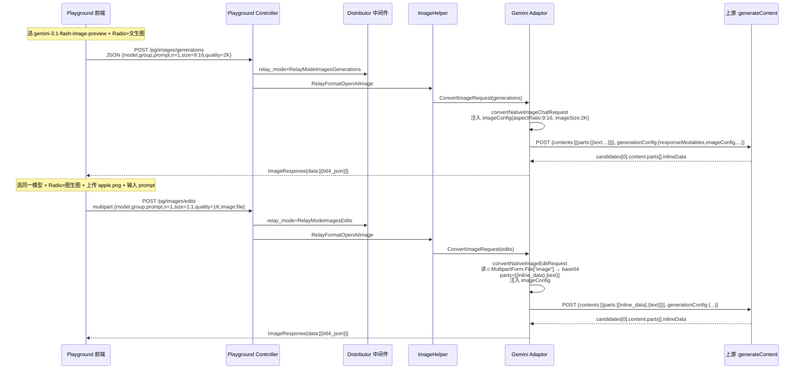
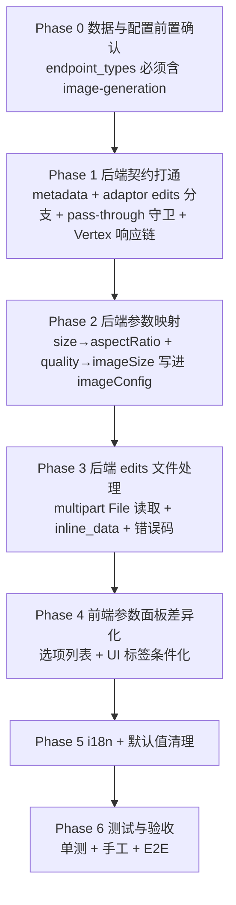
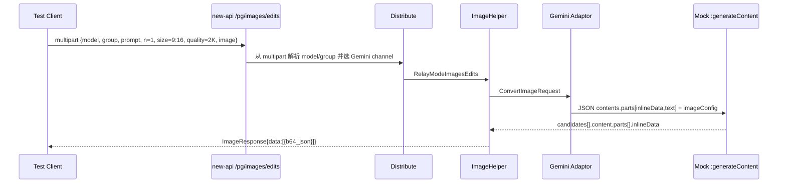

# 操练场 Gemini 原生生图模型改造（对齐 gpt-image-2 交互）— 执行计划

> 范围：在 `/console/playground` 页面对 `gemini-2.5-flash-image` / `gemini-3-pro-image-preview` / `gemini-3.1-flash-image-preview` 三个 Gemini 原生生图模型，与 `gpt-image-2` 完全一致地暴露「文生图(generations)」与「图生图(edits)」两种使用方式；同时让前端真正能控制 `aspectRatio`、`imageSize` 两个上游真正生效的核心参数。
>
> 关键事实来源：
> - `gemini生图模型支持接口和参数情况.md` §三~§五：Gemini 没有独立 `/images/edits` 上游端点，图生图与文生图共用 `:generateContent`，由 `contents[0].parts[].inline_data` 传图；上游真生效的参数只有 `imageConfig.aspectRatio` / `imageConfig.imageSize` / `responseModalities` / `safetySettings` / `systemInstruction`；`candidateCount > 1` 被上游禁止；OpenAI 兼容路径下 `n / size / quality / response_format / extra_body.generationConfig.*` 全部被 `convertNativeImageChatRequest` 静默丢弃。
> - `history_plan/20260429_操练场新增 gpt-image-2 文生图与图生图页面功能_plan.md`：已建立完整的 playground 图生图前后端基础设施（`/pg/images/generations`、`/pg/images/edits`、`RelayModeImagesEdits`、`ImageReferenceUploader`、`ImageRequestModeSwitch`、`buildImageEditPayload`、`useApiRequest.handleImageRequest` 等）。
> - `history_plan/20260519_gpt-image-2 修复参数错误问题_plan.md`：已确立"前端不发送无消费的字段、后端不接受未知字段、metadata 是 UI 唯一来源"的项目纪律。
>
> 兼容前提：与已落地的 gpt-image-2、gpt-image-1、dall-e-2/3、imagen-*、flux-* 行为零回归。

---

## 一、目标

1. playground 选中任一 Gemini 原生生图模型（`common.IsGeminiNativeImageModel` 命中）时，参数面板出现「请求方式」单选：`文生图(generations)` / `图生图(edits)`，与 gpt-image-2 完全对称。
2. **文生图**：走 `POST /pg/images/generations`（JSON），上游真实生效的 `aspectRatio` 与 `imageSize` 由前端控件显式控制。
3. **图生图**：走 `POST /pg/images/edits`（multipart/form-data），上传一张参考图，后端 Gemini adaptor 把文件转 base64 写入 `contents[0].parts[].inline_data`，与同样 prompt + 同样 imageConfig 一起发送到 `:generateContent`。
4. 两种模式共用同一对话流：用户输入 prompt → 助手消息渲染图片（沿用 `GeminiNativeImageChatHandler` 已返回的 `data[].b64_json`，前端按 data URI 展示）。
5. **不破坏** `gpt-image-2/1`、`dall-e-2/3`、`imagen-*`、`flux-*` 在 playground 的行为；不破坏走 `/v1/chat/completions` 多模态路径调用 Gemini 生图的既有客户端；不破坏 Gemini 渠道的 chat / embedding / imagen 行为。
6. 上游 `candidateCount > 1` 被禁，沿用 `NMax: 1` 的硬约束；UI 锁定 n=1 不放开。
7. 三库（SQLite / MySQL / PostgreSQL）行为一致，本计划不改 schema。

> **不在本计划范围**：上游 Gemini SSE `:streamGenerateContent` 在 playground 图像端点的接入（playground 图像请求 `IsStream` 已固化为 false，参见 `dto/openai_image.go:162`）、`outputMimeType` / `outputCompressionQuality` / `personGeneration` 等次要 imageConfig 字段（首版不暴露 UI，留 Phase 7 增量）。

---

## 二、参数差距分析

### 2.1 端到端能力对比

| 维度 | 当前现状 | 本计划目标 | gpt-image-2 现状（对照） |
|---|---|---|---|
| playground UI 模式切换 | ❌ 不显示「请求方式」单选 | ✅ 显示并默认「文生图」 | ✅ 已有 |
| `/pg/images/edits` 路由可用 | ❌ 落到 `gemini adaptor` 兜底 error `not supported model for image generation` | ✅ 复用同一 `:generateContent` 上游，区分 generations / edits | ✅ 已有 |
| `aspectRatio` 控制 | ❌ OpenAI 路径下 prompt 之外参数全丢，输出永远是默认 1408×768 | ✅ 14 档官方比例可选（首版精选 6 档：`1:1 / 4:3 / 3:4 / 16:9 / 9:16 / 21:9`） | n/a（gpt-image-2 上游静默忽略，UI 已撤） |
| `imageSize` 控制 | ❌ 同上 | ✅ 3 档（`1K` / `2K` / `4K`） | ✅ size 字段控制（但 gpt-image-2 上游 size 真生效） |
| `n` 多张 | ❌ 上游禁止 candidateCount > 1 | ✅ 锁定 n=1（metadata 已 `NMax:1`，UI 已锁） | ✅ n_max=10 |
| `response_format` | ❌ Gemini 上游无该字段，metadata 已 `ResponseFormat: false`，UI 已隐藏 | ✅ 保持隐藏 | ✅ 隐藏（gpt-image-2 修复 plan 已撤） |
| 参考图上传 | ❌ 无 UI | ✅ `ImageReferenceUploader` 直接复用 | ✅ 已有 |
| 后端 multipart → inline_data | ❌ 当前 `convertNativeImageChatRequest` 不读取上传文件 | ✅ 新增 edits 分支，从 `c.Request.MultipartForm.File["image"]` 读文件转 base64 | n/a（gpt-image-2 走 OpenAI adaptor multipart 透传） |

### 2.2 字段命名抉择（关键决策）

Gemini 原生 imageConfig 字段是 `aspectRatio` 与 `imageSize`，与 OpenAI ImageRequest 的 `size` / `quality` 字段语义不同。两条可选路径：

| 方案 | 描述 | 优点 | 缺点 |
|---|---|---|---|
| **A（采用）** | 复用现有 `ImageRequest.Size` 字段承载 `aspectRatio`（值如 `"1:1"`），复用 `ImageRequest.Quality` 字段承载 `imageSize`（值如 `"1K"`、`"2K"`、`"4K"`）；后端 Gemini adaptor 按 `image_generation_mode == "gemini_native"` 分支映射 | 与 `convertImagenRequest` 现有 size→aspectRatio 思路一致；DTO 零改动；前端 `inputs.prompt_size` / `inputs.prompt_quality` 零改动；最小化改动 | UI 文案需差异化（`gemini_native` 下「图像尺寸」→「宽高比」、「图像质量」→「图像分辨率」） |
| B | 在 `ImageRequest` 新增独立的 `AspectRatio` / `ImageSize` 字段，前端 payload 也加新字段 | 语义清晰 | 违反 `20260519` plan §五"无消费字段不进 DTO"纪律；新增字段进入 `Extra` 兜底机制涉及面广 |

**选 A**。理由：与 `imagen` 模型既有的 `request.Size` → `Parameters.AspectRatio` 映射逻辑完全同构，零 DTO 变动，前端只需在 UI 标签层做条件化。

### 2.3 关键代码引用（计划执行人必读）

| 模块 | 文件 | 行号 | 现状 |
|---|---|---|---|
| 模型白名单 | `common/model.go` | 20-23,43-47 | `IsGeminiNativeImageModel` 已识别 3 个模型 |
| 元数据下发 | `controller/user.go` | 552-592 | `gemini_native` 已下发 `NMax:1 / ResponseFormat:false`，**未下发 `SupportsEdits`** |
| relay mode | `relay/constant/relay_mode.go` | 69-72 | `/pg/images/edits` 已映射 `RelayModeImagesEdits` |
| 路由 | `router/relay-router.go` | 62-70 | `/pg/images/edits` 已注册 |
| Path 派发 | `controller/playground.go` | 16-27 | `/pg/images/edits` → `RelayFormatOpenAIImage` |
| multipart 解析 | `relay/helper/valid_request.go` | 141-228 | edits 分支已正确解析 prompt/model/n/quality/size；上传 image 字段未结构化 |
| Gemini adaptor 入口 | `relay/channel/gemini/adaptor.go` | 27-31,67-79 | `isGeminiNativeImageGeneration` **强制 `RelayMode == RelayModeImagesGenerations`**，edits 落 error |
| Gemini chat 请求 | `relay/channel/gemini/adaptor.go` | 143-162 | `convertNativeImageChatRequest` 只取 `Prompt`，丢弃其他字段 |
| Gemini DTO | `dto/gemini.go` | 270-310,330-432 | `GeminiPart.InlineData` 已存在；`GeminiChatGenerationConfig.ImageConfig` 已是 `json.RawMessage`（可直接塞 imageConfig） |
| Gemini 图像响应处理 | `relay/channel/gemini/relay-gemini.go` | 1598-1620 | `GeminiNativeImageChatHandler` 已正确解析 `candidates[0].parts[].inlineData` 转 `ImageData{B64Json}` |
| Pass-through 守卫 | `relay/image_handler.go` | 24-32 | 当前 `RelayModeImagesGenerations + gemini_native` 强制关闭 pass-through，**`RelayModeImagesEdits` 未守卫** |
| 前端 endpoint 派发 | `web/src/helpers/playgroundPayload.js` | 30-44 | `getApiEndpointForRequest` 已按 `imageRequestMode` 派发 generations / edits |
| 前端 multipart 构造 | `web/src/helpers/playgroundPayload.js` | 348-408 | `buildImageEditPayload` 已生成符合 multipart 协议的 FormData |
| 前端 metadata 守卫 | `web/src/hooks/playground/imageEditGuards.js` | 25-34 | `normalizeImageRequestMode` 在 `supports_edits === true` 才允许 EDIT |
| 前端参数面板 | `web/src/components/playground/ImageParameterControl.jsx` | 49-156 | size/quality 选项与 UI 文案当前按 OpenAI 模型族硬编码 |
| 上传组件 | `web/src/components/playground/ImageReferenceUploader.jsx` | 25-35 | MIME 白名单 `image/png,image/jpeg,image/webp`，单文件 ≤10 MB |
| Settings 面板装配 | `web/src/components/playground/SettingsPanel.jsx` | 60-234 | `supports_edits` 控制 Radio 与 Uploader 出现，**零改动** |

---

## 三、目标架构



---

## 四、改造原则（不可违反）

1. **单一来源**：模型能力（Radio 是否显示、size/quality 选项、n_max）由后端 `/api/user/playground/models` 的 `image_generation_mode` + `image_parameters` 下发，前端不复制 Gemini 白名单。
2. **路径即语义**：与 gpt-image-2 完全对称，generations 走 `/pg/images/generations` JSON、edits 走 `/pg/images/edits` multipart，不在 body 里塞 mode 字段。
3. **DTO 零改动**：复用 `ImageRequest.Size` 承载 aspectRatio、`ImageRequest.Quality` 承载 imageSize，按 `image_generation_mode == "gemini_native"` 路由分支。`GeminiChatGenerationConfig.ImageConfig` 已是 `json.RawMessage`，可直接序列化任意 imageConfig 字段。
4. **强制非流式**：`IsStream` 永远 false（沿用 `dto/openai_image.go:162` 已固化），UI 隐藏流式开关。
5. **n=1 硬约束**：上游 `candidateCount > 1` 返 400；metadata 保持 `NMax: 1`，前端 `isCountLocked=true`。
6. **零回归**：
   - `imagen-*` 仍走 `convertImagenRequest`（独立分支），逻辑不动；
   - `gpt-image-*` / `dall-e-*` / `flux-*` 走 OpenAI adaptor，本计划不改 OpenAI adaptor；
   - 经 `/v1/chat/completions` multimodal 调 Gemini 生图的客户端走 `CovertOpenAI2Gemini`，本计划不改该转换链。
7. **跨库兼容**：本次不改 schema。
8. **错误清晰**：edits 模式必须有 image 文件，前端 UI 已阻断；后端找不到文件时返回 4xx 明确错误，不退化到 generations。
9. **i18n 完整**：所有新增/调整文案 7 语言（zh-CN / zh-TW / en / fr / ru / ja / vi）补齐。
10. **可测试**：每个改造点配套单测，覆盖路由派发、relay mode、edits multipart 文件读取、imageConfig 序列化、UI 标签条件化。

---

## 五、阶段总览



> 顺序原则：**先确认数据库/模型元数据能让 playground 进入 image-generation 分支 → 后端能力先行（metadata 启用 supports_edits 会立刻让前端 Radio 出现，必须保证后端 edits 实际可用，否则点击 → 500）**；前端参数面板差异化最后做（不影响功能，只影响 UX 文案）。

---

## 五.零、Phase 0 — 数据与配置前置确认（必须） Done

完成摘要：已确认 `common.IsGeminiNativeImageModel` 精确覆盖 3 个目标模型，默认 `GetEndpointTypesByChannelType` 会把它们置为 `image-generation` 优先端点；`model/pricing.go` 的 `models.endpoints` 非空时确实会替换默认端点而非合并。
完成摘要：本地未发现可直接查询的 SQLite 数据库文件；`127.0.0.1:9991/api/user/playground/models` 存在但无登录态返回 401，运行态 `models.endpoints` 自定义覆盖需在带登录态/部署环境复核，本轮不做前端硬编码兜底。

### Step 0.1 — 确认 Gemini 原生生图模型的 endpoint_types 不被自定义 endpoints 覆盖

**文件/逻辑**：`model/pricing.go:213-245`、`controller/user.go:GetUserPlaygroundModels`

`model/pricing.go` 会先根据渠道能力和 `common.GetEndpointTypesByChannelType` 生成默认端点；但如果 `models.endpoints` 非空，会用自定义 endpoints **替换**默认端点，而不是合并。因此即使 `common.IsGeminiNativeImageModel(modelName)` 返回 true，只要数据库里该模型的自定义 endpoints 没有 `"image-generation"`，`/api/user/playground/models` 就不会把该模型暴露为操练场生图模型，前端也不会显示本计划新增的 Radio / Uploader / 参数面板。

执行前必须验证三个模型：

- `gemini-2.5-flash-image`
- `gemini-3-pro-image-preview`
- `gemini-3.1-flash-image-preview`

检查要求：

```bash
curl -fsS http://127.0.0.1:9991/api/user/playground/models \
  | jq '.data[] | select(.name | test("^gemini-(2.5-flash-image|3-pro-image-preview|3.1-flash-image-preview)$"))'
```

每个已启用模型必须满足：

```json
{
  "endpoint_types": ["image-generation", "..."],
  "image_generation_mode": "gemini_native",
  "image_parameters": {
    "size": true,
    "quality": true,
    "response_format": false,
    "n_max": 1,
    "supports_edits": true
  }
}
```

若 `endpoint_types` 缺少 `"image-generation"`，先修正模型元数据配置（尤其是 `models.endpoints`），再继续 Phase 1；不要在前端硬编码兜底。

**判定通过**：`/api/user/playground/models` 返回的 Gemini 原生生图模型均包含 `endpoint_types` 的 `"image-generation"`；如果存在自定义 endpoints，确认其显式包含 `"image-generation"`。

---

## 六、Phase 1 — 后端契约打通 Done

完成摘要：已启用 Gemini native playground metadata 的 `size/quality/supports_edits`，并打通 Gemini adaptor edits relay mode、Gemini edits pass-through 守卫与 Vertex edits 响应链。
完成摘要：已补 controller、Gemini adaptor、Vertex adaptor、image_handler 覆盖测试；`go test ./controller ./relay/channel/gemini ./relay/channel/vertex ./relay -v` 通过。

### Step 1.1 — `controller/user.go` 元数据下发 `SupportsEdits + Size + Quality`

**文件**：`controller/user.go:560-592`

`getPlaygroundImageGenerationMetadata` 的 `gemini_native` 分支改为：

```go
if common.IsGeminiNativeImageModel(modelName) {
    return "gemini_native", &PlaygroundImageParameter{
        Size:           true,   // Gemini 用作 aspectRatio
        Quality:        true,   // Gemini 用作 imageSize
        ResponseFormat: false,  // 上游不支持
        NMax:           1,      // 上游禁止 candidateCount > 1
        SupportsEdits:  true,   // 启用「请求方式」单选
    }
}
```

- 不新增 `image_parameters` 字段。`Size: true` / `Quality: true` 让前端 ImageParameterControl 渲染对应控件；UI 标签差异化由前端 `image_generation_mode === 'gemini_native'` 触发（Phase 4）。
- `NMax: 1` 保持，前端 `isCountLocked` 兼容。
- `SupportsEdits: true` 是核心开关：前端 SettingsPanel `supports_edits` 检查会立刻让 Radio 与 Uploader 出现。

**判定通过**：`go test ./controller -v -run TestPlaygroundGemini` 通过；`curl /api/user/playground/models | jq '.data[]|select(.name=="gemini-3.1-flash-image-preview")'` 返回 `image_parameters.size=true / quality=true / supports_edits=true / n_max=1 / response_format=false`。

### Step 1.2 — `gemini/adaptor.go#isGeminiNativeImageGeneration` 打通 edits

**文件**：`relay/channel/gemini/adaptor.go:27-31`

```go
func isGeminiNativeImageGeneration(info *relaycommon.RelayInfo) bool {
    if info == nil || !common.IsGeminiNativeImageModel(info.UpstreamModelName) {
        return false
    }
    return info.RelayMode == constant.RelayModeImagesGenerations ||
        info.RelayMode == constant.RelayModeImagesEdits
}
```

- 这是让 `/pg/images/edits` → Gemini adaptor → `convertNativeImageEditRequest` 全链路打通的关键开关。
- 该函数还被 `GetRequestURL`、`DoResponse` 引用，确保 edits 也走 `:generateContent` 上游 URL，响应也走 `GeminiNativeImageChatHandler`（这两条路径无需再改）。

**判定通过**：单测构造 `info.RelayMode = RelayModeImagesEdits + UpstreamModelName = "gemini-3.1-flash-image-preview"`，`isGeminiNativeImageGeneration` 返回 true；同时验证非 Gemini 原生模型 / 非图像 relay mode 不被误判。

### Step 1.3 — `relay/image_handler.go` pass-through 守卫扩展

**文件**：`relay/image_handler.go:24-32`

```go
func shouldPassThroughImageRequest(info *relaycommon.RelayInfo) bool {
    shouldPassThrough := model_setting.GetGlobalSettings().PassThroughRequestEnabled ||
        info.ChannelSetting.PassThroughBodyEnabled
    if common.IsGeminiNativeImageModel(info.UpstreamModelName) &&
        (info.RelayMode == relayconstant.RelayModeImagesGenerations ||
            info.RelayMode == relayconstant.RelayModeImagesEdits) {
        return false
    }
    return shouldPassThrough
}
```

- 当前仅 `RelayModeImagesGenerations` 强制关闭；扩展到 `RelayModeImagesEdits`。
- 否则 pass-through 开启时，multipart `image=@apple.png` 原样转发到上游 Gemini `:generateContent` 会直接 400（上游不识别 multipart）。

**判定通过**：单测覆盖 `gemini-3.1-flash-image-preview + RelayModeImagesEdits + PassThroughRequestEnabled=true`，返回 false。

### Step 1.4 — `gemini/adaptor.go#ConvertImageRequest` 增 edits 分支

**文件**：`relay/channel/gemini/adaptor.go:67-79`

```go
func (a *Adaptor) ConvertImageRequest(c *gin.Context, info *relaycommon.RelayInfo, request dto.ImageRequest) (any, error) {
    if info == nil {
        return nil, errors.New("relay info is nil")
    }

    if strings.HasPrefix(strings.ToLower(info.UpstreamModelName), "imagen") {
        return a.convertImagenRequest(request), nil
    }
    if isGeminiNativeImageGeneration(info) {
        if info.RelayMode == constant.RelayModeImagesEdits {
            return a.convertNativeImageEditRequest(c, request)
        }
        return a.convertNativeImageChatRequest(request)
    }
    return nil, errors.New("not supported model for image generation, only imagen-* and gemini-*-image-* models are supported")
}
```

- generations 分支沿用 `convertNativeImageChatRequest`（Phase 2 扩展内部 imageConfig 注入）。
- edits 新增 `convertNativeImageEditRequest`（Phase 3 实现，读 multipart 文件 + 拼 inline_data + 复用 imageConfig 注入逻辑）。

**判定通过**：编译通过；单测构造 edits 用例不再返回 `not supported model for image generation` 错误。

### Step 1.5 — `relay/channel/vertex/adaptor.go` 同步 Gemini native edits 响应处理

**文件**：`relay/channel/vertex/adaptor.go:369-399`

Vertex adaptor 已复用 Gemini adaptor 的 `ConvertImageRequest`：

```go
func (a *Adaptor) ConvertImageRequest(c *gin.Context, info *relaycommon.RelayInfo, request dto.ImageRequest) (any, error) {
    geminiAdaptor := gemini.Adaptor{}
    return geminiAdaptor.ConvertImageRequest(c, info, request)
}
```

因此 Phase 1.2 / 1.4 打通 Gemini edits 后，Vertex 渠道的请求体也会被正确转换成 `:generateContent` JSON。但当前 Vertex `DoResponse` 只在 `RelayModeImagesGenerations + Gemini native` 时调用 `GeminiNativeImageChatHandler`，`RelayModeImagesEdits` 会落到普通 Gemini chat handler，前端拿不到 `ImageResponse{data:[{b64_json}]}`。

必须把判断同步扩展为 generations / edits 两种 relay mode：

```go
if common.IsGeminiNativeImageModel(info.UpstreamModelName) &&
    (info.RelayMode == constant.RelayModeImagesGenerations ||
        info.RelayMode == constant.RelayModeImagesEdits) {
    return gemini.GeminiNativeImageChatHandler(c, info, resp)
}
```

- 这是必须项，不是可选增强；否则 Gemini 官方渠道可用，Vertex Gemini 渠道图生图不可用。
- 不改变 Vertex 原生 Gemini `/v1beta/models/*:generateContent` 透传路径；`RelayModeGemini` 仍走 `GeminiTextGenerationHandler`。
- 不改变 Vertex `imagen-*` 路径；`imagen-*` 仍走 `GeminiImageHandler`。

**判定通过**：新增/扩展 Vertex 单测，覆盖 `gemini-3.1-flash-image-preview + RelayModeImagesEdits` 响应经 `GeminiNativeImageChatHandler` 转为 OpenAI ImageResponse；同时验证 `RelayModeGemini` 与 `imagen-*` 不回归。

### Step 1.6 — Phase 1 单测

**新增 / 扩展**：
- `relay/channel/gemini/adaptor_image_test.go`：补 `TestConvertImageRequest_GeminiNativeEditsRoutedToEdit` —— 验证 edits relay mode 命中新分支；`TestIsGeminiNativeImageGeneration_AllowsEdits`。
- `controller/user_test.go`（或扩展 playground_test.go）：补 `TestPlaygroundGeminiNativeMetadataSupportsEdits` —— 验证 `gemini-3.1-flash-image-preview` 返回 `size:true / quality:true / supports_edits:true / response_format:false / n_max:1`。
- `relay/image_handler_test.go`（如不存在则新建）：补 pass-through 守卫覆盖。
- `relay/channel/vertex/adaptor_test.go`（或现有 Vertex 测试文件）：补 Gemini native edits 响应处理用例，确保 Vertex 渠道与 Gemini 渠道在 playground image edits 下输出同形 `ImageResponse`。

**判定通过**：`go test ./controller ./relay/channel/gemini ./relay/channel/vertex ./relay -v` 全绿。

---

## 七、Phase 2 — 后端 generations imageConfig 映射 Done

完成摘要：已新增 Gemini native `imageConfig` 构建逻辑，按白名单把 `size` 映射为 `aspectRatio`，把 `quality` 映射为 `imageSize`，未识别旧 OpenAI 值会静默丢弃。
完成摘要：已让 generations 请求在有合法参数时注入 `generationConfig.imageConfig`，并用 Gemini adaptor 单测覆盖宽高比、分辨率、组合参数与无效值丢弃。

### Step 2.1 — 在 `gemini/adaptor.go` 引入 imageConfig 构建辅助函数

**文件**：`relay/channel/gemini/adaptor.go`（在 `convertNativeImageChatRequest` 上方）

```go
// geminiAspectRatioWhitelist 是上游 Nano Banana 系列实测可用的官方 aspectRatio
// 见 gemini生图模型支持接口和参数情况.md §二.3。
var geminiAspectRatioWhitelist = map[string]struct{}{
    "1:1": {}, "2:3": {}, "3:2": {}, "3:4": {}, "4:3": {}, "4:5": {}, "5:4": {},
    "9:16": {}, "16:9": {}, "21:9": {}, "1:4": {}, "4:1": {}, "1:8": {}, "8:1": {},
}

// buildGeminiImageConfig 把 OpenAI 风格 ImageRequest 字段映射到 Gemini imageConfig。
// 字段缺省时省略，避免覆盖上游默认值。
func buildGeminiImageConfig(request dto.ImageRequest) (json.RawMessage, error) {
    cfg := map[string]any{}

    aspect := strings.TrimSpace(request.Size)
    if aspect != "" {
        if _, ok := geminiAspectRatioWhitelist[aspect]; ok {
            cfg["aspectRatio"] = aspect
        }
    }

    if imageSize := normalizeGeminiImageSize(request.Quality); imageSize != "" {
        cfg["imageSize"] = imageSize
    }

    if len(cfg) == 0 {
        return nil, nil
    }
    return common.Marshal(cfg)
}

func normalizeGeminiImageSize(quality string) string {
    switch strings.ToLower(strings.TrimSpace(quality)) {
    case "1k", "512", "low", "standard", "auto", "medium":
        return "1K"
    case "2k", "hd", "high":
        return "2K"
    case "4k":
        return "4K"
    }
    return ""
}
```

- `aspectRatio` 仅放行 14 档官方白名单值；未识别值（如旧的 `"1024x1024"`）静默丢弃，**不报错**（兼容老客户端 / 其他模型沿用 size 字段）。
- `imageSize` 接受 OpenAI 风格 `low/standard/hd/auto` 映射，也接受 `"1K"/"2K"/"4K"` 直传；前端 Phase 4 会直接发 `"1K"` 这种纯 Gemini 风格值。
- `512` 暂归到 `1K`（实测 `imageSize=512` 上游可用但分辨率特殊；首版不暴露 UI），保留兼容入口。

### Step 2.2 — `convertNativeImageChatRequest` 注入 imageConfig

**文件**：`relay/channel/gemini/adaptor.go:143-162`

```go
func (a *Adaptor) convertNativeImageChatRequest(request dto.ImageRequest) (*dto.GeminiChatRequest, error) {
    if strings.TrimSpace(request.Prompt) == "" {
        return nil, errors.New("prompt is required for image generation")
    }

    generationConfig := dto.GeminiChatGenerationConfig{
        ResponseModalities: []string{"TEXT", "IMAGE"},
    }
    imageConfig, err := buildGeminiImageConfig(request)
    if err != nil {
        return nil, fmt.Errorf("failed to marshal gemini image config: %w", err)
    }
    if len(imageConfig) > 0 {
        generationConfig.ImageConfig = imageConfig
    }

    return &dto.GeminiChatRequest{
        Contents: []dto.GeminiChatContent{
            {
                Role:  "user",
                Parts: []dto.GeminiPart{{Text: request.Prompt}},
            },
        },
        GenerationConfig: generationConfig,
        SafetySettings:   buildGeminiSafetySettings(),
    }, nil
}
```

- `ResponseModalities` 保持 `["TEXT", "IMAGE"]`，与现状一致。
- `ImageConfig` 仅在前端真的发了可用值时才注入，**为空时省略**——避免上游为空对象报错。

### Step 2.3 — Phase 2 单测

**扩展**：`relay/channel/gemini/adaptor_image_test.go`

新增 5 个用例：
| 用例 | 输入 | 期望 |
|---|---|---|
| `aspectRatio 命中白名单` | `Size="9:16"` | request body 含 `"imageConfig":{"aspectRatio":"9:16"}` |
| `aspectRatio 不识别静默丢弃` | `Size="1024x1024"` | request body **不含** `imageConfig` 或 `imageConfig.aspectRatio` 为空 |
| `imageSize 命中 quality 映射` | `Quality="hd"` | request body 含 `"imageConfig":{"imageSize":"2K"}` |
| `imageSize 接受纯 Gemini 值` | `Quality="4K"` | request body 含 `"imageConfig":{"imageSize":"4K"}` |
| `aspectRatio + imageSize 同时` | `Size="1:1" Quality="2K"` | request body 含 `"imageConfig":{"aspectRatio":"1:1","imageSize":"2K"}` |

并扩展 `TestConvertImageRequest_GeminiNativeDropsOpenAIImageOnlyParameters`：保持 `n / response_format` 等仍被丢弃的现有保护。

**判定通过**：`go test ./relay/channel/gemini -v` 全绿。

---

## 八、Phase 3 — 后端 edits 文件处理（inline_data） Done

完成摘要：已实现 Gemini native edits multipart 文件读取，将 `image` 文件转为 `inlineData` parts，并与 prompt、`responseModalities`、`imageConfig`、`safetySettings` 一起发送到 `:generateContent`。
完成摘要：已覆盖 happy path、多图、imageConfig、缺文件、超大小、MIME 不支持等测试；本地校验错误返回 400/413 且 `SkipRetry=true`。

### Step 3.1 — `convertNativeImageEditRequest` 实现

**新增**：`relay/channel/gemini/adaptor.go`（紧跟 `convertNativeImageChatRequest`）

> **错误处理硬约束**：Gemini edits 的本地校验错误必须返回 4xx 且跳过重试。当前 `relay/image_handler.go` 在 `ConvertImageRequest` 返回普通 `error` 时会包装成默认 500（`types.NewError(err, ErrorCodeConvertRequestFailed)`），且不会自动 `SkipRetry`。因此 `convertNativeImageEditRequest` 不能只返回 `errors.New(...)` 表达用户输入错误；缺文件、MIME 不支持、超大小、multipart 解析失败等都必须返回 `*types.NewAPIError`，并携带 `types.ErrOptionWithSkipRetry()`。

```go
const maxGeminiInlineImageSize = 10 * 1024 * 1024 // 与前端 MAX_REFERENCE_FILE_SIZE 一致

var geminiSupportedInlineMimeTypes = map[string]struct{}{
    "image/png":  {},
    "image/jpeg": {},
    "image/webp": {},
}

func (a *Adaptor) convertNativeImageEditRequest(c *gin.Context, request dto.ImageRequest) (*dto.GeminiChatRequest, error) {
    if strings.TrimSpace(request.Prompt) == "" {
        return nil, types.NewErrorWithStatusCode(
            errors.New("prompt is required for image edit"),
            types.ErrorCodeInvalidRequest,
            http.StatusBadRequest,
            types.ErrOptionWithSkipRetry(),
        )
    }

    if c.Request.MultipartForm == nil {
        if err := c.Request.ParseMultipartForm(int64(maxGeminiInlineImageSize) + 1<<20); err != nil {
            return nil, types.NewErrorWithStatusCode(
                fmt.Errorf("failed to parse multipart form: %w", err),
                types.ErrorCodeInvalidRequest,
                http.StatusBadRequest,
                types.ErrOptionWithSkipRetry(),
            )
        }
    }

    files := c.Request.MultipartForm.File["image"]
    if len(files) == 0 {
        return nil, types.NewErrorWithStatusCode(
            errors.New("image is required for gemini image edit"),
            types.ErrorCodeInvalidRequest,
            http.StatusBadRequest,
            types.ErrOptionWithSkipRetry(),
        )
    }

    parts := make([]dto.GeminiPart, 0, len(files)+1)
    for _, fileHeader := range files {
        if fileHeader.Size > maxGeminiInlineImageSize {
            return nil, types.NewErrorWithStatusCode(
                fmt.Errorf("image file %q exceeds %d bytes", fileHeader.Filename, maxGeminiInlineImageSize),
                types.ErrorCodeReadRequestBodyFailed,
                http.StatusRequestEntityTooLarge,
                types.ErrOptionWithSkipRetry(),
            )
        }
        mimeType := strings.ToLower(strings.TrimSpace(fileHeader.Header.Get("Content-Type")))
        if _, ok := geminiSupportedInlineMimeTypes[mimeType]; !ok {
            return nil, types.NewErrorWithStatusCode(
                fmt.Errorf("unsupported image mime type %q, only image/png, image/jpeg, image/webp are supported", mimeType),
                types.ErrorCodeInvalidRequest,
                http.StatusBadRequest,
                types.ErrOptionWithSkipRetry(),
            )
        }
        f, err := fileHeader.Open()
        if err != nil {
            return nil, fmt.Errorf("failed to open uploaded image: %w", err)
        }
        data, readErr := io.ReadAll(f)
        f.Close()
        if readErr != nil {
            return nil, fmt.Errorf("failed to read uploaded image: %w", readErr)
        }
        parts = append(parts, dto.GeminiPart{
            InlineData: &dto.GeminiInlineData{
                MimeType: mimeType,
                Data:     base64.StdEncoding.EncodeToString(data),
            },
        })
    }
    parts = append(parts, dto.GeminiPart{Text: request.Prompt})

    generationConfig := dto.GeminiChatGenerationConfig{
        ResponseModalities: []string{"TEXT", "IMAGE"},
    }
    imageConfig, err := buildGeminiImageConfig(request)
    if err != nil {
        return nil, fmt.Errorf("failed to marshal gemini image config: %w", err)
    }
    if len(imageConfig) > 0 {
        generationConfig.ImageConfig = imageConfig
    }

    return &dto.GeminiChatRequest{
        Contents: []dto.GeminiChatContent{
            {Role: "user", Parts: parts},
        },
        GenerationConfig: generationConfig,
        SafetySettings:   buildGeminiSafetySettings(),
    }, nil
}
```

- `c.Request.MultipartForm` 在 distributor / `GetAndValidOpenAIImageRequest` 已经触发过 `MultipartForm()` 解析，正常情况下非 nil；保留 fallback `ParseMultipartForm` 以防解析顺序变化。
- `types.NewAPIError` 会被 `types.NewError` 原样保留；因此在 `ImageHelper` 包装 `ErrorCodeConvertRequestFailed` 时，4xx 状态码与 `SkipRetry` 不会丢失。
- **MIME 来自 `fileHeader.Header.Get("Content-Type")`**：浏览器自动填入；与 `ImageReferenceUploader` 的 `accept` 白名单一致。不依赖文件扩展名（前端可能上传 `apple` 无扩展名但 MIME 正确的文件）。
- **base64 编码用 `base64.StdEncoding`**：Gemini API 接受 padded base64。
- **顺序：image 在前、text 在后**：与 `gemini生图模型支持接口和参数情况.md` §四.2 / §九 复现命令一致；上游对 parts 顺序敏感度低，但保持与官方文档示例一致更安全。
- **多文件兼容**：循环上传文件转换为多个 `inline_data` part；首版前端 `limit=1`，但后端不限死，便于后续 UI 解锁多图。
- **imageConfig 复用 Phase 2 的 `buildGeminiImageConfig`**：edits 与 generations 共用同一映射逻辑。

### Step 3.2 — import 同步

**文件**：`relay/channel/gemini/adaptor.go`（import 段）

新增 `encoding/base64`、`io`、`encoding/json`（如尚未引入）、`net/http`。`fmt` 已存在。

### Step 3.3 — Phase 3 单测

**新增 / 扩展**：`relay/channel/gemini/adaptor_image_test.go`

| 用例 | 期望 |
|---|---|
| `TestConvertNativeImageEditRequest_HappyPath` | 模拟 `c.Request.MultipartForm.File["image"]` 含一张 PNG；返回的 GeminiChatRequest `contents[0].parts` 长度=2，前者 InlineData.MimeType=image/png + Data 是 base64，后者 Text 是 prompt |
| `TestConvertNativeImageEditRequest_NoFileReturnsError` | 不放 image 文件 → 返回 `image is required for gemini image edit`，状态码 400，`SkipRetry=true` |
| `TestConvertNativeImageEditRequest_OversizeRejected` | 模拟 11MB 文件 → 返回 `exceeds` 错误，状态码 413，`SkipRetry=true` |
| `TestConvertNativeImageEditRequest_UnsupportedMimeRejected` | Content-Type=`image/gif` → 返回 `unsupported image mime type`，状态码 400，`SkipRetry=true` |
| `TestConvertNativeImageEditRequest_AppliesImageConfig` | Size=`16:9` + Quality=`2K` → request body 含 `imageConfig.aspectRatio=16:9 / imageSize=2K` |
| `TestConvertNativeImageEditRequest_MultipleImages` | 两张文件 → parts 含两个 InlineData + 一个 Text（验证多图后端容量） |

**判定通过**：`go test ./relay/channel/gemini -v` 全绿。

---

## 九、Phase 4 — 前端参数面板差异化 Done

完成摘要：已让前端基于后端 `imageGenerationMode === "gemini_native"` 切换 Gemini 原生宽高比/分辨率选项与标签，不新增前端 Gemini 模型白名单。
完成摘要：已处理旧 `prompt_size=1024x1024` / `prompt_quality=auto` 在 Gemini 模式下显示为「默认（不发送）」且 payload 省略；目标前端测试 36 项通过。

### Step 4.1 — `playgroundPayload.js` 增加 Gemini native 选项

**文件**：`web/src/helpers/playgroundPayload.js`

```js
const GEMINI_NATIVE_ASPECT_RATIOS = [
  '',
  '1:1',
  '4:3',
  '3:4',
  '16:9',
  '9:16',
  '21:9',
];

const GEMINI_NATIVE_IMAGE_SIZES = ['', '1K', '2K', '4K'];

export const isGeminiNativeImageModel = (model = '') =>
  model.toLowerCase() === 'gemini-2.5-flash-image' ||
  model.toLowerCase() === 'gemini-3-pro-image-preview' ||
  model.toLowerCase() === 'gemini-3.1-flash-image-preview';
```

> **白名单同步约束**：上面 `isGeminiNativeImageModel` 必须与后端 `common/model.go#geminiNativeImageModels` 保持同步；任何新增 Gemini 原生生图模型时双侧一起改。计划文档与每个改动 PR 必须强调这一点（这是 `gemini生图模型支持接口和参数情况.md` §八.1 标注的"双白名单陷阱"）。
>
> **更稳的替代**：可不在前端硬编码白名单，改为读 `currentModelOption.imageGenerationMode === 'gemini_native'`。但 `getImageSizeOptionsForModel` 现签名只有 `(model, imageParameters)` 不带 mode；本计划首版增加新参数 `imageGenerationMode`，避免硬编码。最终采用此方式：

修订 `getImageSizeOptionsForModel` / `getImageQualityOptionsForModel` 签名：

```js
export const getImageSizeOptionsForModel = (
  model = '',
  imageParameters,
  imageGenerationMode = '',
) => {
  if (imageParameters?.size === false) return [];
  if (imageGenerationMode === 'gemini_native') return GEMINI_NATIVE_ASPECT_RATIOS;
  if (isGptImageModel(model)) return GPT_IMAGE_SIZES;
  if (isDallE3Model(model)) return DALL_E_3_SIZES;
  if (isDallE2Model(model)) return DALL_E_2_SIZES;
  return GENERIC_IMAGE_SIZES;
};

export const getImageQualityOptionsForModel = (
  model = '',
  imageParameters,
  imageGenerationMode = '',
) => {
  if (imageParameters?.quality === false) return [];
  if (imageGenerationMode === 'gemini_native') return GEMINI_NATIVE_IMAGE_SIZES;
  if (isGptImageModel(model)) return GPT_IMAGE_QUALITIES;
  if (isDallE3Model(model)) return DALL_E_3_QUALITIES;
  if (isDallE2Model(model)) return [];
  return GENERIC_IMAGE_QUALITIES;
};
```

同步调整 `sanitizeImageSize` / `sanitizeImageQuality`：在 `gemini_native` 模式下不要强制兜底为 `'1024x1024'` / `'auto'`，应允许空字符串（=上游默认）。具体：

```js
const sanitizeImageSize = (model = '', size = '', imageParameters, imageGenerationMode = '') => {
  if (imageParameters?.size === false) return '';
  const normalizedSize = typeof size === 'string' ? size.trim() : '';
  const options = getImageSizeOptionsForModel(model, imageParameters, imageGenerationMode);
  if (options.includes(normalizedSize)) return normalizedSize;
  if (imageGenerationMode === 'gemini_native') return ''; // 空 → 上游默认 1408×768
  if (isGptImageModel(model) || isDallE3Model(model) || isDallE2Model(model)) {
    return getDefaultImageSizeForModel(model);
  }
  return normalizedSize || getDefaultImageSizeForModel(model);
};

const sanitizeImageQuality = (model = '', quality = '', imageParameters, imageGenerationMode = '') => {
  if (imageParameters?.quality === false) return '';
  const normalizedQuality = typeof quality === 'string' ? quality.trim() : '';
  const options = getImageQualityOptionsForModel(model, imageParameters, imageGenerationMode);
  if (isDallE2Model(model)) return '';
  if (options.includes(normalizedQuality)) return normalizedQuality;
  if (imageGenerationMode === 'gemini_native') return ''; // 空 → 上游默认 1K
  if (isGptImageModel(model)) return 'auto';
  if (isDallE3Model(model)) return 'standard';
  return normalizedQuality || 'auto';
};
```

`buildImageGenerationPayload` / `buildImageEditPayload` 调用时把 `imageGenerationMode` 参数传进去；`imageGenerationMode` 通过 `inputs.imageGenerationMode`（由 `usePlaygroundState` 注入，见 Step 4.3）获取。

### Step 4.2 — `ImageParameterControl.jsx` UI 标签条件化

**文件**：`web/src/components/playground/ImageParameterControl.jsx`

```jsx
const isGeminiNative = inputs.imageGenerationMode === 'gemini_native';
const sizeLabel = isGeminiNative ? t('宽高比') : t('图像尺寸');
const qualityLabel = isGeminiNative ? t('图像分辨率') : t('图像质量');
```

在已有 `t('图像尺寸')` / `t('图像质量')` 位置替换。size/quality 选项继续从已扩展的 `getImageSizeOptionsForModel(inputs.model, imageParameters, inputs.imageGenerationMode)` 获取。

option label 映射 `labelByValue` 扩展：

```js
const labelByValue = {
  // 既有
  auto: '自动', standard: '标准', hd: '高清', low: '低', medium: '中', high: '高',
  url: 'URL', b64_json: 'Base64 JSON',
  // 新增（Gemini）
  '': '默认（不发送）',
  '1:1': '1:1（方形）',
  '4:3': '4:3',
  '3:4': '3:4',
  '16:9': '16:9（宽屏）',
  '9:16': '9:16（竖屏）',
  '21:9': '21:9（超宽）',
  '1K': '1K（默认）',
  '2K': '2K',
  '4K': '4K',
};
```

必须处理旧配置 / 切换模型后的无效 Select value。当前 `ImageParameterControl` 直接把 `inputs.prompt_size` / `inputs.prompt_quality` 传给 Semi `Select`；如果老用户 localStorage 中仍是 `1024x1024` / `auto`，切到 Gemini 后这些值不在 Gemini optionList 内，不能让 UI 显示一个无效的「宽高比」或「图像分辨率」值。

首选实现是上面这种：Gemini native 选项显式提供 `''` =「默认（不发送）」，让 UI 状态、payload sanitize、上游默认行为一致。若执行时不把 `''` 放进 optionList，也必须在控件层计算受控值：

```js
const normalizeSelectValue = (value, options) =>
  options.some((option) => option.value === value) ? value : '';
```

并对 size/quality 两个 Select 使用 normalized value；否则 §11.2 的「旧 localStorage 切 Gemini 后 UI 显示为空/默认」无法稳定成立。

**判定通过**：选 `gemini-3.1-flash-image-preview` 后参数面板显示「宽高比」「图像分辨率」标签，选项为默认空值 + 6 档 aspectRatio、默认空值 + 3 档 imageSize；旧 `prompt_size=1024x1024` / `prompt_quality=auto` 切到 Gemini 时 UI 显示「默认（不发送）」且 payload 不含 `size` / `quality`；切到 `gpt-image-2` 后标签恢复为「图像尺寸」「图像质量」，选项恢复 OpenAI 风格。

### Step 4.3 — `usePlaygroundState.js` 暴露 `imageGenerationMode`

**文件**：`web/src/hooks/playground/usePlaygroundState.js:129-150`

```js
const selectedModelOption = useMemo(
  () => findModelOption(models, inputs.model),
  [models, inputs.model],
);
const imageParameters = selectedModelOption?.imageParameters;
const imageGenerationMode = selectedModelOption?.imageGenerationMode || '';
// ...
const inputsWithImageParameters = useMemo(
  () => ({
    ...inputs,
    imageParameters,
    imageGenerationMode,
    imageRequestMode,
  }),
  [inputs, imageParameters, imageGenerationMode, imageRequestMode],
);
```

`processModelsData` 已经 spread `imageGenerationMode`（参见 `playgroundPayload.js:481-483`），可直接使用。

### Step 4.4 — `Playground/index.jsx` / `playgroundPayload.js` 透传 imageGenerationMode

`buildImageGenerationPayload(messages, inputs)` 与 `buildImageEditPayload(messages, inputs)` 内部从 `inputs.imageGenerationMode` 取值并传给 `sanitizeImageSize` / `sanitizeImageQuality`。调用方零改动。

### Step 4.5 — 默认值与持久化清理

**文件**：`web/src/components/playground/configStorage.js`、`web/src/hooks/playground/usePlaygroundState.js`

- `DEFAULT_CONFIG.inputs.prompt_size = '1024x1024'`、`prompt_quality = 'auto'` 保留（gpt-image-2 等需要）。
- `sanitizePlaygroundInputsForStorage` 不需要新增清理项——`prompt_size` / `prompt_quality` 在 `gemini_native` 模式下若残留 OpenAI 风格值会被 `sanitizeImageSize` / `sanitizeImageQuality` 静默丢弃，不上传到上游，且 UI 切回时仍能用。
- UI 层必须同步显示空值 / 默认值，不能只在 payload 阶段丢弃；否则用户看到的参数与实际发送参数不一致。
- 唯一可能的体验问题：用户在 Gemini 下选 `9:16`，切到 `gpt-image-2`，`prompt_size` 是 `9:16` 但 OpenAI 不识别 → `sanitizeImageSize` 会 fallback 到 `getDefaultImageSizeForModel(model) = '1024x1024'`。这与现有行为一致，无需特殊处理。
- **校验**：`bun test src/helpers/playgroundPayload.test.js` 验证「切模型后旧值被丢弃」分支。

### Step 4.6 — Phase 4 单测

**扩展 / 新增**：
- `web/src/helpers/playgroundPayload.test.js`：
  - `getImageSizeOptionsForModel returns gemini aspect ratios when image_generation_mode is gemini_native`
  - `getImageQualityOptionsForModel returns 1K/2K/4K when image_generation_mode is gemini_native`
  - `buildImageGenerationPayload sends aspect ratio via size field for gemini_native`
  - `buildImageEditPayload FormData includes aspect ratio + imageSize when gemini_native`
  - `sanitizeImageSize drops legacy 1024x1024 when switching to gemini_native`
  - `Gemini native default empty size/quality are omitted from payload`
- `web/src/components/playground/ImageParameterControl.test.jsx`：
  - `renders 宽高比 / 图像分辨率 labels for gemini_native`
  - `shows 默认（不发送） when stored Gemini size/quality value is not in option list`
  - `renders 图像尺寸 / 图像质量 labels for gpt-image-2`

**判定通过**：`bun test src/helpers/playgroundPayload.test.js src/components/playground/ImageParameterControl.test.jsx` 全绿。

---

## 十、Phase 5 — i18n + 默认值清理 Done

完成摘要：已为 zh-CN / zh-TW / en / fr / ru / ja / vi 补齐「宽高比」「图像分辨率」「默认（不发送）」及 Gemini 选项标签翻译。
完成摘要：已运行 `bun run i18n:lint` 并通过；默认值清理由 payload sanitize 与控件 normalized value 双层保证。

### Step 5.1 — i18n

**文件**：`web/src/i18n/locales/{zh-CN,zh-TW,en,fr,ru,ja,vi}.json`

新增 keys（按现有 flat JSON 风格，key 为中文源串）：

| key | 用途 |
|---|---|
| `宽高比` | gemini_native 模式 size 标签 |
| `图像分辨率` | gemini_native 模式 quality 标签 |
| `1:1（方形）`、`16:9（宽屏）`、`9:16（竖屏）`、`21:9（超宽）` | 4 个带说明的 aspectRatio option label |
| `1K（默认）` | imageSize=1K option label |
| `默认（不发送）` | Gemini native 空 size / quality 选项 |
| `Gemini 原生生图模型一次只生成 1 张图` | NMax=1 提示（可选，复用已有「Gemini 图像模型一次只生成 1 张图」即可，无需新增） |

执行 `bun run i18n:lint` 校验 7 语言覆盖。

> 7 语言翻译质量原则：英文使用 `Aspect ratio` / `Resolution`；其他语言保持名词风格统一，避免动词化。具体翻译由执行人在落地阶段查阅现有 locale 风格统一。

### Step 5.2 — 默认值兜底

- 老用户 localStorage `prompt_size` 可能是 `'1024x1024'` 或 `'auto'`，切到 Gemini 模型时 `sanitizeImageSize` 已经做了静默丢弃（返回 `''`，让上游默认 1408×768 生效）。无需特殊迁移逻辑。
- `inputs.image_request_mode` 默认 `generation`；切到 Gemini 后 `supports_edits=true` 让 Radio 出现，用户主动切到 edit 才生效。`normalizeImageRequestMode` 已守卫"模型不支持 edits 时强制回退 generation"。

---

## 十一、Phase 6 — 测试与验收 Done

完成摘要：已新增 `controller/gemini_native_image_integration_test.go` 最小集成测试，覆盖真实 `/pg/images/edits` multipart → Distribute → Playground/Relay/ImageHelper → Gemini adaptor → mock `:generateContent` → OpenAI `ImageResponse` 全链路，并断言 `inlineData`、`text`、`responseModalities`、`imageConfig.aspectRatio/imageSize` 与日志 `request_path`。
完成摘要：已补 Gemini/Vertex native image 出站 `Content-Type: application/json` 回归保护；`go test ./controller ./relay/channel/gemini ./relay/channel/vertex ./relay -v`、`bun test src/helpers/playgroundPayload.test.js src/components/playground/ImageParameterControl.test.jsx`、`bun run i18n:lint` 均通过。

### 11.1 自动化

| 类型 | 文件 | 覆盖 |
|---|---|---|
| 后端 | `controller/user_test.go` | `gemini-*` metadata 形态：`size=true / quality=true / supports_edits=true / response_format=false / n_max=1 / image_generation_mode=gemini_native` |
| 后端 | `relay/channel/gemini/adaptor_image_test.go` | `isGeminiNativeImageGeneration` 允许 edits；`ConvertImageRequest` 派发；`convertNativeImageChatRequest` 注入 imageConfig；`convertNativeImageEditRequest` 6 个用例（见 Step 3.3）；保持 `n / response_format` 仍被丢弃的现有保护 |
| 后端 | `relay/image_handler_test.go` | `shouldPassThroughImageRequest` 对 `gemini_native + edits` 强制关闭 |
| 后端 | `relay/channel/vertex/adaptor_test.go` | Vertex Gemini native edits 响应走 `GeminiNativeImageChatHandler`，不落普通 chat handler |
| 前端 | `web/src/helpers/playgroundPayload.test.js` | size/quality 选项 + sanitize + payload 构造（见 Step 4.6） |
| 前端 | `web/src/components/playground/ImageParameterControl.test.jsx` | UI 标签条件化（见 Step 4.6） |

### 11.2 手工回归清单

> 在已部署 Gemini 渠道（指向真实上游 `aiartmirror.com` 或类似 OpenAI 兼容中转）的环境下执行，每条上游真实出图约 0.5-2 秒，整套清单 < 5 分钟。

- [ ] 选 `gemini-3.1-flash-image-preview`：UI 显示「请求方式」单选默认「文生图」，「宽高比」「图像分辨率」「图像数量」（锁定 1）三个控件；不显示「返回格式」。
- [ ] 文生图发送 prompt `"a single red apple on a clean white background, studio photo"` + 宽高比=默认（空）：DevTools URL=`/pg/images/generations`，Content-Type=`application/json`，body 含 `model/group/prompt/n=1`，**不含** `size` / `quality` 字段；助手消息渲染默认 1408×768 红苹果。
- [ ] 切宽高比=`9:16` + 分辨率=`2K`：body 含 `size:"9:16" / quality:"2K"`；助手消息渲染竖图 ~1376×2752。
- [ ] 切到「图生图」：参考图上传组件出现；上传 `apple_red.png` 与输入 prompt `"change the apple color to bright green"`：URL=`/pg/images/edits`，Content-Type 以 `multipart/form-data; boundary=` 开头；FormData 字段集 `{model, group, prompt, n, size?, quality?, image}`；助手消息渲染绿苹果。
- [ ] 图生图未上传文件：发送按钮 disabled，悬停 tooltip 含「图生图模式需要先上传参考图」。
- [ ] 切到 `gpt-image-2`：UI 标签恢复「图像尺寸」「图像质量」，选项恢复 `auto/1024x1024/...`，与改造前一致。
- [ ] 切到 `dall-e-3`：UI 标签恢复，无 Radio。
- [ ] 切到 `imagen-3-fast-generate-001`：走 `convertImagenRequest` 路径（独立），UI 显示 size 字段不变（无 Radio，因 metadata 未下发 supports_edits）。
- [ ] 切到 `gpt-4o`：endpointType=openai，参数面板显示 chat 参数。
- [ ] 自定义请求体模式 + Gemini + 图生图：发送按钮 disabled 并提示「自定义请求体模式不支持图生图」。
- [ ] 旧用户 localStorage 中 `prompt_size='1024x1024'` / `prompt_quality='auto'`：切到 Gemini 后 UI 显示「默认（不发送）」，payload 不含 `size` / `quality`，不影响发送。
- [ ] 计费日志：generations/edits 各一次，`/api/log/self?type=2` 最近条目 `model_name='gemini-3.1-flash-image-preview'`，`other.request_path` 分别为 `/pg/images/generations` 与 `/pg/images/edits`，`quota > 0`。

### 11.3 最小集成测试（必须）

单元测试覆盖不到 body storage、multipart 复读、distributor 解析 `model/group`、relay mode、pass-through 守卫、Gemini adaptor 转换、Gemini 响应回写 OpenAI ImageResponse 这些组合行为。因此本计划必须至少新增一条最小集成测试，不能只靠手工回归。

**目标链路**：



测试要求：

- mock upstream 必须支持 `/v1beta/models/<model>:generateContent`，记录最近一次 JSON body。
- 直发 `/pg/images/edits` multipart，断言 HTTP 200，响应 body 是 OpenAI `ImageResponse`，且 `data[0].b64_json` 存在。
- 断言 mock 收到的上游 JSON：
  - `contents[0].parts` 至少包含一个 `inlineData` 和一个 `text`；
  - `inlineData.mimeType` 与上传文件一致；
  - `generationConfig.responseModalities` 包含 `TEXT` 与 `IMAGE`；
  - `generationConfig.imageConfig.aspectRatio == "9:16"`；
  - `generationConfig.imageConfig.imageSize == "2K"`。
- 测试环境必须显式关闭全局/渠道 pass-through，或断言 `shouldPassThroughImageRequest` 生效；否则 multipart 会绕过 adaptor，测试结果不稳定。
- 该用例可以放在 `scripts/e2e/gemini-native-image/edits.spec.ts`，也可以先放在后端集成测试目录；关键是必须覆盖真实 HTTP multipart → mock upstream 的完整链路。

**判定通过**：最小 edits 集成测试在本地 Docker Compose + mock upstream 下稳定通过；失败时能从 mock echo 看到上游 JSON 快照。

### 11.4 完整 E2E（可后置，沿用 gpt-image-2 套路）

> 与已落地的 `scripts/e2e/gpt-image-2/` 平行新建 `scripts/e2e/gemini-native-image/`，主要复用 `mock-upstream/server.ts` —— 但 mock 必须扩展对 `/v1beta/models/<model>:generateContent` 路径的支持（OpenAI 兼容路径 `/v1/images/generations` 在本场景下被 new-api 转成 Gemini 原生 URL 再发出）。
>
> mock 行为契约：接收 JSON `{contents:[{parts:[...]}],generationConfig:{imageConfig:{aspectRatio,imageSize}}}` → 回 `{candidates:[{content:{parts:[{inlineData:{mimeType:"image/png",data:"<base64>"}}]}}]}` 并把 imageConfig 字段照搬到 `/v1/echo` snapshot 便于断言。
>
> spec 拆分（参照 gpt-image-2 计划 §七）：
> - `generations.spec.ts`：UI 生成 + body 含 `size/quality` 映射上游 imageConfig
> - `edits.spec.ts`：multipart 上传 + 上游 inline_data 字段断言（base64 内容回显）
> - `capability.spec.ts`：UI 标签「宽高比」「图像分辨率」与选项白名单
> - `guards.spec.ts`：edits 无文件阻断、自定义请求体阻断
> - `regression.spec.ts`：gpt-image-2 / dall-e-3 / gpt-4o 行为不回归
>
> 完整 E2E 设计可以延后到本计划合并 + 上线后再做（可参考 `history_plan/20260429_操练场新增 gpt-image-2 文生图与图生图页面功能集成测试_plan.md` 的方法论），但 §11.3 的最小 edits 集成测试不能后置。

---

## 十二、风险与对策

| 风险 | 触发条件 | 应对 |
|---|---|---|
| 模型双白名单不同步 | `common/model.go#geminiNativeImageModels` 与前端 `processModelsData` 解析的 `image_generation_mode` 不一致 | 前端不维护硬编码 model 列表，只读 `currentModelOption.imageGenerationMode === 'gemini_native'`（Step 4.3 已选择该路径） |
| 模型自定义 endpoints 覆盖默认端点 | `models.endpoints` 非空且未包含 `"image-generation"`，导致 `/api/user/playground/models` 不返回生图端点 | Phase 0 必须先校验 `/api/user/playground/models`；缺失时先修模型元数据配置，不在前端硬编码兜底 |
| `MultipartForm.File["image"]` 在 distributor 之前已被消费 | distributor 用 `UnmarshalBodyReusable` 解析 model/group，触发 `c.MultipartForm()`；正常情况下 File 仍可访问，但若 body storage 被替换为 stream 则失效 | `common.UnmarshalBodyReusable` 用 body storage 缓存原始 body；多次解析 multipart 安全。adaptor 用 `c.Request.MultipartForm.File["image"]` 即可，无需重读 body |
| pass-through 仍可能绕过 adaptor | 全局或渠道 `PassThroughBodyEnabled=true`，且 Step 1.3 守卫漏 edits | Step 1.3 已显式覆盖 `RelayModeImagesEdits + gemini_native`；单测 lock |
| Vertex Gemini edits 响应格式错误 | Vertex adaptor 复用 Gemini 请求转换，但 `DoResponse` 未把 edits 交给 `GeminiNativeImageChatHandler` | Step 1.5 同步扩展 Vertex 响应链，并用单测覆盖 |
| 本地校验错误返回 500 / 触发重试 | `convertNativeImageEditRequest` 返回普通 `error`，被 `ImageHelper` 包装为默认 500 且非 skip-retry | Phase 3 要求用 `types.NewErrorWithStatusCode` 返回 400/413，并设置 `ErrOptionWithSkipRetry` |
| 上游 4xx：`candidateCount` 隐式 > 1 | 本地 sanitizeImageCount 兜底失效，前端发 n=2 到后端 | metadata `NMax:1` + 前端 `isCountLocked` + 后端 `sanitizeImageCount` 三重保护；上游 4xx 不被吞，会原样回显 |
| 上游 4xx：`imageConfig.aspectRatio` 非白名单值 | 前端选项以外的值通过 localStorage / 导入配置混入 | Step 2.1 `buildGeminiImageConfig` 白名单校验，未识别值静默丢弃；上游收到的请求只包含合法字段 |
| Pass-through 模式下用户期望可绕过转换 | 高级用户在 channel 配置 `pass_through_body_enabled=true` 希望直接 multipart 透传 | 文档明确：Gemini native 图像不支持 pass-through；用户若要原生控制更精细的 `outputMimeType / personGeneration`，应直接调 `/v1beta/models/*:generateContent`（new-api 已透传该路径） |
| 老 localStorage `prompt_size=1024x1024` 切到 Gemini 后显示无效值 | UI 显示值与实际 payload sanitize 后发送值不一致 | Step 4.2 必须提供「默认（不发送）」空值或控件层 normalized value，确保 UI 与 payload 一致 |
| 多文件 UI 解锁后上游可能拒绝 | 首版前端 `limit=1`；上游官方支持 inline_data 多张但未实测 | 后端 `convertNativeImageEditRequest` 已支持循环多 File；UI 解锁多文件前需独立实测 |
| 计费倍率不变 | `gemini-3.1-flash-image-preview` 现有计价配置未含 size/quality 倍率，本计划不变 | 与 gpt-image-* 同策略（`ImagePriceRatio=1.0` 默认），如需 size/quality 倍率，单独提案 |
| OpenAI 渠道误配 Gemini 模型 | 用户把 `gemini-3.1-flash-image-preview` 放到 OpenAI 类型渠道 | 不归本计划，由用户配置正确的 Gemini 类型渠道；OpenAI adaptor 收到 Gemini 模型会按 OpenAI 协议转发到上游，上游 404 / 400，错误清晰 |
| `/v1/chat/completions` 多模态调用回归 | 该路径走 `CovertOpenAI2Gemini`，本计划不动 | 路径独立，零影响 |

---

## 十三、改动文件清单

### 后端（4 修改 + ≥1 新增测试）

1. `controller/user.go` — `getPlaygroundImageGenerationMetadata` 的 `gemini_native` 分支启用 `Size:true / Quality:true / SupportsEdits:true`。
2. `relay/channel/gemini/adaptor.go` — `isGeminiNativeImageGeneration` 加 `RelayModeImagesEdits`；`ConvertImageRequest` 加 edits 分支；新增 `buildGeminiImageConfig` / `normalizeGeminiImageSize` / `convertNativeImageEditRequest`；imports 加 `encoding/base64` / `io` / `encoding/json` / `net/http`。
3. `relay/image_handler.go` — `shouldPassThroughImageRequest` 扩展守卫到 `RelayModeImagesEdits + gemini_native`。
4. `relay/channel/vertex/adaptor.go` — Vertex Gemini native edits 响应也走 `GeminiNativeImageChatHandler`。
5. **新增 / 扩展** `relay/channel/gemini/adaptor_image_test.go`、`relay/channel/vertex/adaptor_test.go`、`controller/user_test.go`（或 `playground_test.go`）、`relay/image_handler_test.go`（如不存在则新建）。

### 前端（3 修改 + 1 扩展测试）

6. `web/src/helpers/playgroundPayload.js` — `getImageSizeOptionsForModel` / `getImageQualityOptionsForModel` 加 `imageGenerationMode` 参数；新增 `GEMINI_NATIVE_ASPECT_RATIOS` / `GEMINI_NATIVE_IMAGE_SIZES` 常量（含默认空值）；`sanitizeImageSize` / `sanitizeImageQuality` 同步；`buildImageGenerationPayload` / `buildImageEditPayload` 透传 `imageGenerationMode`。
7. `web/src/components/playground/ImageParameterControl.jsx` — `image_generation_mode === 'gemini_native'` 时切换标签为「宽高比」「图像分辨率」；扩展 `labelByValue`；无效旧值显示「默认（不发送）」或 normalized 空值。
8. `web/src/hooks/playground/usePlaygroundState.js` — `inputsWithImageParameters` 注入 `imageGenerationMode`。
9. **扩展** `web/src/helpers/playgroundPayload.test.js`、`web/src/components/playground/ImageParameterControl.test.jsx`。
10. `web/src/i18n/locales/{zh-CN,zh-TW,en,fr,ru,ja,vi}.json` — 新增 6-8 个翻译 key。

### 集成测试（至少 1 新增）

11. `scripts/e2e/gemini-native-image/edits.spec.ts`（或等价后端集成测试）— 最小 multipart edits → Gemini `:generateContent` → ImageResponse 全链路测试。

### 总计：约 8 修改 + ≥3 新建/扩展测试 + ≥1 最小集成测试

---

## 十四、验收标准

1. `gemini-3.1-flash-image-preview` 等 3 个 Gemini 原生生图模型在 `/api/user/playground/models` 返回 `endpoint_types` 含 `"image-generation"`、`image_generation_mode = "gemini_native"`、`image_parameters.{size:true, quality:true, response_format:false, n_max:1, supports_edits:true}`。
2. `imagen-*`、`gpt-image-*`、`dall-e-*`、`flux-*`、`gpt-4o` 等模型的元数据形态完全保持当前现状（回归保护）。
3. playground 选 Gemini 原生生图模型时：
   - 显示「请求方式」单选，默认「文生图」；
   - 参数面板显示「宽高比」（默认 + 6 档）、「图像分辨率」（默认 + 3 档）、「图像数量」（锁定 1）；
   - 不显示「返回格式」与「流式输出」。
4. 文生图模式：请求 URL=`/pg/images/generations`、Content-Type=`application/json`；请求体可控字段 `{model, group, prompt, n=1, size?, quality?}`；空 size/quality 或旧 OpenAI 风格值被 Gemini sanitize 为空时 body 中省略，UI 同步显示「默认（不发送）」。
5. 图生图模式：请求 URL=`/pg/images/edits`、Content-Type=`multipart/form-data; boundary=...`；FormData 字段集 `{model, group, prompt, n=1, size?, quality?, image}`。
6. 后端 edits 进入 Gemini adaptor 后：
   - `convertNativeImageEditRequest` 从 `c.Request.MultipartForm.File["image"]` 读到文件；
   - 上游收到的 JSON body 含 `contents[0].parts` 前序为 `{inline_data:{mime_type,data}}`、末尾为 `{text:<prompt>}`；
   - 若提供 size/quality，body 含 `generationConfig.imageConfig.{aspectRatio,imageSize}`；
   - `responseModalities: ["TEXT","IMAGE"]` 始终注入；
   - `safetySettings` 沿用 `buildGeminiSafetySettings()`。
7. 后端本地校验错误清晰：缺 image / prompt 为空 / MIME 不支持返回 400 且不重试；文件超过 10MB 返回 413 且不重试。
8. Gemini 与 Vertex Gemini 两类渠道在 generations / edits 下响应均走 `GeminiNativeImageChatHandler`，聊天流正确渲染（`candidates[].parts[].inlineData` 转 `ImageData{B64Json}`，前端 `buildImageResponseContent` 把 b64_json 转 data URI 展示）。
9. `dall-e-*` / `gpt-image-*` / `flux-*` / `imagen-*` 的 playground 行为零回归。
10. `/v1/chat/completions` multimodal 调用 Gemini 生图的行为零回归（走 `CovertOpenAI2Gemini` 独立路径）。
11. 自定义请求体模式 + 图生图：UI 阻断并提示。
12. 三库（SQLite/MySQL/PostgreSQL）冒烟通过（本次不改 schema，主要冒烟点 `models` 表的 endpoint_types JSON 字段在三库下 `/api/user/playground/models` 返回一致）。
13. 最小 `/pg/images/edits` multipart → Gemini `:generateContent` → OpenAI ImageResponse 集成测试通过。
14. `go test ./controller ./relay/channel/gemini ./relay/channel/vertex ./relay -v` 全绿；`bun test src/helpers/playgroundPayload.test.js src/components/playground/ImageParameterControl.test.jsx` 全绿；`bun run i18n:lint` 通过。

---

## 十五、执行顺序总结

```mermaid
flowchart TD
    S0[Phase 0 endpoint_types / models.endpoints 前置确认] --> S1
    S1[Phase 1.1 controller/user.go metadata SupportsEdits/Size/Quality] --> S2
    S2[Phase 1.2 isGeminiNativeImageGeneration 允许 edits] --> S3
    S3[Phase 1.3 image_handler.go pass-through 守卫加 edits] --> S4
    S4[Phase 1.4 ConvertImageRequest 加 edits 分支] --> S5
    S5[Phase 1.5 Vertex Gemini native edits 响应链] --> S6
    S6[Phase 1.6 Phase 1 单测] --> S7
    S7[Phase 2.1 buildGeminiImageConfig + normalizeGeminiImageSize] --> S8
    S8[Phase 2.2 convertNativeImageChatRequest 注入 imageConfig] --> S9
    S9[Phase 2.3 Phase 2 单测] --> S10
    S10[Phase 3.1 convertNativeImageEditRequest 实现 + 4xx/SkipRetry] --> S11
    S11[Phase 3.2 imports 同步] --> S12
    S12[Phase 3.3 Phase 3 单测 6 用例] --> S13
    S13[Phase 4.1 playgroundPayload Gemini native 选项与签名扩展] --> S14
    S14[Phase 4.2 ImageParameterControl UI 标签条件化 + 默认空值] --> S15
    S15[Phase 4.3 usePlaygroundState 暴露 imageGenerationMode] --> S16
    S16[Phase 4.4 透传链路接通] --> S17
    S17[Phase 4.5 默认值清理 verify] --> S18
    S18[Phase 4.6 Phase 4 单测] --> S19
    S19[Phase 5.1 i18n 7 语言 + lint] --> S20
    S20[Phase 5.2 默认值兜底校验] --> S21
    S21[Phase 6 单测 + 手工回归 + 最小集成测试] --> END[合并主干]
```



> **关键卡点**：Phase 1.1 启用 `SupportsEdits:true` 必须与 Phase 1.4 / 1.5 / 3.1 同一 PR 合入，否则前端 Radio 出现但点击发送会 500 或 Vertex 渠道响应格式错误。**Phase 0 + Phase 1 + Phase 2 + Phase 3 是一个不可拆的原子单元**；Phase 4 / 5 可以独立 PR 但建议同一 PR 一起合，避免 UI 标签错位的中间态。§11.3 最小集成测试是合并前门禁，不后置。

---

## 十六、与 gpt-image-2 改造的关键差异（执行人速查）

| 维度 | gpt-image-2 改造 | Gemini 原生生图改造（本计划） |
|---|---|---|
| 上游端点 | `/v1/images/generations` 与 `/v1/images/edits`（两个独立路径） | 仅 `:generateContent`（一个路径承载文/图生图，靠 `parts[].inline_data` 区分） |
| 适配器 | OpenAI adaptor（multipart 透传） | Gemini adaptor（需把 multipart 拆出文件 → base64 → inline_data） |
| 参数透传 | OpenAI adaptor 默认全量透传，需要白名单剥离 `group/response_format/reference_usage` | Gemini adaptor 默认全部丢弃，需要显式映射 size→aspectRatio / quality→imageSize |
| `n` | n_max=10（前端可输入 1-10） | n_max=1（上游禁止 candidateCount > 1） |
| `response_format` | metadata 已撤（plan 20260519 修复） | metadata 早已 false（上游无该字段） |
| 文件读取 | OpenAI adaptor 直接写 multipart 到上游 | Gemini adaptor 必须 `c.Request.MultipartForm.File["image"]` 读二进制 + base64 编码 |
| imageConfig | 不需要 | DTO `GeminiChatGenerationConfig.ImageConfig` 已是 `json.RawMessage`，零 DTO 改动 |
| 前端 UI 标签 | 「图像尺寸」「图像质量」 | 「宽高比」「图像分辨率」（按 image_generation_mode 条件化） |
| 前端基础设施 | Radio / Uploader / multipart 协议（已新建） | **完全复用，零新增组件** |
| 计费倍率 | ImagePriceRatio=1.0（默认） | 同上 |
| 风险等级 | 中（首次引入 multipart 协议） | 低（基础设施齐备，仅扩展 adaptor） |

---

> 本计划为 `Gemini 原生生图模型在操练场对齐 gpt-image-2 交互` 的最终执行方案，按本文档顺序执行即可。计划落地后请在文档末尾补 Review 区，记录实际改动与偏差。
