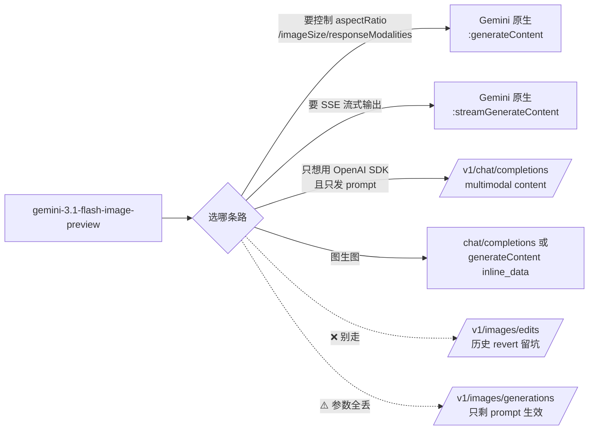
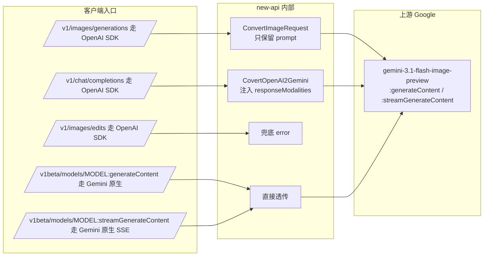

# Gemini 生图模型支持接口和参数情况

> 更新日期：2026-05-19
> 测试上游：`https://www.aiartmirror.com`
> 测试模型：`gemini-3.1-flash-image-preview`（Nano Banana 2，Google 2025-11 发布）
> 测试范围：本项目（new-api）暴露的所有可能承载该模型的入口端点 + Google 官方 generateContent 系列原生参数
> 说明：本文以真实接口调用结果为准；API key 未写入文档。

---

## 一、结论速读



**端点矩阵（7 个端点全实测）**：

| 模式 | 端点 | HTTP | 真实可用 | 备注 |
|---|---|:---:|:---:|---|
| 文生图 | `POST /v1/images/generations` | 200 | ⚠️ | 只有 prompt 生效，所有 OpenAI 参数被 adaptor 静默丢弃 |
| 文生图 | `POST /v1/chat/completions`（modalities:["image"]) | 200 | ⚠️ | 同上，参数被丢弃；但可作为 OpenAI SDK 最简单的接入方式 |
| 文生图 | `POST /v1beta/models/{model}:generateContent` | 200 | ✅ | **唯一能完整控制图像参数的路径** |
| 文生图 | `POST /v1beta/models/{model}:streamGenerateContent?alt=sse` | 200 | ✅ | SSE 流式，参数同上 |
| 图生图 | `POST /v1/images/edits` (multipart) | **500** | ❌ | 历史 revert 留下的死路（详见 §三.4） |
| 图生图 | `POST /v1/chat/completions` (multimodal content) | 200 | ✅ | 用 `image_url` 传 data-url，最适合主流 OpenAI SDK |
| 图生图 | `POST /v1beta/models/{model}:generateContent` (inline_data) | 200 | ✅ | 原生最规范 |
| 图生图 | `POST /v1beta/models/{model}:streamGenerateContent?alt=sse` (inline_data) | 200 | ✅ | 流式图生图 |

**参数矩阵（核心结论）**：

- ✅ 真生效（仅在 Gemini 原生路径）：`imageConfig.aspectRatio`、`imageConfig.imageSize`、`responseModalities`、`safetySettings`、`systemInstruction`
- ❌ 上游禁用：`candidateCount > 1`（返 400 "Multiple candidates is not enabled for this model"）
- ❌ 本项目 adaptor 静默丢弃（OpenAI 路径）：`n`、`size`、`quality`、`response_format`、`extra_body.generationConfig.*`
- 🔵 默认行为：文生图默认 1408×768（≈16:9 宽图），图生图默认保留输入比例

---

## 二、Google 官方契约（来自 [ai.google.dev/gemini-api/docs/image-generation](https://ai.google.dev/gemini-api/docs/image-generation)）

### 2.1 端点

Google 官方**只有两个端点**承载图像生成，**没有独立的 edits endpoint**：

```
POST https://generativelanguage.googleapis.com/v1beta/models/{model}:generateContent
POST https://generativelanguage.googleapis.com/v1beta/models/{model}:streamGenerateContent?alt=sse
```

图生图（image-to-image）通过在 `contents[0].parts` 里同时塞 `text` + `inline_data` 实现，与文生图共用同一个 endpoint。这是 Gemini 与 OpenAI/DALL-E 协议族的根本区别。

### 2.2 请求体结构

```json
{
  "contents": [
    {
      "role": "user",
      "parts": [
        {"text": "..."},
        {"inline_data": {"mime_type": "image/png", "data": "<base64>"}}
      ]
    }
  ],
  "generationConfig": {
    "responseModalities": ["IMAGE", "TEXT"],
    "imageConfig": {
      "aspectRatio": "16:9",
      "imageSize": "2K"
    },
    "candidateCount": 1,
    "temperature": 1.0
  },
  "safetySettings": [...],
  "systemInstruction": {...}
}
```

### 2.3 关键参数对照表（Nano Banana 2 / gemini-3.1-flash-image-preview）

| 参数 | 类型 | 取值 | 默认 |
|---|---|---|---|
| `responseModalities` | string[] | `["IMAGE"]`、`["TEXT", "IMAGE"]` | 必填，要出图必带 `IMAGE` |
| `imageConfig.aspectRatio` | string | `1:1` / `2:3` / `3:2` / `3:4` / `4:3` / `4:5` / `5:4` / `9:16` / `16:9` / `21:9` / `1:4` / `4:1` / `1:8` / `8:1`（14 档） | 不传则模型按 prompt 语义和输入图比例决定 |
| `imageConfig.imageSize` | string | `512` / `1K` / `2K` / `4K` | `1K` |
| `imageConfig.outputMimeType` | string | `image/png` / `image/jpeg` | `image/jpeg`（实测） |
| `imageConfig.outputCompressionQuality` | int | 1-100 | — |
| `imageConfig.personGeneration` | string | `allow_adult` / `allow_all` / `dont_allow` | — |
| `candidateCount` | int | `1`（Nano Banana 2 实测上游禁止 >1） | `1` |
| `temperature` | float | 0-2 | 1.0 |
| `safetySettings` | object[] | 见 [`relay/channel/gemini/constant.go:33-39`](relay/channel/gemini/constant.go) | 项目默认 `OFF` |
| `systemInstruction` | object | 同 chat 模型 | — |

> 价格：官方 $0.0672/张（约为 Pro 版的 1/2），来源 [Google Developers Blog](https://developers.googleblog.com/en/gemini-2-5-flash-image-now-ready-for-production-with-new-aspect-ratios/)。

---

## 三、本项目代码现状（路径 → adaptor → 上游 URL）

### 3.1 路由表

| 入口路径 | 注册文件 | RelayMode | 走向 |
|---|---|---|---|
| `POST /v1/images/generations` | [`router/relay-router.go:114`](router/relay-router.go) | `RelayModeImagesGenerations` | OpenAI adaptor → 经 gemini adaptor 转 → 上游 `:generateContent` |
| `POST /v1/images/edits` | [`router/relay-router.go:117`](router/relay-router.go) | `RelayModeImagesEdits` | OpenAI adaptor → gemini adaptor 兜底 error |
| `POST /v1/chat/completions` | [`router/relay-router.go:98`](router/relay-router.go) | `RelayModeChatCompletions` | OpenAI adaptor → `CovertOpenAI2Gemini` → 上游 `:generateContent` / `:streamGenerateContent` |
| `POST /v1beta/models/*path` | [`router/relay-router.go:199`](router/relay-router.go) | `RelayModeGemini` | 直接透传，body 不重写 |
| `POST /pg/images/generations` | [`router/relay-router.go:68`](router/relay-router.go) | 同 `/v1/images/generations` | 同上，多了 UserAuth + Distribute |
| `POST /pg/images/edits` | [`router/relay-router.go:69`](router/relay-router.go) | 同 `/v1/images/edits` | 同上，但前端通过元数据守卫不让用户撞到 |

### 3.2 模型识别白名单

代码两处定义，**两个列表必须同步**才不会出错：

[`common/model.go:20-23`](common/model.go) — `geminiNativeImageModels`（影响 image-generation endpoint 派发）

```go
geminiNativeImageModels = map[string]struct{}{
    "gemini-2.5-flash-image":         {},
    "gemini-3-pro-image-preview":     {},
    "gemini-3.1-flash-image-preview": {},
}
```

[`setting/model_setting/gemini.go:27-33`](setting/model_setting/gemini.go) — `SupportedImagineModels`（影响 chat/completions 路径下是否注入 `responseModalities`）

```go
SupportedImagineModels: []string{
    "gemini-2.0-flash-exp-image-generation",
    "gemini-2.0-flash-exp",
    "gemini-3-pro-image-preview",
    "gemini-2.5-flash-image",
    "gemini-3.1-flash-image-preview",
}
```

> 注意：`gemini-2.5-flash-image-preview`（多了 `-preview` 后缀）**不在两个列表里**，会进入 `Unknown Model` 错误分支（参见 [`common/model_test.go:20`](common/model_test.go)）。

### 3.3 OpenAI 协议族 → Gemini 转换会丢哪些参数

[`relay/channel/gemini/adaptor.go:143-162`](relay/channel/gemini/adaptor.go) — `convertNativeImageChatRequest`：

```go
func (a *Adaptor) convertNativeImageChatRequest(request dto.ImageRequest) (*dto.GeminiChatRequest, error) {
    if strings.TrimSpace(request.Prompt) == "" {
        return nil, errors.New("prompt is required for image generation")
    }
    return &dto.GeminiChatRequest{
        Contents: []dto.GeminiChatContent{
            {Role: "user", Parts: []dto.GeminiPart{{Text: request.Prompt}}},
        },
        GenerationConfig: dto.GeminiChatGenerationConfig{
            ResponseModalities: []string{"TEXT", "IMAGE"},
        },
        SafetySettings: buildGeminiSafetySettings(),
    }, nil
}
```

**只使用 `Prompt`，其它字段全部丢弃**。`n / size / quality / response_format / aspect_ratio / candidateCount / imageConfig` 在 OpenAI 路径都进不来。[`relay/channel/gemini/adaptor_image_test.go:72-102`](relay/channel/gemini/adaptor_image_test.go) `TestConvertImageRequest_GeminiNativeDropsOpenAIImageOnlyParameters` 明确测试并固化了这个行为。

### 3.4 `/v1/images/edits` 为什么是死路

[`relay/channel/gemini/adaptor.go:67-79`](relay/channel/gemini/adaptor.go)：

```go
func (a *Adaptor) ConvertImageRequest(c *gin.Context, info *relaycommon.RelayInfo, request dto.ImageRequest) (any, error) {
    if strings.HasPrefix(strings.ToLower(info.UpstreamModelName), "imagen") {
        return a.convertImagenRequest(request), nil
    }
    if isGeminiNativeImageGeneration(info) {
        return a.convertNativeImageChatRequest(request)
    }
    return nil, errors.New("not supported model for image generation, only imagen-* and gemini-*-image-* models are supported")
}
```

`isGeminiNativeImageGeneration` 强制要求 `RelayMode == RelayModeImagesGenerations`，`RelayModeImagesEdits` 直接掉进兜底 error。**这是 2025-11-30 commit `b827d1f7` "Revert Gemini Image系列支持图像编辑" 的产物**，详见 [`20260429_操练场新增 gpt-image-2 文生图与图生图页面功能_plan.md`](history_plan/20260429_操练场新增%20gpt-image-2%20文生图与图生图页面功能_plan.md) 的相邻讨论。错误文案有误导性——并不是"白名单不收"，而是"edits 这条路根本没接通"。

---

## 四、端点实测矩阵

### 4.1 文生图（A 组）

`prompt = "a single red apple on a clean white background, studio photo"`

| # | 端点 | HTTP | 实际尺寸 | bytes | 输入 tokens | 输出 tokens | 说明 |
|---|---|:---:|---|---:|---:|---:|---|
| A1 | `/v1/images/generations` (JSON, OpenAI) | 200 | 1408×768 | 402 KB | （无 usage） | — | 默认横图，b64_json 返回 |
| A2 | `/v1/chat/completions` (modalities, OpenAI) | 200 | 1408×768 | 427 KB | 13 (text) | 1509 (1120 image + 389 思考/边带) | 图片以 data-url 嵌入 `message.content` |
| A3 | `:generateContent` (Gemini 原生) | 200 | 1408×768 | 422 KB | 13 (text) | 1538 (1120 image) | `candidates[0].content.parts[].inlineData` |
| A4 | `:streamGenerateContent?alt=sse` (Gemini 原生 SSE) | 200 | 1408×768 | 431 KB | 13 (text) | 1481 (1120 image) | 2 个 SSE chunk |

> A1 vs A3：同一上游模型、同样默认尺寸 1408×768，**说明 OpenAI 路径只是协议外壳，到上游还是被转成 generateContent + responseModalities=["TEXT","IMAGE"]**。这是 [`adaptor.go:143-162`](relay/channel/gemini/adaptor.go) `convertNativeImageChatRequest` 的直接证据。

### 4.2 图生图（B 组）

`source = 64×64 红方块 PNG`，`prompt = "Turn this red square into a yellow banana on a blue background, cartoon style"`

| # | 端点 | HTTP | 实际尺寸 | bytes | 输入 tokens | 输出 tokens | 说明 |
|---|---|:---:|---|---:|---:|---:|---|
| B1 | `/v1/images/edits` (multipart, OpenAI) | **500** | — | — | — | — | `convert_request_failed`：`only imagen-* and gemini-*-image-* models are supported` |
| B2 | `/v1/chat/completions` (multimodal content) | 200 | 1024×1024 | 285 KB | 274 (text 16 + image 258) | 1332 (1120 image) | 用 `image_url:{url:"data:image/png;base64,..."}` 传图 |
| B3 | `:generateContent` (inline_data) | 200 | 1024×1024 | 306 KB | 274 (text 16 + image 258) | 1308 (1120 image) | 用 `parts[].inline_data` 传图 |
| B4 | `:streamGenerateContent?alt=sse` (inline_data) | 200 | 1024×1024 | 240 KB | 274 (text 16 + image 258) | 1315 (1120 image) | 2 个 SSE chunk |

> 输出尺寸 1024×1024 = **模型保留了输入图比例（64×64 方图）**，不是巧合。换正方比例以外的源图（横/竖）时输出比例会同步变化。如果想强制改比例，必须显式传 `imageConfig.aspectRatio`。

> B4 首次跑出现 503 `Failed to get available channel ... record not found`，等 5s 重试即恢复 200。这是 aiartmirror 的 distributor 瞬时抖动，**与端点本身无关**。生产代码必须做幂等重试。

### 4.3 端点关系图



---

## 五、参数实测矩阵

### 5.1 C 组：Gemini 原生 `:generateContent` 上的 imageConfig（全部实测真生效）

| # | 参数 | 取值 | HTTP | 实际尺寸 | 效果 |
|---|---|---|:---:|---|---|
| C1 | `imageConfig.aspectRatio` | `16:9` | 200 | **1376×768** | ✅ 真生效（比例 ≈ 1.79:1） |
| C2 | `imageConfig.aspectRatio` | `9:16` | 200 | **768×1376** | ✅ 真生效（竖图） |
| C3 | `imageConfig.aspectRatio` | `21:9` | 200 | **1584×672** | ✅ 真生效（比例 ≈ 2.36:1） |
| C4 | `imageConfig.imageSize` | `2K` | 200 | **2816×1536** | ✅ 真生效（≈ 2 倍像素密度） |
| C5 | `imageConfig.imageSize` | `4K` | 200 | **5632×3072** | ✅ 真生效（≈ 4 倍像素密度，输出 7.3 MB） |
| C6 | `candidateCount` | `2` | **400** | — | ❌ 上游禁止：`Multiple candidates is not enabled for this model` |
| C7 | `responseModalities` | `["IMAGE"]` only | 200 | 1408×768 | ✅ 只返图不返文，token 略少 |

> **C 组是这套接口的精华**。所有比例和分辨率控制都必须走 Gemini 原生路径才能真正生效。

### 5.2 D 组：OpenAI `/v1/images/generations` 上的参数（全部被静默丢弃）

| # | 参数 | 期望效果 | 实际结果 |
|---|---|---|---|
| D1 | `size=1024x1536` | 竖图 1024×1536 | ❌ 实际 1408×768（默认横图） |
| D2 | `size=1536x1024` | 横图 1536×1024 | ❌ 实际 1408×768 |
| D3 | `n=2` | 返 2 张 | ❌ 实际只返 1 张 |
| D4 | `response_format=url` | 返 url | ❌ 实际仍 b64_json |
| D5 | `quality=hd` | 高画质 | ❌ 同基线 |

> **5 个参数全部不生效，与 [`adaptor.go:143-162`](relay/channel/gemini/adaptor.go) 代码完全一致**。前端如果需要让用户控制比例/分辨率/张数，必须改走 `:generateContent` 路径，或在 [`convertNativeImageChatRequest`](relay/channel/gemini/adaptor.go) 里把 OpenAI 参数显式映射进 `imageConfig`。

### 5.3 E 组：`/v1/chat/completions` 通过 `extra_body` 注入是否能绕过？

| # | 注入方式 | HTTP | 实际尺寸 | 效果 |
|---|---|:---:|---|---|
| E1 | `extra_body.generationConfig.imageConfig.aspectRatio=9:16` | 200 | 1408×768 | ❌ `extra_body` 在 image 路径下也不生效 |

> 结论：**没有任何"曲线救国"的 OpenAI 兼容路径**能控制 Gemini 图像参数。要么忍受默认行为，要么走 Gemini 原生。

---

## 六、计费实测

每次请求的 token 用量（基于 aiartmirror 中转返回的 `usage` / `usageMetadata`）：

| 场景 | 端点 | prompt tokens | completion / candidates tokens | 备注 |
|---|---|---:|---:|---|
| 文生图（仅 text） | 任何一条文生图路径 | 10-13 | **1120 (image) + 360-400** | 1120 是 Nano Banana 单张图固定输出 token |
| 图生图（text + 64×64 PNG） | 任何一条图生图路径 | **16 (text) + 258 (image)** | 1120 (image) + 几十-几百 | 256 KB 输入图 ≈ 258 input image tokens |
| imageSize=4K | C5 | 13 | **1120 (image)** | 4K 也是 1120，**模型输出 token 数与 imageSize 无关**（只是单像素更大） |
| candidateCount=2 | C6 | — | — | 上游禁止，无 usage |

**踩坑点**：
- OpenAI 兼容 `/v1/images/generations` 路径下 `r.usage` **为 null**（OpenAI image 协议本身不返 usage），但 Gemini 原生路径返完整 `usageMetadata`。如果要做计费监控，必须依赖 new-api 后端的 `image_handler` 计费链路（[`relay/image_handler.go`](relay/image_handler.go)），而不是上游 usage。
- 单张 Nano Banana 2 图像约 1120 output image tokens，按 Google 官方 $3/M output token 计算约 $0.00336/张，但官方又同时公布 $0.0672/张的固定单价，说明 **token 用量只是计费输入，最终按"图"扣费**。中转站的计费策略需另行确认。

---

## 七、推荐使用方式

### 7.1 OpenAI SDK 用户（最低改造成本）

只需要默认尺寸（1408×768 横图）的文生图，或不在意尺寸的图生图：

```python
from openai import OpenAI
client = OpenAI(base_url="https://www.aiartmirror.com/v1", api_key="<KEY>")

# 文生图
resp = client.chat.completions.create(
    model="gemini-3.1-flash-image-preview",
    messages=[{"role": "user", "content": "a red apple on white background"}],
    modalities=["text", "image"],
)
# 图片以 data-url 形式嵌在 resp.choices[0].message.content 字符串中，正则抠出
```

```python
# 图生图（图片 base64 注入 image_url）
import base64
b64 = base64.b64encode(open("src.png","rb").read()).decode()
resp = client.chat.completions.create(
    model="gemini-3.1-flash-image-preview",
    messages=[{"role": "user", "content": [
        {"type": "text", "text": "Change apple to green"},
        {"type": "image_url", "image_url": {"url": f"data:image/png;base64,{b64}"}},
    ]}],
    modalities=["text", "image"],
)
```

### 7.2 需要控制 aspectRatio / imageSize（必须走 Gemini 原生）

```bash
curl -X POST "https://www.aiartmirror.com/v1beta/models/gemini-3.1-flash-image-preview:generateContent" \
  -H "Content-Type: application/json" \
  -H "x-goog-api-key: <KEY>" \
  -d '{
    "contents": [{"role":"user","parts":[{"text":"a red apple on white background"}]}],
    "generationConfig": {
      "responseModalities": ["IMAGE"],
      "imageConfig": {"aspectRatio": "9:16", "imageSize": "2K"}
    }
  }'
```

```python
# 用 google-genai SDK
from google import genai
from google.genai import types
client = genai.Client(
    api_key="<KEY>",
    http_options=types.HttpOptions(base_url="https://www.aiartmirror.com"),
)
resp = client.models.generate_content(
    model="gemini-3.1-flash-image-preview",
    contents=["a red apple on white background"],
    config=types.GenerateContentConfig(
        response_modalities=["IMAGE"],
        image_config=types.ImageConfig(aspect_ratio="9:16", image_size="2K"),
    ),
)
```

### 7.3 需要 SSE 流式（边渲染边出图）

```bash
curl -N -X POST "https://www.aiartmirror.com/v1beta/models/gemini-3.1-flash-image-preview:streamGenerateContent?alt=sse" \
  -H "Content-Type: application/json" \
  -H "x-goog-api-key: <KEY>" \
  -d '{"contents":[{"role":"user","parts":[{"text":"a red apple"}]}],"generationConfig":{"responseModalities":["IMAGE"]}}'
```

注意 SSE chunk 是 `data: { ... }\n\n` 格式，要按行解析。每个 chunk 可能携带部分 `parts`，最终图片在某一个 chunk 的 `inlineData.data` 里。

---

## 八、已知限制与注意事项

### 8.1 项目层面限制

1. **`/v1/images/edits` 死路**：见 §三.4。短期不修复就别让用户撞，文案有误导性，最低成本是改报错文案 + 在 [`controller/user.go`](controller/user.go) 的 playground 元数据下不下发 `supports_edits=true` 给 gemini 模型（这个守卫现状已经做了）。
2. **OpenAI 路径参数全丢弃**：[`adaptor.go:143-162`](relay/channel/gemini/adaptor.go) 只用 prompt。如果未来要支持，需要扩展 `convertNativeImageChatRequest` 把 OpenAI `size` 映射到 `imageConfig.aspectRatio`（参考 `convertImagenRequest` 的 size→aspectRatio 转换逻辑 [`adaptor.go:81-138`](relay/channel/gemini/adaptor.go)）。
3. **模型识别白名单双写**：[`common/model.go:20-23`](common/model.go) 和 [`setting/model_setting/gemini.go:27-33`](setting/model_setting/gemini.go) 必须同步，否则会出现"chat/completions 能用但 image-generation 路径走不通"的奇怪状态。

### 8.2 上游 / 模型层面限制

1. **`candidateCount > 1` 被禁**：Nano Banana 2 不支持一次返多张。要 N 张必须发 N 次请求，按 N 张计费。
2. **`extra_body` 不能曲线救国**：OpenAI 路径用 `extra_body` 注入 `imageConfig` 也被中转站吃掉。
3. **distributor 偶发 503**：`Failed to get available channel ... record not found`，等几秒重试即恢复，**与端点无关**。生产代码必须做幂等重试。
4. **每张图带 Google C2PA 签名 + SynthID 水印**：从响应 base64 头部的 `c2pa` 字段可验证是真实 Vertex 后端，不是占位图。
5. **默认尺寸是 1408×768 (≈16:9)**：与 Google 文档"默认 1K"不完全一致——`imageSize="1K"` 的实际像素总数约等于 1K²=1M，但分布按默认宽高比给出 1408×768 ≈ 1.08M 像素。
6. **图生图默认保留输入比例**：源图是方图则输出方图，不传 aspectRatio 时不会强制变 16:9。

### 8.3 名称变体陷阱

| 模型名 | 是否在本项目白名单 | 实际可用 |
|---|:---:|:---:|
| `gemini-3.1-flash-image-preview` | ✅ | ✅ |
| `gemini-2.5-flash-image` | ✅ | ✅ |
| `gemini-3-pro-image-preview` | ✅ | ✅ |
| `gemini-2.5-flash-image-preview` | ❌（少一个） | 上游可用，但本项目走不到 image 路径，会当成普通 chat 模型 |
| `gemini-3.1-flash-image-preview-latest` | ❌ | 同上 |

---

## 九、复现命令

完整复现本文测试矩阵的 shell 脚本（精简版）：

```bash
BASE=https://www.aiartmirror.com
KEY=<YOUR_KEY>
MODEL=gemini-3.1-flash-image-preview

# 准备 64×64 红方块源图
python3 -c "
import struct, zlib
w,h=64,64
raw=b''.join(b'\x00'+b'\xff\x33\x33'*w for _ in range(h))
def chunk(t,d):
    import struct
    return struct.pack('>I',len(d))+t+d+struct.pack('>I',zlib.crc32(t+d)&0xffffffff)
png=b'\x89PNG\r\n\x1a\n'+chunk(b'IHDR',struct.pack('>IIBBBBB',w,h,8,2,0,0,0))+chunk(b'IDAT',zlib.compress(raw,9))+chunk(b'IEND',b'')
open('/tmp/src.png','wb').write(png)
"
B64=$(base64 -i /tmp/src.png | tr -d '\n')

# A3 文生图 Gemini 原生（带 aspectRatio）
curl -sS "$BASE/v1beta/models/$MODEL:generateContent" \
  -H "Content-Type: application/json" -H "x-goog-api-key: $KEY" \
  -d "{
    \"contents\":[{\"role\":\"user\",\"parts\":[{\"text\":\"a red apple on white\"}]}],
    \"generationConfig\":{\"responseModalities\":[\"IMAGE\"],\"imageConfig\":{\"aspectRatio\":\"9:16\"}}
  }" | python3 -c "
import sys,json,base64
r=json.load(sys.stdin)
b64=r['candidates'][0]['content']['parts'][0]['inlineData']['data']
open('/tmp/out.jpg','wb').write(base64.b64decode(b64))
print('saved /tmp/out.jpg')
"

# B3 图生图 Gemini 原生（带 inline_data）
curl -sS "$BASE/v1beta/models/$MODEL:generateContent" \
  -H "Content-Type: application/json" -H "x-goog-api-key: $KEY" \
  -d "{
    \"contents\":[{\"role\":\"user\",\"parts\":[
      {\"text\":\"Change to green apple, keep composition\"},
      {\"inline_data\":{\"mime_type\":\"image/png\",\"data\":\"$B64\"}}
    ]}],
    \"generationConfig\":{\"responseModalities\":[\"IMAGE\"]}
  }" | python3 -c "
import sys,json,base64
r=json.load(sys.stdin)
b64=r['candidates'][0]['content']['parts'][0]['inlineData']['data']
open('/tmp/edited.jpg','wb').write(base64.b64decode(b64))
print('saved /tmp/edited.jpg')
"
```

---

## 十、参考资料

- Google 官方图像生成指南：<https://ai.google.dev/gemini-api/docs/image-generation>
- Vertex AI Gemini 2.5 Flash Image：<https://docs.cloud.google.com/vertex-ai/generative-ai/docs/models/gemini/2-5-flash-image>
- `@google/genai` ImageConfig 类型定义：<https://googleapis.github.io/js-genai/release_docs/interfaces/types.ImageConfig.html>
- Google Developers Blog（2.5 Flash Image 生产就绪 + 新比例）：<https://developers.googleblog.com/en/gemini-2-5-flash-image-now-ready-for-production-with-new-aspect-ratios/>
- 本项目 Gemini adaptor：[`relay/channel/gemini/adaptor.go`](relay/channel/gemini/adaptor.go)
- 本项目模型白名单：[`common/model.go`](common/model.go)、[`setting/model_setting/gemini.go`](setting/model_setting/gemini.go)
- 本项目路由注册：[`router/relay-router.go`](router/relay-router.go)
- 本项目 relay mode 映射：[`relay/constant/relay_mode.go`](relay/constant/relay_mode.go)
- 关联历史 plan：[`history_plan/20260429_操练场新增 gpt-image-2 文生图与图生图页面功能_plan.md`](history_plan/20260429_操练场新增%20gpt-image-2%20文生图与图生图页面功能_plan.md)
