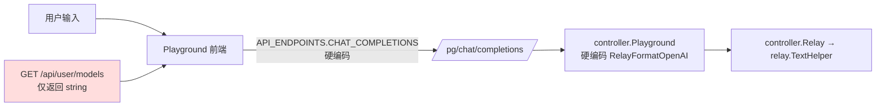
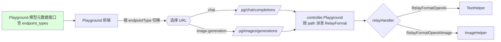
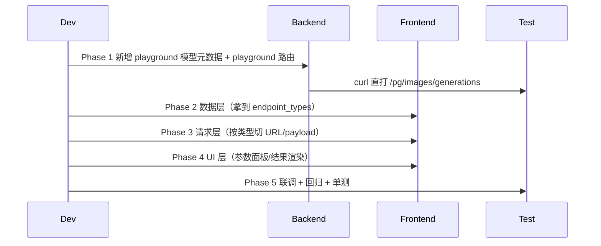

# Playground 支持生图模型 `images/generations` 接口 —— 执行计划

> 范围：仅 OpenAI 兼容的 `POST /v1/images/generations` 端点（文生图）。`images/edits`（图生图+mask，multipart）与 `images/variations` 留给后续迭代。

---

## 一、目标

让 `/console/playground` 在用户选择生图模型（`dall-e-2/3`、`gpt-image-*`、`flux-*`、`imagen-*` 等）时，自动改走 `POST /pg/images/generations`，并在聊天流中渲染生成的图像；其余对话模型行为完全不变。

---

## 二、现状（已读代码确认）



### 关键代码位点

| 角色 | 位点 |
|---|---|
| 前端发送 URL 常量 | [`web/src/constants/playground.constants.js:78`](web/src/constants/playground.constants.js) |
| 前端发送逻辑 | [`web/src/hooks/playground/useApiRequest.jsx:188,316`](web/src/hooks/playground/useApiRequest.jsx) |
| 前端模型加载 | [`web/src/hooks/playground/useDataLoader.js:36`](web/src/hooks/playground/useDataLoader.js) |
| 前端 payload 构造 | [`web/src/helpers/api.js:112`](web/src/helpers/api.js) |
| 后端 playground 控制器 | [`controller/playground.go:32-55`](controller/playground.go) |
| 后端 playground 路由 | [`router/relay-router.go:62-68`](router/relay-router.go) |
| distributor 中间件 pg 分支 | [`middleware/distributor.go:84-100,328-337`](middleware/distributor.go) |
| 模型→端点类型已有缓存 | [`model/pricing.go:62,98-108`](model/pricing.go) |
| 端点类型→路径映射 | [`common/endpoint_defaults.go:19-28`](common/endpoint_defaults.go) |
| 生图模型识别 | [`common/model.go:38-49`](common/model.go) |
| 生图请求 DTO | [`dto/openai_image.go:14-37`](dto/openai_image.go) |
| 生图 relay helper | [`relay/image_handler.go:23`](relay/image_handler.go) |
| 路径→relayMode | [`relay/constant/relay_mode.go:59,69`](relay/constant/relay_mode.go) |
| 用户模型列表接口 | [`controller/user.go:518-543`](controller/user.go) |
| 消息渲染（已支持 image_url） | [`web/src/components/playground/MessageContent.jsx:298-352`](web/src/components/playground/MessageContent.jsx) |

---

## 三、目标架构



---

## 四、改造原则（最佳实践，全程遵守）

1. **单一来源**：endpoint 信息以后端 `model.GetModelSupportEndpointTypes` 为唯一权威，前端不复制 `ImageGenerationModels` 列表。
2. **路径即语义**：playground 的 endpoint 用 URL path 表达（`/pg/{type}`），与 `/v1/{type}` 镜像，避免请求体内额外字段。
3. **无侵入**：不动 `dto.PlayGroundRequest`，不动 `dto.ImageRequest`，不动 `ImageHelper`，仅扩展 controller/router/前端。
4. **零回归**：现有 chat 链路零改动语义；通过白名单 path 引入新分支，默认走旧逻辑。
5. **强制非流式**：生图请求 `IsStream` 永远返回 false（[`dto/openai_image.go:162`](dto/openai_image.go) 已固化），前端禁用 SSE 入口。
6. **跨库兼容**：本次改造不涉及 schema 变更，三库（SQLite/MySQL/PostgreSQL）行为完全一致。
7. **DRY**：playground 不再硬编码 RelayFormat，`controller.Playground` 内部用 path → format 映射函数。
8. **命名一致**：前端常量沿用后端 `EndpointType` 枚举值字符串（`openai`、`image-generation`）。

---

## 五、阶段总览



> 顺序原则：**先后端后前端、先数据后视图、每阶段可独立验证**。

---

## 六、Phase 0 — 契约定义（不写代码） — Done

Done
确认新增 `POST /pg/images/generations`、保留 `POST /pg/chat/completions` 与 `/api/user/models` 字符串数组契约。
确认新增 playground 专用模型元数据接口，前端按 `endpoint_types.includes('image-generation')` 派发。

### 0.1 路由契约
- 新增：`POST /pg/images/generations`
- 沿用：`POST /pg/chat/completions`

### 0.2 接口契约（避免破坏旧消费方）

`GET /api/user/models` 当前不变，继续返回 `string[]`，供 token 页面等旧消费方使用：

```json
{ "success": true, "data": ["gpt-4o", "dall-e-3"] }
```

新增 playground 专用模型元数据接口（建议路径：`GET /api/user/playground/models`），返回模型名与 endpoint 类型：

```json
{
  "success": true,
  "data": [
    { "name": "gpt-4o",    "endpoint_types": ["openai"] },
    { "name": "dall-e-3",  "endpoint_types": ["image-generation", "openai"] }
  ]
}
```

> 必须新增接口或新增显式 query 参数（如 `/api/user/models?with_endpoint_types=true`），不能直接改变 `/api/user/models` 默认响应结构；当前 `web/src/components/table/tokens/index.jsx` 与 `web/src/components/table/tokens/modals/EditTokenModal.jsx` 也依赖字符串数组。

### 0.3 前端 endpoint 选择策略

按模型 `endpoint_types` 是否包含目标类型选 URL；**不要依赖 `endpoint_types[0]`**，因为模型自定义 Endpoints 来自 JSON map 时顺序不稳定：
- `endpoint_types.includes('image-generation')` ⇒ `/pg/images/generations`
- 否则 ⇒ `/pg/chat/completions`

未来扩展 audio/embedding/responses 沿用同一模式。

---

## 七、Phase 1 — 后端改造（6 步）

### Step 1.1 — 新增 playground 模型元数据接口 — Done

Done
新增 `GET /api/user/playground/models`，保留 `/api/user/models` 原字符串数组响应。
新接口复用用户可用分组模型列表，并在读取 endpoint types 前调用 `model.GetPricing()` 预热缓存。

**文件**：[`controller/user.go:518-543`](controller/user.go)、对应 API 路由文件

- 保持 `GET /api/user/models` 默认返回 `[]string` 不变，避免破坏 token 页面等旧消费方。
- 新增 playground 专用接口（建议 `GET /api/user/playground/models`），复用当前用户可用模型计算逻辑。
- 新接口返回 `Array<{name, endpoint_types}>`，`endpoint_types` 复用 [`model.GetModelSupportEndpointTypes`](model/pricing.go)。
- 新接口读取 endpoint 类型前必须确保定价/端点缓存已初始化：优先在接口入口调用 `model.GetPricing()`；或将 `model.GetModelSupportEndpointTypes` 改成自热缓存。否则冷启动时 `modelSupportEndpointTypes` 可能为空，生图模型不会被识别为 `image-generation`。
- 字段命名 `name` / `endpoint_types`，与 `dto.OpenAIModels.SupportedEndpointTypes` 对齐。

**判定通过**：`curl /api/user/models` 仍返回字符串数组；`curl /api/user/playground/models` 返回带 endpoint 类型的新结构。

### Step 1.2 — 更新生图模型识别规则 — Done

Done
将 `gpt-image-1` 精确匹配升级为 `prefix:gpt-image-`，覆盖后续 GPT Image 系列。
保留 DALL·E、Imagen、Flux 原有识别规则，并调整前缀判断顺序。

**文件**：[`common/model.go:12-19`](common/model.go)

- 扩展 `ImageGenerationModels`，至少覆盖 OpenAI 当前图片模型系列：
  - `prefix:gpt-image-`（覆盖 `gpt-image-1` 及后续 `gpt-image-*` 系列）
  - `dall-e-2`
  - `dall-e-3`
- 保留当前对 `prefix:imagen-`、`flux-`、`flux.1-` 的识别。
- 使用 `prefix:gpt-image-` 是必须的：否则后续 OpenAI 新增 `gpt-image-*` 模型时会再次被误判为 chat 模型；该前缀当前不与已知文本模型命名冲突。

**判定通过**：`gpt-image-1` 与任意 `gpt-image-*` 测试模型均能在 playground 模型元数据中返回 `image-generation`。

### Step 1.3 — `controller.Playground` 改为 path 派发 — Done

Done
新增 `playgroundRelayFormatByPath`，按 `/pg/chat/completions` 和 `/pg/images/generations` 返回对应 relay format。
`GenRelayInfo` 与最终 `Relay` 调用均使用 path 派发结果，未知 path 返回 404。

**文件**：[`controller/playground.go:32,55`](controller/playground.go)

- 新增内部函数 `playgroundRelayFormatByPath(path string) types.RelayFormat`：
  - `/pg/chat/completions` → `RelayFormatOpenAI`
  - `/pg/images/generations` → `RelayFormatOpenAIImage`
  - 其他 → 返回错误
- `GenRelayInfo` 调用与最终 `Relay(c, ...)` 调用都使用该函数返回的 format。
- `Token.Name` 仍可写 `playground-{group}`，与 path 无关。

**判定通过**：`go vet ./...` + `go build ./...` 通过，单元测试覆盖两种 path。

### Step 1.4 — 新增路由 — Done

Done
在 `/pg` 路由组新增 `POST /images/generations`，复用现有 playground 中间件链。
保留 `POST /pg/chat/completions` 不变。

**文件**：[`router/relay-router.go:62-68`](router/relay-router.go)

```go
playgroundRouter.POST("/chat/completions", controller.Playground)
playgroundRouter.POST("/images/generations", controller.Playground) // 新增
```

中间件链不变（`UserAuth` + `Distribute`）。

### Step 1.5 — distributor 兼容新 path — Done

Done
将 distributor 的 playground 分支从 `/pg/chat/completions` 扩展为 `/pg/`，兼容 chat 与 image payload 中的 model/group。
为 `Path2RelayMode` 增加 `/pg/images/generations` 到 `RelayModeImagesGenerations` 的映射。

**文件**：[`middleware/distributor.go:85,328`](middleware/distributor.go)

- 把 `strings.HasPrefix(path, "/pg/chat/completions")` 改为 `strings.HasPrefix(path, "/pg/")`。
- `dto.PlayGroundRequest{Model, Group}` 兼容两种请求体（chat payload 含 model/group，image payload 也含 model/group）。
- 校验 [`relay/constant/relay_mode.go:69`](relay/constant/relay_mode.go) 已有 `/v1/images/generations` → `RelayModeImagesGenerations`；为 `/pg/images/generations` 也加一条等价分支，确保 `Path2RelayMode` 在 playground path 下仍然返回 `RelayModeImagesGenerations`（影响校验、适配器 URL、计费与 `ImageHelper` 分支）。

**判定通过**：日志中 `relay_mode = RelayModeImagesGenerations`、`RelayFormat = openai_image` 在 playground 生图请求时正确输出。

### Step 1.6 — 后端单元测试 — Done

Done
新增 `controller/playground_test.go`，覆盖 path 到 relay format、`/pg/images/generations` relay mode。
补充 `gpt-image-*` 前缀识别测试。

**新增文件**：`controller/playground_test.go`

- 测试 `playgroundRelayFormatByPath` 三种入参。
- 测试 `Path2RelayMode` 对 `/pg/images/generations` 返回 `RelayModeImagesGenerations`。
- 测试 `common.IsImageGenerationModel` 覆盖 `gpt-image-1` 与 `gpt-image-*` 前缀模型。
- 不 mock `model.GetModelSupportEndpointTypes` 这类普通函数；如需覆盖模型元数据接口，优先测响应结构与兼容性，或抽出可注入的纯函数后再测。

**可选新增文件**：`controller/user_test.go`（仅在能低成本构造上下文/测试库时新增）

> 三库无差异，不需要 DB-flavor 分支。

---

## 八、Phase 2 — 前端数据层（4 步）

### Step 2.1 — playground 加载模型元数据 — Done

Done
`useDataLoader` 已使用 playground 专用模型元数据接口，并修正了同路径下缺失的 `showError` 导入。
`processModelsData` 已兼容字符串数组与 `{name, endpoint_types}` 结构，输出项统一携带 `endpointTypes` 且默认回落到 chat endpoint。

**文件**：[`web/src/hooks/playground/useDataLoader.js`](web/src/hooks/playground/useDataLoader.js)、[`web/src/helpers/api.js:195-210`](web/src/helpers/api.js)

- `useDataLoader` 改用 playground 专用模型元数据接口（建议 `GET /api/user/playground/models`）。
- `processModelsData` 入参兼容两种：`string[]`（兜底兼容）和 `Array<{name, endpoint_types}>`。
- 输出 `modelOptions` 每项加 `endpointTypes` 字段，UI 已有 `label/value` 不变。
- `endpointTypes` 为空时兜底为 `[ENDPOINT_TYPES.OPENAI]`，避免旧接口 fallback 下页面不可用。

### Step 2.2 — 常量扩展 — Done

Done
已新增 `/pg/images/generations`、`ENDPOINT_TYPES`，并保持后端 endpoint type 字符串完全一致。
已为生图参数加入 `prompt_*` 默认值，默认不发送 `response_format` 以避免 GPT Image 兼容问题。

**文件**：[`web/src/constants/playground.constants.js`](web/src/constants/playground.constants.js)

- `API_ENDPOINTS` 增加：`IMAGES_GENERATIONS: '/pg/images/generations'`。
- 新增 `ENDPOINT_TYPES = { OPENAI: 'openai', IMAGE_GENERATION: 'image-generation' }`（与后端字符串严格一致）。
- `DEFAULT_CONFIG.inputs` 增加生图默认值：`prompt_size: '1024x1024'`、`prompt_quality: 'auto'`、`prompt_n: 1`。命名加 `prompt_` 前缀避免与现有 chat 字段冲突。
- `prompt_response_format` 默认为空/不传；仅当用户显式选择且当前模型支持时再发送，避免 `gpt-image-1` 等模型的参数兼容问题。

### Step 2.3 — 派生 endpointType — Done

Done
`usePlaygroundState` 已通过 `useMemo` 从当前模型的 `endpointTypes` 派生 `selectedEndpointType`。
`endpointType` 没有写入 localStorage，始终由模型元数据和当前状态实时计算。

**文件**：[`web/src/hooks/playground/usePlaygroundState.js`](web/src/hooks/playground/usePlaygroundState.js)

- 不持久化 `endpointType` 到 localStorage（依赖模型派生）。
- 暴露 `useMemo` 计算：根据 `inputs.model` 在 `models` 中查 `endpointTypes`，使用 `endpointTypes.includes(ENDPOINT_TYPES.IMAGE_GENERATION)` 判断；命中 ⇒ 返回 `'image-generation'`，否则 `'openai'`。

### Step 2.4 — 自定义请求体模式下的 endpoint 推导 — Done

Done
自定义请求体模式会优先读取可解析 JSON 里的 `model`，并按该模型元数据推导最终 endpoint。
当 JSON 不可解析、缺少 model 或 model 不在列表中时，会回退到左侧已选模型的 endpointType。

**文件**：[`web/src/hooks/playground/usePlaygroundState.js`](web/src/hooks/playground/usePlaygroundState.js)、[`web/src/pages/Playground/index.jsx`](web/src/pages/Playground/index.jsx)

- customRequestMode 开启时，endpointType 必须优先从 `customRequestBody.model` 推导，而不是只看左侧模型选择框。
- 推导顺序：
  - 自定义 JSON 可解析且包含 `model` ⇒ 按该 model 的 `endpointTypes` 推导；
  - 自定义 JSON 不可解析、无 model、或 model 不在列表中 ⇒ fallback 到 `inputs.model` 对应 endpointType。
- 这是必须的：否则高级用户在自定义 JSON 中写 `gpt-image-1`，但左侧仍选 `gpt-4o` 时，请求会被错误发到 `/pg/chat/completions`。

---

## 九、Phase 3 — 前端请求层（5 步）

### Step 3.1 — payload 构造拆分 — Done

Done
已将 chat 构造拆为 `buildChatPayload`，并保留 `buildApiPayload` 别名兼容既有调用。
已新增 `buildImagePayload` 与 `buildPayloadByEndpoint`，在 builder 层清理生图模型的 size、quality、n、response_format。

**文件**：[`web/src/helpers/api.js:112-170`](web/src/helpers/api.js)

- 保留 `buildApiPayload`（chat），重命名为 `buildChatPayload`，对外保留 `buildApiPayload` 别名以减少 import 风暴。
- 新增 `buildImagePayload(messages, inputs)`：
  - **取最后一条 user message 的纯文本作为 `prompt`**（生图无多轮上下文，已与你确认）。
  - 字段基础集：`{model, group, prompt, n, size, quality}`。
  - `response_format` 仅在用户显式选择且模型支持时追加；不要默认强塞 `url`。
  - `dall-e-2` / `dall-e-3` / `gpt-image-*` 的 size/quality 取值约束在前端做软提示（详见 [`relay/helper/valid_request.go:194-216`](relay/helper/valid_request.go) 的硬校验）。
- 新增统一入口 `buildPayloadByEndpoint(endpointType, ...)` 由调用方使用。
- `buildImagePayload` 内部必须再次做模型级参数清理，不能只依赖 UI：
  - `gpt-image-*`：不要发送 `response_format: "url"`；如需返回格式，使用 `output_format` / `output_compression` 等 GPT Image 支持字段。
  - `gpt-image-*` size 仅允许 `auto`、`1024x1024`、`1536x1024`、`1024x1536`。
  - `dall-e-3` size 仅允许 `1024x1024`、`1024x1792`、`1792x1024`。
  - `dall-e-2` size 仅允许 `256x256`、`512x512`、`1024x1024`。
  - 对从 localStorage、导入配置、自定义状态残留带来的不兼容字段，builder 层应删除或替换为默认值，避免请求到后端后才失败。

### Step 3.2 — `useApiRequest` 按类型派发 — Done

Done
`sendRequest` 已接收 `endpointType`，生图请求强制派发到 `handleImageRequest` 并忽略流式开关。
`handleImageRequest` 使用 `POST /pg/images/generations`，同时复用现有调试面板 request/response 记录。

**文件**：[`web/src/hooks/playground/useApiRequest.jsx`](web/src/hooks/playground/useApiRequest.jsx)

- 新增 `handleImageRequest(payload)`：使用 `fetch(API_ENDPOINTS.IMAGES_GENERATIONS, ...)`，必非流式，复用 `setDebugData`。
- `sendRequest(payload, isStream, endpointType)` 增加 `endpointType` 参数：
  - `image-generation` ⇒ 强制走 `handleImageRequest`，忽略 `isStream`。
  - 其他 ⇒ 维持 `handleSSE` / `handleNonStreamRequest`。

### Step 3.2.1 — 编辑消息后的重新生成也按 endpoint 派发 — Done

Done
`useMessageEdit` 已接收当前 `endpointType`，编辑用户消息后重新生成会调用统一 payload builder。
生图重新生成会继续走 image payload 和 image endpoint，由 `sendRequest` 强制非流式派发。

**文件**：[`web/src/hooks/playground/useMessageEdit.jsx`](web/src/hooks/playground/useMessageEdit.jsx)、[`web/src/pages/Playground/index.jsx`](web/src/pages/Playground/index.jsx)

- `useMessageEdit` 当前在用户编辑消息并选择“重新生成”时仍直接调用 `buildApiPayload(...)` 和 `sendRequest(payload, inputs.stream)`，必须改为使用 `buildPayloadByEndpoint(endpointType, ...)`。
- `useMessageEdit` 需要接收当前 `endpointType`，或接收由页面注入的 `buildPayload`/`sendByEndpoint` 回调。
- 重新生成生图消息时：
  - payload 必须是 `{model, group, prompt, n, size, quality, ...}`；
  - URL 必须是 `/pg/images/generations`；
  - 必须强制非流式。
- 这是必须的：否则普通发送可以生图，但编辑用户 prompt 后重新生成会退回 chat payload，导致同一个页面工作流不一致。

### Step 3.3 — image 响应 → message 转换 — Done

Done
`handleImageRequest` 已将 `revised_prompt` 映射为 text content，并将 `url` 或 `b64_json` 映射为 `image_url` content。
渲染仍复用 `MessageContent` 已有数组内容分支，没有改动消息渲染协议。

**文件**：同 `useApiRequest.jsx`（在 `handleImageRequest` 内）

- OpenAI 返回 `{data: [{url, b64_json, revised_prompt}], created}`。
- 把 `data` 映射到 assistant message 的 `content` 数组：
  ```js
  content = [
    ...data.filter(d => d.revised_prompt).map(d => ({
      type: 'text',
      text: d.revised_prompt
    })),
    ...data.map(d => ({
      type: 'image_url',
      image_url: { url: d.url || `data:image/png;base64,${d.b64_json}` }
    }))
  ].filter(Boolean)
  ```
- 复用 [`MessageContent.jsx:298-352`](web/src/components/playground/MessageContent.jsx) 已有的 array content 渲染分支，零改动。

### Step 3.4 — 自定义请求体同步适配 image payload — Done

Done
`useSyncMessageAndCustomBody` 已接收 `endpointType`，chat 模式保留原有 messages 同步行为。
image-generation 模式不再把自定义 JSON 与 `messages` 相互改写，切换时由预览 payload 初始化并保持用户 JSON 原样发送。

**文件**：[`web/src/hooks/playground/useSyncMessageAndCustomBody.js`](web/src/hooks/playground/useSyncMessageAndCustomBody.js)

- 让 hook 接收 `endpointType`。
- chat 模式保持现有行为：自定义 JSON 与 `messages` 互相同步。
- image-generation 模式不要再强行写入/读取 `messages` 字段，避免把 `{model, prompt, ...}` 污染成 chat payload。
- image-generation 模式切换到自定义请求体时，只使用 `constructPreviewPayload` 生成的 `{model, group, prompt, n, size, quality, ...}` 初始化；用户后续编辑的 JSON 保持原样发送。
- customRequestMode 下实际发送 endpoint 必须使用 Step 2.4 的推导结果：
  - 自定义 body 内 model 是生图模型 ⇒ `/pg/images/generations`；
  - 自定义 body 内 model 是 chat 模型 ⇒ `/pg/chat/completions`；
  - 自定义 body 无法推导 ⇒ fallback 到左侧模型选择框推导结果。
- 发送前仍需根据最终 endpointType 做一次 payload 兼容处理：image-generation 不允许残留 `messages` 干扰默认构造；chat 不允许把 `{prompt, n, size}` 当成 chat payload 自动改写。

---

## 十、Phase 4 — 前端 UI（4 步）

### Step 4.1 — `onMessageSend` 适配 endpoint — Done

Done
`onMessageSend` 已按 `endpointType` 调用统一 payload builder，并把 endpointType 传给 `sendRequest`。
生图模式下默认发送不再夹带图片 URL，粘贴图片入口也会被上下文禁用。

**文件**：[`web/src/pages/Playground/index.jsx:239-306`](web/src/pages/Playground/index.jsx)

- 调用 `buildPayloadByEndpoint(endpointType, ...)`。
- `sendRequest(payload, inputs.stream, endpointType)`。
- 生图模式禁用 `inputs.imageEnabled` 上传逻辑（避免 prompt 里夹图）。

### Step 4.2 — `SettingsPanel` 按 endpointType 切换 — Done

Done
`SettingsPanel` 已接收 `endpointType`，生图模型下隐藏 chat 参数、流式开关和多模态图片 URL 输入。
设置面板 memo 比较已纳入 `endpointType`，模型在 chat/image 之间切换时会正确刷新 UI。

**文件**：[`web/src/components/playground/SettingsPanel.jsx`](web/src/components/playground/SettingsPanel.jsx)

- 接收新 prop `endpointType`。
- `image-generation` 时：
  - 隐藏：流式开关、温度/top_p/max_tokens/frequency_penalty/presence_penalty/seed、imageUrls 输入。
  - 显示：新组件 `ImageParameterControl`（size 下拉、quality 下拉、n 数字输入、response_format 单选）。
- `customRequestMode` 也按当前 `endpointType` 选择 URL：chat 模型走 `/pg/chat/completions`，生图模型走 `/pg/images/generations`。
- 自定义请求体模式下不自动改写用户 JSON，仅负责按 endpoint 发送；这样高级用户可以完整调试生图 JSON。

### Step 4.3 — 新组件 `ImageParameterControl` — Done

Done
已新增 `ImageParameterControl`，只负责 size、quality、n、response_format 等生图参数。
size/quality 选项按模型动态变化，`gpt-image-*` 默认隐藏 `response_format` 避免发送不兼容字段。

**新增文件**：`web/src/components/playground/ImageParameterControl.jsx`

- 单一职责：只渲染图像参数表单。
- size 选项按 model 动态：
  - `gpt-image-*`：`auto`、`1024x1024`、`1536x1024`、`1024x1536`。
  - `dall-e-3`：`1024x1024`、`1024x1792`、`1792x1024`。
  - `dall-e-2`：`256x256`、`512x512`、`1024x1024`。
  - 其他 OpenAI 兼容生图模型：默认显示通用选项，实际兼容性以渠道/后端错误为准。
- `response_format` 对 `gpt-image-*` 默认隐藏或禁用；如需支持 GPT Image 返回格式，使用 `output_format` / `output_compression` 等字段，不发送 `response_format: "url"`。

### Step 4.4 — i18n — Done

Done
已在 zh-CN、zh-TW、en、fr、ru、ja、vi 现有 locale 文件中补齐本次新增 UI 和错误提示 key。
未新增错误 locale 文件；已用 JSON 解析脚本确认所有新增 key 在 7 个 locale 中均存在。

**文件**：[`web/src/i18n/locales/zh-CN.json`](web/src/i18n/locales/zh-CN.json)、[`web/src/i18n/locales/zh-TW.json`](web/src/i18n/locales/zh-TW.json)（fallback 为 `zh-CN`）+ en/fr/ru/ja/vi（先用 zh 兜底，逐步补）

- 新 key：`图像尺寸`、`图像质量`、`图像数量`、`返回格式`、`生成图像`、`未输入提示词`、`生图模型不支持流式`等。
- 项目没有 `zh.json`，不要新增错误文件名；必须改现有 locale 文件。

---

## 十一、Phase 5 — 调试面板适配 — Done

Done
`constructPreviewPayload` 已按最终 `endpointType` 使用统一 payload builder，生图预览显示 `{model, group, prompt, n, size, quality...}`。
`useApiRequest` 的 image/chat 请求都会写入现有 debug request/response 字段，DebugPanel 本体无需改动。

**文件**：[`web/src/components/playground/DebugPanel.jsx`](web/src/components/playground/DebugPanel.jsx)（无需大改）

- `previewPayload` 已经接受任意对象，会自动 JSON 化。
- `constructPreviewPayload` 在 [`Playground/index.jsx:188-236`](web/src/pages/Playground/index.jsx) 内按 `endpointType` 选构造函数。

---

## 十二、Phase 6 — 测试与回归 — Done

Done
后端新增并通过 `controller/playground_test.go`，前端新增并通过 `web/src/helpers/playgroundPayload.test.js`。
已执行 `go test ./common ./controller ./relay/constant ./middleware ./router`、`bun test src/helpers/playgroundPayload.test.js`、`bun run build`，构建仅有既有依赖/大 chunk 警告。

### 6.1 自动化

| 类型 | 文件 | 覆盖 |
|---|---|---|
| 后端 | `controller/playground_test.go` | path → format 映射、`Path2RelayMode` 的 `/pg/images/generations` 分支 |
| 前端 | `web/src/helpers/api.test.js`（如缺则新建） | `buildImagePayload` 取 last user msg、`processModelsData` 兼容两种入参、`gpt-image-*` 参数清理 |
| 前端 | `web/src/hooks/playground/useMessageEdit.test.jsx`（如缺则新建） | 编辑用户消息后重新生成时，image-generation 仍走 image payload 与非流式发送 |
| 前端 | endpoint 推导纯函数测试（按实际落点） | customRequestBody.model 优先于左侧模型选择框，且无法解析时 fallback 正确 |

### 6.2 手工回归清单

- [ ] chat 模型（gpt-4o）：发送、流式、停止、重置、自定义请求体 — 行为不变。
- [ ] 生图模型（dall-e-3）：URL 自动切到 `/pg/images/generations`；UI 仅显示生图参数；返回图片在聊天流渲染。
- [ ] 生图模型 + `b64_json`：data URI 正确渲染。
- [ ] 切换模型（chat ↔ image）：参数面板平滑切换，无残留状态污染请求体。
- [ ] 编辑生图用户消息后选择“重新生成”：仍走 `/pg/images/generations`，请求体是 image payload，不包含 chat-only `messages`。
- [ ] 三库（SQLite/MySQL/PostgreSQL）：用 `common.Using*` 分别启动一遍。
- [ ] 自定义请求体模式按最终推导 endpoint 发送：body model 为 chat 走 `/pg/chat/completions`，body model 为生图走 `/pg/images/generations`，body model 与左侧选择框不一致时以 body model 为准。
- [ ] `gpt-image-*` 不发送 `response_format: "url"`；size 只出现 `auto`、`1024x1024`、`1536x1024`、`1024x1536`。
- [ ] 余额扣减：生图按 `ImageRatio` + `GetTokenCountMeta` 正确计费（核对日志）。
- [ ] 鉴权：`UserAuth` + `Distribute` 在新路径上生效（未登录返回 401，无 group 权限返回 403）。

---

## 十三、风险与应对

| 风险 | 触发条件 | 应对 |
|---|---|---|
| `/api/user/models` 旧消费方崩溃 | 直接改变默认响应结构 | 不改默认接口；新增 playground 专用接口或显式 query 参数，token 页面继续拿字符串数组。 |
| 生图 endpoint 判断不稳定 | 使用 `endpoint_types[0]`，但自定义 endpoints 来自 JSON map 顺序不可靠 | 使用 `endpointTypes.includes('image-generation')`，不依赖顺序。 |
| 冷启动 endpoint 元数据为空 | 新接口直接调用 `GetModelSupportEndpointTypes`，缓存尚未由 `GetPricing()` 初始化 | 新接口入口调用 `model.GetPricing()` 或让 `GetModelSupportEndpointTypes` 自热缓存。 |
| 新 OpenAI 图片模型被当作 chat 模型 | `common.ImageGenerationModels` 未使用 `prefix:gpt-image-` | 使用前缀识别并加单测。 |
| 生图渠道未注册到 OpenAI 兼容通道 | 渠道适配器不实现 `ConvertImageRequest` | 错误会由 `ImageHelper` 直接返回，UI 显示原始错误信息，不影响其他功能。 |
| `gpt-image-1` 参数兼容问题 | 默认强塞 `response_format: url` | 默认不传 `response_format`，仅用户显式选择且模型支持时传。 |
| customRequestMode 无法调试生图 | 自定义请求体仍固定 chat URL，或同步 hook 强行写入 `messages` | 自定义请求体按当前 `endpointType` 选 URL；image-generation 模式不自动改写用户 JSON，只保留 JSON 原样发送。 |
| 编辑后重新生成失效 | `useMessageEdit` 仍固定调用 chat payload 构造与 `sendRequest(payload, inputs.stream)` | 编辑重生成也使用 `buildPayloadByEndpoint` 与 endpointType 派发。 |
| 自定义 JSON 与左侧模型不一致 | endpointType 只由 `inputs.model` 推导 | customRequestMode 下优先读取 `customRequestBody.model` 推导 endpoint，失败再 fallback。 |
| GPT Image 新模型再次漏识别 | 生图模型列表只枚举具体 `gpt-image-*` 名称 | 使用 `prefix:gpt-image-` 并加前缀测试。 |
| GPT Image size / response_format 不兼容 | 保存配置或导入配置残留 DALL·E 参数 | `buildImagePayload` 发送前做模型级参数清理，UI 只作为辅助提示。 |
| 计费冲突 | 生图渠道同时被 `OtherRatio('n')` 和 `ImagePriceRatio` 双重计费 | 已读注释 [`dto/openai_image.go:151-154`](dto/openai_image.go)，本次不涉及计费修改，零风险。 |

---

## 十四、验收标准

1. 选中 `dall-e-3`，输入 prompt → playground 显示生成图片；DevTools 网络面板请求 URL 为 `/pg/images/generations`，请求体至少包含 `{model, prompt, size, quality, n, group}`，`response_format` 仅在用户显式选择且模型支持时出现。
2. 选中 `gpt-4o`，行为与改造前完全一致；请求 URL 为 `/pg/chat/completions`。
3. 切换模型时，参数面板自动切换；请求体类型自动切换。
4. 后端日志包含 `RelayMode=RelayModeImagesGenerations` + `RelayFormat=openai_image`，并由 `ImageHelper` 处理。
5. `gpt-image-*` 均能被识别为 `image-generation`。
6. 编辑用户 prompt 后重新生成，仍按当前 endpointType 正确发送；生图模式不退回 chat payload。
7. 自定义请求体中 `model` 与左侧模型不一致时，以自定义请求体的 `model` 推导 endpoint。
8. `gpt-image-*` 请求不会发送 `response_format: "url"`，size 不会发送 DALL·E 专用尺寸。
9. 三库均通过手工回归。
10. `/api/user/models` 仍返回字符串数组；playground 专用模型元数据接口返回 `name` 与 `endpoint_types`。
11. 单元测试通过（后端 + 前端）。

---

## 十五、改动文件清单（最终一览）

### 后端（7 个文件；如 API 路由单独改则 8 个）
1. [`controller/user.go`](controller/user.go) / API 路由 — 新增 playground 模型元数据接口，保留 `GetUserModels` 默认结构
2. [`common/model.go`](common/model.go) — 补充 `prefix:gpt-image-` 生图模型识别
3. [`controller/playground.go`](controller/playground.go) — path 派发
4. [`router/relay-router.go`](router/relay-router.go) — 新路由
5. [`middleware/distributor.go`](middleware/distributor.go) — pg 前缀通配
6. [`relay/constant/relay_mode.go`](relay/constant/relay_mode.go) — 新增 `/pg/images/generations` 分支
7. **新增** `controller/playground_test.go`

### 前端（约 10 个文件；9 修改 + 1 新增）
8. [`web/src/helpers/api.js`](web/src/helpers/api.js) — `processModelsData` + `buildImagePayload` + `buildPayloadByEndpoint`
9. [`web/src/constants/playground.constants.js`](web/src/constants/playground.constants.js) — 常量
10. [`web/src/hooks/playground/usePlaygroundState.js`](web/src/hooks/playground/usePlaygroundState.js) — `endpointType` 派生
11. [`web/src/hooks/playground/useApiRequest.jsx`](web/src/hooks/playground/useApiRequest.jsx) — `handleImageRequest`
12. [`web/src/hooks/playground/useSyncMessageAndCustomBody.js`](web/src/hooks/playground/useSyncMessageAndCustomBody.js) — 自定义请求体同步按 endpoint 分支
13. [`web/src/hooks/playground/useMessageEdit.jsx`](web/src/hooks/playground/useMessageEdit.jsx) — 编辑后重新生成也按 endpoint 构造 payload 与发送
14. [`web/src/pages/Playground/index.jsx`](web/src/pages/Playground/index.jsx) — `onMessageSend`、预览、自定义 body model 优先推导
15. [`web/src/components/playground/SettingsPanel.jsx`](web/src/components/playground/SettingsPanel.jsx) — 按 endpoint 切换
16. **新增** `web/src/components/playground/ImageParameterControl.jsx`
17. [`web/src/i18n/locales/zh-CN.json`](web/src/i18n/locales/zh-CN.json)、[`web/src/i18n/locales/zh-TW.json`](web/src/i18n/locales/zh-TW.json) 等 — 文案

### 总计：约 15 修改 + 2 新建 = 17 个文件（如新增独立 API 路由文件，按实际落地微调）
