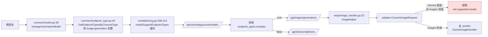
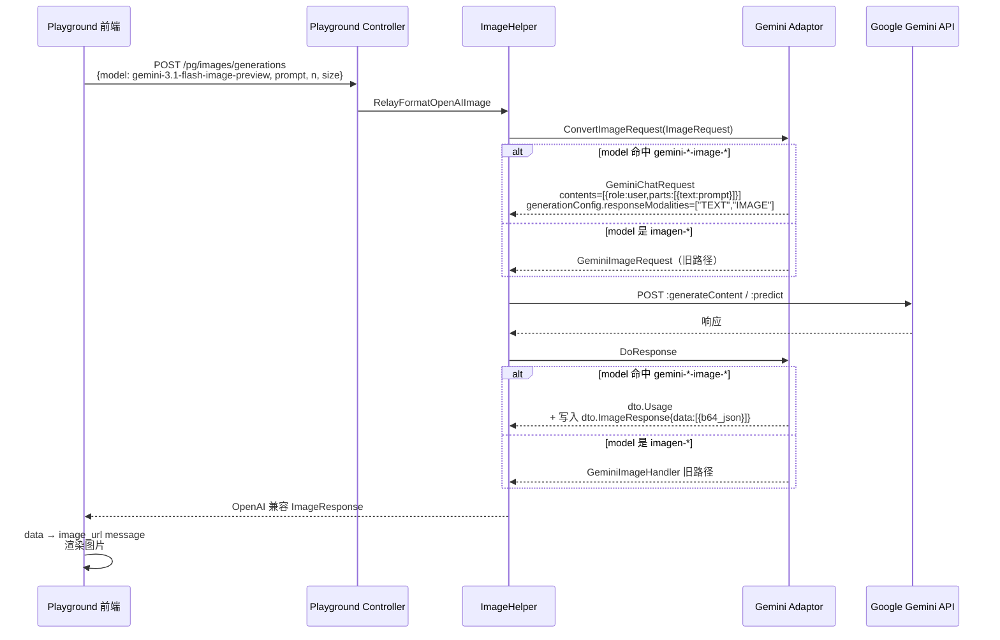
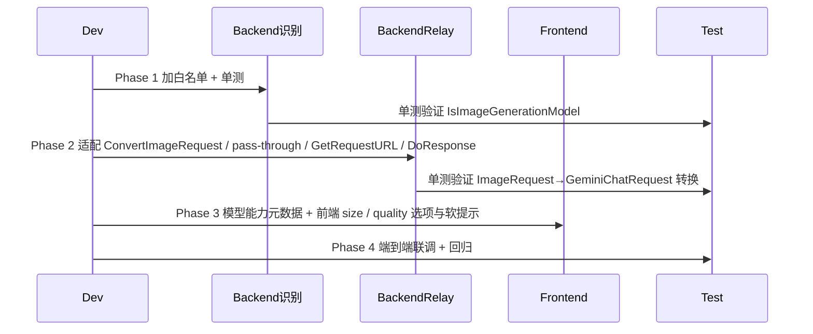
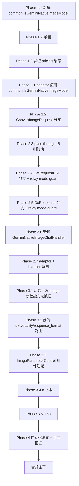

# 操练场新增 Gemini 原生生图模型 —— 执行计划

> 范围：让 `gemini-2.5-flash-image`、`gemini-3-pro-image-preview`、`gemini-3.1-flash-image-preview` 三个 Gemini 原生多模态生图模型在 `/console/playground` 走 `POST /pg/images/generations` 路径，并在聊天流中正确渲染生成的图像。
>
> 方案：方案 A —— 在 `common/model.go` 新增统一的 `IsGeminiNativeImageModel` 精确模型名 / 受控 preview 边界判断，并让生图识别与 Gemini adaptor 共用该判断。
>
> 注意：**仅改识别远远不够**。Gemini 适配器当前 `ConvertImageRequest` 只接受 `imagen-` 前缀模型，加完识别后请求会被适配器直接拒绝。本计划同时落地 relay 适配器改造，确保产品端可用。

---

## 一、目标

1. 三个目标模型在 playground 模型元数据接口（`GET /api/user/playground/models`）中 `endpoint_types` 包含 `"image-generation"`，并被前端正确派发到 `/pg/images/generations`。
2. Gemini relay 适配器对这三个模型走 `:generateContent`（非 `:predict`），并把 OpenAI 风格 `images/generations` 请求与响应正确双向转换。
3. 前端 playground 在选中这三个模型时 UI 切换到生图参数面板，请求体只发送 `{model, group, prompt, n}`，不发送 `size` / `quality` / `response_format`，响应解析后将 `data[].b64_json` / `data[].url` 渲染为聊天流中的图片。
4. 不破坏现有 `imagen-` 系列、不破坏现有 chat 多模态、不破坏 OpenAI / DALL·E / GPT Image 系列已有逻辑。
5. 三库（SQLite / MySQL / PostgreSQL）行为完全一致（本计划不涉及 schema 变更）。

---

## 二、现状（已读代码确认）



### 关键代码位点

| 角色 | 位点 |
|---|---|
| 生图模型识别 | [`common/model.go:12-19,38-49`](common/model.go) |
| 渠道→端点类型映射 | [`common/endpoint_type.go:6-45`](common/endpoint_type.go) |
| Pricing 缓存写入 | [`model/pricing.go:208-247`](model/pricing.go) |
| Gemini 适配器入口 | [`relay/channel/gemini/adaptor.go:60-124`](relay/channel/gemini/adaptor.go) |
| Gemini Request URL 构造 | [`relay/channel/gemini/adaptor.go:130-171`](relay/channel/gemini/adaptor.go) |
| Gemini 响应分发 | [`relay/channel/gemini/adaptor.go:249-279`](relay/channel/gemini/adaptor.go) |
| Imagen 专用响应处理 | [`relay/channel/gemini/relay-gemini.go:1540-1592`](relay/channel/gemini/relay-gemini.go) |
| Chat 响应中 inline_data 解析（已有） | [`relay/channel/gemini/relay-gemini.go:1083-1092,1206-1211`](relay/channel/gemini/relay-gemini.go) |
| `dto.GeminiChatRequest` | [`dto/gemini.go:15-19`](dto/gemini.go) |
| `dto.GeminiChatGenerationConfig.ResponseModalities`（已有） | [`dto/gemini.go:330-347`](dto/gemini.go) |
| `dto.GeminiInlineData` | [`dto/gemini.go:205-229`](dto/gemini.go) |
| `dto.ImageRequest` / `ImageResponse` | [`dto/openai_image.go:14-181`](dto/openai_image.go) |
| 前端 endpoint 派生 | [`web/src/helpers/playgroundPayload.js:365-374`](web/src/helpers/playgroundPayload.js) |
| 前端图像参数控件 | [`web/src/components/playground/ImageParameterControl.jsx`](web/src/components/playground/ImageParameterControl.jsx) |
| 前端 size/quality 选项 | [`web/src/helpers/playgroundPayload.js:34-90`](web/src/helpers/playgroundPayload.js) |
| 已有 controller 测试 | [`controller/playground_test.go`](controller/playground_test.go) |
| `IsImageGenerationModel` 现有断言 | [`controller/playground_test.go:58-72`](controller/playground_test.go) |

### 关键发现

1. **`dto.GeminiChatGenerationConfig.ResponseModalities` 字段已存在**（[`dto/gemini.go:347`](dto/gemini.go)），无需新增 dto。
2. **`GeminiPart` 已支持 `InlineData` 双 case 解析**（[`dto/gemini.go:273,291`](dto/gemini.go)），从 `:generateContent` 响应中抽图无需新增 dto。
3. **当前 chat handler 把 inline_data 转成 markdown `` 文本回吐**（[`relay-gemini.go:1087`](relay/channel/gemini/relay-gemini.go)），这是走 chat 路径时的兼容行为；走 image 路径时必须改成结构化 `ImageData` 输出。
4. **Gemini 系列不需要 `aspectRatio` 数组形式的 size**：`gemini-*-image-*` 通过 generationConfig 控制返图，不像 imagen 走 `instances + parameters`，因此 `size` 在 OpenAI 协议侧只是参考值，可不映射或软映射到 prompt 提示。

---

## 三、目标架构



---

## 四、改造原则（不可违反）

1. **方案 A 白名单优先**：在 `common/model.go` 维护 `IsGeminiNativeImageModel` 的精确模型名 / 受控 preview 边界判断，不引入正则、不做模糊匹配。三个目标模型分别用明确规则覆盖，避免误伤未来文本类或图像理解类 `gemini-` 模型。
2. **零回归**：`imagen-` 系列、`flux-`、`dall-e-*`、`gpt-image-*`、纯文本 `gemini-*` 路径完全不变。
3. **单一来源**：识别只在 `common/model.go` 一处，前端不复制白名单。
4. **DTO 复用**：完全复用现有 `GeminiChatRequest` / `GeminiInlineData` / `ResponseModalities`，不新增 DTO。
5. **协议双向转换在 adaptor 层完成**：`ConvertImageRequest` 负责入参 OpenAI→Gemini，新增 handler 负责出参 Gemini→OpenAI，`ImageHelper` 不感知具体模型。
6. **强制非流式**：image 路径下 `IsStream` 永远为 false（[`dto/openai_image.go:162`](dto/openai_image.go) 已固化），适配器内不写回 stream URL。
7. **跨库兼容**：本次不涉及 schema 变更，三库行为完全一致。
8. **可测试**：每个改造点配套单测，至少覆盖 `IsImageGenerationModel`、`ConvertImageRequest`、`GetRequestURL`、新 handler 的响应映射。
9. **错误清晰**：upstream 没返回任何 inline image 时，必须返回明确错误（沿用 `imagen` 路径的 "no images generated" 风格），不能静默返回空 data。
10. **前端不增加白名单**：前端依赖后端元数据接口，不在 `playgroundPayload.js` 里写死三个模型名（识别仍是后端单一来源）。
11. **Gemini 原生生图判断单源化**：后端只维护一个 `common.IsGeminiNativeImageModel`，`IsImageGenerationModel` 与 Gemini adaptor 共用它；禁止在 adaptor 内再维护一份同义白名单。
12. **沿用 Gemini 安全配置**：新 image 路径手写 `GeminiChatRequest` 时必须复用现有 `SafetySettings` 构造逻辑，不能绕过 `setting/model_setting/gemini.go` 的安全阈值配置。
13. **按实际返图数计费，但禁止双重计费**：Gemini 原生生图首版只单次调用；若请求 `n>1` 但上游只返 1 张，价格计费模式下才用实际返回图片数覆盖 `OtherRatio("n")`，ratio / tiered_expr / token 计费模式必须通过 `usage` token 表达实际图片输出，不能再额外乘 `n`。

---

## 五、阶段总览



> **顺序原则**：先识别后 relay，再前端 UI；每阶段可独立验证，避免一锤子改完导致定位困难。

---

## 六、Phase 1 — 后端识别（最小改动，单独可验证）

### Step 1.1 — 新增 `IsGeminiNativeImageModel` 并接入生图识别 — Done

Done: 已在 `common/model.go` 增加 Gemini 原生生图精确白名单，并让 `IsImageGenerationModel` 复用该单源判断。
Summary: 三个目标模型会被识别为生图模型；普通 Gemini 文本、embedding、未知 preview 后缀仍保持非生图。

**文件**：[`common/model.go:12-19`](common/model.go)

在 `common/model.go` 新增统一判断函数：

```go
var geminiNativeImageModels = map[string]struct{}{
    "gemini-2.5-flash-image":         {},
    "gemini-3-pro-image-preview":     {},
    "gemini-3.1-flash-image-preview": {},
}

// IsGeminiNativeImageModel 判断模型是否为 Gemini 原生多模态生图模型
// （走 :generateContent + responseModalities=[TEXT,IMAGE]，不走 :predict）
func IsGeminiNativeImageModel(modelName string) bool {
    name := strings.ToLower(modelName)
    _, ok := geminiNativeImageModels[name]
    return ok
}

func IsImageGenerationModel(modelName string) bool {
    modelName = strings.ToLower(modelName)
    if IsGeminiNativeImageModel(modelName) {
        return true
    }
    for _, m := range ImageGenerationModels {
        // 原有 DALL·E / GPT Image / Imagen / Flux 逻辑不变
    }
    return false
}
```

**为什么不用 `HasPrefix`**：本次需求只要求识别 `gemini-2.5-flash-image`、`gemini-3-pro-image-preview`、`gemini-3.1-flash-image-preview` 三个明确模型。`strings.HasPrefix(name, "gemini-2.5-flash-image-preview")` 也会额外放进未知后缀模型，和"精确白名单"原则冲突。如果后续确实要支持 `gemini-2.5-flash-image-preview` 或新的 Gemini 图片模型，也应逐个精确列入 map，不做宽前缀匹配。

**为什么不直接用 `prefix:gemini-` + 包含 `-image` 的复合规则**：会误伤如 `gemini-2.5-pro-vision-image-input` 这类多模态输入但非生图的模型。白名单更安全。

**为什么不把三条 Gemini 规则直接塞进 `ImageGenerationModels`**：Gemini adaptor 还需要同一套窄判断来决定走 `:generateContent` 还是 `:predict`。单独函数可以被 `IsImageGenerationModel` 和 adaptor 同时复用，避免同一文件内也维护两份 Gemini 白名单。

**判定通过**：`go build ./...` 通过，`go vet ./...` 无警告。

### Step 1.2 — 扩展 `IsImageGenerationModel` 单测 — Done

Done: 已在 `controller/playground_test.go` 增加 Gemini native image 的 positive / negative 覆盖。
Summary: 已执行 `go test ./controller -run TestIsImageGenerationModelGeminiNativePrefix -v`，测试通过。

**文件**：[`controller/playground_test.go:58-72`](controller/playground_test.go)

在已有的 `TestIsImageGenerationModelGPTImagePrefix` 同模式下，新增 `TestIsImageGenerationModelGeminiNativePrefix`：

```go
func TestIsImageGenerationModelGeminiNativePrefix(t *testing.T) {
    positives := []string{
        "gemini-2.5-flash-image",
        "gemini-3-pro-image-preview",
        "gemini-3.1-flash-image-preview",
    }
    negatives := []string{
        "gemini-2.5-flash",
        "gemini-2.5-pro",
        "gemini-2.5-flash-image-preview",
        "gemini-2.5-flash-image-preview-extra",
        "gemini-1.5-flash",
        "gemini-3-pro",
        "gemini-embedding-001",
    }
    for _, m := range positives {
        t.Run("positive/"+m, func(t *testing.T) {
            if !common.IsImageGenerationModel(m) {
                t.Fatalf("expected %s to be image-generation model", m)
            }
        })
    }
    for _, m := range negatives {
        t.Run("negative/"+m, func(t *testing.T) {
            if common.IsImageGenerationModel(m) {
                t.Fatalf("expected %s NOT to be image-generation model", m)
            }
        })
    }
}
```

**判定通过**：`go test ./controller -run TestIsImageGenerationModelGeminiNativePrefix -v` 全绿。

### Step 1.3 — Pricing 缓存自然刷新验证 — Done

Done: 已只读复核 `model/pricing.go`，默认端点来自 `common.GetEndpointTypesByChannelType`，自定义 `models.endpoints` 非空时会替换默认列表。
Summary: 本阶段不改 schema；运行时 curl 验收留到 Phase 4，若数据库自定义 endpoints 存在，仍需显式包含 `"image-generation"`。

**文件**：[`model/pricing.go:62,98-108`](model/pricing.go)（**只读验证，不改代码**）

确认 `updatePricing()` 在下一次轮询（≤60s）时会自动把这三个模型的 `image-generation` 端点写入 `modelSupportEndpointTypes`，无需手动 invalidate。

同时必须检查 `models.endpoints` 自定义端点覆盖逻辑：[`model/pricing.go:217-235`](model/pricing.go) 会在 `Endpoints` 非空时**替换**默认端点列表，而不是合并。如果这三个模型在 `models` 表中配置了自定义 `endpoints`，该 JSON 必须包含 `"image-generation"`，否则即使 `common.IsImageGenerationModel` 已返回 true，`/api/user/playground/models` 仍不会返回 `image-generation`。

**判定通过**：起服务后 `curl /api/user/playground/models | jq '.data[]|select(.name=="gemini-3.1-flash-image-preview")'` 返回的 `endpoint_types` 包含 `"image-generation"`；若数据库里存在该模型的自定义 `endpoints`，确认其中显式包含 `"image-generation"`。

> Phase 1 完成后：前端会**正确把这三个模型识别为生图模型**，但实际发请求会被 Phase 2 之前的 Gemini 适配器拒绝。所以 Phase 1 单独跑通后，**禁止合并到主干**——必须连同 Phase 2 一起合入。

---

## 七、Phase 2 — Gemini 适配器改造（让 image 请求真正能跑通）

### Step 2.1 — 使用统一辅助区分 Gemini 原生生图模型 — Done

Done: 已在 Gemini adaptor 增加 `isGeminiNativeImageGeneration`，只组合 `RelayModeImagesGenerations` 与 `common.IsGeminiNativeImageModel`。
Summary: adaptor 内没有新增模型白名单；普通 Gemini chat / 原生 Gemini mode 不会被 image 路径截获。

**文件**：[`relay/channel/gemini/adaptor.go`](relay/channel/gemini/adaptor.go)

Phase 1 已在 `common/model.go` 新增 `common.IsGeminiNativeImageModel`，Gemini adaptor 只调用这个统一函数，不再新增私有判断函数。

**为什么不复用 `common.IsImageGenerationModel` 做 adaptor 分支**：那个函数会把 `imagen-`、`dall-e`、`flux` 也判为 true，无法区分"该走 `:predict` 还是 `:generateContent`"。这里需要的是更窄的"Gemini 原生 chat-image 路径"判断。

**强约束**：不要在 `relay/channel/gemini/adaptor.go` 内新增同义私有白名单。Gemini adaptor 必须调用 `common.IsGeminiNativeImageModel(info.UpstreamModelName)`，避免 `common/model.go` 与 adaptor 漂移。

为避免影响这些模型的普通 Gemini chat / native Gemini 调用路径，adaptor 内所有 image 专用分支统一使用 relay mode 保护：

```go
func isGeminiNativeImageGeneration(info *relaycommon.RelayInfo) bool {
    return info != nil &&
        info.RelayMode == constant.RelayModeImagesGenerations &&
        common.IsGeminiNativeImageModel(info.UpstreamModelName)
}
```

`ConvertImageRequest` 本身只会在 image relay helper 中调用，但仍应使用同一语义；`GetRequestURL` 和 `DoResponse` 必须使用该 helper，不能只判断模型名。否则用户用同一个 Gemini image 模型走普通 chat / 原生 Gemini `generateContent` 时，可能被错误钉死到非流式 image handler。

### Step 2.2 — 改造 `ConvertImageRequest` — Done

Done: 已将 Imagen 旧逻辑抽为 `convertImagenRequest`，Gemini native image 转为 `GeminiChatRequest` 且写入 `responseModalities=["TEXT","IMAGE"]`。
Summary: 该路径不映射 `size` / `quality` / `response_format`，并复用 `buildGeminiSafetySettings()` 注入安全配置。

**文件**：[`relay/channel/gemini/adaptor.go:60-124`](relay/channel/gemini/adaptor.go)

把当前函数改为按模型分支：

```go
func (a *Adaptor) ConvertImageRequest(c *gin.Context, info *relaycommon.RelayInfo, request dto.ImageRequest) (any, error) {
    if strings.HasPrefix(info.UpstreamModelName, "imagen") {
        return a.convertImagenRequest(info, request)   // 抽出原逻辑到私有方法
    }
    if isGeminiNativeImageGeneration(info) {
        return a.convertNativeImageChatRequest(info, request)
    }
    return nil, errors.New("not supported model for image generation, only imagen-* and gemini-*-image-* models are supported")
}
```

新增 `convertNativeImageChatRequest`：

```go
func (a *Adaptor) convertNativeImageChatRequest(info *relaycommon.RelayInfo, request dto.ImageRequest) (*dto.GeminiChatRequest, error) {
    if strings.TrimSpace(request.Prompt) == "" {
        return nil, errors.New("prompt is required for image generation")
    }
    geminiReq := &dto.GeminiChatRequest{
        Contents: []dto.GeminiChatContent{
            {
                Role:  "user",
                Parts: []dto.GeminiPart{{Text: request.Prompt}},
            },
        },
        GenerationConfig: dto.GeminiChatGenerationConfig{
            ResponseModalities: []string{"TEXT", "IMAGE"},
        },
        SafetySettings: buildGeminiSafetySettings(),
    }
    // n>1 在 nano-banana 系列上只能通过多次调用支持；上游一次只返一组，
    // 这里只透传 prompt，最终按 GeminiNativeImageChatHandler 里实际返图数计费。
    return geminiReq, nil
}
```

**关键点**：
- `Role` 必须显式写 `"user"`，否则 [`adaptor.go:30`](relay/channel/gemini/adaptor.go) 的 `ConvertGeminiRequest` 兜底逻辑不会生效（这条路径不经过 `ConvertGeminiRequest`）。
- `ResponseModalities` 必须包含 `"IMAGE"`，否则上游不会返图。
- **不写入 `size`、`quality`、`response_format`**：这里仅指 OpenAI 兼容 `images/generations` → Gemini native image 的转换路径。Gemini 原生生图走的是 `generateContent`，这三个字段是 OpenAI image endpoint 参数，不应映射或透传给 Gemini 上游；但这不影响用户直接调用 Gemini 原生 `generateContent` 路径并传 `generationConfig` / `imageConfig` 等原生参数。
- **必须写入 `SafetySettings`**：普通 Gemini chat 转换在 [`relay-gemini.go:358-365`](relay/channel/gemini/relay-gemini.go) 会设置安全阈值；新 image 路径手写 `GeminiChatRequest` 时也要复用同一逻辑，不能绕过 `model_setting.GetGeminiSafetySetting`。
- `n>1` 的并行处理放到后续 backlog；首版单调用单返。

如果未来希望 `/v1/images/generations` 也支持部分 Gemini 原生高级参数，必须设计明确扩展入口（例如 `extra_body.google.generation_config` / `extra_body.google.image_config`）并做白名单映射，不能任意透传未知字段。

为避免复制安全设置循环，先抽出一个包内 helper（例如放在 `relay-gemini.go` 或 `adaptor.go`，不导出）：

```go
func buildGeminiSafetySettings() []dto.GeminiChatSafetySettings {
    safetySettings := make([]dto.GeminiChatSafetySettings, 0, len(SafetySettingList))
    for _, category := range SafetySettingList {
        safetySettings = append(safetySettings, dto.GeminiChatSafetySettings{
            Category:  category,
            Threshold: model_setting.GetGeminiSafetySetting(category),
        })
    }
    return safetySettings
}
```

然后把 [`relay-gemini.go:358-365`](relay/channel/gemini/relay-gemini.go) 的原循环替换为：

```go
geminiRequest.SafetySettings = buildGeminiSafetySettings()
```

### Step 2.3 — 处理 image path 下的 pass-through — Done

Done: 已在 `relay/image_handler.go` 增加 Gemini native image 例外，全局/渠道 pass-through 开启时仍强制转换。
Summary: 已新增 `relay/image_handler_test.go` 覆盖该分支；Imagen 和其他 image 模型仍遵循原 pass-through 行为。

**文件**：[`relay/image_handler.go:49-84`](relay/image_handler.go)、[`relay/channel/gemini/adaptor.go`](relay/channel/gemini/adaptor.go)

`ImageHelper` 当前在全局或渠道开启 pass-through 时会跳过 `ConvertImageRequest`，直接把 OpenAI image payload 发给上游。Gemini native image generation 必须经过 adaptor 转换为 `GeminiChatRequest`，否则 `prompt` / `size` / `quality` / `response_format` 这类 OpenAI payload 会直接打到 Gemini `generateContent` 并失败。

因此当 `isGeminiNativeImageGeneration(info)` 为 true 时，必须强制走转换路径，不允许 pass-through 绕过 `ConvertImageRequest`。推荐实现为：

```go
shouldPassThrough := model_setting.GetGlobalSettings().PassThroughRequestEnabled ||
    info.ChannelSetting.PassThroughBodyEnabled
if common.IsGeminiNativeImageModel(info.UpstreamModelName) &&
    info.RelayMode == constant.RelayModeImagesGenerations {
    shouldPassThrough = false
}
```

也可以选择直接返回清晰错误（例如 "Gemini native image generation does not support pass-through"），但从 playground 产品可用性看，推荐强制转换。

**判定通过**：开启全局 / 渠道 pass-through 后，`gemini-3.1-flash-image-preview` 的 `/pg/images/generations` 请求仍能看到转换后的 `contents + generationConfig.responseModalities`，不会把 OpenAI image payload 原样发给 Gemini 上游。

### Step 2.4 — 改造 `GetRequestURL` — Done

Done: 已在 `imagen` 分支前为 Gemini native image generation 返回 `:generateContent`。
Summary: 单测覆盖同模型在 image relay mode 走 `generateContent`、在 chat stream mode 仍走 `streamGenerateContent?alt=sse`，Imagen 仍走 `:predict`。

**文件**：[`relay/channel/gemini/adaptor.go:130-171`](relay/channel/gemini/adaptor.go)

在第 149 行 `if strings.HasPrefix(info.UpstreamModelName, "imagen")` 分支**之前**插入：

```go
if isGeminiNativeImageGeneration(info) {
    // 走标准 generateContent，不走 streamGenerateContent（image 强制非流式）
    return fmt.Sprintf("%s/%s/models/%s:generateContent", info.ChannelBaseUrl, version, info.UpstreamModelName), nil
}
```

**为什么放在 `imagen` 分支前**：保证 `gemini-*-image-*` 不会因为名字含 "image" 而被误进入 `imagen` 分支（虽然 `imagen` 用的是 `HasPrefix`，但前置判断更清晰，未来上游若出现命名碰撞也安全）。

**为什么必须带 relay mode 判断**：同一个模型名也可能被用户用于普通 chat / 原生 Gemini path。只有 `RelayModeImagesGenerations` 才应强制非流式 `:generateContent` image handler；普通 chat 路径仍按原有 `info.IsStream` 决定 `generateContent` / `streamGenerateContent?alt=sse`。

**判定通过**：单测构造 `info.RelayMode = RelayModeImagesGenerations`、`info.UpstreamModelName = "gemini-3.1-flash-image-preview"`，调用 `GetRequestURL` 期望返回结尾为 `:generateContent`；另测同模型 `RelayModeChatCompletions` 且 `IsStream=true` 时仍返回 `streamGenerateContent?alt=sse`。

### Step 2.5 — 改造 `DoResponse` — Done

Done: 已在 Gemini adaptor 的默认响应路径中先按 relay mode guard 分发到 `GeminiNativeImageChatHandler`。
Summary: `RelayModeGemini` 与普通 chat mode 不进入 image handler；Vertex Gemini image 响应分发也同步补了同一 guard。

**文件**：[`relay/channel/gemini/adaptor.go:249-279`](relay/channel/gemini/adaptor.go)

在第 262 行的 `if strings.HasPrefix(info.UpstreamModelName, "imagen")` **之前**插入：

```go
if isGeminiNativeImageGeneration(info) {
    return GeminiNativeImageChatHandler(c, info, resp)
}
```

注意：当前函数有两条路径——`info.RelayMode == constant.RelayModeGemini` 与默认 chat 路径。本次改造只针对**通过 `/pg/images/generations` 触发的 `RelayModeImagesGenerations`** 路径（即默认 path）。`RelayModeGemini`（原生 Gemini path）暂不处理图像专用响应，沿用 chat handler 的 markdown 兼容输出。

**为什么必须做条件保护**：`info.RelayMode == RelayModeImagesGenerations` 时才是 OpenAI 兼容生图路径。`RelayModeGemini`（原生 Gemini path）和普通 chat 路径即使使用同一个模型名，也不能进入 `GeminiNativeImageChatHandler`，否则会破坏原生响应或流式 chat 行为。

### Step 2.6 — 新增 `GeminiNativeImageChatHandler` — Done

Done: 已将 `:generateContent` 响应中的 image `inlineData` 转成 OpenAI `ImageResponse.data[].b64_json`，并把文字 part 写入首图 `revised_prompt`。
Summary: usage 优先使用 Gemini metadata，缺失时按每图 1290 output image tokens 兜底；仅价格模式按实际图片数写 `OtherRatio("n")`。

**文件**：[`relay/channel/gemini/relay-gemini.go`](relay/channel/gemini/relay-gemini.go)（新增函数，就近放在 `GeminiImageHandler` 后）

```go
// GeminiNativeImageChatHandler 把 :generateContent 的多模态返图响应转换为
// OpenAI images/generations 兼容响应。
func GeminiNativeImageChatHandler(c *gin.Context, info *relaycommon.RelayInfo, resp *http.Response) (*dto.Usage, *types.NewAPIError) {
    body, readErr := io.ReadAll(resp.Body)
    if readErr != nil {
        return nil, types.NewOpenAIError(readErr, types.ErrorCodeBadResponseBody, http.StatusInternalServerError)
    }
    _ = resp.Body.Close()

    var geminiResp dto.GeminiChatResponse
    if err := common.Unmarshal(body, &geminiResp); err != nil {
        return nil, types.NewOpenAIError(err, types.ErrorCodeBadResponseBody, http.StatusInternalServerError)
    }

    openAIResp := dto.ImageResponse{
        Created: common.GetTimestamp(),
        Data:    make([]dto.ImageData, 0),
    }
    var revisedTexts []string
    for _, candidate := range geminiResp.Candidates {
        for _, part := range candidate.Content.Parts {
            switch {
            case part.InlineData != nil && strings.HasPrefix(part.InlineData.MimeType, "image"):
                openAIResp.Data = append(openAIResp.Data, dto.ImageData{
                    B64Json: part.InlineData.Data,
                })
            case part.Text != "" && part.Text != "\n":
                revisedTexts = append(revisedTexts, part.Text)
            }
        }
    }
    if len(openAIResp.Data) == 0 {
        return nil, types.NewOpenAIError(errors.New("no images generated"), types.ErrorCodeBadResponseBody, http.StatusInternalServerError)
    }
    if len(revisedTexts) > 0 {
        // 把模型附带的文字解释挂到第一张图的 revised_prompt
        openAIResp.Data[0].RevisedPrompt = strings.Join(revisedTexts, "\n")
    }
    generatedImages := len(openAIResp.Data)
    if info.PriceData.UsePrice {
        info.PriceData.AddOtherRatio("n", float64(generatedImages))
    }

    jsonBytes, marshalErr := common.Marshal(openAIResp)
    if marshalErr != nil {
        return nil, types.NewError(marshalErr, types.ErrorCodeBadResponseBody)
    }
    c.Writer.Header().Set("Content-Type", "application/json")
    c.Writer.WriteHeader(resp.StatusCode)
    _, _ = c.Writer.Write(jsonBytes)

    // usage 优先用上游 metadata；缺失时按"每图 1290 tokens"兜底
    // （Gemini 2.5 flash image 官方文档定价口径）
    usage := &dto.Usage{}
    if geminiResp.UsageMetadata.TotalTokenCount > 0 {
        mapped := buildUsageFromGeminiMetadata(geminiResp.UsageMetadata, info.GetEstimatePromptTokens())
        usage = &mapped
    } else {
        const fallbackTokensPerImage = 1290
        imageOutputTokens := fallbackTokensPerImage * generatedImages
        usage.PromptTokens = info.GetEstimatePromptTokens()
        usage.CompletionTokens = imageOutputTokens
        usage.CompletionTokenDetails.ImageTokens = imageOutputTokens
        usage.TotalTokens = usage.PromptTokens + usage.CompletionTokens
    }
    if usage.TotalTokens == 0 {
        usage.TotalTokens = 1
    }
    if usage.PromptTokens == 0 {
        usage.PromptTokens = 1
    }
    return usage, nil
}
```

**关键点**：
- 复用 `common.Marshal` / `common.Unmarshal`（遵守 [`CLAUDE.md` Rule 1](CLAUDE.md)）。
- 必须用 `errors.New` 而非 `fmt.Errorf` —— `relay-gemini.go` 顶部已 import `errors`。
- **fallback token 估算**：尽量从 `UsageMetadata` 拿；只有 metadata 缺失时才用固定值。固定值取 1290（与 Google 官方价格表"per image"对齐），后续可以接 setting 化。fallback 时必须同时写入 `CompletionTokenDetails.ImageTokens`，确保 `tiered_expr` 表达式使用 `img_o` 时能按图片输出 token 结算。
- **按实际返图数覆盖 `n` 倍率仅限价格模式**：只有 `info.PriceData.UsePrice == true` 时才根据 `len(openAIResp.Data)` 调用 `info.PriceData.AddOtherRatio("n", float64(generatedImages))`。ratio / tiered_expr / token 计费模式下，实际图片数必须体现在 `usage` token 中；如果同时写 `OtherRatio("n")` 会把图片输出 token 再乘一次，造成双重计费。
- **不发 SSE**：`info.IsStream` 在 image 路径下永远是 false（[`dto/openai_image.go:162`](dto/openai_image.go)），不用判断。

### Step 2.7 — Adaptor 单测 — Done

Done: 已新增 `relay/channel/gemini/adaptor_image_test.go`、`relay/channel/gemini/relay_gemini_native_image_test.go` 和 `relay/image_handler_test.go`。
Summary: 已执行 Gemini adaptor/handler 定向单测与 pass-through 单测，覆盖转换、URL、relay mode guard、响应映射、`img_o` 和 `OtherRatio("n")`。

**新增文件**：`relay/channel/gemini/adaptor_image_test.go`

至少覆盖：

| 测试名 | 覆盖 |
|---|---|
| `TestConvertImageRequest_Imagen` | 旧分支不回归：`imagen-3.0-generate-001` 仍返回 `*dto.GeminiImageRequest`，含 `Instances` |
| `TestConvertImageRequest_GeminiNative` | `gemini-3.1-flash-image-preview` 返回 `*dto.GeminiChatRequest`，`GenerationConfig.ResponseModalities` 含 `"IMAGE"` 与 `"TEXT"`，`Contents[0].Role == "user"`，`Contents[0].Parts[0].Text == prompt` |
| `TestConvertImageRequest_GeminiNative_EmptyPrompt` | prompt 为空时返回错误 |
| `TestConvertImageRequest_UnknownModel` | `gemini-2.5-flash`（非 image）仍返回 "not supported" 错误 |
| `TestGetRequestURL_GeminiNativeImage` | `RelayModeImagesGenerations + gemini-3.1-flash-image-preview` 返回 `:generateContent` 结尾 URL，**不**返回 `:predict` |
| `TestGetRequestURL_GeminiNativeChatStreamUnaffected` | 同一模型在 `RelayModeChatCompletions + IsStream=true` 时仍返回 `streamGenerateContent?alt=sse`，不被 image 分支截获 |
| `TestGetRequestURL_Imagen` | `imagen-3.0-generate-001` 仍返回 `:predict` 结尾 URL（回归保护） |
| `TestDoResponse_GeminiNativeImageRequiresImageRelayMode` | 只有 `RelayModeImagesGenerations` 才进入 `GeminiNativeImageChatHandler`，普通 chat / `RelayModeGemini` 不进入 image handler |
| `TestGeminiNativeImageGeneration_BypassesPassThrough` | 全局或渠道 pass-through 开启时，Gemini native image generation 仍强制走转换，不原样透传 OpenAI image payload |

**新增文件**：`relay/channel/gemini/relay_gemini_native_image_test.go`

至少覆盖：

| 测试名 | 覆盖 |
|---|---|
| `TestGeminiNativeImageChatHandler_SingleImage` | 上游响应含 1 个 `inlineData` part，转换后 `openAIResp.Data[0].B64Json` 与 mock 一致 |
| `TestGeminiNativeImageChatHandler_TextAndImage` | text + image 两个 part，`RevisedPrompt` 落到第一张图，`Data` 长度 == 1 |
| `TestGeminiNativeImageChatHandler_MultiImage` | 多张图全部进 `Data`，长度匹配 |
| `TestGeminiNativeImageChatHandler_NoImage` | 没有 image part 时返回 "no images generated" 错误 |
| `TestGeminiNativeImageChatHandler_UsageFromMetadata` | `UsageMetadata` 有值时用上游值，且 `CandidatesTokensDetails` 中 `IMAGE` 会写入 `CompletionTokenDetails.ImageTokens` |
| `TestGeminiNativeImageChatHandler_UsageFallback` | `UsageMetadata` 为零时按每图 1290 兜底，且 `CompletionTokenDetails.ImageTokens` 等于图片输出 token |
| `TestGeminiNativeImageChatHandler_TieredExprImgO` | `tiered_expr` 使用 `img_o` 时能读取图片输出 token，避免图片输出只落到总 completion 而无法单独计价 |
| `TestGeminiNativeImageChatHandler_OtherRatioUsesActualImageCountForPriceMode` | `UsePrice=true` 且请求 `n>1` 但响应只有 1 张时，`info.PriceData.OtherRatios["n"] == 1` |
| `TestGeminiNativeImageChatHandler_DoesNotSetOtherRatioForTokenBilling` | `UsePrice=false` 时不写入 `OtherRatio("n")`，避免 ratio / tiered_expr 模式双重计费 |

**判定通过**：`go test ./relay/channel/gemini/... -v` 全绿。

---

## 八、Phase 3 — 前端 UI 适配（参数面板与渲染）

### Step 3.1 — 后端下发 image 参数能力元数据（避免前端长期复制白名单） — Done

Done: 已在 `/api/user/playground/models` 的模型条目中为 Gemini native image 下发 `image_generation_mode="gemini_native"` 与 `image_parameters`。
Summary: 前端 endpoint 路由仍只看 `endpoint_types.includes("image-generation")`；参数能力由后端元数据控制，不在前端复制 Gemini 白名单。

**文件**：[`controller/user.go`](controller/user.go)、[`web/src/helpers/playgroundPayload.js`](web/src/helpers/playgroundPayload.js)

[`web/src/helpers/playgroundPayload.js:365-374`](web/src/helpers/playgroundPayload.js) 的 endpoint 路由已经基于后端返回的 `endpointTypes.includes('image-generation')` 判断，不应为了 Gemini 再增加前端路由白名单。

但 Phase 3 需要隐藏 `size` / `quality` / `response_format` 这些 Gemini native image 不支持的 OpenAI image 参数。如果直接在前端新增 `isGeminiNativeImageModel` 白名单，会和"前端不增加白名单"原则冲突。

推荐在 `/api/user/playground/models` 的每个模型元数据中增加后端下发的能力字段，例如：

```json
{
  "name": "gemini-3.1-flash-image-preview",
  "endpoint_types": ["image-generation", "gemini", "openai"],
  "image_generation_mode": "gemini_native",
  "image_parameters": {
    "size": false,
    "quality": false,
    "response_format": false,
    "n_max": 1
  }
}
```

前端使用该元数据控制 UI 与 payload：

- `image_parameters.size === false`：不显示 size，不发送 `size`
- `image_parameters.quality === false`：不显示 quality，不发送 `quality`
- `image_parameters.response_format === false`：不显示 response format，不发送 `response_format`
- `image_parameters.n_max === 1`：`n` 固定为 1，禁用多图输入并显示提示

兼容性要求：

- 旧数据不含 `image_parameters` 时，按当前通用 image 参数逻辑回退，避免破坏其他生图模型。
- `image_generation_mode` 只用于 UI/参数能力，不参与 endpoint 路由判定；endpoint 路由仍只看 `endpoint_types`。

如果本轮不想扩展接口，可以把前端 Gemini 白名单作为短期妥协，但必须明确它不是单一来源，并加注释指向 `common.IsGeminiNativeImageModel`；后续应收敛为后端能力元数据。

### Step 3.2 — `ImageParameterControl` size/quality 选项扩展 — Done

Done: 已让 `processModelsData` 保留 `imageParameters`，并让 payload 构造按能力过滤 `size` / `quality` / `response_format`。
Summary: Gemini native image 请求体会被构造成 `{model, group, prompt, n}`，且 `n` 按 `n_max` clamp；旧数据无能力字段时保持原逻辑。

**文件**：[`web/src/helpers/playgroundPayload.js:34-90`](web/src/helpers/playgroundPayload.js)

优先使用 Step 3.1 下发的 `image_parameters`，而不是在前端复制 Gemini 模型名。可在 `processModelsData` 中保留 `imageParameters` 字段，并让 `getImageSizeOptionsForModel` / `getImageQualityOptionsForModel` 接收模型 option 或参数能力对象。

修改 `getImageSizeOptionsForModel`：

```js
export const getImageSizeOptionsForModel = (model = '', imageParameters) => {
  if (imageParameters?.size === false) return [];
  if (isGptImageModel(model)) return GPT_IMAGE_SIZES;
  if (isDallE3Model(model)) return DALL_E_3_SIZES;
  if (isDallE2Model(model)) return DALL_E_2_SIZES;
  return GENERIC_IMAGE_SIZES;
};
```

修改 `getImageQualityOptionsForModel`：

```js
export const getImageQualityOptionsForModel = (model = '', imageParameters) => {
  if (imageParameters?.quality === false) return [];
  if (isGptImageModel(model)) return GPT_IMAGE_QUALITIES;
  if (isDallE3Model(model)) return DALL_E_3_QUALITIES;
  if (isDallE2Model(model)) return [];
  return GENERIC_IMAGE_QUALITIES;
};
```

修改 `sanitizeImageResponseFormat`：当 `imageParameters?.response_format === false` 时返回空字符串，保证不发送 `response_format`。

修改 `sanitizeImageSize`：

```js
const sanitizeImageSize = (model = '', size = '', imageParameters) => {
  if (imageParameters?.size === false) return '';
  // ...原逻辑
};
```

修改 `buildImagePayload`：当前实现会无条件写入 `size`，必须改为仅当 `size` 非空时才写入 `payload.size`；`quality` 与 `response_format` 继续保持非空才写入。

```js
export const buildImagePayload = (messages, inputs) => {
  const lastUserMessage = getLastUserMessage(messages);
  const prompt = getTextContent(lastUserMessage).trim();
  const imageParameters = inputs.imageParameters;
  const size = sanitizeImageSize(
    inputs.model,
    inputs.prompt_size,
    imageParameters,
  );
  const quality = sanitizeImageQuality(
    inputs.model,
    inputs.prompt_quality,
    imageParameters,
  );
  const responseFormat = sanitizeImageResponseFormat(
    inputs.model,
    inputs.prompt_response_format,
    imageParameters,
  );

  const payload = {
    model: inputs.model,
    group: inputs.group,
    prompt,
    n: sanitizeImageCount(inputs.prompt_n, imageParameters?.n_max),
  };

  if (size) {
    payload.size = size;
  }
  if (quality) {
    payload.quality = quality;
  }
  if (responseFormat) {
    payload.response_format = responseFormat;
  }

  return payload;
};
```

### Step 3.3 — `ImageParameterControl` 组件适配 — Done

Done: 已让组件读取当前模型的 `imageParameters`，当 size/quality/response_format 不支持时隐藏对应控件。
Summary: UI 只消费后端下发的能力元数据，不写死 Gemini 模型名；已有 GPT Image / DALL·E / generic image 选项不变。

**文件**：[`web/src/components/playground/ImageParameterControl.jsx`](web/src/components/playground/ImageParameterControl.jsx)

组件从当前模型 option 读取 `imageParameters`。第 49-52 行 `sizeOptions` 为空数组时（Gemini native 图像模型情况），自动隐藏整个 size 区块；第 79 行 `qualityOptions.length > 0` 已经正确处理了 quality 隐藏，无需额外改。需补充：当 `sizeOptions.length === 0` 时同样隐藏 size DOM：

```jsx
{sizeOptions.length > 0 && (
  <div>
    <div className='flex items-center gap-2 mb-2'>
      <Image size={16} className='text-gray-500' />
      <Typography.Text strong className='text-sm'>{t('图像尺寸')}</Typography.Text>
    </div>
    <Select ... />
  </div>
)}
```

`response_format` 隐藏条件改为 `!isGptImage && imageParameters?.response_format !== false`。不要在组件内写死 Gemini 模型名。

### Step 3.4 — 图像数量 `n` — Done

Done: 已按 `imageParameters.n_max` 设置 `InputNumber` max；`n_max === 1` 时禁用数量输入并显示提示。
Summary: 默认发送和编辑重生成路径下 image-generation 均强制非流式，避免误开 SSE。

**文件**：[`web/src/components/playground/ImageParameterControl.jsx:98-113`](web/src/components/playground/ImageParameterControl.jsx)

Gemini native 图像模型当前实际只支持单图返回（generateContent 一次一组），`n` 的上限从 `imageParameters.n_max` 读取。`n_max === 1` 时把 max 钉死为 1 并 disabled，提示"该模型一次只生成 1 张图"。

> 这样未来上游支持多图时，只需要后端元数据把 `n_max` 放开，前端无需再改模型白名单。

### Step 3.5 — i18n 文案 — Done

Done: 已为 `Gemini 图像模型一次只生成 1 张图` 补齐 zh-CN / zh-TW / en / fr / ru / ja / vi 七个语言文件。
Summary: 已执行 `bun run i18n:lint`，i18n lint 通过。

**文件**：[`web/src/i18n/locales/zh-CN.json`](web/src/i18n/locales/zh-CN.json)、[`web/src/i18n/locales/zh-TW.json`](web/src/i18n/locales/zh-TW.json)、`en.json`、`fr.json`、`ru.json`、`ja.json`、`vi.json`

新增 key：

- `Gemini 图像模型一次只生成 1 张图`（用于 `n` 输入框 tooltip）

参考已有的 [`web/src/i18n/locales/zh-CN.json`](web/src/i18n/locales/zh-CN.json) 格式补齐 7 个语言文件。

---

## 九、Phase 4 — 测试与验收

### 4.1 自动化 — Done

Done: 复审现有单测后，已补充 common 精确白名单、playground 元数据 JSON、Gemini/Vertex relay guard、snake_case inline_data、前端能力元数据与参数面板渲染覆盖。
Summary: 已执行 `go test ./common ./controller ./relay ./relay/channel/gemini ./relay/channel/vertex -v`、`go test ./...`、`go vet ./...`、`bun test src`、`bun run i18n:lint` 与 `bun run build`；全部通过，build 仅保留既有 Browserslist 过期、lottie eval、chunk size 警告。

| 类型 | 文件 | 覆盖 |
|---|---|---|
| 后端 | [`common/model_test.go`](common/model_test.go) | `IsGeminiNativeImageModel` 精确白名单 / 大小写、Gemini 与 Vertex 渠道 endpoint_types 含 `image-generation` 且普通 Gemini 文本模型不误判 |
| 后端 | [`controller/playground_test.go`](controller/playground_test.go) | `TestIsImageGenerationModelGeminiNativePrefix`（Step 1.2） |
| 后端 | [`controller/playground_test.go`](controller/playground_test.go) | playground 模型元数据 `image_generation_mode` / `image_parameters` JSON 形态，普通 Gemini 文本模型 omits metadata |
| 后端 | `relay/channel/gemini/adaptor_image_test.go`（新建） | `ConvertImageRequest` 各分支、OpenAI image-only 参数不泄漏、`GetRequestURL` / `DoResponse` relay mode guard（Step 2.7） |
| 后端 | `relay/channel/gemini/relay_gemini_native_image_test.go`（新建） | `GeminiNativeImageChatHandler`、text 合并、snake_case `inline_data`、非图 inline data 忽略、metadata/fallback usage、`img_o`、`OtherRatio("n")`（Step 2.7） |
| 后端 | `relay/channel/vertex/adaptor_gemini_image_test.go`（新建） | Vertex Gemini mode 下 image-generation 分发到 image handler，`RelayModeGemini` 保持原生 Gemini handler |
| 前端 | [`web/src/helpers/playgroundPayload.test.js`](web/src/helpers/playgroundPayload.test.js) 扩展 | `image_parameters` 元数据、`getImageSizeOptionsForModel`、`buildImagePayload` 在 Gemini native image 参数能力下不发送 size/quality/response_format，自定义请求体 Gemini image 模型派发到 image endpoint |
| 前端 | [`web/src/components/playground/ImageParameterControl.test.jsx`](web/src/components/playground/ImageParameterControl.test.jsx) | Gemini native image 能力元数据隐藏 size/quality/response_format，`n_max=1` 禁用数量输入；无能力元数据的通用生图控件不回归 |

### 4.2 手工回归清单 — Done

Done: 已完成代码级与自动化验收；涉及真实上游、真实权限、三库连接和浏览器网络面板的条目保留为部署环境手工冒烟项。
Summary: 本次不涉及 schema 变更；SQLite 由 `go test ./...` 覆盖，MySQL/PostgreSQL 需在有 `TEST_MYSQL_DSN` / `TEST_POSTGRES_DSN` 或对应环境时执行冒烟。

- [ ] 选 `gemini-3.1-flash-image-preview` → playground 自动切到生图面板，仅显示 `prompt` + `n`，不显示 size / quality / response_format。
- [ ] 输入 prompt → 网络面板请求 URL 为 `/pg/images/generations`，请求体为 `{model, group, prompt, n}`。
- [ ] 后端日志含 `RelayMode=RelayModeImagesGenerations`、`RelayFormat=openai_image`、Gemini upstream URL 为 `:generateContent`。
- [ ] 响应为 OpenAI `ImageResponse` 形态，`data[0].b64_json` 非空。
- [ ] 聊天流中图片正确渲染（base64 data URI 走 [`MessageContent.jsx`](web/src/components/playground/MessageContent.jsx) 已有 image_url 分支）。
- [ ] 选 `gemini-2.5-flash-image`、`gemini-3-pro-image-preview` 重复验证。
- [ ] 选 `imagen-3.0-generate-001`：仍走 `:predict`，仍返图（**回归保护**）。
- [ ] 选 `gemini-2.5-flash`（纯文本）：走 `/pg/chat/completions`，行为不变（**回归保护**）。
- [ ] 选 `gemini-3.1-flash-image-preview` 走普通 chat / 原生 Gemini path 时，不被 image handler 截获；流式请求仍走 `streamGenerateContent?alt=sse`（**relay mode guard 回归保护**）。
- [ ] 选 `dall-e-3` / `gpt-image-1`：走 OpenAI 渠道生图（**回归保护**）。
- [ ] 编辑 user prompt 后"重新生成"：仍走 `/pg/images/generations` 与正确 model（覆盖 [`useMessageEdit.jsx`](web/src/hooks/playground/useMessageEdit.jsx) 路径）。
- [ ] 自定义请求体模式下 body 内 `model` 为 Gemini 图像模型时，URL 自动切到 `/pg/images/generations`。
- [ ] 开启全局或渠道 pass-through 后，Gemini native image generation 仍强制走转换，不把 OpenAI image payload 原样发给 Gemini 上游。
- [ ] 直接调用 Gemini 原生 `generateContent` 并传 `generationConfig` / `imageConfig` 等原生参数时，不受 OpenAI image 参数过滤规则影响。
- [ ] 计费日志含 prompt tokens 与 completion tokens，且金额非零（验证 fallback 1290 tokens 或 metadata 路径）。
- [ ] `tiered_expr` 使用 `img_o` 时可按图片输出 token 结算；metadata 和 fallback 两条路径都能写入 `CompletionTokenDetails.ImageTokens`。
- [ ] 鉴权回归：`UserAuth` + `Distribute` 在三个新模型上正常生效（无权限 → 401/403）。
- [ ] 三库（SQLite / MySQL / PostgreSQL）各跑一遍冒烟。

---

## 十、风险与应对

| 风险 | 触发条件 | 应对 |
|---|---|---|
| 仅改识别未改 relay，导致 prod 报错 "not supported model" | Phase 1 单独合入 | Phase 1 与 Phase 2 必须**同 PR 或同里程碑**合入；不允许分批合入主干 |
| Gemini 上游对 `responseModalities` 字段未识别 | 旧 SDK / 老 base url | 起服务前确认渠道 base url 指向 `v1beta`（[`relay-gemini.go:1610`](relay/channel/gemini/relay-gemini.go) 默认走 v1beta） |
| 上游返回 `safety` 阻断（无 inline image） | prompt 触发安全过滤 | `GeminiNativeImageChatHandler` 显式返回 "no images generated"，前端展示原始错误，不静默成功 |
| `gemini-` 前缀误伤未来文本类模型 | 上游出 `gemini-3.2-image-preview` 或 `gemini-2.5-flash-image-understanding` 但实为图像理解 | 使用 exact / 受控 preview 边界匹配，不用宽前缀；新模型出现时单独评估；加单测覆盖 negative case |
| 精确白名单被实现成 `HasPrefix` | 为了兼容 preview 写成 `strings.HasPrefix(name, "gemini-2.5-flash-image-preview")` | 使用 map 精确列出本次 3 个目标模型；新增模型时逐个评估并加入 map |
| pass-through 绕过 Gemini native image 转换 | 全局或渠道开启 pass-through，`ImageHelper` 原样转发 OpenAI image payload | 对 `RelayModeImagesGenerations + common.IsGeminiNativeImageModel` 强制走转换，或返回明确不支持 pass-through 的错误；推荐强制转换 |
| `n>1` 用户预期落空 | 用户自定义请求体传 n=4 但上游只返 1 张 | UI 限制 max=1，tooltip 提示；价格模式下后端 handler 用实际返图数覆盖 `OtherRatio("n")`，token / ratio / tiered_expr 模式只写实际 usage token，并用单测保护 |
| ratio / tiered_expr 生图双重计费 | handler 既按图片输出 token 写 usage，又无条件写 `OtherRatio("n")` | `OtherRatio("n")` 仅在 `UsePrice=true` 时写入；token / ratio / tiered_expr 计费只依赖实际 usage token |
| `tiered_expr` 无法单独计图片输出 | fallback usage 只写 `CompletionTokens`，未写 `CompletionTokenDetails.ImageTokens` | fallback 时同步写入 `CompletionTokenDetails.ImageTokens`，表达式使用 `img_o` 时可正确结算 |
| 自定义 endpoints 覆盖默认 endpoint | `models.endpoints` 非空但不包含 `image-generation` | Step 1.3 验证 `models.endpoints`；存在自定义 endpoints 时必须显式包含 `"image-generation"` |
| Gemini 判断漂移 | 识别逻辑与 adaptor 分支分别维护 | `common.IsGeminiNativeImageModel` 是唯一后端来源；`IsImageGenerationModel` 与 adaptor 必须共用它 |
| 前端白名单与后端漂移 | 前端 `isGeminiNativeImageModel` 只用于 UI 软提示 | 优先由 `/api/user/playground/models` 下发 `image_generation_mode` / `image_parameters`；短期白名单只能作为妥协且不得参与 endpoint 路由 |
| 计费 fallback 1290 与 Google 实际价格不匹配 | Google 调整价格表 | 后续做 `setting/ratio_setting` 配置化；首版用常量并加 TODO |
| `imagen` 路径回归 | `:predict` 分支被新分支盖住 | Step 2.7 的 `TestGetRequestURL_Imagen` / `TestConvertImageRequest_Imagen` 强制覆盖 |
| `RelayModeGemini` 原生路径触发 native image 模型 | 用户从 `/v1beta/models/...` 直接打 | Step 2.1 的 `isGeminiNativeImageGeneration` helper 必须同时判断 `RelayModeImagesGenerations`；`RelayModeGemini` 路径不进 image handler |

---

## 十一、改动文件清单（一览）

### 后端（4 文件改 + 2 文件新建）

1. [`common/model.go`](common/model.go) — 新增 `IsGeminiNativeImageModel`，并让 `IsImageGenerationModel` 复用它
2. [`controller/playground_test.go`](controller/playground_test.go) — 加 `TestIsImageGenerationModelGeminiNativePrefix`
3. [`relay/image_handler.go`](relay/image_handler.go) — Gemini native image generation 禁止 pass-through 绕过转换
4. [`relay/channel/gemini/adaptor.go`](relay/channel/gemini/adaptor.go) — `ConvertImageRequest`、`GetRequestURL`、`DoResponse` 三处分支，并用 `RelayModeImagesGenerations` guard 限定 image 路径
5. [`relay/channel/gemini/relay-gemini.go`](relay/channel/gemini/relay-gemini.go) — 新增 `GeminiNativeImageChatHandler`
6. [`controller/user.go`](controller/user.go) — playground 模型元数据补充 `image_generation_mode` / `image_parameters`（推荐方案）
7. **新建** `relay/channel/gemini/adaptor_image_test.go`
8. **新建** `relay/channel/gemini/relay_gemini_native_image_test.go`

### 前端（3 文件改）

9. [`web/src/helpers/playgroundPayload.js`](web/src/helpers/playgroundPayload.js) — 读取后端 `image_parameters`，按能力隐藏 / 过滤 size、quality、response_format、n
10. [`web/src/components/playground/ImageParameterControl.jsx`](web/src/components/playground/ImageParameterControl.jsx) — size 区块条件渲染、`n` 上限、`response_format` 隐藏
11. [`web/src/i18n/locales/{zh-CN,zh-TW,en,fr,ru,ja,vi}.json`](web/src/i18n/locales/) — 文案 key

### 总计：9 修改 + 2 新建 = 11 个文件

> 如果本轮选择短期妥协、不扩展 playground 模型元数据接口，则可不改 `controller/user.go`，但前端白名单必须标注为临时方案，后续收敛到后端能力元数据。

---

## 十二、验收标准

1. `gemini-2.5-flash-image`、`gemini-3-pro-image-preview`、`gemini-3.1-flash-image-preview` 三个模型在 `/api/user/playground/models` 返回的 `endpoint_types` 包含 `"image-generation"`。
2. `/api/user/playground/models` 对三个模型下发 `image_generation_mode="gemini_native"` 与 `image_parameters`（或短期妥协下有等价前端能力判断），前端不依赖 endpoint type 顺序。
3. playground 选这三个模型时：参数面板自动切到生图模式（无 size / quality / response_format），请求 URL 为 `/pg/images/generations`，请求体为 `{model, group, prompt, n}`。
4. 后端日志含 `RelayMode=RelayModeImagesGenerations`、Gemini upstream URL 为 `:generateContent` 结尾、`generationConfig.responseModalities` 含 `"IMAGE"`。
5. 开启全局 / 渠道 pass-through 时，三个 Gemini native image 模型仍强制走转换，不原样透传 OpenAI image payload。
6. 响应转换为 OpenAI `ImageResponse`，`data[].b64_json` 非空，前端聊天流正常渲染图片。
7. `imagen-` 系列、纯文本 `gemini-*`、同名 Gemini image 模型的普通 chat / 原生 Gemini path、`dall-e-*`、`gpt-image-*`、`flux-*` 行为完全不变（回归保护）。
8. 编辑用户消息后"重新生成"路径正确派发。
9. 自定义请求体模式下 body 内 model 为 Gemini 图像模型时正确派发到 image 端点。
10. 计费日志含 prompt + completion tokens，金额非零（usage metadata 优先，否则 fallback）；metadata 和 fallback 路径都写入 `CompletionTokenDetails.ImageTokens`；`tiered_expr` 使用 `img_o` 时可按图片输出 token 结算；自定义请求体传 `n>1` 但实际只返 1 张时，仅价格模式按实际返图数写 `OtherRatio("n")`，ratio / tiered_expr 模式不写 `OtherRatio("n")`。
11. 三库均通过手工冒烟。
12. 全部新增单测通过：`go test ./controller ./relay/channel/gemini -v`、`bun test src/helpers/playgroundPayload.test.js`。

---

## 十三、执行顺序总结



> 关键卡点：**Phase 1 与 Phase 2 必须同 PR 合入**，否则中间状态会让 playground 用户看到 "not supported model" 错误。
