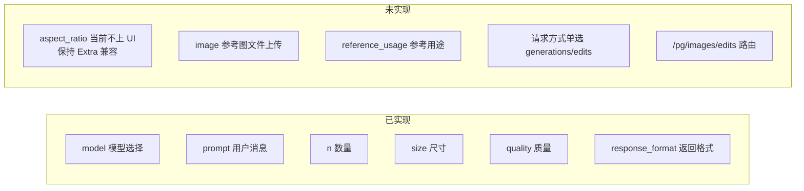
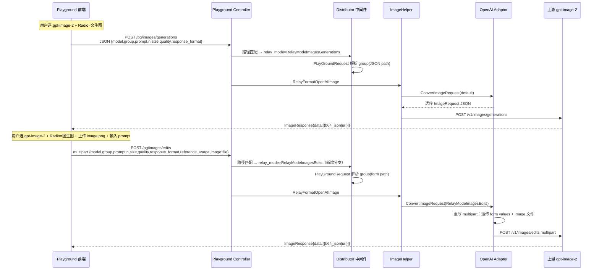
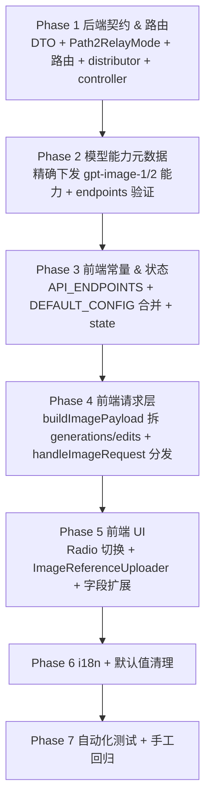
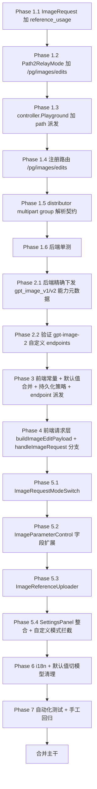
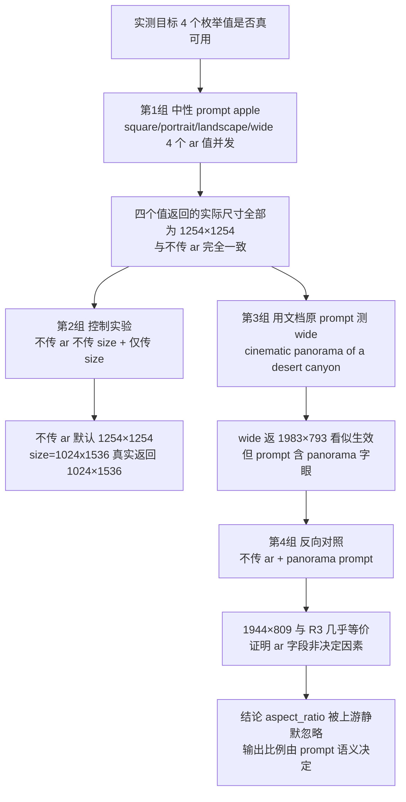
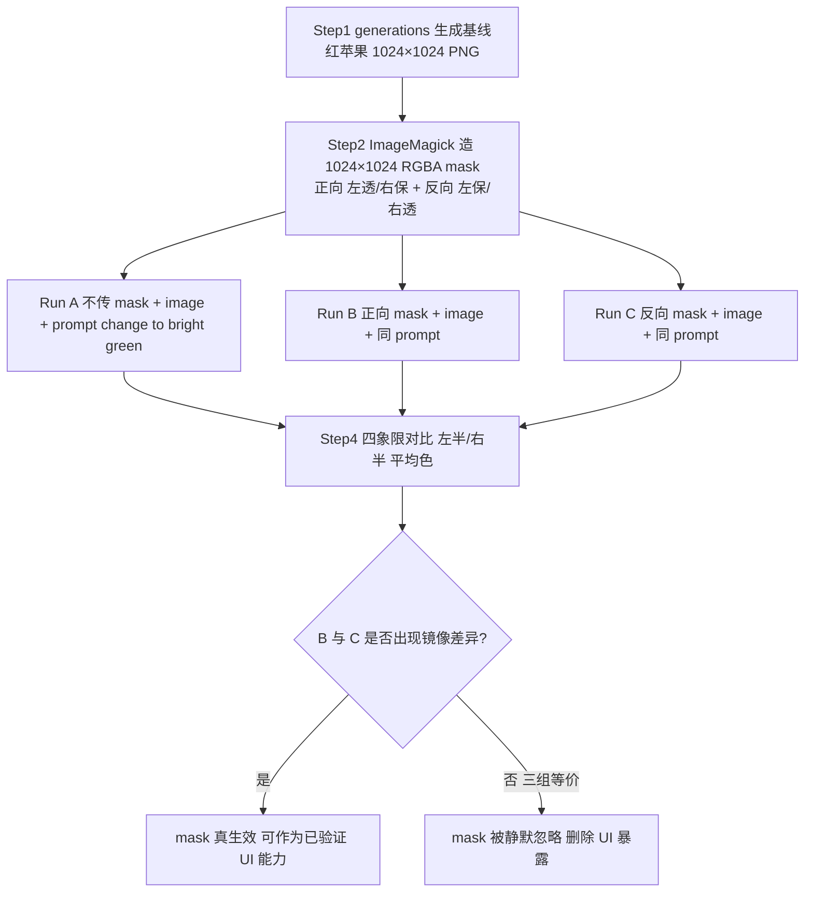

# 操练场新增 gpt-image-2 文生图与图生图页面功能 — 执行计划

> 范围：在 `/console/playground` 页面为 `gpt-image-2` 模型新增「文生图」与「图生图」两种使用方式，分别对应上游 `POST /v1/images/generations` 与 `POST /v1/images/edits` 接口。前端用单选切换（Radio），所有已验证有效的上游可调参数均在前端暴露并提供合理默认值；`aspect_ratio` 因当前上游静默忽略，首版不接入 UI，也不新增结构化 DTO 字段。
>
> 接口规范来源：项目根目录 `gpt-image-2使用指南.md`（实测整理）。
>
> 兼容前提：与已落地的 `20260427_playground_images_plan.md`（playground 接入 images/generations）和 `20260428_操练场新增 Gemini 原生生图模型_plan.md`（Gemini 原生生图）现网行为完全兼容，对其他生图模型零回归。

---

## 一、目标

1. 在 playground 选中 `gpt-image-2` 时，参数面板出现「请求方式」单选：`文生图(generations)` / `图生图(edits)`；未来 `gpt-image-*` 模型只有在后端能力元数据明确声明 `supports_edits=true` 时才显示该单选。
2. **文生图** 走 `POST /pg/images/generations`（JSON），暴露所有上游参数：`prompt`、`n`、`size`、`quality`、`response_format`，全部带默认值且可覆盖。
3. **图生图** 走 `POST /pg/images/edits`（multipart/form-data），在文生图参数基础上额外暴露：`image`（文件，必填）、`reference_usage`（subject/composition/style）。`mask` 因当前上游静默忽略（详见文末 §19 Review），不作为首版可用参数暴露。
4. 两种模式共用同一个对话流：用户输入 prompt → 助手消息渲染图片（沿用已有 `image_url` content 协议，base64 → data URI、url 直接展示）。
5. **不破坏** 已有 `dall-e-2/3`、`gpt-image-1`、`flux-*`、`imagen-*`、`gemini-*-image-*` 的 playground 行为。
6. 三库（SQLite / MySQL / PostgreSQL）行为一致，本计划不改 schema。

---

## 二、参数差距分析（当前前端 vs gpt-image-2 接口指南）



### 详细对照表

| 字段 | 文生图(generations) | 图生图(edits) | 当前前端是否实现 | 当前后端是否实现 |
|---|:---:|:---:|---|---|
| `model` | ✅ | ✅ | 已（模型下拉） | 已 |
| `prompt` | ✅ | ✅ | 已（取最后一条 user 消息文本） | 已 |
| `n` | ✅ | ✅ | 已（`ImageParameterControl`） | 已（`ImageRequest.N`） |
| `size` | ✅ | ✅ | 已 | 已 |
| `quality` | ✅ | ✅ | 已 | 已 |
| `response_format` | ✅ | ✅ | 已（但当前对 GPT Image 系列默认隐藏） | 已 |
| `aspect_ratio` | ⚠️ 上游当前静默忽略，UI 不接 | ⚠️ 上游当前静默忽略，UI 不接 | 不实现控件 | 不新增结构化 DTO 字段（避免破坏依赖 `Extra` 的现有渠道） |
| `image` 文件上传 | ❌ | ✅（必填，可重复传多张） | **未**（现有 `ImageUrlInput` 是 chat 多模态消息内 URL，不是 multipart 文件） | 已（`OpenAI adaptor.ConvertImageRequest` 在 `RelayModeImagesEdits` 已处理 `mf.File["image"]`） |
| `mask` 文件上传 | ❌ | ⚠️ 上游当前静默忽略，首版不作为可用参数（详见文末 §19 Review） | 不实现控件 | 通用 OpenAI adaptor 已具备透传能力，但本功能不接入 |
| `reference_usage` | ❌ | ✅（默认 `subject`） | **未** | **未**（DTO 未声明，但适配器透传 form 时可携带；为类型安全建议用指针字段显式声明） |
| 上游路由 `/pg/images/edits` | — | — | **未** | **未**（仅 `/v1/images/edits` 已存在） |
| 请求方式单选 | — | — | **未** | — |

### 关键发现（已读代码确认）

1. **后端 `OpenAI adaptor.ConvertImageRequest`（[`relay/channel/openai/adaptor.go:426-552`](relay/channel/openai/adaptor.go)）已实现完整的 multipart 透传**：以 `mf.Value` 写入所有非 model/file 字段、把 `image` / `image[]` / `mask` 文件按 MIME 类型重写到上游。这意味着只要前端正确发出 multipart，`reference_usage` 会自动透传上游，**适配器无需改造**。`mask` 虽有通用透传能力，但因 gpt-image-2 当前静默忽略，首版不在 UI 暴露。
2. **`GetAndValidOpenAIImageRequest`（[`relay/helper/valid_request.go:142-228`](relay/helper/valid_request.go)）在 `RelayModeImagesEdits + multipart` 分支已正确解析 prompt/model/n/quality/size**。`reference_usage` / `response_format` 当前不在显式取字段范围：这不影响 `OpenAI adaptor` 的 multipart 上游透传，但会导致 `ImageRequest`、计费 meta、调试转换链里的结构化字段缺失。`reference_usage` 是本次必须结构化的字段；`aspect_ratio` 当前不上 UI 且被上游忽略，不新增 DTO 字段，避免破坏已有渠道通过 `Extra["aspect_ratio"]` 读取未知字段的兼容性。
3. **`Path2RelayMode`（[`relay/constant/relay_mode.go:69-72`](relay/constant/relay_mode.go)）当前只识别 `/v1/images/edits`**，`/pg/images/edits` 不会落到 `RelayModeImagesEdits`。这是后端必须改造的点。
4. **`distributor.go` 的 `/pg/` 分支（[`middleware/distributor.go:84-99,325-333`](middleware/distributor.go)）依赖 `UnmarshalBodyReusable` 取 `model`/`group`**，而 `UnmarshalBodyReusable`（[`common/gin.go:108-134`](common/gin.go)）已经原生兼容 `application/json`、`form`、`multipart/form-data` 三种 Content-Type。当前 [`common/gin.go:272`](common/gin.go) 的 `processFormMap` 是把 form map 转成 JSON 后按 `json` tag 反序列化，因此现有 `json` tag 已能绑定 multipart 的 `model/group`。`form` tag 可以作为可读性增强补上，但**不能把它当成 group 解析的关键修复点**。
5. **playground 模型元数据接口（[`controller/user.go:545-611`](controller/user.go)）已有 `image_generation_mode` + `image_parameters` 的下发机制**，前端 `processModelsData`（[`web/src/helpers/playgroundPayload.js:360-400`](web/src/helpers/playgroundPayload.js)）已消费这两个字段。新增 `gpt-image-2` 的能力元数据应走这条单一来源。
6. **`response_format` 当前在前端对 `gpt-image-*` 系列默认隐藏**（[`ImageParameterControl.jsx:136`](web/src/components/playground/ImageParameterControl.jsx) 与 [`playgroundPayload.js:172`](web/src/helpers/playgroundPayload.js)）。`gpt-image-2` 文档明确支持 `response_format=url`（实测通过），需要让 `gpt-image-2` 解锁该控件。
7. **`models.endpoints` 自定义端点会覆盖默认端点识别**：[`model/pricing.go`](model/pricing.go) 中自定义 `endpoints` 非空时不是与默认端点合并，而是替换。即使 `common.IsImageGenerationModel("gpt-image-2")` 命中，如果数据库中 `gpt-image-2` 的自定义 endpoints 未包含 `"image-generation"`，`/api/user/playground/models` 仍不会返回生图能力，前端也不会进入本功能。

---

## 三、目标架构



---

## 四、改造原则（不可违反）

1. **单一来源**：模型能力（哪些参数可用、上限）由后端 `/api/user/playground/models` 的 `image_generation_mode` + `image_parameters` 下发，前端不复制 `gpt-image-2` 白名单（与历史 Gemini 计划保持一致原则）。
2. **路径即语义**：playground 与 `/v1/...` 镜像 — `/pg/images/generations` 与 `/pg/images/edits` 一一对应，不在请求体里塞 mode 字段。
3. **前后端契约最小化**：`gpt-image-2` 在 OpenAI 协议族下是标准 OpenAI 兼容图像模型，复用 `OpenAI adaptor` 已有 multipart 重写逻辑，**不新增渠道适配器代码**。
4. **DTO 白名单原则**：`reference_usage` 在 `ImageRequest` 显式声明为 optional 指针字段（`omitempty`），保证 JSON & multipart 解析、param-override、计费 meta 一致。`aspect_ratio` 当前不上 UI 且被上游忽略，首版不新增结构化 DTO 字段，避免破坏已有渠道通过 `Extra["aspect_ratio"]` 读取未知字段的兼容性。
5. **强制非流式**：图像请求 `IsStream` 永远 false（[`dto/openai_image.go:162`](dto/openai_image.go) 已固化），UI 隐藏流式开关。
6. **零回归**：`dall-e-*`、`gpt-image-1`、`flux-*`、`imagen-*`、`gemini-*-image-*` 在 playground 中的现有行为（含已落地的 Gemini native image generation 强制转换、image_parameters 能力下发）完全不变。
7. **跨库兼容**：本次不改 schema，三库行为一致。
8. **可测试**：每个改造点配套单测，至少覆盖路径派发、relay mode 映射、multipart 透传、edits multipart 下 `response_format/reference_usage` 结构化填充、前端 Radio 切换 endpoint 与 payload 形态。
9. **错误清晰**：edit 模式下 `image` 文件未上传时前端阻止发送并提示；后端 `image is required` 错误（[`openai/adaptor.go:475`](relay/channel/openai/adaptor.go)）原样回显。
10. **i18n 完整**：所有新文案 7 语言（zh-CN / zh-TW / en / fr / ru / ja / vi）补齐，沿用项目既有 `useTranslation` 模式。

---

## 五、阶段总览



> 顺序原则：**后端先行 → 数据层 → 请求层 → 视图层 → 文案 → 测试**。每阶段独立可验证。

---

## 六、Phase 1 — 后端契约与路由（5 步）

### Step 1.1 — 扩展 `dto.ImageRequest` 增加 `reference_usage`

> **Done**
> - `ImageRequest` 已新增 `ReferenceUsage *string`，保持 `omitempty` 与 `form/json` 契约，不新增 `AspectRatio` 字段。
> - edits multipart 解析已显式填充 `response_format` 与 `reference_usage`，并保留未知 `aspect_ratio` 进入 `Extra` 的兼容路径。

**文件**：[`dto/openai_image.go:14-37`](dto/openai_image.go)

新增 `reference_usage` 字段（保持 `omitempty`，并遵守 optional scalar 使用指针类型的项目规则）：

```go
type ImageRequest struct {
    // ...既有字段...
    ReferenceUsage *string `json:"reference_usage,omitempty" form:"reference_usage"`
}
```

- 建议同时打 `json` 与 `form` 双标签：generations 走 JSON 解码，edits 走 multipart 解码。当前 [`common/gin.go:272`](common/gin.go) 的 `processFormMap` 是 form map → JSON → `common.Unmarshal`，实际按 `json` tag 生效；`form` tag 是契约自说明和未来兼容保护。
- 必须使用 `*string`：`reference_usage` 是从客户端解析后会转发上游的 optional scalar 字段，应满足“字段缺省 => nil => marshal 时省略；字段显式传入 => 非 nil => 保留”的语义。
- **不要新增 `AspectRatio` 字段**：`aspect_ratio` 当前不上 UI 且被 gpt-image-2 上游静默忽略；更重要的是，`ImageRequest.UnmarshalJSON` 当前会把未知字段收进 `Extra`，MiniMax 等现有渠道依赖 `request.Extra["aspect_ratio"]` 做适配。把 `aspect_ratio` 改成已知字段会改变这些渠道行为，首版不应引入该兼容风险。
- 不要破坏 `UnmarshalJSON`/`MarshalJSON`：`reference_usage` 会被 `GetJSONFieldNames`（反射）自动识别为已知字段，不会误入 `Extra`，无需特别改造。
- **必须同步扩展 multipart 显式填充路径**：[`relay/helper/valid_request.go:142-228`](relay/helper/valid_request.go) 的 `RelayModeImagesEdits + multipart` 分支当前手动填充 `Prompt/Model/N/Quality/Size/Watermark`，不会因 DTO 新增字段而自动填充。新增字段后必须在该分支显式读取：
  ```go
  imageRequest.ResponseFormat = formData.Get("response_format")
  if formData.Has("reference_usage") {
      referenceUsage := formData.Get("reference_usage")
      imageRequest.ReferenceUsage = &referenceUsage
  }
  ```
  其中 `ResponseFormat` 虽然不是新增 DTO 字段，但 edits multipart 当前同样没有填充；本次一起补齐，保证 generations 与 edits 的结构化请求对象一致。

**判定通过**：`go vet ./...` + `go build ./...` 通过；`reference_usage` 在 generations(JSON) 与 edits(multipart) 两条解析路径都能被填充；`response_format` 在 edits(multipart) 路径也能被填充；JSON round-trip 不丢 `reference_usage`，且 `aspect_ratio` 仍保持未知字段进入 `Extra` 的既有行为。

### Step 1.2 — `Path2RelayMode` 新增 `/pg/images/edits` 分支

> **Done**
> - `Path2RelayMode` 已把 `/pg/images/edits` 映射到 `RelayModeImagesEdits`，与 `/pg/images/generations` 保持对称。
> - `/v1/images/edits` 与 `/pg/images/generations` 的既有 relay mode 行为保持不变。

**文件**：[`relay/constant/relay_mode.go:71-72`](relay/constant/relay_mode.go)

把：
```go
} else if strings.HasPrefix(path, "/v1/images/edits") {
    relayMode = RelayModeImagesEdits
```
改为：
```go
} else if strings.HasPrefix(path, "/v1/images/edits") || strings.HasPrefix(path, "/pg/images/edits") {
    relayMode = RelayModeImagesEdits
```

- 与已落地的 `/pg/images/generations`（[`relay_mode.go:69`](relay/constant/relay_mode.go)）保持完全对称写法。
- 这是关键开关：`relay_mode` 一旦正确为 `RelayModeImagesEdits`，下游 `relayHandler`（[`controller/relay.go:37`](controller/relay.go)）会进入 `ImageHelper`，`GetAndValidOpenAIImageRequest`（[`relay/helper/valid_request.go:146`](relay/helper/valid_request.go)）会进入 multipart 解析，`OpenAI adaptor.ConvertImageRequest`（[`relay/channel/openai/adaptor.go:428`](relay/channel/openai/adaptor.go)）会进入 multipart 重写。

**判定通过**：单测构造 `path=/pg/images/edits`，`Path2RelayMode` 返回 `RelayModeImagesEdits`；同时验证 `/pg/images/generations` 仍返回 `RelayModeImagesGenerations`、`/v1/images/edits` 不回归。

### Step 1.3 — `controller.Playground` 增加 `/pg/images/edits` 派发

> **Done**
> - `playgroundRelayFormatByPath` 已支持 `/pg/images/edits`，返回 `RelayFormatOpenAIImage`。
> - generations 与 edits 继续共用 OpenAI image relay format，差异由 relay mode 区分。

**文件**：[`controller/playground.go:16-25`](controller/playground.go)

`playgroundRelayFormatByPath` 增加分支：
```go
case "/pg/images/edits":
    return types.RelayFormatOpenAIImage, nil
```

- `images/generations` 与 `images/edits` 共用同一个 `RelayFormatOpenAIImage`，差异由 `relay_mode` 区分（generations vs edits），与 `/v1` 真实路径完全镜像。

**判定通过**：扩展 `controller/playground_test.go` 的 `TestPlaygroundRelayFormatByPath`，补 `/pg/images/edits` 用例与无效 path 用例；`go test ./controller -run TestPlaygroundRelayFormatByPath`。

### Step 1.4 — 路由注册 `POST /pg/images/edits`

> **Done**
> - playground 路由组已注册 `POST /pg/images/edits`，沿用现有鉴权、性能检查与分发中间件链。
> - 新路由与 `/pg/images/generations` 同级，不影响 `/v1/images/edits` 现有调用入口。

**文件**：[`router/relay-router.go:62-69`](router/relay-router.go)

在 playground 路由组内新增一行：
```go
playgroundRouter.POST("/chat/completions", controller.Playground)
playgroundRouter.POST("/images/generations", controller.Playground)
playgroundRouter.POST("/images/edits", controller.Playground) // 新增
```

- 中间件链 `UserAuth + SystemPerformanceCheck + Distribute` 沿用，无需另设。

**判定通过**：起服务后 `curl -F` 一个最小 multipart 到 `/pg/images/edits` 能进入到 distributor 阶段（即使因渠道未配通会失败，路由层 200/4xx 即 OK，不应是 404）。

### Step 1.5 — `distributor.go` /pg/ 分支兼容 multipart 解析 group

> **Done**
> - `ModelRequest` 与 `PlayGroundRequest` 已补充 `form` tag，当前 multipart 仍通过 `UnmarshalBodyReusable` 的 form-map JSON 路径解析。
> - `/pg/` 分支未新增多余解析分支，后续用单测验证 multipart 下 `model/group` 行为。

**文件**：[`middleware/distributor.go:25-28,84-99,325-333`](middleware/distributor.go)、[`dto/playground.go`](dto/playground.go)

#### 1.5.1 明确 `ModelRequest` 与 `PlayGroundRequest` 的 multipart 解析契约

当前 [`common/gin.go:272`](common/gin.go) 的 `processFormMap` 会把 form/multipart values 转成 JSON 后调用 `common.Unmarshal`，因此 `ModelRequest` 与 `PlayGroundRequest` 仅有 `json` tag 时也能绑定 `model/group`。这意味着**补 `form` tag 不是修复 group 解析的必要条件**。

仍建议给两个结构体补 `form` tag，作为契约自说明和未来解析实现调整的保护，但相关单测必须验证实际 multipart 解析结果，而不是把“存在 form tag”当成行为依据。

```go
// middleware/distributor.go:25
type ModelRequest struct {
    Model string `json:"model" form:"model"`
    Group string `json:"group,omitempty" form:"group"`
}

// dto/playground.go
type PlayGroundRequest struct {
    Model string `json:"model,omitempty" form:"model"`
    Group string `json:"group,omitempty" form:"group"`
}
```

> 关键约束：如果未来 `processFormMap` 改为真正按 `form` tag 反射绑定，补 tag 后仍能保持兼容；如果保持当前 JSON 反序列化实现，补 tag 不影响行为。

#### 1.5.2 distributor `/pg/` JSON 解析与 multipart 解析的统一

[`middleware/distributor.go:84-99`](middleware/distributor.go) 当前直接 `UnmarshalBodyReusable` 解 `PlayGroundRequest`：JSON 路径正常，multipart 路径也已天然兼容。**不需要再分支**。

[`middleware/distributor.go:325-333`](middleware/distributor.go) 同理 — `getModelFromRequest` 内部也走 `UnmarshalBodyReusable`，无须再写 `c.PostForm` 兜底。

**判定通过**：单测 `TestDistributorPlaygroundEditsMultipart` —— 模拟 `/pg/images/edits` multipart body 含 `model=gpt-image-2&group=demo`，`getModelRequest` 返回的 `ModelRequest.Model == "gpt-image-2"` 且 `Group == "demo"`；权限分支正常。

### Step 1.6 — 单元测试

> **Done**
> - 已新增/扩展 controller、relay/constant、dto、middleware 测试，覆盖 edits path、relay mode、multipart `response_format/reference_usage` 与 `aspect_ratio` Extra 兼容。
> - 已执行 `go test ./controller ./relay/constant ./dto ./middleware -v`，全部通过。

**新增/扩展文件**：
- `controller/playground_test.go` — 扩 `playgroundRelayFormatByPath` 与 `Path2RelayMode` 用例。
- `relay/constant/relay_mode_test.go`（如不存在则新建）— 验证 `/pg/images/edits` → `RelayModeImagesEdits`，及现有 `/v1/images/edits`、`/pg/images/generations` 不回归。
- `dto/openai_image_test.go`（如不存在则新建）— 验证 `reference_usage` 在 JSON 与 multipart 两条路径都可被解码；验证 edits multipart 下 `response_format` 也会被填充；验证 JSON marshal round-trip 不丢 `reference_usage`；验证 `aspect_ratio` 仍作为未知字段进入 `Extra`，避免破坏现有渠道。
- `middleware/distributor_test.go`（如不存在则新建）— 验证 multipart `/pg/images/edits` 模型/分组正确解析。

**判定通过**：`go test ./controller ./relay/constant ./dto ./middleware -v` 全绿。

---

## 七、Phase 2 — 模型能力元数据（gpt-image-2 解锁 response_format & supports_edits）

### Step 2.1 — 后端下发 gpt-image-2 能力元数据

> **Done**
> - `PlaygroundImageParameter` 已新增 `supports_edits`，并对 `gpt-image-1` / `gpt-image-2` 精确下发 v1/v2 能力元数据。
> - 未知未来 `gpt-image-*` 不默认开启 v2 能力，也未下发 `aspect_ratio` 能力位。

**文件**：[`controller/user.go:545-611`](controller/user.go)

#### 2.1.1 扩展 `PlaygroundImageParameter`

```go
type PlaygroundImageParameter struct {
    Size           bool `json:"size"`
    Quality        bool `json:"quality"`
    ResponseFormat bool `json:"response_format"`
    NMax           int  `json:"n_max,omitempty"`
    SupportsEdits  bool `json:"supports_edits,omitempty"` // 新增：是否支持 /v1/images/edits
}
```

- `supports_edits` 用 `omitempty`，不影响其他模型 JSON 形态。
- 不下发 `aspect_ratio` 能力位：当前上游静默忽略该字段，且首版不新增 `ImageRequest.AspectRatio` 结构化字段。

#### 2.1.2 扩展 `getPlaygroundImageGenerationMetadata` 增加 gpt-image 分支

```go
func getPlaygroundImageGenerationMetadata(modelName string) (string, *PlaygroundImageParameter) {
    if common.IsGeminiNativeImageModel(modelName) {
        // 既有逻辑不变
    }
    if strings.ToLower(modelName) == "gpt-image-2" {
        return "gpt_image_v2", &PlaygroundImageParameter{
            Size:           true,
            Quality:        true,
            ResponseFormat: true,  // gpt-image-2 实测支持 response_format=url
            NMax:           10,    // 文档允许 1-10
            SupportsEdits:  true,  // gpt-image-2 实测支持 /v1/images/edits
        }
    }
    return "", nil
}
```

> **关键考量**：`gpt-image-1` 与 `gpt-image-2` 都用 `prefix:gpt-image-` 命中，但 OpenAI 官方 `gpt-image-1` 不支持 `response_format=url`。未来未知 `gpt-image-*` 的能力也不能仅凭前缀推断，否则会把未验证参数暴露给用户。两种处理方式：
> - **方案 A（保守，推荐）**：在 `image_generation_mode` 上区分 — `gpt-image-1` 返 `image_generation_mode = "gpt_image_v1"` + `ResponseFormat: false`；`gpt-image-2` 返 `image_generation_mode = "gpt_image_v2"` + 已验证能力。
> - **方案 B（激进）**：统一 `gpt_image` 模式，把不兼容字段交给上游报错处理。
>
> 选 **方案 A**：避免上游 4xx 噪音，前端 UI 干净。本计划按方案 A 落地。`common.IsImageGenerationModel` 仍可继续用 `prefix:gpt-image-` 做端点类型识别，但 `image_parameters` 必须按已验证模型精确下发；未知未来 `gpt-image-*` 先不默认开启 `response_format/supports_edits`。

```go
func getPlaygroundImageGenerationMetadata(modelName string) (string, *PlaygroundImageParameter) {
    name := strings.ToLower(modelName)
    if common.IsGeminiNativeImageModel(modelName) {
        return "gemini_native", &PlaygroundImageParameter{ /* 既有 */ }
    }
    if name == "gpt-image-1" {
        return "gpt_image_v1", &PlaygroundImageParameter{
            Size: true, Quality: true,
            ResponseFormat: false, // gpt-image-1 不支持
            NMax: 10,
            SupportsEdits: true,
        }
    }
    if name == "gpt-image-2" {
        // gpt-image-2：按 gpt-image-2 使用指南实测能力开启
        return "gpt_image_v2", &PlaygroundImageParameter{
            Size: true, Quality: true,
            ResponseFormat: true,
            NMax: 10,
            SupportsEdits: true,
        }
    }
    if strings.HasPrefix(name, "gpt-image-") {
        // 未知未来 gpt-image-*：端点识别可命中 image-generation，但不下发未经验证的 UI 能力。
        return "", nil
    }
    return "", nil
}
```

#### 2.1.3 单测

新增 / 扩展 `controller/user_test.go` 或 `controller/playground_test.go`：
- `gpt-image-1` 模型返回 `image_generation_mode = "gpt_image_v1"`、`ResponseFormat=false`、`SupportsEdits=true`，且不包含 `aspect_ratio` 能力位。
- `gpt-image-2` 模型返回 `image_generation_mode = "gpt_image_v2"`、`ResponseFormat=true`、`SupportsEdits=true`，且不包含 `aspect_ratio` 能力位。
- 未知 `gpt-image-*`（例如 `gpt-image-3-preview`）不默认返回 `gpt_image_v2`，也不默认打开 `ResponseFormat/SupportsEdits`。
- `dall-e-3` / `gemini-3.1-flash-image-preview` 不回归（gemini 仍返 `gemini_native`，dall-e 仍无元数据）。

**判定通过**：`go test ./controller -v` 通过；`curl /api/user/playground/models | jq '.data[]|select(.name=="gpt-image-2")'` 返回新增字段。

### Step 2.2 — 数据库自定义 endpoints 验证

> **Done**
> - 本阶段不改 schema，也不自动修改用户已有 `models.endpoints` 数据。
> - 已保留验收要求：目标环境需确认 `gpt-image-2.endpoint_types` 包含 `"image-generation"`，自定义 endpoints 非空时必须显式配置该端点。

**文件**：无 schema 改动；只读验证 `models.endpoints` 数据。

`/api/user/playground/models` 的 `endpoint_types` 来自 `model.GetModelSupportEndpointTypes(modelName)`。当 `models.endpoints` 自定义端点非空时，当前定价缓存逻辑会用该 JSON **替换**默认端点列表，而不是和默认端点合并。因此：

- 若 `gpt-image-2` 在 `models` 表没有自定义 `endpoints`，则 `common.IsImageGenerationModel("gpt-image-2")` 的默认识别会让 `endpoint_types` 包含 `"image-generation"`。
- 若 `gpt-image-2` 在 `models` 表配置了自定义 `endpoints`，该 JSON 必须显式包含 `"image-generation"`；否则前端不会进入 image endpoint，也不会显示本次新增的文生图/图生图能力。
- 本计划不修改 schema，也不自动改用户已有数据；验收时必须检查目标环境的模型配置。

**判定通过**：`curl /api/user/playground/models | jq '.data[]|select(.name=="gpt-image-2")'` 返回 `endpoint_types` 包含 `"image-generation"`；如不包含，先检查并修正 `models.endpoints` 配置。

---

## 八、Phase 3 — 前端常量与状态（4 步）

### Step 3.1 — 常量扩展

> **Done**
> - 已新增 `/pg/images/edits`、`IMAGE_REQUEST_MODES`、`IMAGE_REFERENCE_USAGE`，并补齐 `prompt_reference_usage`、`image_request_mode`、`image_reference_files` 默认值。
> - 已新增统一配置 sanitize helper，保存、导出、导入、重置路径会清理 `image_reference_files` 与历史 `image_mask_file`。

**文件**：[`web/src/constants/playground.constants.js`](web/src/constants/playground.constants.js)

```js
export const API_ENDPOINTS = {
  CHAT_COMPLETIONS: '/pg/chat/completions',
  IMAGES_GENERATIONS: '/pg/images/generations',
  IMAGES_EDITS: '/pg/images/edits',                     // 新增
  USER_MODELS: '/api/user/playground/models',
  USER_GROUPS: '/api/user/self/groups',
};

export const IMAGE_REQUEST_MODES = {
  GENERATION: 'generation',
  EDIT: 'edit',
};

export const IMAGE_REFERENCE_USAGE = {
  SUBJECT: 'subject',
  COMPOSITION: 'composition',
  STYLE: 'style',
};

export const DEFAULT_CONFIG = {
  inputs: {
    // ...既有...
    prompt_size: '1024x1024',
    prompt_quality: 'auto',
    prompt_n: 1,
    prompt_response_format: '',          // 不传时上游默认 b64_json
    prompt_reference_usage: 'subject',   // 新增：edits 默认 subject
    image_request_mode: 'generation',    // 新增：Radio 默认值
    image_reference_files: [],           // 新增：edit 模式上传的 File[]（不持久化到 localStorage）
  },
  // ...
};
```

> **持久化策略**：`image_request_mode`、`prompt_reference_usage` 持久化到 localStorage（与 `prompt_size` 等一致）；`image_reference_files` 是 `File` 对象，**不可序列化**，必须从持久化路径剔除（参考 `usePlaygroundState` 的现有 `JSON.stringify` 逻辑，新增字段 blacklist）。

> **统一清理要求**：必须新增 `sanitizePlaygroundInputsForStorage` / `sanitizePlaygroundConfig` 这类 helper，并让 `saveConfig`、`ConfigManager` 导出前写 localStorage、`exportConfig`、`handleConfigImport`、`handleConfigReset` 复用同一清理逻辑。仅在 `usePlaygroundState` 的保存路径 blacklist 不够，因为当前导出流程也会直接序列化 `currentConfig`。导入旧配置时也必须强制把 `image_reference_files` 重置为 `[]`，并丢弃历史草案或外部配置里可能残留的 `image_mask_file` 字段；这只是配置清理兼容，不代表首版恢复 mask 参数。

### Step 3.2 — `processModelsData` 携带新能力字段

> **Done**
> - `processModelsData` 继续原样保留后端 `image_parameters` 对象，`supports_edits` 会随模型选项传入前端。
> - 后续 UI 与请求决策均读取 `currentModelOption/imageParameters.supports_edits`，不新增前端 gpt-image-2 白名单。

**文件**：[`web/src/helpers/playgroundPayload.js:360-400`](web/src/helpers/playgroundPayload.js)

`imageParameters` 字段已在通用对象中保留，新增字段（`supports_edits`）会自动随 spread 传到前端。**核心改动只是 `getImageSizeOptionsForModel` 等纯函数读取 `imageParameters?.supports_edits` 控制 UI 展示**（详见 Phase 5）。

### Step 3.3 — `usePlaygroundState` 暴露 image_request_mode

> **Done**
> - 初始化 inputs 已改为与 `DEFAULT_CONFIG.inputs` 合并，并强制将 `image_reference_files` 初始化为空数组。
> - 已暴露归一化 `imageRequestMode`，当模型不支持 edits 时回退 generation，并清空参考图文件。

**文件**：[`web/src/hooks/playground/usePlaygroundState.js`](web/src/hooks/playground/usePlaygroundState.js)

- 初始化 `inputs` 时必须把旧 localStorage 配置与 `DEFAULT_CONFIG.inputs` 合并，而不是继续使用 `savedConfig.inputs || DEFAULT_CONFIG.inputs`：
  ```js
  const [inputs, setInputs] = useState(() => ({
    ...DEFAULT_CONFIG.inputs,
    ...(savedConfig.inputs || {}),
    image_reference_files: [],
  }));
  ```
  这是必须的：老用户已有配置时，`image_request_mode`、`prompt_reference_usage` 等新增默认值不会自动出现，导致默认「文生图」和 edits 默认 `subject` 不稳定。
- 把 `image_request_mode`、`prompt_reference_usage` 加入 inputs 持久化字段，把 `image_reference_files` 排除；统一 sanitize helper 还要删除历史残留的 `image_mask_file`，避免旧导入文件把不可序列化字段带回配置。
- 暴露归一化后的 `imageRequestMode` derived 值（如果当前模型 `imageParameters.supports_edits === false`，强制 fallback 到 `'generation'`，避免脏状态污染）。后续所有请求决策都只能使用该归一化值，raw `inputs.image_request_mode` 只作为 UI 持久化输入：

```js
const imageRequestMode = useMemo(() => {
  const supportsEdits = currentModelOption?.imageParameters?.supports_edits;
  const persisted = inputs.image_request_mode || 'generation';
  if (!supportsEdits && persisted === 'edit') {
    return 'generation';
  }
  return persisted;
}, [currentModelOption, inputs.image_request_mode]);
```

必须使用 `imageRequestMode` 的路径：
- `getApiEndpointForRequest`
- `buildPayloadByEndpoint`
- `constructPreviewPayload`
- `onMessageSend`
- `useMessageEdit` 重新生成
- 自定义请求体模式拦截

### Step 3.4 — endpoint 派发增加 edits 分支

> **Done**
> - 已新增 `getApiEndpointForRequest({ endpointType, imageRequestMode })`，edit 模式派发到 `/pg/images/edits`。
> - 旧 `getApiEndpointByEndpointType` 保留为兼容层，默认仍将 image-generation 派发到 generations。

**文件**：[`web/src/helpers/playgroundPayload.js:26-32`](web/src/helpers/playgroundPayload.js)

`getApiEndpointByEndpointType` 当前只有 chat / generations 两个返回。新增按归一化后的 `imageRequestMode` 二次派发：

```js
export const getApiEndpointForRequest = ({ endpointType, imageRequestMode }) => {
  if (!isImageGenerationEndpoint(endpointType)) {
    return API_ENDPOINTS.CHAT_COMPLETIONS;
  }
  if (imageRequestMode === IMAGE_REQUEST_MODES.EDIT) {
    return API_ENDPOINTS.IMAGES_EDITS;
  }
  return API_ENDPOINTS.IMAGES_GENERATIONS;
};
```

保留旧 `getApiEndpointByEndpointType` 作为兼容层，内部委托新函数（避免引发的 import 风暴）。

---

## 九、Phase 4 — 前端请求层（3 步）

### Step 4.1 — `buildImagePayload` 拆 generations / edits

> **Done**
> - 已拆出 `buildImageGenerationPayload` 与 `buildImageEditPayload`，edit 返回 `{ formData, debugSnapshot }` 并校验 prompt 与参考图。
> - FormData 已按计划写入 model/group/prompt/n/size/quality/response_format/reference_usage/image，未写入 mask 或 aspect_ratio。

**文件**：[`web/src/helpers/playgroundPayload.js:277-316`](web/src/helpers/playgroundPayload.js)

把当前 `buildImagePayload` 拆为：
- `buildImageGenerationPayload(messages, inputs)` — 返回 plain object（沿用现有 sanitize 逻辑）。
- `buildImageEditPayload(messages, inputs)` — **返回 `{ formData: FormData, debugSnapshot: object }`**：
  - `formData` 用于 `fetch` 提交；
  - `debugSnapshot` 用于 DebugPanel 显示（File 对象不能 `JSON.stringify`，把文件名/大小/类型抽出）。
  - FormData 字段顺序：`model`、`group`、`prompt`、`n`、`size`（如有）、`quality`（如有）、`response_format`（如有）、`reference_usage`（如有）、`image`（每个文件 append 一次，多张时 OpenAI 适配器已自动转 `image[]`）。
  - 必须做前端校验：`prompt` 不能为空、`image_reference_files` 至少 1 个文件。

```js
export const buildImageEditPayload = (messages, inputs) => {
  const lastUserMessage = getLastUserMessage(messages);
  const prompt = getTextContent(lastUserMessage).trim();
  const imageParameters = inputs.imageParameters;
  const formData = new FormData();
  formData.append('model', inputs.model);
  formData.append('group', inputs.group || '');
  formData.append('prompt', prompt);
  formData.append('n', String(sanitizeImageCount(inputs.prompt_n, imageParameters?.n_max)));
  const size = sanitizeImageSize(inputs.model, inputs.prompt_size, imageParameters);
  if (size) formData.append('size', size);
  const quality = sanitizeImageQuality(inputs.model, inputs.prompt_quality, imageParameters);
  if (quality) formData.append('quality', quality);
  const responseFormat = sanitizeImageResponseFormat(inputs.model, inputs.prompt_response_format, imageParameters);
  if (responseFormat) formData.append('response_format', responseFormat);
  if (inputs.prompt_reference_usage) {
    formData.append('reference_usage', inputs.prompt_reference_usage);
  }
  (inputs.image_reference_files || []).forEach((file) => {
    formData.append('image', file, file.name);
  });
  return {
    formData,
    debugSnapshot: {
      url: API_ENDPOINTS.IMAGES_EDITS,
      fields: {
        model: inputs.model, group: inputs.group, prompt,
        n: inputs.prompt_n, size, quality,
        response_format: responseFormat || undefined,
        reference_usage: inputs.prompt_reference_usage || undefined,
      },
      files: {
        image: (inputs.image_reference_files || []).map(f => ({ name: f.name, size: f.size, type: f.type })),
      },
    },
  };
};
```

`buildPayloadByEndpoint` 同步加分支：
```js
export const buildPayloadByEndpoint = (
  endpointType,
  imageRequestMode,
  messages,
  systemPrompt,
  inputs,
  parameterEnabled,
) => {
  if (isImageGenerationEndpoint(endpointType)) {
    if (imageRequestMode === IMAGE_REQUEST_MODES.EDIT) {
      return buildImageEditPayload(messages, inputs);
    }
    return buildImageGenerationPayload(messages, inputs);
  }
  return buildChatPayload(messages, systemPrompt, inputs, parameterEnabled);
};
```

> `buildPayloadByEndpoint` 应显式接收 `imageRequestMode`，或调用方传入已带归一化 mode 的 inputs；禁止在 builder 内直接读取 raw `inputs.image_request_mode`。

### Step 4.2 — `useApiRequest.handleImageRequest` 区分 multipart / json

> **Done**
> - `handleImageRequest` 已支持 plain JSON 与 FormData 两种 payload，multipart 请求不手动设置 `Content-Type`。
> - `sendRequest` 已新增 endpoint 参数，image 请求由调用方显式传入 generations/edits 目标 URL。

**文件**：[`web/src/hooks/playground/useApiRequest.jsx:305-431`](web/src/hooks/playground/useApiRequest.jsx)

修改 `handleImageRequest`：
- 接收 payload 现在可能是 plain object（generations）或 `{ formData, debugSnapshot }`（edits）。
- 用第二参数显式传入目标 endpoint（避免函数内再判断模式，由调用方决定）：

```js
const handleImageRequest = useCallback(async (payload, endpoint = API_ENDPOINTS.IMAGES_GENERATIONS) => {
  const isMultipart = payload && payload.formData instanceof FormData;
  const debugView = isMultipart ? payload.debugSnapshot : payload;
  setDebugData((prev) => ({
    ...prev, request: debugView, timestamp: new Date().toISOString(),
    response: null, sseMessages: null, isStreaming: false,
  }));
  setActiveDebugTab(DEBUG_TABS.REQUEST);
  const fetchInit = isMultipart
    ? { method: 'POST', headers: { 'New-Api-User': getUserIdFromLocalStorage() }, body: payload.formData }
    : { method: 'POST', headers: { 'Content-Type': 'application/json', 'New-Api-User': getUserIdFromLocalStorage() }, body: JSON.stringify(payload) };
  const response = await fetch(endpoint, fetchInit);
  // ...其余错误处理 / 响应处理与现状完全一致
}, [...]);
```

> **注意**：multipart 请求**不要手动设置 `Content-Type`**，由浏览器自动加上 boundary。手动设置会让上游解析失败。

`sendRequest` 同步增加 `endpoint` 参数：
```js
const sendRequest = useCallback((payload, isStream, endpointType = ENDPOINT_TYPES.OPENAI, endpoint) => {
  if (endpointType === ENDPOINT_TYPES.IMAGE_GENERATION) {
    handleImageRequest(payload, endpoint || API_ENDPOINTS.IMAGES_GENERATIONS);
    return;
  }
  // ...其余不变
}, [...]);
```

### Step 4.3 — `Playground/index.jsx` 与 `useMessageEdit` 适配

> **Done**
> - `onMessageSend`、预览 payload 和自定义请求体拦截已使用归一化 `imageRequestMode`，edit 模式发送 `/pg/images/edits`。
> - `useMessageEdit` 重新生成已保持原 image mode；edit 模式缺少参考图时阻断并提示重新上传。

**文件**：[`web/src/pages/Playground/index.jsx`](web/src/pages/Playground/index.jsx)、[`web/src/hooks/playground/useMessageEdit.jsx`](web/src/hooks/playground/useMessageEdit.jsx)

- `onMessageSend`：
  ```js
  const payload = buildPayloadByEndpoint(endpointType, imageRequestMode, messages, systemPrompt, inputs, parameterEnabled);
  const endpoint = getApiEndpointForRequest({ endpointType, imageRequestMode });
  sendRequest(payload, inputs.stream, endpointType, endpoint);
  ```
- `useMessageEdit` 的「重新生成」分支同步使用归一化后的 `imageRequestMode` + `buildPayloadByEndpoint` + `getApiEndpointForRequest`，避免编辑 prompt 后再生成时退回 generations（即使当前 mode 是 edit）。
  - **edit 重新生成的特殊点**：`File` 对象在编辑用户消息后可能已经被 GC（用户没有重新选择文件）。处理策略：
    - 若 `inputs.image_reference_files` 仍有有效 `File`（用户没刷新页面），照常发送；
    - 若已为空，提示「图生图重新生成需要重新上传参考图」，阻止发送，保持 user message 不变。
  - 这是必须的：否则会无声地把 edit 退化成 generations，行为不一致。
- `constructPreviewPayload`（DebugPanel 预览）按归一化后的 `imageRequestMode` 调用对应 builder；edit 模式下显示 `debugSnapshot` 而非 FormData 实例。

---

## 十、Phase 5 — 前端 UI（4 步）

### Step 5.1 — 新增 `ImageRequestModeSwitch` 单选组件

> **Done**
> - 已新增 `ImageRequestModeSwitch`，基于归一化 `imageRequestMode` 受控切换 generation/edit。
> - 组件仅由 SettingsPanel 在 `supports_edits=true` 的 image-generation 模型下挂载，自定义请求体模式下禁用。

**新增文件**：`web/src/components/playground/ImageRequestModeSwitch.jsx`

- 仅在 `endpointType === image-generation` 且当前模型 `imageParameters?.supports_edits === true` 时渲染。
- 使用 Semi UI `RadioGroup`，options：
  - `generation` → 文案 `t('文生图')`，副标题 `POST /v1/images/generations`
  - `edit` → 文案 `t('图生图')`，副标题 `POST /v1/images/edits`
- 受控：`value={imageRequestMode}`、`onChange => onInputChange('image_request_mode', value)`；显示值使用归一化后的 `imageRequestMode`，持久化仍写入 raw `inputs.image_request_mode`。
- `disabled={customRequestMode}` — 自定义请求体模式下由 JSON 决定，不让 Radio 干扰。

### Step 5.2 — `ImageParameterControl` 扩展

> **Done**
> - `response_format` 显示逻辑已交给后端 `image_parameters.response_format` 控制，移除 gpt-image 前端硬编码隐藏。
> - edit 模式已新增 `reference_usage` Select，默认使用 `subject`，未添加 `aspect_ratio` 控件。

**文件**：[`web/src/components/playground/ImageParameterControl.jsx`](web/src/components/playground/ImageParameterControl.jsx)

> **⚠️ 方案 A 调整（来自文末 [§17 Review](#十七review--aspect_ratio-实测复盘2026-04-29) 实测）**：**删除 `aspect_ratio` UI 控件，且首版不新增 `ImageRequest.AspectRatio` 字段**。原因：在 `https://www.aiartmirror.com/` 上实测四档枚举值（square/portrait/landscape/wide）均被上游静默忽略，输出比例完全由 prompt 语义决定；保留 UI 会出现"用户选 portrait + 中性 prompt → 出方图"的违反预期体验。DTO 不结构化 `aspect_ratio` 还能避免破坏现有渠道依赖 `Extra["aspect_ratio"]` 的行为。

新增字段渲染（与既有 size/quality/n/response_format 同样按 `imageParameters?.<key>` 控制可见性）：

1. **reference_usage**（仅 `imageRequestMode === 'edit'` 时显示）：
   - `Select`，optionList：`[ {value:'subject', label:t('主体(subject)')}, {value:'composition', label:t('构图(composition)')}, {value:'style', label:t('风格(style)')} ]`
   - 默认 `'subject'`。
2. **response_format** 解锁 `gpt-image-2`：
   - 当前判定 `!isGptImage && imageParameters?.response_format !== false` 隐藏。
   - 改为 `imageParameters?.response_format !== false`（让能力元数据成为唯一来源；`gpt-image-1` 由后端能力元数据 `response_format=false` 控制隐藏，`gpt-image-2` 由 `response_format=true` 显示）。
   - 同步更新 `playgroundPayload.js` 内 `sanitizeImageResponseFormat` — 删掉对 `isGptImageModel(model)` 的硬编码隐藏（已被能力元数据替代）。

### Step 5.3 — 新增 `ImageReferenceUploader` 文件上传组件

> **Done**
> - 已新增 `ImageReferenceUploader`，本地保留单张 PNG/JPEG/WebP 文件，大小限制 10 MB，并提供预览与删除。
> - 组件未实现 mask 上传；只写入 `image_reference_files` 供 edits multipart 使用。

**新增文件**：`web/src/components/playground/ImageReferenceUploader.jsx`

> **⚠️ 方案 A 调整（来自文末 [§19 Review](#十九review--mask-实测复盘2026-04-29) 实测）**：**删除 mask 上传区块**。原因：在 `https://www.aiartmirror.com/` 上以正向（左透/右保）+ 反向（左保/右透）双重对照实测，mask 字段被上游静默忽略 — 整图均匀变色，与不传 mask 完全等价；保留 UI 会让用户误以为是 `gpt-image-2` 已验证能力。后端 [`OpenAI adaptor.ConvertImageRequest`](relay/channel/openai/adaptor.go) 的 `mf.File["mask"]` 透传保留以备未来上游真正启用时无需改动，UI 当前不接。

- 仅在 `imageRequestMode === 'edit'` 时渲染。
- 使用 Semi UI `Upload`：
  - `multiple`：先期固定为单文件（`limit={1}`），保留 `multiple` 接口；后续若上游验证多张支持稳定再放开。
  - `accept="image/png,image/jpeg,image/webp"`：与 OpenAI adaptor `detectImageMimeType`（[`relay/channel/openai/adaptor.go:557-565`](relay/channel/openai/adaptor.go)）支持的 MIME 一致；**已用真实 baseurl 实测三种格式均 HTTP 200 且编辑语义生效（详见 §18）**。
  - `beforeUpload` 拦截：阻断默认 HTTP 上传，仅本地保留 `File`，写入 `inputs.image_reference_files`。
  - 大小限制：`maxSize` 设为 10 MB（与项目 `multipartMemoryLimit` 默认 32 MB 留缓冲；超大文件给出软警告，不强制阻断）。
  - 性能 hint：UI 提示「WebP/JPEG 上传更快」 — 实测 PNG 1.2 MB ≈ 48 s vs JPEG 217 KB ≈ 24 s vs WebP 44 KB ≈ 28 s（详见 §18）。
- 文件预览：显示缩略图 + 文件名 + 删除按钮。
- 校验：`prompt` 与文件至少一项缺失时，禁用「发送」按钮（在 `Playground/index.jsx` 的 `onMessageSend` 入口处再次校验，防止 keyboard shortcut 绕过）。

### Step 5.4 — `SettingsPanel` 整合

> **Done**
> - SettingsPanel 已在 image-generation 分支整合请求方式单选、参考图上传和图片参数面板。
> - 自定义请求体 + edit 模式会显示提示并由发送入口阻断，memo 比较已纳入 `imageRequestMode`。

**文件**：[`web/src/components/playground/SettingsPanel.jsx`](web/src/components/playground/SettingsPanel.jsx)

- `isImageGeneration` 分支内增加：
  ```jsx
  {isImageGeneration && (
    <>
      {currentModelOption?.imageParameters?.supports_edits && (
        <ImageRequestModeSwitch
          inputs={inputs}
          onInputChange={onInputChange}
          disabled={customRequestMode}
        />
      )}
      {imageRequestMode === IMAGE_REQUEST_MODES.EDIT && (
        <ImageReferenceUploader
          referenceFiles={inputs.image_reference_files}
          onReferenceFilesChange={(files) => onInputChange('image_reference_files', files)}
          disabled={customRequestMode}
        />
      )}
      <ImageParameterControl
        inputs={inputs}
        onInputChange={onInputChange}
        disabled={customRequestMode}
      />
    </>
  )}
  ```
- `customRequestMode` 与 image-generation 的兼容：当用户在自定义请求体模式 + edit 模式下，请求 URL 由归一化后的 `imageRequestMode` 决定，body 仍以用户 JSON 为准；**不允许**在自定义请求体模式下提交 multipart（自定义模式天然只能写 JSON），UI 应在自定义模式 + edit 模式同时启用时给出提示「自定义请求体模式不支持图生图，请关闭自定义请求体或切换到文生图」并阻止发送。
- `endpointType` 与 `imageRequestMode` 都纳入 `React.memo` 比较 props 的依赖列表。

---

## 十一、Phase 6 — i18n 与默认值清理

### Step 6.1 — i18n 文案

> **Done**
> - 已在 zh-CN / zh-TW / en / fr / ru / ja / vi 七个前端语言文件补齐本功能新增文案。
> - 已校验新增 key 均存在，未重新引入 aspect_ratio 或 mask UI 文案。

**文件**：`web/src/i18n/locales/{zh-CN,zh-TW,en,fr,ru,ja,vi}.json`

新增 keys（按现有 flat JSON 风格，key 为中文源串）：
- `请求方式`、`文生图`、`图生图`
- `参考图`、`参考用途`
- `主体(subject)`、`构图(composition)`、`风格(style)`
- `图生图模式需要先上传参考图`
- `自定义请求体模式不支持图生图，请关闭自定义请求体或切换到文生图`
- `图生图重新生成需要重新上传参考图`
- `仅支持 PNG / JPEG / WebP，单文件不超过 10 MB`

执行 `bun run i18n:lint` 确保 7 语言全部补齐。

### Step 6.2 — 默认值兜底

> **Done**
> - 默认值、旧配置合并、保存/导出/导入/重置 sanitize 均已覆盖；`image_reference_files` 不持久化，历史 `image_mask_file` 会被丢弃。
> - `prompt_reference_usage` 默认 `subject`，模型不支持 edits 时归一化回 generation 并清空参考图文件。

- `usePlaygroundState` 持久化时把 `image_reference_files` 从 stringify 路径排除；同时必须通过统一的 `sanitizePlaygroundConfig` / `sanitizePlaygroundInputsForStorage` 覆盖 `saveConfig`、`ConfigManager` 导出前写 localStorage、`exportConfig`、`handleConfigImport`、`handleConfigReset`，避免 File 对象在非主保存路径被序列化为 `{}`。sanitize helper 还必须丢弃历史残留的 `image_mask_file`，但不新增默认值和 UI 入口。
- `DEFAULT_CONFIG.inputs.image_request_mode` 新装机用户默认 `'generation'`；老用户从 localStorage 加载配置时必须与 `DEFAULT_CONFIG.inputs` 合并，补齐新增默认值。
- `DEFAULT_CONFIG.inputs.prompt_reference_usage` 新装机和老用户均默认 `'subject'`；若持久化配置中为空，`buildImageEditPayload` 也要用 `'subject'` 兜底。
- 当用户切换模型导致 `supports_edits` 变 false 时，归一化后的 `imageRequestMode` 必须回退到 `'generation'`，并清空 `image_reference_files`，避免脏状态污染下次发送。是否同步回写 raw `inputs.image_request_mode` 可按 UI 体验决定，但发送决策必须只看 `imageRequestMode`。
- 导入旧配置时强制重置 `image_reference_files: []`，并删除历史残留的 `image_mask_file`，不信任导入文件里的同名字段。

---

## 十二、Phase 7 — 测试与验收

> **Done**
> - 已完成后端目标测试、`go build ./...`、前端 `bun test src`、`bun run i18n:lint`、`bun run build`；生产构建仅保留既有 Browserslist / lottie eval / chunk-size 警告。
> - 已补齐图生图 multipart、请求方式单选、参考图校验、配置 sanitize、重新生成守卫与 mask/aspect_ratio 不暴露的自动化覆盖；目标环境仍需按清单确认 `gpt-image-2` 自定义 endpoints 含 `image-generation`。

### 7.1 自动化

| 类型 | 文件 | 覆盖 |
|---|---|---|
| 后端 | `dto/openai_image_test.go` | `reference_usage` JSON & multipart 解析；edits multipart 填充 `response_format`；JSON round-trip；`aspect_ratio` 仍进入 `Extra` 的兼容性 |
| 后端 | `relay/constant/relay_mode_test.go` | `/pg/images/edits` → `RelayModeImagesEdits`；`/pg/images/generations` 不回归 |
| 后端 | `controller/playground_test.go` | `/pg/images/edits` → `RelayFormatOpenAIImage`；其他 path 不回归 |
| 后端 | `controller/playground_test.go` | `gpt-image-1`/`gpt-image-2`/`gemini-3.1-flash-image-preview`/`dall-e-3` 的 `image_generation_mode` 与 `image_parameters` 形态 |
| 后端 | `middleware/distributor_test.go` | multipart `/pg/images/edits` 的 `model`/`group` 解析 |
| 前端 | `web/src/helpers/playgroundPayload.test.js` | `buildImageGenerationPayload`：sanitize 后的 plain object 字段集；`buildImageEditPayload`：FormData 字段集、文件 append、`debugSnapshot` 形态 |
| 前端 | `web/src/hooks/playground/usePlaygroundState.test.jsx` | 旧 localStorage 配置与 `DEFAULT_CONFIG.inputs` 合并后补齐 `image_request_mode` / `prompt_reference_usage`；归一化 `imageRequestMode`；且 localStorage / 导出 / 导入均不持久化 File 对象，也不会保留历史 `image_mask_file` |
| 前端 | `web/src/components/playground/ImageReferenceUploader.test.jsx` | 单文件上传/删除/MIME 拒绝/大小阻断 |
| 前端 | `web/src/components/playground/ImageRequestModeSwitch.test.jsx` | 单选切换；`supports_edits=false` 时不渲染 |
| 前端 | `web/src/hooks/playground/useMessageEdit.test.jsx` | edit 模式重新生成时无文件 → 阻断；有文件 → 走 `/pg/images/edits` |

### 7.2 手工回归清单

- [ ] 选 `gpt-image-2`，Radio 默认「文生图」，UI 显示 size / quality / n / response_format。
- [ ] 老用户已有 playground localStorage 配置时，刷新页面后仍默认 `image_request_mode=generation`，图生图默认 `reference_usage=subject`。
- [ ] `/api/user/playground/models` 中 `gpt-image-2.endpoint_types` 包含 `"image-generation"`；若数据库 `models.endpoints` 自定义非空，确认其中显式包含 `"image-generation"`。
- [ ] 文生图发送：DevTools 网络面板 URL = `/pg/images/generations`，`Content-Type: application/json`，请求体含 `{model, group, prompt, n, size, quality, response_format?}`。
- [ ] 文生图 `response_format=url`：返回 `data[0].url`，前端聊天流渲染外链图片。
- [ ] 切换 Radio 到「图生图」：UI 出现参考图上传 + reference_usage 单选；上传一张红苹果 PNG + prompt `change the apple color to bright green`。
- [ ] 图生图发送：URL = `/pg/images/edits`，`Content-Type: multipart/form-data; boundary=...`，请求体含 model/group/prompt/n/size/quality/response_format?/reference_usage/image，response 为 ImageResponse，前端正常渲染。
- [ ] 图生图未上传文件 → 发送按钮禁用 + 提示。
- [ ] 图生图上传后编辑用户消息「重新生成」 → 仍走 `/pg/images/edits`，文件仍在；若刷新过页面 → 提示需要重新上传。
- [ ] 切换到 `gpt-image-1`：Radio 仍出现（`supports_edits=true`），但 `response_format` UI **不显示**（能力元数据控制）。
- [ ] 切换到 `dall-e-3`：Radio **不出现**（`supports_edits` 缺失），UI 与改造前一致。
- [ ] 切换到 `gemini-3.1-flash-image-preview`：Radio **不出现**，行为完全保持已落地的 Gemini native image 流程。
- [ ] 切换到 `gpt-4o`：endpointType=openai，参数面板显示 chat 参数，行为不变。
- [ ] 自定义请求体模式 + 选 `gpt-image-2` + 模式 = 图生图：UI 提示禁用，发送按钮 disable。
- [ ] 自定义请求体模式 + 选 `gpt-image-2` + 模式 = 文生图：可正常发送 JSON。
- [ ] 三库（SQLite / MySQL / PostgreSQL）冒烟：每库各跑一次「文生图」+「图生图」。
- [ ] 计费日志：generations 单张 / edits 单张正确扣费，`size`、`quality`、`n` 写入 logContent。

---

## 十三、风险与应对

| 风险 | 触发条件 | 应对 |
|---|---|---|
| `PlayGroundRequest`/`ModelRequest` multipart 解析失败导致 group 失效 | 误判 `processFormMap` 的绑定机制，或未来实现从 JSON tag 改为 form tag | Step 1.5 明确当前按 JSON tag 反序列化，补 `form` tag 仅作契约自说明；单测覆盖 multipart 路径下 group 校验 |
| `Path2RelayMode` 漏配致 edits 落到 `RelayModeChatCompletions` | 只复制 generations 不加 edits 分支 | Step 1.2 双 path 同时覆盖；单测 negative case |
| edits multipart 的 `reference_usage` / `response_format` 未进入 `ImageRequest` | 只改 DTO，忘记 `GetAndValidOpenAIImageRequest` 的手动填充分支 | Step 1.1 同步扩展 valid_request multipart 分支；单测覆盖结构化字段填充 |
| `aspect_ratio` 被当成可用 UI 能力导致用户预期错误 | 上游当前静默忽略该字段 | 不下发 `aspect_ratio` 能力位，Phase 5.2 不渲染控件，且首版不新增 `ImageRequest.AspectRatio` 字段 |
| `aspect_ratio` 结构化字段破坏现有渠道 | `ImageRequest.UnmarshalJSON` 不再把 `aspect_ratio` 收进 `Extra`，MiniMax 等渠道读不到 `request.Extra["aspect_ratio"]` | 首版不新增 `AspectRatio` 字段；单测确认 `aspect_ratio` 仍进入 `Extra` |
| 上传文件残留在 localStorage / 导出配置中触发存储污染 | 把 File 对象 `JSON.stringify`，或导出路径绕过主保存逻辑 | Step 6.2 统一 sanitize 配置，覆盖 save / export / import / reset，并清理历史 `image_mask_file` |
| 老用户 localStorage 配置缺少新增默认值 | `savedConfig.inputs || DEFAULT_CONFIG.inputs` 不会合并新增字段 | Step 3.3/6.2 初始化时合并 `DEFAULT_CONFIG.inputs` 并清空 File 字段 |
| 未知未来 `gpt-image-*` 被错误开启 v2 UI 能力 | 仅按 `prefix:gpt-image-` 下发 `response_format/supports_edits` | Step 2.1 只对已验证模型精确下发能力；未知 `gpt-image-*` 不默认返回 `gpt_image_v2` |
| `gpt-image-2` 被模型自定义 endpoints 配置挡住 | `models.endpoints` 非空时替换默认 endpoint_types | Step 2.2/验收检查自定义 endpoints，必须显式包含 `"image-generation"` |
| 自定义请求体模式下尝试发 multipart | UI 没有阻断 | Step 5.4 显式提示并 disable 发送 |
| 编辑 prompt 重新生成时丢失 File 静默退化 | useMessageEdit 没校验 | Step 4.3 显式校验，缺文件时阻断 |
| 不支持 edits 的模型仍被脏状态发到 `/pg/images/edits` | localStorage 或导入配置残留 `image_request_mode=edit` | 所有 endpoint / payload / preview / resend 决策统一使用归一化后的 `imageRequestMode` |
| 多文件上传时上游 only 接首张 | `image[]` 命名机制 | OpenAI adaptor 已自动转 `image[]`（[`adaptor.go:489`](relay/channel/openai/adaptor.go)）；首版 UI 限制单文件，规避兼容问题 |
| 大文件触发 `multipartMemoryLimit` | 默认 32 MB | UI 限制 10 MB；超出走软警告；后端默认值不动 |
| customRequest body model 与左侧模型不一致 | 自定义 JSON 写 `gpt-image-2` 但左侧选 `gpt-4o` | endpoint 派生已在 `getEndpointTypeFromCustomBody`（[`playgroundPayload.js:416`](web/src/helpers/playgroundPayload.js)）按 body model 优先；本次保持该行为，edit 模式因为不支持自定义已被 5.4 拦截 |
| Radio 切换后 UI 抖动 | mode 切换时 `useEffect` 强制 reset 文件 | Step 6.2 切到 generation 时清空 image 参考图；切到 edit 时不动（保留用户已上传） |
| 后端 `image is required` 在 edits 路径 prompt 为空时被 generations 校验吞 | `GetAndValidOpenAIImageRequest` 在 edits 分支不校验 prompt 为空 | UI 层强校验阻断；上游 4xx 也会回显，验收清单已覆盖 |
| GPT Image 系列计费 ratio 因 aspect_ratio/扩展字段错算 | `GetTokenCountMeta` 仅按 `dall-e` 系列处理 size 倍率 | `gpt-image-*` 系列的 ImagePriceRatio 默认走 1.0；本次不引入新计费规则；如未来需要按 size 倍率细化，单独提案 |
| 旧 client 通过 `/v1/images/edits` 调用受影响 | 后端 `/v1/images/edits` 行为完全不变 | 本次只新增 `/pg/...` 镜像分支，对 v1 路径零影响 |

---

## 十四、改动文件清单

### 后端（5 修改 + ≥1 新建）
1. [`dto/openai_image.go`](dto/openai_image.go) — 增加 `ReferenceUsage *string` 字段（双 tag）；不新增 `AspectRatio` 字段，保持 `aspect_ratio` 进入 `Extra` 的兼容行为。
2. [`dto/playground.go`](dto/playground.go) — 加 `form` tag。
3. [`middleware/distributor.go`](middleware/distributor.go) — `ModelRequest` 加 `form` tag（契约自说明，不作为 group 解析关键修复）。
4. [`relay/constant/relay_mode.go`](relay/constant/relay_mode.go) — `Path2RelayMode` 增加 `/pg/images/edits` 分支。
5. [`controller/playground.go`](controller/playground.go) — `playgroundRelayFormatByPath` 增加 `/pg/images/edits` 分支。
6. [`router/relay-router.go`](router/relay-router.go) — 注册 `POST /pg/images/edits`。
7. [`relay/helper/valid_request.go`](relay/helper/valid_request.go) — edits multipart 分支补 `response_format` / `reference_usage` 显式填充。
8. [`controller/user.go`](controller/user.go) — `PlaygroundImageParameter` 加 `SupportsEdits`，`getPlaygroundImageGenerationMetadata` 精确下发 `gpt-image-1` / `gpt-image-2` 能力，未知 `gpt-image-*` 不默认套 v2 能力。
9. **新建/扩展** `dto/openai_image_test.go`、`relay/constant/relay_mode_test.go`、`middleware/distributor_test.go`、`controller/playground_test.go`、`controller/user_test.go`。

### 前端（5 修改 + 2 新建）
10. [`web/src/constants/playground.constants.js`](web/src/constants/playground.constants.js) — 常量 / 默认值。
11. [`web/src/helpers/playgroundPayload.js`](web/src/helpers/playgroundPayload.js) — `processModelsData` 字段、`buildImageGenerationPayload` / `buildImageEditPayload`、`getApiEndpointForRequest`、`sanitizeImageResponseFormat` 解锁条件。
12. [`web/src/hooks/playground/usePlaygroundState.js`](web/src/hooks/playground/usePlaygroundState.js) — 旧配置合并默认值、统一配置 sanitize、持久化 blacklist 与 derived `imageRequestMode`。
13. [`web/src/hooks/playground/useApiRequest.jsx`](web/src/hooks/playground/useApiRequest.jsx) — `handleImageRequest` multipart 分支、`sendRequest` 接 `endpoint`。
14. [`web/src/hooks/playground/useMessageEdit.jsx`](web/src/hooks/playground/useMessageEdit.jsx) — edit 重生成的文件存在性校验。
15. [`web/src/pages/Playground/index.jsx`](web/src/pages/Playground/index.jsx) — `onMessageSend` / `constructPreviewPayload` 按模式切 builder/endpoint，自定义+edit 模式拦截。
16. [`web/src/components/playground/SettingsPanel.jsx`](web/src/components/playground/SettingsPanel.jsx) — 装入新组件、纳入 memo deps。
17. [`web/src/components/playground/ImageParameterControl.jsx`](web/src/components/playground/ImageParameterControl.jsx) — 增加 reference_usage / response_format 解锁。
18. **新建** `web/src/components/playground/ImageRequestModeSwitch.jsx`。
19. **新建** `web/src/components/playground/ImageReferenceUploader.jsx`。
20. [`web/src/i18n/locales/{zh-CN,zh-TW,en,fr,ru,ja,vi}.json`](web/src/i18n/locales/) — 文案。
21. **新建/扩展** `web/src/helpers/playgroundPayload.test.js`、`web/src/hooks/playground/usePlaygroundState.test.jsx`、`web/src/components/playground/ImageRequestModeSwitch.test.jsx`、`web/src/components/playground/ImageReferenceUploader.test.jsx`。

### 总计：约 12 修改 + ≥4 新建

---

## 十五、验收标准

1. `gpt-image-2` 在 `/api/user/playground/models` 返回 `endpoint_types` 含 `image-generation`、`image_generation_mode = "gpt_image_v2"`、`image_parameters.size/quality/response_format = true`、`supports_edits = true`、`n_max = 10`，且不下发 `aspect_ratio` 能力位。
2. `gpt-image-1` 同接口返回 `image_generation_mode = "gpt_image_v1"`、`response_format = false`、`supports_edits = true`，且不下发 `aspect_ratio` 能力位。
3. 未知未来 `gpt-image-*` 不默认返回 `gpt_image_v2`，不默认开启 `response_format/supports_edits`；`endpoint_types` 可继续由后端模型识别返回 `"image-generation"`。
4. 若目标环境的 `models.endpoints` 对 `gpt-image-2` 有自定义配置，该配置显式包含 `"image-generation"`；否则 `/api/user/playground/models` 不会驱动前端进入本功能。
5. `dall-e-*`、`gemini-*-image-*`、`flux-*`、`imagen-*`、`gpt-4o` 的元数据形态与改造前一致（回归保护）。
6. playground 选 `gpt-image-2` 时显示「请求方式」单选，默认「文生图」；旧 localStorage 配置用户也能补齐该默认值。
7. 文生图模式：请求 URL = `/pg/images/generations`、Content-Type = `application/json`；请求体可控字段为 `{model, group, prompt, n, size, quality, response_format?}`。
8. 图生图模式：请求 URL = `/pg/images/edits`、Content-Type 由浏览器自动生成的 `multipart/form-data; boundary=...`；FormData 字段集为 `{model, group, prompt, n, size, quality, response_format?, reference_usage, image}`。
9. edits multipart 进入后端后，`ImageRequest.ResponseFormat`、`ImageRequest.ReferenceUsage` 可被结构化填充；`aspect_ratio` 不新增结构化字段，仍按未知字段进入 `Extra`。
10. 两种模式响应均能在聊天流中正确渲染（base64 → data URI / url 直接展示）。
11. 编辑用户消息后「重新生成」与原模式一致；edit 模式无文件时阻断并提示。
12. 自定义请求体模式 + 文生图：可正常 JSON 发送；自定义请求体模式 + 图生图：UI 阻断并提示。
13. 保存、导出、导入、重置配置均不会持久化 `image_reference_files`，也会丢弃历史残留的 `image_mask_file`。
14. 三库（SQLite/MySQL/PostgreSQL）冒烟通过。
15. 后端 `go test ./controller ./relay/constant ./dto ./middleware -v` 全绿；前端 `bun test src` 全绿；`bun run i18n:lint` 无缺失。
16. 计费链路：generations 与 edits 都按现有 `ImageHelper` + `ImagePriceRatio` 正确扣费，日志含 size/quality/n。

---

## 十六、执行顺序总结



> 关键卡点：**Phase 1（后端）必须整体合入**，否则前端任何调用 `/pg/images/edits` 都会 404。Phase 2 元数据也要一起上线，否则前端无法识别 `gpt-image-2` 的能力。前端 Phase 3-6 必须按顺序串行（数据 → 请求 → 视图 → 文案）。

---

## 十七、Review — `aspect_ratio` 实测复盘（2026-04-29）

> **背景**：原计划 Phase 5.2 把 `aspect_ratio` 列为 `square / portrait / landscape / wide` 四档枚举。其中只有 `wide` 来自 [`gpt-image-2使用指南.md`](gpt-image-2使用指南.md) §3.5 实测条目，其余三档为推断。本次拿真实 baseurl `https://www.aiartmirror.com/` + apikey 在线回归，验证四档是否真可用。

### 17.1 实验流程



### 17.2 测试矩阵（原始数据）

| # | aspect_ratio | size | prompt | 实际像素 | 比例 | 含义 |
|---|---|---|---|---|---|---|
| 1 | `square` | (不传) | a single red apple on a clean white background | 1254×1254 | 1:1 | 与不传等价 |
| 2 | `portrait` | (不传) | a single red apple on a clean white background | 1254×1254 | 1:1 | 与不传等价 |
| 3 | `landscape` | (不传) | a single red apple on a clean white background | 1254×1254 | 1:1 | 与不传等价 |
| 4 | `wide` | (不传) | a single red apple on a clean white background | 1254×1254 | 1:1 | 与不传等价 |
| 5 | (不传) | (不传) | a single red apple on a clean white background | 1254×1254 | 1:1 | 默认基线 |
| 6 | (不传) | `1024x1536` | a single red apple on a clean white background | 1024×1536 | 2:3 | ✅ size 真实生效 |
| 7 | `wide` | (不传) | cinematic panorama of a desert canyon | 1983×793 | 2.5:1 | 看似 ar 生效 |
| 8 | `portrait` | (不传) | vertical portrait of a young woman, full body | 864×1821 | 1:2.1 | 看似 ar 生效 |
| 9 | `landscape` | (不传) | a wide landscape of mountains and lakes at sunset | 1536×1024 | 3:2 | 看似 ar 生效 |
| 10 | `square` | (不传) | a centered square composition of a flower | 1254×1254 | 1:1 | 看似 ar 生效 |
| 11 | **(不传)** | (不传) | **cinematic panorama of a desert canyon** | **1944×809** | **2.4:1** | **决定性证据** |

> 上游响应 URL 域名：`pre-signed-firefly-prod.s3-accelerate.amazonaws.com`，背后疑似 Adobe Firefly 包装层。

### 17.3 核心结论

1. **`aspect_ratio` 字段在该 baseurl 被上游静默忽略**：第 1–4 行四个枚举值与第 5 行不传 ar 的输出**完全一致**（1254×1254）。如果该字段真生效，至少 `portrait` / `landscape` / `wide` 应当改变尺寸，但没有。
2. **`size` 是真实生效的尺寸控制器**：第 6 行 `size=1024x1536` 真实返回 1024×1536（2:3 比例）。
3. **文档"`aspect_ratio=wide` 实测返 1839×855"是巧合**：第 7 行（文档原 prompt + ar=wide）返 1983×793 看似 ar 生效；但**第 11 行的反向对照**（不传 ar，仅用 `panorama` prompt）返 1944×809，与第 7 行近乎等价 — 真正决定输出比例的是 prompt 语义里的 `panorama / portrait / landscape / wide` 字面词，**不是 `aspect_ratio` 参数**。
4. **API 层契约**：四个枚举值都返 200 不报错，但对输出无独立影响。

### 17.4 对计划的调整

| 位置 | 原计划 | 调整 | 状态 |
|---|---|---|---|
| Phase 5.2 | 渲染 `aspect_ratio` Select（4 档枚举） | **删除该控件**；保留 `reference_usage` 和 `response_format` 解锁 | ✅ 已改 |
| Phase 1.1 | `ImageRequest` 增加 `AspectRatio` 字段 | **删除该 DTO 字段**：首版不上 UI，且避免破坏现有渠道依赖 `Extra["aspect_ratio"]` 的兼容行为 | ✅ 已改 |
| Phase 2.1 | `gpt_image_v2` 的 `image_parameters.aspect_ratio = true` | 删除该能力位（避免前端误识别为"该模型支持 aspect_ratio"，与 Phase 5.2 对齐） | ✅ 已改 |
| Phase 3.1 | `DEFAULT_CONFIG.inputs.prompt_aspect_ratio = ''` | 删除该默认值（无 UI 接入，且不新增结构化 DTO 字段） | ✅ 已改 |
| Phase 4.1 | `buildImageEditPayload` / `buildImageGenerationPayload` 写入 `aspect_ratio` 分支 | 删除写入逻辑 | ✅ 已改 |
| Phase 6.1 | i18n 新增 `长宽比 / 方形 / 竖屏 / 横屏 / 超宽 / 不发送 / 优先级高于尺寸…` | 从 i18n key 清单删除 | ✅ 已改 |
| Phase 7.2 | 手工回归"文生图 `aspect_ratio=wide` 返接近 1839×855" | 从清单删除 | ✅ 已改 |
| Phase 7.2 | 手工回归"文生图 `response_format=url` 返 `data[0].url`" | **保留**（实测 24h 预签名 URL 真实有效） | ✅ 不变 |
| [`gpt-image-2使用指南.md`](gpt-image-2使用指南.md) §3.5 | "`aspect_ratio=wide`(不传 size)实际返回尺寸 1839×855" | 表格下方补 Note："实测发现该尺寸由 prompt 中的 `panorama` 关键词决定，与 `aspect_ratio` 字段无关；当前上游忽略 `aspect_ratio` 入参" | ✅ 已改 |

### 17.5 不阻断主流程

- 删 `aspect_ratio` UI **不影响** `gpt-image-2` 的核心使用：`size` 已能覆盖 `1024x1024(square) / 1024x1536(portrait) / 1536x1024(landscape)` 三种比例；超宽 / 全景场景由用户在 prompt 中加 `panorama / cinematic ultrawide / wide angle` 等词触发（与字段控制等价，实测验证）。
- 后端 DTO 字段 `AspectRatio` 首版不新增：未来若上游启用真正的 `aspect_ratio` 控制，需要先评估并同步改造依赖 `Extra["aspect_ratio"]` 的现有渠道，再打开能力位与 UI。

### 17.6 实验复现命令

```bash
# 中性 prompt 4 ar 值并发（任一 ar 值都返 1254×1254 方图，证明 ar 被忽略）
for ar in square portrait landscape wide; do
  curl -s -o /tmp/${ar}.json -X POST https://www.aiartmirror.com/v1/images/generations \
    -H "Authorization: Bearer <YOUR_TOKEN>" \
    -H "Content-Type: application/json" \
    -d "{\"model\":\"gpt-image-2\",\"prompt\":\"a single red apple on a clean white background, studio photo\",\"n\":1,\"quality\":\"low\",\"response_format\":\"url\",\"aspect_ratio\":\"${ar}\"}" &
done
wait
for ar in square portrait landscape wide; do
  url=$(jq -r '.data[0].url' /tmp/${ar}.json); curl -s -o /tmp/${ar}.png "$url"
  echo "${ar}: $(sips -g pixelWidth -g pixelHeight /tmp/${ar}.png | grep pixel | tr '\n' ' ')"
done

# 决定性反向对照：不传 ar + panorama prompt → 仍返超宽，证明 ar 不是决定因素
curl -s -X POST https://www.aiartmirror.com/v1/images/generations \
  -H "Authorization: Bearer <YOUR_TOKEN>" \
  -H "Content-Type: application/json" \
  -d '{"model":"gpt-image-2","prompt":"cinematic panorama of a desert canyon","n":1}' \
  | jq -r '.data[0].b64_json' | base64 -D > /tmp/panorama_no_ar.png
sips -g pixelWidth -g pixelHeight /tmp/panorama_no_ar.png   # → 1944×809
```

---

## 十八、Review — `accept` MIME 实测复盘（2026-04-29）

> **背景**：Phase 5.3 计划 `accept="image/png,image/jpeg,image/webp"` 来源于 OpenAI adaptor [`detectImageMimeType`](relay/channel/openai/adaptor.go) 的扩展名白名单（代码层非推断）。但**上游 `https://www.aiartmirror.com/` 是否真接受这三种格式**仅有代码侧推断，本次拉真实 baseurl/apikey 完成端到端实测。

### 18.1 实验流程

```mermaid
flowchart LR
    Base[文生图基线<br/>红苹果 1024×1024 PNG]
    Base --> Conv[本地转码<br/>magick + cwebp 转 PNG/JPG/WebP]
    Conv --> Edit[并发 POST /v1/images/edits<br/>同 prompt: change to bright green]
    Edit --> Verify[下载产物<br/>对比平均色 RGB]
    Verify --> Done[三产物均"绿主导"<br/>三种格式真实可用]
```

### 18.2 实测矩阵

| 入参格式 | 入参大小 | HTTP | 耗时 | 输出尺寸 | 输出平均 RGB | 编辑语义 |
|---|---:|:---:|---:|---|---|:---:|
| 原图（参考） | 1.2 MB | — | — | 1024×1024 | (84%, 49%, 50%) 红主导 | — |
| **PNG** | 1.2 MB | 200 | 48 s | 1254×1254 | (73%, 82%, 47%) 绿主导 | ✅ |
| **JPEG** | 217 KB | 200 | 24 s | 1254×1254 | (76%, 82%, 48%) 绿主导 | ✅ |
| **WebP** | 44 KB | 200 | 28 s | 1254×1254 | (79%, 84%, 48%) 绿主导 | ✅ |

> 三产物 G 通道相对原图跃升 ≈33 pp、R 下降 ≈10 pp，相互差异 ≤6 pp 内一致 — 上游真处理了 prompt+image，不是吐回占位图、也不是默默丢弃 WebP/JPEG。

### 18.3 核心结论

1. **三种 MIME 全部真实可用**：HTTP 200 + 编辑语义生效，与代码层 `detectImageMimeType` 白名单严格对齐。原计划 `accept` 列表保留不变。
2. **上游统一 transcode 输出 PNG**：无论入参 PNG/JPG/WebP，response 都返 PNG。前端响应渲染逻辑无需按格式分支，沿用现有 `image_url`/`b64_json` 协议。
3. **耗时与入参体积强相关**：PNG (1.2 MB) ≈ 48 s vs JPEG/WebP (217 KB / 44 KB) ≈ 24-28 s。建议 UI 提示用户优先 WebP/JPEG，避免高分辨率 PNG 体感卡顿；不阻断 PNG。

### 18.4 对计划的调整

| 位置 | 原计划 | 调整 | 状态 |
|---|---|---|---|
| Phase 5.3 `accept` 行 | 仅注释"与 detectImageMimeType MIME 一致" | 追加"已用 aiartmirror 实测三种格式均 HTTP 200 且编辑语义生效" | ✅ 已改 |
| Phase 5.3 上传组件 | 大小限制 + 软警告 | 增加性能 hint：UI 提示"WebP/JPEG 上传更快" | ✅ 已改 |
| Phase 5.3 `limit={1}` | 单文件 | 不变（多文件 `image[]` 未实测，按计划灰度推后） | ✅ 不变 |
| 其他 Phase | — | 无影响 | — |

### 18.5 复现命令

```bash
# 1. 生成基线红苹果 PNG（quality=low / size=1024 控制成本）
curl -s -X POST https://www.aiartmirror.com/v1/images/generations \
  -H "Authorization: Bearer <YOUR_TOKEN>" -H "Content-Type: application/json" \
  -d '{"model":"gpt-image-2","prompt":"a single red apple on a clean white background, studio photo","n":1,"quality":"low","response_format":"url","size":"1024x1024"}' \
  | jq -r '.data[0].url' | xargs curl -s -o apple.png

# 2. 转 JPG / WebP（macOS 需 brew install imagemagick webp）
magick apple.png apple.jpg
cwebp -quiet apple.png -o apple.webp

# 3. 三种格式并发跑 edits
for fmt in png jpg webp; do
  curl -s -o resp_${fmt}.json -X POST https://www.aiartmirror.com/v1/images/edits \
    -H "Authorization: Bearer <YOUR_TOKEN>" \
    -F model=gpt-image-2 -F "prompt=change the apple color to bright green" \
    -F n=1 -F quality=low -F response_format=url -F image=@apple.${fmt} &
done
wait

# 4. 下载产物 + 平均色对比（绿色主导即编辑生效）
for fmt in png jpg webp; do
  url=$(jq -r '.data[0].url' resp_${fmt}.json); curl -s -o out_${fmt}.png "$url"
  echo "${fmt}: $(magick out_${fmt}.png -resize 1x1\! -format '%[pixel:p{0,0}]' info:)"
done
```

---

## 十九、Review — `mask` 实测复盘（2026-04-29）

> **背景**：原计划 Phase 5.3 把 `mask` 作为图生图 UI 高级折叠区可选上传项，依据是 OpenAI 协议族标准 + [`OpenAI adaptor.ConvertImageRequest`](relay/channel/openai/adaptor.go) 已透传 `mf.File["mask"]`。但 [`gpt-image-2使用指南.md`](gpt-image-2使用指南.md) 的 edits 字段表并未列出 `mask`，[`优化建议.md`](优化建议.md) §1 也指出"未经验证不应作为已支持参数暴露"。本次拉真实 baseurl `https://www.aiartmirror.com/` + apikey 完成端到端实测，与 §17/§18 同方法论。

### 19.1 实验设计

OpenAI 标准 mask 约定：PNG 与 image 同尺寸、必须含 alpha 通道，**透明区域(alpha=0) 应被编辑**，**不透明区域(alpha=255) 应保留**。如果上游真支持该字段，正向 mask 与反向 mask 必须出现镜像差异；若三组（无 mask / 正向 / 反向）整图均匀变色，则字段被静默忽略。**正反双向对照是必要的** — 单侧实验无法区分"mask 被忽略"与"上游使用反向 mask 约定"两种情况。



### 19.2 实测矩阵（原始数据）

| 区域 | 原图(红苹果) | Run A 无 mask | Run B 正向 mask 左透/右保 | Run C 反向 mask 左保/右透 |
|---|---|---|---|---|
| 左半 R/G/B (%) | **95.5 / 68.7 / 69.8** R 主导 | 85.0 / 91.1 / 66.1 G 主导 | 87.3 / 90.6 / 67.1 G 主导 | 85.8 / 89.6 / 66.6 G 主导 |
| 右半 R/G/B (%) | **89.2 / 64.2 / 66.0** R 主导 | 76.7 / 82.4 / 61.8 G 主导 | 80.3 / 83.8 / 62.6 G 主导 | 78.0 / 82.2 / 62.3 G 主导 |
| HTTP | — | 200 | 200 | 200 |
| 上游耗时 | — | 28 s | 40 s | 27 s |
| 输出尺寸 | 1024×1024 | 1254×1254 | 1254×1254 | 1254×1254 |

> 上游响应域名：`pre-signed-firefly-prod.s3-accelerate.amazonaws.com`，与 §17 / §18 一致（疑似 Adobe Firefly 包装层）。

差值表（与 Run A 无 mask 对比，正负 pp）：

| 区域 | Δ(B-A) R | Δ(B-A) G | Δ(B-A) B | Δ(C-A) R | Δ(C-A) G | Δ(C-A) B |
|---|---:|---:|---:|---:|---:|---:|
| 左半 | +2.3 | -0.5 | +1.0 | +0.7 | -1.5 | +0.5 |
| 右半 | +3.6 | +1.4 | +0.8 | +1.3 | -0.2 | +0.5 |

> 所有差值在 ±4 pp 内，与 gpt-image-2 同 prompt 多次跑的随机性同量级，证明 mask 输入对输出无独立影响。

### 19.3 核心结论

1. **`mask` 字段在该 baseurl 被静默忽略**：无 mask / 正向 / 反向三组结果**整图均匀变绿且数值等价**。如果 mask 真生效，正向应出现"左绿右红"，反向应出现"左红右绿"，但实测两组都是"左绿右绿"，与无 mask 完全等价。
2. **正反双重对照消除"反向约定"嫌疑**：单跑正向一组无法区分"mask 被忽略"与"上游用反向约定"；本次正反两组都未出现任何镜像差异，证据闭环。
3. **HTTP 200 + 静默丢弃，与 `aspect_ratio` 现象同构**：上游既不报错也不警告，但行为上对 mask 完全不响应。这一模式与 §17 的 `aspect_ratio` 行为完全一致，可归纳为该 baseurl 对 `gpt-image-2` 的"未支持字段静默吞"统一处理策略。
4. **Run B 耗时 40 s 偏高是单次抖动**：Run C 比 Run A 还快 1 s，三组耗时差异在网络/上游负载噪声范围内，不能作为"mask 进入了处理路径"的证据。

### 19.4 对计划的调整

| 位置 | 原计划 | 调整 | 状态 |
|---|---|---|---|
| 一、目标 | 图生图额外暴露 `image / mask / reference_usage` | 改为 `image / reference_usage`；mask 不上 UI，仅后端透传 | ✅ 已改 |
| 二、对照表 mask 行 | "**未** 实现"被列入图生图首版 UI 能力 | 改为"⚠️ 上游静默忽略，UI 不接，后端透传保留" | ✅ 已改 |
| 二、未实现 mermaid | 含 `MK[mask 蒙版文件上传]` 节点 | 删除该节点 | ✅ 已改 |
| 三、sequence diagram | edits multipart 含 `mask?:file` 字段 | 移除 `mask?:file` | ✅ 已改 |
| Phase 3.1 | `DEFAULT_CONFIG.inputs.image_mask_file = null` | 删除该默认值 | ✅ 已改 |
| Phase 3.1 持久化策略 | 不持久化 `image_reference_files`、`image_mask_file` | 改为仅 `image_reference_files` | ✅ 已改 |
| Phase 3.3 | 初始化 inputs 含 `image_mask_file: null`、持久化 blacklist `image_mask_file` | 删除两处 image_mask_file | ✅ 已改 |
| Phase 4.1 校验 | "`mask`（如上传）必须是 PNG 且与 `image` 同尺寸" | 删除该约束 | ✅ 已改 |
| Phase 4.1 FormData 顺序 | 含"`mask`（如有）" | 删除 mask 项 | ✅ 已改 |
| Phase 4.1 `buildImageEditPayload` | append `mask` 文件 + debugSnapshot 含 `mask` 字段 | 删除两处 mask 写入 | ✅ 已改 |
| Phase 5.3 | 第二个 `Upload` 区块（折叠"高级"）= mask 单文件可选 | **删除该上传区块**，并在 Step 5.3 头部补 §19 实测说明 | ✅ 已改 |
| Phase 5.4 | `ImageReferenceUploader` 接收 `maskFile / onMaskFileChange` props | 删除两个 props | ✅ 已改 |
| Phase 6.1 i18n | 新增 `蒙版` 文案 | 删除该 key | ✅ 已改 |
| Phase 6.2 | 持久化 blacklist 双字段 + 模型切换清空 `image_mask_file` | 改为仅 `image_reference_files` | ✅ 已改 |
| 十三、风险表 | "Step 6.2 持久化时 blacklist 这两个字段" | 改为"该字段" | ✅ 已改 |
| 十三、风险表 Radio | "切到 generation 时清空 image/mask" | 改为"清空 image 参考图" | ✅ 已改 |
| 十五、验收标准 | edits FormData 字段集含 `mask?` | 移除 `mask?` | ✅ 已改 |
| 后端 [`OpenAI adaptor.ConvertImageRequest`](relay/channel/openai/adaptor.go) `mf.File["mask"]` 透传 | — | **保留**：OpenAI 协议族通用能力，未来上游真启用 mask 时无需后端改动 | ✅ 不变 |
| 后端 [`relay/helper/valid_request.go`](relay/helper/valid_request.go) edits multipart 显式填充 | 不涉及 mask 字段 | 不改 | ✅ 不变 |
| 三、sequence diagram 注释 "重写 multipart：透传 form values + image/mask 文件" | — | 改为仅描述首版实际发送的 `image` 文件；OpenAI adaptor 的通用 `mask` 透传能力只在后端兼容性说明中保留 | ✅ 已改 |

### 19.5 不阻断主流程

- 删 mask UI **不影响** `gpt-image-2` 图生图核心使用：实测 `image + prompt + reference_usage` 已能稳定驱动整图编辑（详见 §18），且 `reference_usage = subject/composition/style` 提供了"以参考图为主体/构图/风格基准"三种语义控制，覆盖大多数图生图场景。
- 局部编辑场景由用户在 prompt 中显式指明（如 "change only the apple color, keep the background unchanged"），与 mask 控制等价但更稳定（mask 当前根本不生效）。
- 后端 OpenAI adaptor 透传保留作为前向兼容点：未来若上游启用真正的 mask 处理，只需重新打开 Phase 5.3 的 mask 折叠 UI + 在 `buildImageEditPayload` 恢复 mask append（约 25 行代码），无需 schema/DTO 改动。

### 19.6 实验复现命令

```bash
mkdir -p /tmp/mask_test && cd /tmp/mask_test
TOKEN=<YOUR_TOKEN>
BASE=https://www.aiartmirror.com

# 1) 生成基线红苹果（1024×1024 控制成本）
curl -sS -X POST $BASE/v1/images/generations \
  -H "Authorization: Bearer $TOKEN" -H "Content-Type: application/json" \
  -d '{"model":"gpt-image-2","prompt":"a single red apple on a clean white background, studio photo","n":1,"quality":"low","response_format":"url","size":"1024x1024"}' \
  | jq -r '.data[0].url' | xargs curl -sS -o apple.png

# 2) 造正向 mask（左透/右保）+ 反向 mask（左保/右透），强制 RGBA 通道
magick -size 1024x1024 xc:'rgba(0,0,0,0)' -alpha set -channel RGBA \
  -fill 'rgba(255,255,255,1)' -draw 'rectangle 512,0 1024,1024' PNG32:mask.png
magick -size 1024x1024 xc:'rgba(0,0,0,0)' -alpha set -channel RGBA \
  -fill 'rgba(255,255,255,1)' -draw 'rectangle 0,0 512,1024' PNG32:mask_inverse.png

# 3) 三组并发：无 mask / 正向 / 反向，prompt 一致
for tag in no_mask with_mask inv_mask; do
  case $tag in
    no_mask)    EXTRA="" ;;
    with_mask)  EXTRA="-F mask=@mask.png" ;;
    inv_mask)   EXTRA="-F mask=@mask_inverse.png" ;;
  esac
  curl -sS -o resp_${tag}.json -X POST $BASE/v1/images/edits \
    -H "Authorization: Bearer $TOKEN" \
    -F "model=gpt-image-2" \
    -F "prompt=change the apple color to bright green, keep the same composition" \
    -F n=1 -F quality=low -F response_format=url \
    -F image=@apple.png $EXTRA &
done; wait

# 4) 下载 + 左右半区平均色对比（B/C 与 A 等价 = mask 被忽略）
for tag in no_mask with_mask inv_mask; do
  curl -sS -o out_${tag}.png "$(jq -r '.data[0].url' resp_${tag}.json)"
  W=$(magick identify -format '%w' out_${tag}.png); H=$(magick identify -format '%h' out_${tag}.png); HW=$((W/2))
  echo "[$tag] L=$(magick out_${tag}.png -crop ${HW}x${H}+0+0 +repage -resize 1x1\! -format '%[pixel:p{0,0}]' info:) R=$(magick out_${tag}.png -crop ${HW}x${H}+${HW}+0 +repage -resize 1x1\! -format '%[pixel:p{0,0}]' info:)"
done
```
