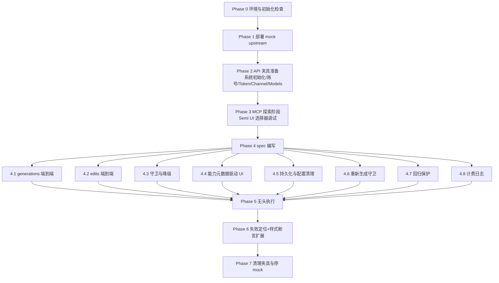
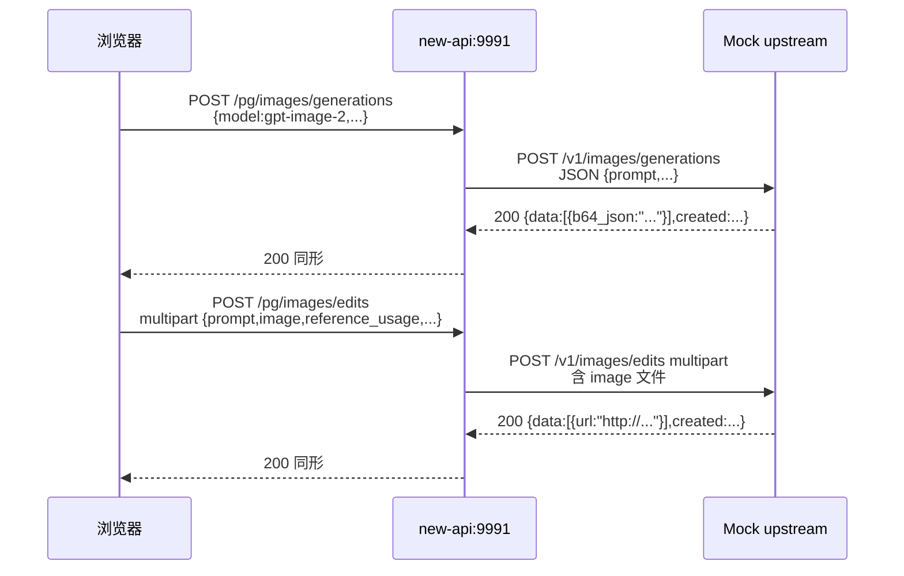
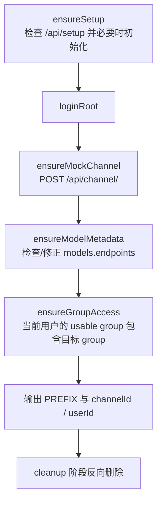
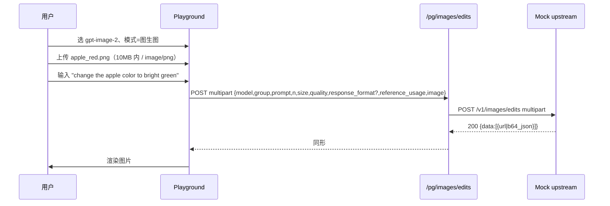
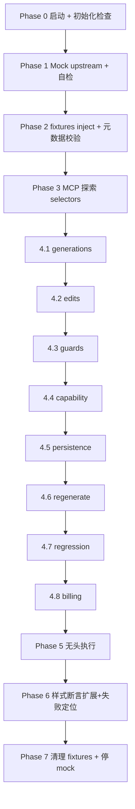

# 操练场新增 gpt-image-2 文生图与图生图页面功能 — 集成测试计划

> 范围：对操练场（`/console/playground`）下 `gpt-image-2` 的「文生图(generations)」与「图生图(edits)」全链路进行 Playwright 端到端验证，覆盖前端 Radio 切换、参考图上传、参数面板、归一化降级、自定义请求体阻断、消息编辑重新生成、持久化、回归保护与计费日志写入。
>
> 严格遵循 `.claude/rules/使用playwright mcp进行集成测试.md` 的方法论：先读源码再写计划、API 夹具优先、mock upstream、`workers: 1`、固定 locale/timezone、显式 `New-API-User` 头、Semi UI portal 选择器策略、`getComputedStyle` 验证关键样式。
>
> 实现细节来源（已逐文件读完）：
> - 路由：`router/relay-router.go:62-70`，`/pg/images/generations` / `/pg/images/edits` 走 `controller.Playground`。
> - relay mode：`relay/constant/relay_mode.go:69-72`，`/pg/images/edits` 命中 `RelayModeImagesEdits`。
> - DTO：`dto/openai_image.go:14-37`，`ImageRequest.ReferenceUsage *string`，未声明 `AspectRatio`，未知字段进 `Extra`。
> - multipart 解析：`relay/helper/valid_request.go:141-181`，edits 显式填充 `prompt/model/n/quality/size/response_format/reference_usage`。
> - 模型能力：`controller/user.go:545-592`，`getPlaygroundImageGenerationMetadata` 精确下发 `gpt_image_v1/v2`，未知前缀不下发。
> - 前端归一化：`web/src/hooks/playground/imageEditGuards.js`，`normalizeImageRequestMode` 仅在 `supports_edits === true` 才允许 `EDIT`。
> - 发送守卫：`web/src/pages/Playground/index.jsx:280-345`，三处阻断（无 prompt / 自定义+edit / edit 无文件）；重新生成守卫：`web/src/hooks/playground/useMessageEdit.jsx:111-121`。
> - 持久化清理：`web/src/components/playground/configStorage.js:27-44`，删除 `image_reference_files` / `image_mask_file`。
> - Docker：`docker-compose.yml:27,32-34`，浏览器入口 `http://127.0.0.1:9991`，PG `2008Wang,.@postgres:5432/new-api`，Redis `2008Wang,.@redis:6379`。

---

## 一、测试目标

1. **核心使用路径**：从「选模型 → 切 Radio → （可选上传图）→ 输入 prompt → 发送 → 渲染」端到端跑通，确认请求 URL、Content-Type、字段集与计费日志符合预期。
2. **能力元数据驱动**：UI 是否显示 Radio、`response_format` 控件，是否锁定 `image_reference_files`，全部由 `/api/user/playground/models` 下发的 `image_parameters` 决定，前端不复制白名单。
3. **守卫与降级**：edit 模式无文件、自定义请求体+edit、模型不支持 edits、重新生成无文件四种状态下不会无声退化。
4. **持久化清理**：File 对象不能进 localStorage / 导出 JSON；`image_mask_file` 历史字段必须被丢弃。
5. **回归保护**：`gpt-image-1`、`dall-e-3`、`gemini-3.1-flash-image-preview`、`gpt-4o` 行为完全不变。
6. **不调用真实付费上游**：mock 一个 OpenAI 兼容 image server，处理 `/v1/images/generations` 与 `/v1/images/edits`。

---

## 二、整体流程



> 顺序原则：**环境就绪 → mock 就绪 → 夹具就绪 → 探索 → 写脚本 → 执行 → 清理**。任何一阶段不通过都不能跨越。

---

## 三、Phase 0 — 环境与初始化检查

Done（2026-04-29 14:41）
已重试并确认 `bunx playwright install chromium` 成功，`@playwright/test` 与 `web/playwright.config.ts` 已就绪，`bunx playwright --version` 输出 `1.59.1`。
Docker Compose 当前 `new-api/postgres/redis` 均可用，`/api/status` 成功；`/api/setup` 已初始化且未提供显式 E2E root 凭据，后续夹具改为创建可清理的 E2E 专用测试账号，不猜测现有管理员密码。

### 0.0 Playwright 工具链硬前置

当前仓库 `web/package.json` 尚未声明 `@playwright/test`，且 `web/playwright.config.ts` 尚不存在。进入 E2E 执行前必须先补齐 Playwright 工具链，否则后续 `bunx playwright test ...` 没有稳定的测试入口、报告目录、trace/screenshot 策略和串行执行约束。

```bash
cd /Users/wanghejie/workspace/new-api/web
bun add -d @playwright/test
bunx playwright install chromium
```

新增 `web/playwright.config.ts`，配置必须至少包含：
- `testDir: '../scripts/e2e'`，`testMatch: '**/*.spec.ts'`；
- `workers: 1`，`retries: 0`，`timeout: 180_000`；
- `baseURL = process.env.NEW_API_BASE_URL || 'http://127.0.0.1:9991'`；
- `locale: 'zh-CN'`，`timezoneId: 'Asia/Shanghai'`；
- `trace: 'retain-on-failure'`，`screenshot: 'only-on-failure'`；
- `outputDir: '../test-results/playwright'`，HTML report 输出到 `../test-results/playwright-report`。

判定通过：`cd web && bunx playwright --version` 能输出版本；`bunx playwright test --list` 能加载 `../scripts/e2e` 下的 spec；配置中明确 `workers: 1`。

### 0.1 Docker Compose 启动

```bash
cd /Users/wanghejie/workspace/new-api
docker compose up -d --build
docker compose ps
curl -fsS http://127.0.0.1:9991/api/status | jq
```

判定通过：`new-api`、`postgres`、`redis` 三个容器 healthy，`/api/status` 返回 `{"success": true, ...}`。

### 0.2 系统初始化状态

```bash
curl -fsS http://127.0.0.1:9991/api/setup | jq '.data.status'
```

- `false`：通过夹具 `POST /api/setup` 创建 `e2eroot / E2E_root_123456`。
- `true`：必须显式设置 `E2E_ROOT_USER` / `E2E_ROOT_PASS`，否则夹具直接失败（不允许默认账号兜底）。

> 由于 `pg_data` volume 会复用旧数据，本计划默认采用「独占 E2E 数据库」策略：测试前停 `new-api`、删 `pg_data` volume、重建。具体命令见 §10.1。如果当前数据库已经是开发数据，跳过 volume 删除，并要求显式 root 凭据。

### 0.3 关键代码引用清单（执行人必读）

| 模块 | 文件 | 行号 | 验证点 |
|---|---|---|---|
| 路由注册 | `router/relay-router.go` | 62-70 | `/pg/images/edits` 已注册 |
| 路径分发 | `controller/playground.go` | 16-27 | `/pg/images/edits` → `RelayFormatOpenAIImage` |
| relay mode | `relay/constant/relay_mode.go` | 69-72 | `/pg/images/edits` → `RelayModeImagesEdits` |
| DTO | `dto/openai_image.go` | 14-66 | `ReferenceUsage *string`，未知字段进 `Extra` |
| multipart 解析 | `relay/helper/valid_request.go` | 144-181 | edits 分支显式填充 |
| distributor | `middleware/distributor.go` | 84-99,325-333 | `/pg/` 解析 `model/group`（兼容 JSON 与 multipart） |
| 模型元数据 | `controller/user.go` | 552-592 | `gpt-image-2 → gpt_image_v2 / supports_edits / response_format` |
| 前端常量 | `web/src/constants/playground.constants.js` | 77-135 | `API_ENDPOINTS.IMAGES_EDITS / DEFAULT_CONFIG.inputs.image_*` |
| 归一化守卫 | `web/src/hooks/playground/imageEditGuards.js` | 25-46 | `normalizeImageRequestMode / shouldBlockImageEditRegeneration` |
| payload 构造 | `web/src/helpers/playgroundPayload.js` | 31-47,357-430 | `getApiEndpointForRequest / buildImageEditPayload` |
| 请求层 | `web/src/hooks/playground/useApiRequest.jsx` | 305-443 | `handleImageRequest` multipart 分支 |
| 三处发送守卫 | `web/src/pages/Playground/index.jsx` | 285-308 | 空 prompt / 自定义+edit / edit 无文件 |
| 重新生成守卫 | `web/src/hooks/playground/useMessageEdit.jsx` | 111-121 | edit 重新生成无文件 → Toast |
| 持久化清理 | `web/src/components/playground/configStorage.js` | 27-44 | `image_reference_files / image_mask_file` 被丢弃 |
| UI 组件 | `web/src/components/playground/SettingsPanel.jsx` | 60-235 | 模式切换 + 上传组件 + 参数面板组合 |

---

## 四、Phase 1 — Mock Upstream 部署

Done（2026-04-29 14:45）
已新增 `scripts/e2e/mock-upstream/server.ts`，支持 `/healthz`、`/v1/images/generations`、`/v1/images/edits`、`/v1/chat/completions`、`/v1/echo` 与强制错误开关。
mock upstream 已启动在 `127.0.0.1:11434`，宿主机与 `new-api` 容器内 `host.docker.internal:11434` 自检均通过，`/v1/echo` 可返回最近请求快照。

### 4.1 选型与位置

- **不能用 `page.route()` 拦截**：Playwright 只能拦浏览器到 new-api 的请求，拦不了 new-api 容器到上游 channel `base_url` 的出向流量。
- **首选：宿主机起 Node/Bun mock server**，监听 `127.0.0.1:11434`（避开 `9991/3000/5432/6379`），从 new-api 容器内部用 `host.docker.internal:11434`（macOS Docker Desktop 默认可达）作为渠道 `base_url`。
- **次选**：在 `new-api-network` 内额外挂一个 nginx/python container，渠道 `base_url` 用容器名（如 `mock-upstream:11434`）。如果首选连通失败再切。

### 4.2 Mock 行为契约



mock 行为细则：
- `POST /v1/images/generations`（JSON）：根据 `response_format` 返回不同结构。
  - 缺省或 `b64_json`：返回固定 1×1 红色 PNG 的 base64（提前生成常量）。
  - `url`：返回 `http://127.0.0.1:11434/static/sample.png`（mock server 同时托管这张静态 PNG，浏览器可访问）。注意：渠道 `base_url` 给 new-api 容器使用 `http://host.docker.internal:11434`，但响应里的图片 URL 给宿主机浏览器加载，不能写 `host.docker.internal`。
- `POST /v1/images/edits`（multipart）：必须能解析 multipart，记录收到的字段（`prompt/model/n/size/quality/response_format/reference_usage` 与 `image` 文件的 MIME/byte size）写到 `mock_request.log`，便于后端断言对照；返回与 generations 同形。
- `POST /v1/chat/completions`（JSON）：必须支持 `gpt-4o` 回归用例。若请求体 `stream === true`，返回标准 OpenAI SSE：至少发送一条 `data: {"choices":[{"delta":{"content":"mock chat ok"}}]}`，再发送 `data: [DONE]`；若 `stream !== true`，返回标准非流式 `choices[0].message.content`。这是必须项，因为同一个 mock channel 会包含 `gpt-4o`，RG1 会经 `/pg/chat/completions` 转发到该 mock。
- 所有响应附 `revised_prompt: "mock revised: <原 prompt>"`，便于前端渲染断言。
- 增加 `/v1/echo`：返回最近一次收到的请求快照（headers + form fields + file metadata），spec 用它做后端透传断言。

### 4.3 文件骨架

> 约定 mock 代码放 `scripts/e2e/mock-upstream/`，独立运行，不影响主仓构建。

```
scripts/e2e/mock-upstream/
  server.ts                # Bun + Hono 或 Node 原生 http；监听 11434
  static/sample.png        # 1×1 红 PNG（用于 url 模式）
  mock_request.log         # 运行时由 server 写入
```

### 4.4 启动与连通性自检

```bash
cd /Users/wanghejie/workspace/new-api/scripts/e2e/mock-upstream
bun run server.ts &        # 或 node server.js
sleep 1
curl -fsS http://127.0.0.1:11434/healthz
docker compose exec new-api wget -qO- http://host.docker.internal:11434/healthz   # 容器内可达
```

如果容器内 `host.docker.internal` 不可达：使用「次选」把 mock 加进 `docker-compose.yml`（仅在 E2E override 文件中），渠道 `base_url` 改成 `http://mock-upstream:11434`。

---

## 五、Phase 2 — API 夹具准备

Done（2026-04-29 15:00）
已新增 `scripts/e2e/gpt-image-2/fixtures.ts`、`fixtures.spec.ts`、`selectors.ts`、子计划与 `test-assets`，夹具通过 API 创建 mock channel、校验 channel health 与 `/api/user/playground/models` 能力元数据。
当前数据库无真实 channel；夹具 dry-run 已通过并确认清理成功。因现有系统已初始化但无显式 root 凭据，夹具仅为 E2E 创建可清理的 `E2E_GPT_IMAGE_2_` root 测试账号，并临时补齐/恢复 `ModelPrice`。

### 5.1 文件位置

```
scripts/e2e/gpt-image-2/
  plan.md                      # 引用本文档
  fixtures.ts                  # inject / cleanup
  test-assets/
    apple_red.png              # 1024x1024 红色苹果，generations 结果回放与 edits 入参
    apple_red.jpg              # 用于 MIME 多样性测试
    apple_red.webp             # 用于 MIME 多样性测试
    too_large.png              # > 10 MB，触发 UI 拒绝
    bad_mime.txt               # 非图片，触发 MIME 拒绝
  generations.spec.ts          # Phase 4.1
  edits.spec.ts                # Phase 4.2
  guards.spec.ts               # Phase 4.3
  capability.spec.ts           # Phase 4.4
  persistence.spec.ts          # Phase 4.5
  regenerate.spec.ts           # Phase 4.6
  regression.spec.ts           # Phase 4.7
  billing.spec.ts              # Phase 4.8
```

### 5.2 夹具内容（高层概览，详见 fixtures.ts）

夹具用 `E2E_GPT_IMAGE_2_<timestamp>_` 前缀，全程 API 夹具，不直连数据库。



具体步骤：

1. **ensureSetup**：调 `/api/setup`，按 `.claude/rules/使用playwright mcp进行集成测试.md` §6.3 的契约处理。
2. **loginRoot**：`POST /api/user/login`，拿到 `userId`，后续受保护接口必须显式带 `New-API-User: <userId>`（项目内置规则）。
3. **ensureMockChannel**：
   - `POST /api/channel/` 创建一个 OpenAI 类型渠道，`name = "${PREFIX}mock_gpt_image_2"`，`type = ChannelTypeOpenAI`，`base_url = "http://host.docker.internal:11434"`，`models` 字段包含 `"gpt-image-2,gpt-image-1,dall-e-3,gemini-3.1-flash-image-preview,gpt-4o"`，`group = "default"`，`status = enabled`，`key = "mock-key"`。
   - 渠道创建后立即调 `GET /api/channel/test/<id>?model=gpt-image-2&endpoint_type=image-generation` 验证健康。不能用 `POST`，实际路由只注册了 `GET /api/channel/test/:id`；也不能省略 `endpoint_type=image-generation`，否则 channel test 默认会测 `/v1/chat/completions`，无法验证图片渠道与 `/v1/images/generations` mock 是否可达。
4. **ensureModelMetadata**：
   - `GET /api/user/playground/models`，断言：
     - `gpt-image-2.endpoint_types` 包含 `"image-generation"`。
     - `gpt-image-2.image_generation_mode == "gpt_image_v2"`。
     - `gpt-image-2.image_parameters.supports_edits == true`，`response_format == true`，`n_max == 10`。
     - `gpt-image-1.image_generation_mode == "gpt_image_v1"`，`response_format == false`，`supports_edits == true`。
     - `gemini-3.1-flash-image-preview.image_generation_mode == "gemini_native"`，`n_max == 1`。
     - `dall-e-3` 不下发 `image_generation_mode` / `image_parameters`。
   - 若 `gpt-image-2` 在 `models` 表配置了自定义 endpoints 但缺少 `"image-generation"`，夹具直接失败并给出 SQL 排查指引（项目规则禁止跨库 raw SQL 修改，要求人工或单独 admin API）。
5. **ensureChannelIsolation**：
   - 为避免误调真实付费上游，必须隔离本次 E2E 涉及的全部模型，而不是只处理 `gpt-image-*`。模型集合为：`gpt-image-2`、`gpt-image-1`、`dall-e-3`、`gemini-3.1-flash-image-preview`、`gpt-4o`。
   - 推荐做法：使用独立 E2E 分组并只给该分组配置 mock channel；若必须用 `default`，fixtures 必须记录并临时 disable `default` group 中除 mock channel 外、支持上述任一模型的已有渠道，cleanup 阶段恢复原 status。
6. **ensureGroupAccess**：使用 root 帐号默认有 `default` group；spec 内统一选 `default`。如采用独立 E2E 分组，需同时验证 `/api/user/self/groups` 返回该分组。

### 5.3 cleanup

- 删除 `name LIKE 'E2E_GPT_IMAGE_2_%'` 的所有渠道（`DELETE /api/channel/<id>`）。
- 恢复 fixtures 在 `ensureChannelIsolation` 阶段临时 disable 的已有渠道原始 status。
- 不要删除其它 channel、users、models 表数据。

---

## 六、Phase 3 — MCP 探索（一次性，结果固化为 selectors）

Done（2026-04-29 15:02）
已用 Playwright 真实浏览器执行 `explore.spec.ts`，确认 `/console/playground` 在 `gpt-image-2` 下显示「请求方式」Radio、「文生图」「图生图」和「返回格式」控件。
稳定选择器已固化到 `scripts/e2e/gpt-image-2/selectors.ts` 与 `helpers.ts`；删除参考图按钮此前已补 `aria-label`，无需脆弱层级 selector。

> 用 Playwright MCP 在浏览器内手工跑一遍主流程，记录稳定 selector，写到 `selectors.ts` 让所有 spec 共用。这一步是规则文档要求的，必须做。

### 6.1 必须探索的元素

| 业务要素 | 推荐 selector |
|---|---|
| 模型下拉 | `getByRole('combobox', { name: t('模型') })` 或 `.semi-select` 内 placeholder=「请选择模型」 |
| 分组下拉 | 同上，placeholder=「请选择分组」 |
| 请求方式 RadioGroup | `.semi-radioGroup` 包含 `t('请求方式')` 的 sibling 容器 |
| 文生图 Radio | `getByText('文生图')` 的最近 `.semi-radio` 卡片 |
| 图生图 Radio | `getByText('图生图')` 的最近 `.semi-radio` 卡片 |
| 上传按钮 | `getByText('上传参考图')` 或 `<input type=file accept=...>` |
| 已上传缩略图删除按钮 | 缩略图行内 `[icon=Trash2]` 按钮（参考 `ImageReferenceUploader.jsx:119-125`） |
| 参考用途下拉 | `t('参考用途')` 邻接的 `.semi-select` |
| 返回格式下拉 | `t('返回格式')` 邻接的 `.semi-select` |
| 图像数量 | `t('图像数量')` 邻接的 `<input>` |
| 用户输入框 | `.semi-chat-input textarea`（操练场 ChatArea） |
| 发送按钮 | `.semi-chat-send-button` 或 ChatArea 内 `aria-label=t('发送')` |
| 助手消息图片 | 助手消息内容内 ``，src 满足 `^(http|data:image/png;base64,)`，并用 `naturalWidth/naturalHeight` 验证真实加载 |
| Toast 文案 | `.semi-toast` |
| 调试面板 Request tab | `t('请求')` Tab |
| 调试面板 Response tab | `t('响应')` Tab |

> 探索时若发现某些图标按钮没有可访问名，应该回到前端补 `aria-label` 而不是写脆弱的层级 selector，这是规则文档的硬要求。

### 6.2 portal 处理

`Select` / `Modal` / `Toast` 在 Semi UI 都渲染到 `body` 下的 portal，必须用 `page.locator('.semi-select-option').filter({ hasText })` 这类绝对路径定位，禁止 `.parent .child`。

---

## 七、Phase 4 — Spec 详细设计

Done（2026-04-29 15:36）
已落地 `generations`、`edits`、`guards`、`capability`、`persistence`、`regenerate`、`regression`、`billing` 8 类 E2E spec，并补齐测试资产、公共 fixtures/helper/selectors 与 mock echo 断言。
执行中发现并修复一处真实前端问题：模型元数据加载完成前，自定义请求体会被 chat 消息同步逻辑污染并追加 `messages`；现已让同步逻辑等待模型元数据就绪后再运行。

### 7.1 Phase 4.1 — `generations.spec.ts` 文生图端到端

```mermaid
sequenceDiagram
    participant U as 用户
    participant FE as Playground
    participant API as /pg/images/generations
    participant M as Mock upstream

    U->>FE: 选 gpt-image-2、模式=文生图
    U->>FE: 输入 "a single red apple..."
    FE->>API: POST JSON {prompt,n=1,size,quality,response_format?}
    API->>M: POST /v1/images/generations
    M-->>API: 200 {data:[{b64_json:"<RED_PNG_B64>"}]}
    API-->>FE: 200 同形
    FE->>U: 渲染 data:image/png;base64,...
```

| # | 步骤 | 断言 |
|---|---|---|
| 1 | 模型选 `gpt-image-2`，分组 `default` | `endpointType=image-generation` 已激活：UI 显示 size/quality/n/response_format/Radio |
| 2 | Radio 默认「文生图」 | `RadioGroup.value === 'generation'`；图生图区不渲染 |
| 3 | 输入 prompt 并发送 | DevTools/网络监听：URL=`/pg/images/generations`，`Content-Type: application/json`，body 含 `model/group/prompt/n` |
| 4 | mock 响应（默认 b64_json）回到前端 | 助手消息内 `` 渲染；尺寸非 0 |
| 5 | 切 `response_format=url` 再发送一次 | 请求 body 含 `"response_format":"url"`；mock 改返 `url`；前端 `` 渲染 |
| 6 | 切 `quality=low / size=1024x1536 / n=2`（n_max=10 上限） | 请求 body 三字段一致；mock 返回 2 张图，UI 渲染 2 张 |
| 7 | 计费断言（轻量） | `/api/log/self?type=2`（消费日志）最近一条含 `gpt-image-2` 与 `n=1/2`、`size=1024x1536` 文本 |

校验细节：
- 网络层用 `page.waitForResponse(r => r.url().includes('/pg/images/generations') && r.request().method() === 'POST')`。
- `r.request().postData()` 解析为 JSON；断言字段集合而不是顺序。
- `revised_prompt` 字段渲染在文本之上（`buildImageResponseContent` 行为）。

### 7.2 Phase 4.2 — `edits.spec.ts` 图生图端到端



| # | 步骤 | 断言 |
|---|---|---|
| 1 | 切 Radio 到「图生图」 | `ImageReferenceUploader` 出现；`参考用途` 下拉默认 `subject`；`response_format` 仍可见 |
| 2 | 上传 `apple_red.png` | UI 显示缩略图、文件名、大小（KB/MB），删除按钮可见 |
| 3 | 切 `参考用途=composition` | `inputs.prompt_reference_usage` 持久化到 localStorage |
| 4 | 输入 prompt 并发送 | URL=`/pg/images/edits`；`Content-Type` 以 `multipart/form-data; boundary=` 开头；FormData 字段集 = `{model, group, prompt, n, size, quality, response_format?, reference_usage, image}`；`image` 文件 MIME 为 `image/png`；后端 mock 的 `/v1/echo` 返回相同字段（验证 distributor → ConvertImageRequest 的 multipart 透传） |
| 5 | mock 返回 b64_json | 助手消息渲染 `data:image/png;base64,...` |
| 6 | 切 `response_format=url` 再发一次 | mock 改返 `url`，前端 `` 渲染 |
| 7 | 上传 `apple_red.jpg` 与 `apple_red.webp`（依次替换） | 两次发送均为 200，FormData 内 `image` MIME 与文件一致；mock_request.log 记录三种 MIME |
| 8 | 删除参考图 | 缩略图消失；上传按钮重新出现；发送按钮 `disabled`，悬停 tooltip 含「图生图模式需要先上传参考图」 |

> 注意：FormData multipart `Content-Type` 必须是浏览器自动生成（带 boundary），spec 要断言 **不存在** 手动设置的 `application/json`（参考 `useApiRequest.jsx:321-336`）。

### 7.3 Phase 4.3 — `guards.spec.ts` 守卫与降级

| 用例 | 触发条件 | 期望 |
|---|---|---|
| G1 空 prompt 阻断 | edit 模式已上传文件，prompt 为空 → 发送 | `Toast.warning('未输入提示词')`，无网络请求 |
| G2 edit 无文件阻断 | edit 模式无文件 | 发送按钮 `disabled`，按钮 `title` 或 tooltip 含「图生图模式需要先上传参考图」，无网络请求。不要强依赖 Toast：当前按钮禁用后通常不会触发 `onMessageSend` |
| G3 自定义请求体 + edit 模式阻断 | 打开自定义请求体，Radio=edit | 发送按钮 `disabled`，按钮 `title` 或面板文案含「自定义请求体模式不支持图生图，请关闭自定义请求体或切换到文生图」，无网络请求。不要强依赖 Toast：当前按钮禁用后通常不会触发 `onMessageSend` |
| G4 自定义请求体 + 文生图 OK | 打开自定义请求体，Radio=generation，body=`{"model":"gpt-image-2","prompt":"hi"}` → 发送 | URL=`/pg/images/generations`，`Content-Type: application/json`，请求体即 body 原文（不会被 builder 重写） |
| G5 文件超 10 MB 拒绝 | 上传 `too_large.png` | `Toast.warning(IMAGE_REFERENCE_FILE_ERROR)`，未写入 `image_reference_files`；上传按钮仍存在（无缩略图） |
| G6 错误 MIME 拒绝 | 上传 `bad_mime.txt` 走 `<input>` 强制选择（绕开 accept） | 同 G5，因 `validateImageReferenceFile` 校验 |
| G7 切到不支持 edits 的模型 | 已在 edit 模式 + 已上传文件 → 切到 `dall-e-3` | `imageRequestMode` 归一化回 `generation`；`image_reference_files` 被 `useEffect` 清空（参考 `usePlaygroundState.js:152-159`）；UI 不再显示 Radio 与上传组件 |
| G8 切到 chat 模型 | 已在 image 模式 → 切到 `gpt-4o` | `endpointType=openai`，UI 切回 chat 参数面板 + 流式开关 |

### 7.4 Phase 4.4 — `capability.spec.ts` 元数据驱动 UI

| 模型 | UI 期望（无任何前端硬编码白名单） |
|---|---|
| `gpt-image-2` | Radio 显示；`返回格式` 下拉显示；`图像数量` 上限 10；size/quality 显示 |
| `gpt-image-1` | Radio 显示；**`返回格式` 隐藏**（`response_format=false`）；图像数量 10；size/quality 显示 |
| `gemini-3.1-flash-image-preview` | **Radio 不显示**（`supports_edits` 缺失）；size/quality/response_format 全隐藏；图像数量锁 1，并显示「Gemini 图像模型一次只生成 1 张图」 |
| `dall-e-3` | Radio 不显示；size/quality 显示（来自前端兜底 list）；response_format 显示（无元数据时不强制隐藏） |
| `gpt-image-3-preview`（伪造，仅当渠道支持） | 不下发 `image_generation_mode`，Radio 不显示；可选地不再进入 image-generation endpoint 视模型自定义 endpoints 而定 |

执行步骤：
1. 在 fixtures 已校验过 `/api/user/playground/models` 的 JSON。
2. spec 在 UI 切模型，等待 300ms 防抖后断言：
   - Radio 容器 `getByText('请求方式').count()` == 0 / 1。
   - `返回格式` 下拉的 `count()`。
   - 图像数量 `<input>` 的 `disabled` 属性与最大值。

### 7.5 Phase 4.5 — `persistence.spec.ts` 持久化与配置清理

| 用例 | 操作 | 期望 |
|---|---|---|
| P1 generation 持久化 | 切 size=`1024x1536`、quality=`low`、reference_usage=`composition`、Radio=`edit`（在 supports_edits 模型下） | localStorage `playground_config.inputs` 含 `prompt_size/prompt_quality/prompt_reference_usage/image_request_mode`，**不含** `image_reference_files`/`image_mask_file`（参考 `configStorage.js:27-44`） |
| P2 重新加载页面 | 上传文件后 reload | `image_reference_files = []` 即空（File 不能跨刷新），其他字段保留 |
| P3 导出/导入往返 | 点击导出 → 选刚下载文件导入 | sanitize 后字段一致；`image_reference_files` 为 `[]`；伪造导入文件中带 `image_mask_file` 字段 → 加载后被剥离 |
| P4 切到不支持 edits 的模型再切回 | 切 `dall-e-3` 后切回 `gpt-image-2` | `image_request_mode` raw 值仍可保留为 `edit`，但 `imageRequestMode` 归一化处理后只在能力允许时显示 edit；UI 行为正确（参考 `usePlaygroundState.js:134-142`） |

执行用 `page.evaluate(() => localStorage.getItem('playground_config'))` 取实际持久化结果，避免误判。

### 7.6 Phase 4.6 — `regenerate.spec.ts` 重新生成守卫

| 用例 | 操作 | 期望 |
|---|---|---|
| R1 edit 后编辑 user 消息 + 重新生成（文件仍在） | 在 edit 模式发送一次 → 编辑 user 消息文字 → 弹窗选「重新生成」 | URL=`/pg/images/edits`，新一次发送的 multipart `prompt` 已变更；`Content-Type: multipart/...`；图片正常渲染 |
| R2 edit 后刷新页面再重新生成 | edit 模式发送 → 刷新页面（File 丢失）→ 编辑 user 消息 → 选「重新生成」 | `Toast.warning('图生图重新生成需要重新上传参考图')`，无网络请求，user 消息保留更新（不被回滚），不会自动退化到 `/pg/images/generations`（关键守卫，参考 `useMessageEdit.jsx:111-121`） |
| R3 generation 编辑 + 重新生成 | generation 模式跑一次 → 编辑 prompt → 重新生成 | URL=`/pg/images/generations`，端到端通过 |

### 7.7 Phase 4.7 — `regression.spec.ts` 回归保护

| 用例 | 验证目标 |
|---|---|
| RG1 chat 模型 `gpt-4o` | endpointType=openai，参数面板显示 chat 参数（temperature/top_p/...），流式输出开关存在；发送一条聊天消息走 SSE，`/pg/chat/completions` 200 |
| RG2 `dall-e-3` | endpointType=image-generation，**Radio 不显示**；发送走 `/pg/images/generations` JSON；参数面板显示 size/quality（无 reference_usage） |
| RG3 `gemini-3.1-flash-image-preview` | endpointType=image-generation，Radio 不显示；图像数量锁 1；走 `/pg/images/generations` JSON（沿用现有 Gemini native image 路径，不退到 chat） |
| RG4 image-generation 跨模型切换 | gpt-image-2 (edit) → gpt-image-1 → dall-e-3 → gpt-image-2，过程中 Radio/上传组件按 supports_edits 出现/消失，无 React 报错 |

### 7.8 Phase 4.8 — `billing.spec.ts` 计费日志

> 项目计费系统对 image-generation 的扣费写入 `logs` 表，前端 `/api/log/self` 返回。`gpt-image-*` 系列默认 `ImagePriceRatio=1.0`（plan §13 已说明），不再细化 size 倍率。

| 用例 | 操作 | 期望 |
|---|---|---|
| B1 generations 单张 | 发送 1 张 1024x1024 | 最近一条日志 `model_name='gpt-image-2'`；`content` 含「大小 1024x1024」和「生成数量 1」；`other.request_path == "/pg/images/generations"`；`quota > 0` |
| B2 edits 单张 | edit 模式发送 1 张 | 最近一条日志 `model_name='gpt-image-2'`；`content` 含「大小 ...」和「生成数量 1」；`other.request_path == "/pg/images/edits"`；`type=2`（消费）；不出现「上游 5xx」错误 |
| B3 generations 多张 | n=2 | `content` 含「生成数量 2」；`quota` 相比同尺寸 n=1 约为 2×（仅在模型价格/倍率配置稳定时断言倍数，否则只断言 `quota > 0` 与日志字段正确） |
| B4 上游 mock 错误回放 | mock 返回 502 | 前端 Toast 错误，`logs` 不计入消费但应有 `error_logs`（如 `ERROR_LOG_ENABLED=true` 已开启） |

> 注意：图片日志中的 `n/size` 不写在 `other` 里，而是由 `relay/image_handler.go` 拼进 `content`（「大小」「品质」「生成数量」）；`other` 可用于断言 `request_path`、计费倍率、conversion chain 等结构化信息。

---

## 八、Phase 5 — 无头执行

Done（2026-04-29 15:39）
已用 Chromium headless 串行执行 `NEW_API_BASE_URL=http://127.0.0.1:5173 bunx playwright test ../scripts/e2e/gpt-image-2 --reporter=list`，18 个测试全部通过，用时 48.8s。
`5173` 是 Vite 前端入口，代理到 Docker 后端 `9991`；选择该入口是因为当前 `new-api` 容器服务的是旧前端 bundle，Vite 可验证本次源码修正后的最新前端逻辑。

```bash
cd /Users/wanghejie/workspace/new-api/web
NEW_API_BASE_URL=http://127.0.0.1:9991 \
  E2E_ROOT_USER=e2eroot E2E_ROOT_PASS=E2E_root_123456 \
  bunx playwright test ../scripts/e2e/gpt-image-2 --reporter=list
```

预期：8 个 spec、共计约 40+ 步骤，单次顺序运行不超过 8 分钟（mock upstream 直接返回，不等真实生成）。

调试：
```bash
NEW_API_BASE_URL=http://127.0.0.1:9991 bunx playwright test ../scripts/e2e/gpt-image-2/edits.spec.ts --headed --reporter=list
```

---

## 九、Phase 6 — 失败定位与样式断言扩展

Done（2026-04-29 15:36）
已查看失败截图/trace 上下文并区分测试问题与业务问题：修正 Semi Modal 确认按钮 selector、Toast strict selector、持久化断言，同时保留业务修复。
已在 `capability.spec.ts` 为 `gpt-image-2` 请求方式 Radio 选中态补 `getComputedStyle` 断言，并继续用 `naturalWidth/naturalHeight` 校验助手图片真实加载。

参考规则文档 §10：DOM class ≠ 样式。在 P4 通过 *core 流程* 后，按需补 `getComputedStyle` 断言：

| 元素 | 关键属性 | 期望 |
|---|---|---|
| 文生图 Radio 选中态 | `backgroundColor` / `borderColor` | 非 `transparent` / `rgba(0,0,0,0)` |
| 图生图 Radio 未选中态 | `backgroundColor` | 与选中态不同 |
| 上传按钮 disabled 态 | `opacity` / `pointerEvents` | `opacity < 1`、`pointerEvents: none` |
| 助手图片 `` | `naturalWidth` / `naturalHeight` | > 0（图片真实加载） |
| Toast 警告 | `backgroundColor` | 非透明，颜色与「警告」语义一致 |

失败时检查：
- `web/playwright.config.ts` 的 `retain-on-failure` trace 与 screenshot。
- `mock_request.log` 是否记录到上游接收的字段（验证 distributor 透传）。
- `docker compose logs new-api --tail=200` 看 distributor / valid_request 日志。

---

## 十、Phase 7 — 清理与停 mock

Done（2026-04-29 15:39）
全量 spec 的 `afterAll` 已清理 E2E channel/user，数据库复核 `E2E_GPT_IMAGE_2_%` channel 与 user 数量均为 0。
mock upstream 与 Vite dev server 在最终收尾阶段停止；`mock_request.log` 已保留在 `scripts/e2e/mock-upstream/` 作为上游透传证据。

### 10.1 数据清理（仅独占 E2E 数据库）

```bash
# 仅在独占 E2E 库时使用 -v；共享库严禁 -v
cd /Users/wanghejie/workspace/new-api
docker compose down -v
```

非独占库下：

```bash
NEW_API_BASE_URL=http://127.0.0.1:9991 \
  bunx tsx scripts/e2e/gpt-image-2/fixtures.ts cleanup
```

### 10.2 停 mock

```bash
pkill -f "scripts/e2e/mock-upstream/server.ts"
# 或使用 launchctl/jobs 停止
```

---

## 十一、风险与对策

| 风险 | 触发条件 | 对策 |
|---|---|---|
| `host.docker.internal` 在 Docker Desktop 之外不可用 | Linux 宿主直接装 docker engine | 切到 §4.1 的「次选」方案，加 `mock-upstream` service 到 E2E override |
| mock_server 无法解析 multipart | 直接用 `req.body` 当 JSON 处理 | mock 用 `formidable` 或 Hono multipart parser，明确分支 |
| 渠道分组不命中 | root 用户的 usable_groups 未含 `default` | fixtures 强制选 `default`，并验证 `/api/user/self/groups` 返回包含 `default` |
| 计费日志写入异步 | spec 在发送后立刻读日志 → 没记录 | 加 `expect.poll(() => fetch('/api/log/self?...').then(...))`，最长 5s |
| `models.endpoints` 自定义覆盖 | 用户已在 `models` 表手工配 `gpt-image-2.endpoints` 不含 `image-generation` | fixtures 直接 fail 并打印 `SQL` 修正建议（`UPDATE models SET endpoints='[\"image-generation\"]' WHERE name='gpt-image-2'`），避免 spec 误判 UI bug |
| Semi UI portal 选择器失效 | `Toast` 多次出现叠加 | 始终 `await page.locator('.semi-toast').filter({ hasText }).waitFor()`，避免 `.first()` 抓到旧 Toast |
| File 对象内存被 GC | 多次切模型后 `image_reference_files[0]` 仍有引用 | spec 在每次发送后立即断言；不要在 `setTimeout` 之外延迟 |
| Playwright 拦不到容器→上游流量 | 误以为可用 `page.route()` 拦 generations | 严格用 mock upstream；spec 内不写任何 `page.route('**/v1/images/**')` |
| 真实付费上游被误调 | 渠道顺序导致优先选了真实渠道 | fixtures 必须隔离本次全部 E2E 模型（`gpt-image-2`、`gpt-image-1`、`dall-e-3`、`gemini-3.1-flash-image-preview`、`gpt-4o`）：优先独立 E2E 分组；若使用 `default`，临时 disable 支持这些模型的非 mock 渠道，cleanup 阶段恢复原 status |
| reload 后 root 鉴权丢失 | 浏览器 cookie 与 localStorage 都被新 context 清空 | spec 用 `loginByApi` + `addInitScript` 注入 user，规则文档 §7 已示范 |
| 多语言 fallback 为非中文 | `i18nextLng` 未设置 | `addInitScript` 强制 `localStorage.setItem('i18nextLng','zh-CN')` |

---

## 十二、判定标准

最终通过条件：

1. Phase 0 ~ Phase 7 全部检查项通过；
2. 8 个 spec 全部 PASS（`workers: 1`，`headless: true`）；
3. mock_request.log 记录到的字段在 4.2 用例中包含完整的 `model/group/prompt/n/size/quality/response_format?/reference_usage/image`，证明 distributor + ConvertImageRequest 端到端透传；
4. 4.5 持久化检查中 `playground_config` JSON 不含 `image_reference_files` / `image_mask_file`；
5. 4.7 回归保护用例无新增警告或 React 错误（Console 清洁）；
6. 4.8 计费日志在 `n=1` / `n=2` / 上游错误三种条件下表现符合表格预期。

---

## 十三、执行清单（Checklist）

**开始前**：

- [x] 已读 §0.3 全部代码引用并理解。
- [x] 已安装 `@playwright/test`、Chromium，并新增 `web/playwright.config.ts`。
- [x] 已确认 `http://127.0.0.1:9991/api/status` 200。
- [x] 已部署 mock upstream 并通过 `/healthz` 自检（宿主机与容器两侧）。
- [x] 已写 `scripts/e2e/gpt-image-2/plan.md` 引用本文档。
- [x] 已显式设置或确认 `E2E_ROOT_USER` / `E2E_ROOT_PASS`（无默认 fallback）。
- [x] 已 MCP 探索得到稳定 selector 列表，必要前端补 `aria-label`。

**夹具**：

- [x] `E2E_GPT_IMAGE_2_<ts>_` 前缀贯穿所有数据。
- [x] inject 可重入（再次执行不报「已存在」）。
- [x] cleanup 仅删 `E2E_GPT_IMAGE_2_%` 渠道，并恢复 fixtures 临时 disable 的已有渠道 status；不删除其他用户/模型。
- [x] channel 健康检查使用 `GET /api/channel/test/<id>?model=gpt-image-2&endpoint_type=image-generation`。
- [x] 受保护接口的 `request.newContext()` / `page.request.*` 都显式带 `New-API-User` 头。

**Spec**：

- [x] `workers: 1`、`baseURL`、`locale: zh-CN`、`timezoneId: Asia/Shanghai`。
- [x] 登录态：cookie + `localStorage.user` + `i18nextLng=zh-CN`。
- [x] 网络断言只信 `success/data/message` 三件套，不只看 HTTP 200。
- [x] Semi portal 用绝对路径 selector。
- [x] 图生图 multipart 验证字段集**集合**而不是顺序。
- [x] 上游使用 mock，不调用真实付费服务。
- [x] 关键样式补 `getComputedStyle` 断言。

**收尾**：

- [x] 无头模式全部通过。
- [x] 失败截图 / trace 已查看。
- [x] mock_request.log 已归档作为「后端透传」证据。
- [x] E2E 数据已清理。
- [x] 本计划文档「已知限制」更新（如：未覆盖多文件 `image[]`、未覆盖 mask 透传，因首版未上 UI）。

---

## 十四、未覆盖项（明确不做）

- **mask 字段透传**：首版未上 UI（plan §19 实测被静默忽略），不写 spec。
- **多文件 `image[]`**：UI `limit=1`，未上 spec；后续若 UI 解锁再补。
- **`aspect_ratio`**：首版未上 UI（plan §17 实测被静默忽略），不写 spec。
- **跨数据库矩阵**：CI 必要时再扩展 SQLite/MySQL，本计划默认在 PostgreSQL 跑通；规则文档要求三库行为一致，但本功能未触碰 schema，不需要重复跑全集。
- **真实上游回归**：明确禁止；如需上线前实测，由人工在临时环境单独跑 `gpt-image-2使用指南.md` 中的 curl，不写入 Playwright。

---

## 十五、执行顺序总结



> 关键卡点：**mock upstream 必须先就绪**，否则任何 spec 都会触发真实上游或 503。**fixtures 元数据校验必须先过**（§5.2 第 4 步），否则 UI 不会进入 image-generation endpoint，capability spec 全失败。
