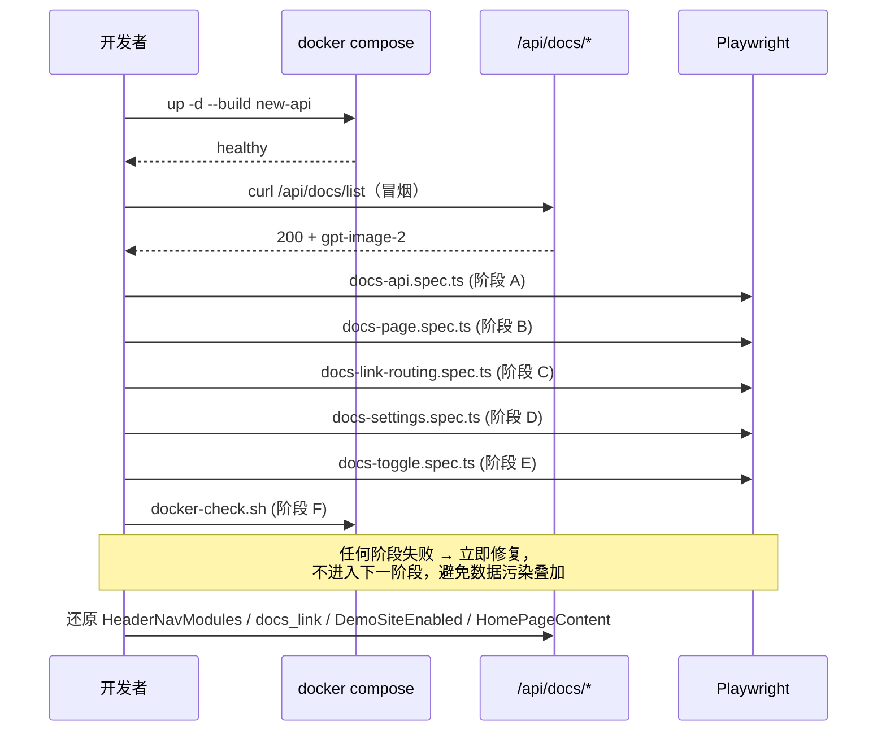

# 实现内置文档页面 — Playwright 集成测试计划

> 本计划严格遵循 `.claude/rules/使用playwright mcp进行集成测试.md` 改写。
> 用 Playwright（spec + 必要时 MCP 调试）端到端验证刚实现的"内置文档页面"功能：后端 `/api/docs/list`、`/api/docs/content`、前端 `/docs` 与 `/docs/:slug` 路由、`useNavigation` 顶栏文档链接分流、Home 页面文档按钮、`SettingsGeneral.docs_link` 写回后状态同步、`HeaderNavModules.docs` 顶栏开关。
> 实施前 root 用户 / docs_link / HeaderNavModules / DemoSiteEnabled / HomePageContent 必须可恢复；外部上游不被触发；多次执行幂等。

---

## 〇、覆盖矩阵速览

| # | 维度 | 覆盖点 | 关键断言 |
|---|---|---|---|
| 1 | 后端 API | `/api/docs/list` 公开返回平铺数组 | `success=true`、按 category→order→title→slug 稳定排序、含 `gpt-image-2`、不含 `README` |
| 2 | 后端 API | `/api/docs/content?slug=` 合法 slug | 返回 `slug/title/category/content`，正文不含 frontmatter、首段含原 markdown |
| 3 | 后端 API | content 边界 | 缺参 / 不存在 slug / 路径穿越 `../safe` / 维护文件 slug `readme` / 全部走 "文档不存在"，不走文件 IO |
| 4 | 后端 API | content 公开访问 | 不带任何 cookie / `New-API-User` 也可访问 |
| 5 | 后端 API | 与同级公开接口一致性 | 与 `/api/about`、`/api/user-agreement` 同样不挂 `UserAuth` |
| 6 | 前端路由 | 直接访问 `/docs` | 自动 `replace` 跳到分组首篇（默认 `gpt-image-2`） |
| 7 | 前端路由 | `/docs/:slug` 渲染 | 拉 `/api/docs/content`，标题 / 面包屑 / markdown 主体 / 代码块都能渲染 |
| 8 | 前端路由 | 不存在 slug | 显示 `文档不存在` 空态、不抛白屏，仍保留左侧目录 |
| 9 | 前端路由 | 左侧 Nav 选择切换 | URL 变化、右侧 markdown 重新拉取、避免缓存（不写 localStorage） |
| 10 | 前端路由 | 移动端 SideSheet | 顶栏菜单按钮可打开 / 关闭目录抽屉，正文不挤压 |
| 11 | 顶栏分流 | 留空 docs_link | 顶栏"文档"按钮内部跳，无 `target=_blank` |
| 12 | 顶栏分流 | 相对 `/docs/...` | 内部跳 |
| 13 | 顶栏分流 | 同源 URL `/docs` | 内部跳 |
| 14 | 顶栏分流 | 外链 `https://docs.newapi.pro` | 新标签页打开（`target=_blank` 或 `window.open`） |
| 15 | Home 按钮 | 与顶栏五种分流一致 | 同上五种 |
| 16 | 顶栏开关 | `HeaderNavModules.docs=false` | 顶栏不渲染"文档"按钮，但 `/docs` 仍可直接访问（链接级关闭，路由不下线） |
| 17 | Settings 链路 | 修改 `general_setting.docs_link` 后保存 | `PUT /api/option/` 成功 → 触发 `/api/status` → `StatusContext` 同步 → 顶栏即时切换内/外，无需刷新 |
| 18 | i18n | `zh-CN` / `en` 切换 | 标题 `文档中心` / `Documentation Center` 一致；不出现裸 i18n key |
| 19 | 样式 | `getComputedStyle` 校验 | 主区背景非透明、目录边框非透明、激活项 `color`/`fontWeight` 改变；暗色模式同步 |
| 20 | Docker 构建 | `.dockerignore` 放行 | 镜像内 `/api/docs/list` 真返回非空（验证 `go:embed` 生效） |
| 21 | 安全 | content 接口路径穿越 | 不会读到 `docs/guides/README.md`、`_draft.md`、宿主 `/etc/passwd` |
| 22 | 兼容 | 无 frontmatter / 缺字段 | 后端单测已覆盖；前端不依赖 `category` 字段（fallback `通用`） |

> 22 项覆盖中，4–5、20–22 是单测+构建检查覆盖；其余依赖 Playwright 真实浏览器执行。

---

## 一、测试环境

### 1.1 Docker Compose 事实

参见 `docker-compose.yml`：

- 主 compose 浏览器入口 `http://127.0.0.1:9991`；容器内监听 `3000`。
- 主 compose 默认数据库 PostgreSQL 15（`postgres:5432/new-api`，`pg_data` volume）。
- Redis 在内网，无对外端口。
- 主 compose 固定了 `container_name: new-api` 和 `127.0.0.1:9991:3000`，只加 `-p new-api-e2e` 不能隔离容器名和端口。
- 当前主仓库容器已 `Up (healthy)` 但镜像里并不含本 worktree 代码（实测 `/api/docs/list` 返回 `Invalid URL`）。
- **E2E 默认必须使用独占 compose 文件 / override**：独立容器名、独立端口、独立 PostgreSQL volume，避免污染当前开发库，也避免测到主仓库旧镜像。

### 1.2 Base URL

```bash
NEW_API_BASE_URL=http://127.0.0.1:9992
```

测试代码必须从环境变量读，不要硬编码；本地 vite 调试可用 `http://127.0.0.1:5173`，但回归阶段一律走嵌入了后端的 E2E compose 入口。若临时沿用主 compose，才把 `NEW_API_BASE_URL` 改回 `http://127.0.0.1:9991`。

### 1.3 必须使用独占 E2E Compose

> 严格按照规则的"E2E 默认不调用真实付费上游 / 数据先行"的精神，集成测试**必须基于本 worktree 实际产物**，否则测的是旧镜像。

不要直接复用主 compose 的 `pg_data`。本功能测试会写 `OptionMap` 全局键，复用已有库会污染本地开发状态，也会被已有初始化状态、演示站模式、首页内容影响。必须准备一个独占 E2E compose 文件（推荐放在 repo 根 `docker-compose.e2e.yml`，避免多 compose 相对路径歧义），至少覆盖：

- `new-api.container_name`：如 `new-api-e2e-docs`
- `postgres.container_name`：如 `postgres-e2e-docs`
- `redis.container_name`：如 `redis-e2e-docs`
- `new-api.ports`：如 `127.0.0.1:9992:3000`
- `postgres.volumes`：使用独立 volume，如 `pg_data_e2e_docs:/var/lib/postgresql/data`
- `new-api.build.context`：必须指向当前 worktree 根目录

如果用 override 而不是完整 E2E compose，必须确认 `ports`、`volumes`、`container_name` 没有被 compose merge 规则追加成主环境和 E2E 环境同时存在；否则改用完整 `docker-compose.e2e.yml`。

### 1.4 必须先重新构建镜像

```bash
# 先在 worktree 里构建静态资源 + 重建 new-api 镜像
export NEW_API_BASE_URL=http://127.0.0.1:9992
export E2E_COMPOSE='docker compose -f docker-compose.e2e.yml'

$E2E_COMPOSE up -d --build new-api

# 等 new-api healthy
until $E2E_COMPOSE ps new-api | grep -q '(healthy)'; do sleep 2; done

curl -fsS "$NEW_API_BASE_URL/api/status" | head -c 200
curl -fsS "$NEW_API_BASE_URL/api/docs/list" | head -c 200
```

如果 `/api/docs/list` 仍 `Invalid URL`，说明镜像没用本 worktree 代码 —— 直接停下，先排查 `Dockerfile` / `.dockerignore` / `go:embed` 路径。

### 1.5 初始化与测试账号

`/api/setup` 的 `data.status` 取决于当前 E2E 数据库 volume 状态：

- `status=true`：库已初始化。**禁止默认密码**，必须显式：

  ```bash
  export E2E_ROOT_USER=<已知 root 账号>
  export E2E_ROOT_PASS=<已知 root 密码>
  ```

  缺少这两个变量时，夹具脚本 fail-fast，不要尝试默认 `e2eroot / E2E_root_123456`（与项目规则一致）。

- `status=false`：通过 `POST /api/setup` 用 `e2eroot / E2E_root_123456` 初始化，仅在该次独占数据库内有效。

> 本计划默认走独占 E2E 数据库。只有临时人工排查时才允许复用已有库；一旦复用，必须显式传入 root 凭证，并严格备份 / 还原所有全局键。

---

## 二、Playwright 工具链准备

### 2.1 安装

```bash
cd web
bun add -d @playwright/test
bunx playwright install chromium
```

如果还想跑 webkit/firefox，可以再 `bunx playwright install`。E2E 默认只跑 chromium。

### 2.2 推荐目录

```text
.claude/worktrees/feature+docs/
├─ web/
│  └─ playwright.config.ts          # Playwright 配置（baseURL 等）
└─ scripts/
   └─ e2e/
      └─ docs/
         ├─ plan.md                 # 即本文件的执行版（可软链或拷贝）
         ├─ fixtures.ts             # 备份/恢复 docs_link、HeaderNavModules、DemoSiteEnabled、HomePageContent
         ├─ docs-api.spec.ts        # 阶段 A：纯后端 API 黑盒测试
         ├─ docs-page.spec.ts       # 阶段 B：/docs 页面渲染、目录、空态、404 slug
         ├─ docs-link-routing.spec.ts # 阶段 C：顶栏 + Home 五种分流
         ├─ docs-settings.spec.ts   # 阶段 D：SettingsGeneral 配置链路
         └─ docs-toggle.spec.ts     # 阶段 E：HeaderNavModules.docs 开关
```

### 2.3 `web/playwright.config.ts`

```ts
import { defineConfig, devices } from '@playwright/test';

const baseURL = process.env.NEW_API_BASE_URL || 'http://127.0.0.1:9992';

export default defineConfig({
  testDir: '../scripts/e2e',
  testMatch: '**/*.spec.ts',
  timeout: 180_000,
  expect: { timeout: 10_000 },
  retries: 0,
  workers: 1,
  reporter: [
    ['list'],
    ['html', { open: 'never', outputFolder: '../test-results/playwright-report' }],
  ],
  outputDir: '../test-results/playwright',
  use: {
    baseURL,
    headless: true,
    screenshot: 'only-on-failure',
    trace: 'retain-on-failure',
    viewport: { width: 1440, height: 900 },
    locale: 'zh-CN',
    timezoneId: 'Asia/Shanghai',
  },
  projects: [{ name: 'chromium', use: { ...devices['Desktop Chrome'] } }],
});
```

Done
本地已确认 Bun、Docker、Docker Compose 可用，并通过 Bun 安装 `@playwright/test` 与 Chromium。
已新增独占 `docker-compose.e2e.yml` 和 `web/playwright.config.ts`，默认使用 `http://127.0.0.1:9992`、串行 Chromium 执行，并处理根目录 spec 对 `web/node_modules` 的模块解析。
E2E compose 已显式关闭全局 Web/API/Critical/Search 限流，避免真实浏览器加载静态资源时触发 429 干扰功能断言。

---

## 三、夹具设计（`scripts/e2e/docs/fixtures.ts`）

### 3.1 必须备份的状态

后端有四个跟本次测试相关的全局键，写入前必须备份、`afterAll` 必须还原：

| 键 | 来源 | 默认值 | 备份方式 |
|---|---|---|---|
| `general_setting.docs_link` | `OptionMap` / `GeneralSetting.DocsLink` | `https://docs.newapi.pro`（来自 `general_setting.go:14`） | `GET /api/option/` → 找 key 取 value |
| `HeaderNavModules` | `OptionMap` | 空字符串（前端默认 `docs:true`） | 同上，原样回写字符串 |
| `DemoSiteEnabled` | `OptionMap` / `operation_setting.DemoSiteEnabled` | `false` | 同上，原样回写字符串 |
| `HomePageContent` | `OptionMap` | 空字符串 | 同上，原样回写字符串 |

`OptionMap` / `OptionRoute` 都挂 `RootAuth`，登录账户必须是 root。

`HomePageContent` 必须纳入夹具，因为 Home 页面只有在 `/api/home_page_content` 返回空字符串并且 `homePageContentLoaded=true` 后才渲染内置 banner 和“文档”按钮；如果库里配置了自定义首页内容，Home 按钮用例会假失败。`DemoSiteEnabled` 也必须纳入夹具，因为演示站模式下 Home 按钮会被版本/GitHub 按钮替代。

### 3.2 鉴权细节（关键，规则写明）

- 登录 `/api/user/login` 拿到 `data.id`、`data.username` 等。
- 后端通过 `middleware.UserAuth()` 校验：cookie `session` + 请求头 `New-API-User`。
- `request.newContext()` / `page.request` **不会自动带 `New-API-User`**，必须手动 `headers: { 'New-API-User': String(user.id) }`，否则 root 接口 401。

### 3.3 fixtures.ts 骨架

```ts
import { request, expect, type APIRequestContext } from '@playwright/test';

const BASE_URL = process.env.NEW_API_BASE_URL || 'http://127.0.0.1:9992';
const ROOT_USER = process.env.E2E_ROOT_USER || 'e2eroot';
const ROOT_PASS = process.env.E2E_ROOT_PASS || 'E2E_root_123456';

export type RootSession = {
  api: APIRequestContext;
  userId: number;
  authHeaders: Record<string, string>;
};

export type DocsBackup = {
  docsLink: string;
  headerNavModules: string;
  demoSiteEnabled: string;
  homePageContent: string;
};

async function ensureSetup(api: APIRequestContext) {
  const res = await api.get('/api/setup');
  const body = await res.json();
  if (body?.data?.status) {
    if (!process.env.E2E_ROOT_USER || !process.env.E2E_ROOT_PASS) {
      throw new Error(
        '系统已初始化，请显式设置 E2E_ROOT_USER / E2E_ROOT_PASS，或重建独占 E2E 数据库',
      );
    }
    return;
  }
  const setup = await api.post('/api/setup', {
    data: {
      username: ROOT_USER,
      password: ROOT_PASS,
      confirmPassword: ROOT_PASS,
      SelfUseModeEnabled: false,
      DemoSiteEnabled: false,
    },
  });
  const setupBody = await setup.json();
  expect(setupBody.success, setupBody.message).toBeTruthy();
}

export async function loginRoot(): Promise<RootSession> {
  const api = await request.newContext({ baseURL: BASE_URL });
  await ensureSetup(api);
  const res = await api.post('/api/user/login', {
    data: { username: ROOT_USER, password: ROOT_PASS },
  });
  const body = await res.json();
  expect(body.success, body.message).toBeTruthy();
  return {
    api,
    userId: body.data.id,
    authHeaders: { 'New-API-User': String(body.data.id) },
  };
}

export async function readOptions(s: RootSession): Promise<Record<string, string>> {
  const res = await s.api.get('/api/option/', { headers: s.authHeaders });
  expect(res.ok(), `read options failed: ${res.status()}`).toBeTruthy();
  const body = await res.json();
  expect(body.success, body.message).toBeTruthy();
  const map: Record<string, string> = {};
  for (const opt of body.data) map[opt.key] = String(opt.value ?? '');
  return map;
}

export async function backupDocsState(s: RootSession): Promise<DocsBackup> {
  const opts = await readOptions(s);
  return {
    docsLink: opts['general_setting.docs_link'] ?? '',
    headerNavModules: opts['HeaderNavModules'] ?? '',
    demoSiteEnabled: opts['DemoSiteEnabled'] ?? 'false',
    homePageContent: opts['HomePageContent'] ?? '',
  };
}

export async function setOption(s: RootSession, key: string, value: string) {
  const res = await s.api.put('/api/option/', {
    headers: s.authHeaders,
    data: { key, value },
  });
  const body = await res.json();
  expect(body.success, `${key} → ${value}: ${body.message}`).toBeTruthy();
}

export async function restoreDocsState(s: RootSession, backup: DocsBackup) {
  await setOption(s, 'general_setting.docs_link', backup.docsLink);
  await setOption(s, 'HeaderNavModules', backup.headerNavModules);
  await setOption(s, 'DemoSiteEnabled', backup.demoSiteEnabled);
  await setOption(s, 'HomePageContent', backup.homePageContent);
}
```

> 说明：`/api/option/` 返回的 value 字段是字符串（与现有写入路径一致）。`HeaderNavModules` 本身就是 JSON 字符串，备份/还原都按字符串原样处理，不要 `JSON.parse → JSON.stringify`，避免空格或字段顺序差异。`DemoSiteEnabled` 也按字符串 `"true"` / `"false"` 原样处理。

### 3.4 Home 相关前置状态

Home 按钮测试前必须显式准备：

```ts
await setOption(session, 'DemoSiteEnabled', 'false');
await setOption(session, 'HomePageContent', '');
```

并在 `afterAll` / `finally` 中调用 `restoreDocsState`。不要只在测试里等待 `/api/home_page_content`，因为接口成功并不代表页面会渲染默认 banner；自定义 `HomePageContent` 非空时 Home 组件会走另一条渲染路径。

### 3.5 浏览器登录态

集成测试中需要"已登录"上下文 + 已被 PageLayout 拉过 `/api/status`：

```ts
async function loginInBrowser(page: Page, session: RootSession) {
  await page.addInitScript(() => {
    localStorage.setItem('i18nextLng', 'zh-CN');
  });

  // 先用 page.request 设 cookie，再注入 localStorage user
  const res = await page.request.post('/api/user/login', {
    data: { username: ROOT_USER, password: ROOT_PASS },
  });
  const body = await res.json();
  expect(body.success).toBeTruthy();
  await page.addInitScript((user) => {
    localStorage.setItem('user', JSON.stringify(user));
  }, body.data);
}
```

未登录场景（验证文档接口公开）跳过 login。

Done
已新增 `scripts/e2e/docs/fixtures.ts`，集中实现 E2E 初始化、root 登录、四个全局键备份/恢复、Home 默认状态准备。
夹具中的 root 接口统一携带 `New-API-User`，浏览器登录态会在页面加载前写入 `localStorage.user` 和 `i18nextLng=zh-CN`。

---

## 四、阶段 A — 后端 API 集成（`docs-api.spec.ts`）

### 4.1 目标

不依赖前端，在 `NEW_API_BASE_URL` 指向的 E2E 服务上验证文档 HTTP 接口的契约、安全边界和公开属性。

### 4.2 测试用例

1. **未登录访问 list 公开返回**
   - `request.newContext()` 不带任何 cookie / 请求头。
   - `GET /api/docs/list` → `200`、`success=true`、`Array.isArray(data)`、长度 ≥ 1。
   - 至少含 `slug=gpt-image-2, title='gpt-image-2 使用指南', category='模型指南', order=10`。
   - 所有元素都不含 `README`、不含 `_draft`、`slug` 都满足 `^[a-z0-9]+(?:-[a-z0-9]+)*$`。
   - 列表稳定排序：相邻元素 `(category, order, title, slug)` 字典序非降。

2. **未登录访问 content 公开返回**
   - `GET /api/docs/content?slug=gpt-image-2` → `success=true`，`data.slug='gpt-image-2'`，`data.content` 不含 `---\nslug:`（frontmatter 已剥离），且包含原文中明确的 `## 1. 快速开始`。

3. **缺参 / 空 slug**
   - `GET /api/docs/content` 无 `slug` → `success=false`、`message='文档不存在'`。
   - `GET /api/docs/content?slug=` → 同上。
   - `GET /api/docs/content?slug=%20%20` → 同上（trim 后为空）。

4. **不存在 slug**
   - `GET /api/docs/content?slug=does-not-exist` → `success=false`、`message='文档不存在'`、`status=200`（业务错误仍 200）。

5. **路径穿越式 slug**
   - `GET /api/docs/content?slug=../safe`、`%2e%2e%2fsafe`、`gpt-image-2/../README` 都 → `success=false`、`message='文档不存在'`，**绝对不能** 200 + 实际文件正文。
   - 静默检查：服务端日志没有 `read doc` 行（这条断言可选，作为 MCP 调试时验证）。

6. **维护文件 slug**
   - `GET /api/docs/content?slug=readme`、`?slug=_draft` → `文档不存在`，证明 `shouldSkipDocFile` 双重保险生效。

7. **空白 trim**
   - `GET /api/docs/content?slug=%20gpt-image-2%20` → `success=true`，已通过 `c.Query("slug")` + `strings.TrimSpace` 兼容。

8. **重复请求一致性**
   - 同一 slug 连续 5 次请求，`data.content` MD5 一致；证明索引是只读快照、无并发污染。

### 4.3 命令

```bash
NEW_API_BASE_URL=http://127.0.0.1:9992 \
  bunx playwright test ../scripts/e2e/docs/docs-api.spec.ts --reporter=list
```

Done
已新增 `scripts/e2e/docs/docs-api.spec.ts`，覆盖 list/content 公开访问、排序、frontmatter 剥离、缺参/空参/不存在/路径穿越/维护文件 slug。
同一 slug 连续读取会校验 MD5 一致性，避免索引或并发状态污染回归。

---

## 五、阶段 B — 前端 `/docs` 页面渲染（`docs-page.spec.ts`）

### 5.1 目标

验证 `web/src/pages/Docs/{index,DocsLayout,DocViewer}.jsx` 端到端：

- 路由可达。
- 自动跳首篇。
- 左侧 Nav 分组、激活态正确。
- 右侧 markdown 真实渲染（含代码块、表格、Mermaid）。
- 错误态可见。
- 移动端 SideSheet 行为。

### 5.2 公共前置

- 运行前 fixture：`backupDocsState` → `setOption('general_setting.docs_link', '')` → `setOption('HeaderNavModules', '')`（恢复内置默认 `docs:true`）。
- `afterAll` 还原。
- 浏览器登录可选；本阶段所有用例**未登录也应能看到 `/docs`**，这本身是阶段 4.4 的覆盖点。

### 5.3 测试用例

1. **`/docs` 自动重定向到首篇**
   - `await page.goto('/docs')`。
   - 等待 `page.waitForURL('**/docs/gpt-image-2')`（最大等待 10s）。
   - 截图保存 `01-docs-redirect.png` 仅在失败时由 trace 输出。

2. **左侧 Nav 渲染分组**
   - 桌面尺寸下 `aside` 可见，含文本 `文档中心`。
   - 用 `page.locator('.semi-navigation-sub-title')` 或 `.semi-nav-sub` 在分组里找到 `模型指南`。
   - 在 `模型指南` 分组下能找到 `gpt-image-2 使用指南` 项。
   - 当前激活项的 `aria-current` / class 含 `selected`。
   - 选择器策略：
     ```ts
     const aside = page.locator('aside');
     await expect(aside.getByText('文档中心')).toBeVisible();
     await expect(aside.getByText('模型指南')).toBeVisible();
     const item = aside.getByRole('button', { name: 'gpt-image-2 使用指南' })
       .or(aside.getByText('gpt-image-2 使用指南'));
     await expect(item.first()).toBeVisible();
     ```

3. **右侧渲染 markdown**
   - 等待 `/api/docs/content?slug=gpt-image-2` 200。
   - 面包屑文本含 `模型指南` 和 `gpt-image-2 使用指南`（`text='tertiary'` 那行）。
   - `h2` 中含 `gpt-image-2 使用指南`。
   - `article` 内含原文里的 `1. 快速开始`、`Base URL` 表格行、至少一个 `<pre><code>` 代码块（断言 `await page.locator('article pre code').first().isVisible()`）。
   - **不写 localStorage**：`page.evaluate(() => localStorage.getItem('docs:gpt-image-2'))` 为 `null`（验证规则中"不做缓存"）。

4. **不存在 slug 的空态**
   - `await page.goto('/docs/does-not-exist')`。
   - 显示 `文档不存在` 文案；左侧 Nav 仍可见。
   - `page.locator('.semi-toast')` 可见 `文档不存在`（`showError` 触发的 toast）。

5. **从 Nav 切换文档**（如果未来加入第二篇文档时强制覆盖；当前只有一篇时跳过并加 `test.fixme` + 注释）
   - 当 list 长度 ≥ 2 时执行；否则 `test.skip(docs.length < 2, '需要至少两篇内置文档')`。
   - 监听 `/api/docs/content` 请求次数：切换前 1 次，切换后 2 次。
   - URL 变化为目标 slug。
   - 不出现 `localStorage.docs:<slug>`。

6. **移动端 SideSheet**
   - 设视口 `await page.setViewportSize({ width: 390, height: 844 })`。
   - `aside` 不再常驻；点击 `IconMenu` 按钮 → `.semi-sidesheet` 可见、含 `文档中心`。
   - 点击 Nav.Item 后 `.semi-sidesheet` 自动关闭、URL 跳转。

7. **i18n 切换**
   - 强制 `localStorage.setItem('i18nextLng', 'en')` → `await page.goto('/docs/gpt-image-2')`。
   - 标题文本应包含 `Documentation Center`（来自 locale 同步）；不存在裸 key `文档中心`（防止 i18n 漏键）。

8. **加载态骨架**
   - 故意拦截 `/api/docs/list` 延迟 300ms：
     ```ts
     await page.route('**/api/docs/list', async (route) => {
       await new Promise((r) => setTimeout(r, 300));
       await route.continue();
     });
     ```
   - 期间 `aside` 区域至少 1 个 `.semi-skeleton` 可见。

### 5.4 样式断言（关键 — 规则要求）

不能只信 class，要 `getComputedStyle`：

```ts
async function computed(locator: Locator, prop: string) {
  return locator.evaluate(
    (el, p) => window.getComputedStyle(el).getPropertyValue(p),
    prop,
  );
}

const aside = page.locator('aside').first();
expect(await computed(aside, 'background-color')).not.toMatch(/rgba?\(0,\s*0,\s*0,\s*0\)|transparent/);
expect(await computed(aside, 'border-right-color')).not.toMatch(/rgba?\(0,\s*0,\s*0,\s*0\)|transparent/);

const main = page.locator('main').first();
expect(parseInt(await computed(main, 'min-height'), 10)).toBeGreaterThan(0);
```

暗色模式：

```ts
await page.evaluate(() => document.documentElement.classList.add('dark'));
const dark = await computed(page.locator('aside').first(), 'background-color');
expect(dark).not.toEqual('rgba(0, 0, 0, 0)');
```

Done
已新增 `scripts/e2e/docs/docs-page.spec.ts`，覆盖 `/docs` 自动跳转、桌面目录、Markdown 主体、未知 slug 空态、移动端 SideSheet、英文 i18n 和加载骨架。
样式断言使用 `getComputedStyle` 校验目录背景/边框和页面背景，并确认文档内容不写入 `localStorage` 缓存。

---

## 六、阶段 C — 顶栏 + Home 链接分流（`docs-link-routing.spec.ts`）

### 6.1 目标

矩阵化覆盖 `resolveDocsTarget` 在浏览器里的真实跳转：

| Case | docs_link | 顶栏点击 | Home 文档按钮点击 |
|---|---|---|---|
| C1 | `''`（留空） | navigate 到 `/docs` | navigate 到 `/docs` |
| C2 | `/docs/gpt-image-2` | navigate 到 `/docs/gpt-image-2` | 同 |
| C3 | `/docs/gpt-image-2?tab=usage#examples` | 内部跳，URL 含 query/hash | 同 |
| C4 | `${NEW_API_BASE_URL}/docs`（同源） | 内部跳 | 同 |
| C5 | `https://docs.newapi.pro` | 新 tab | 新 tab |
| C6 | `/console/docs`（非 docs 路径同源） | 新 tab（按 `external` 处理） | 同 |

### 6.2 实施细节

- 每个 case 走"备份 → setOption(docs_link) → 必要时准备 `DemoSiteEnabled=false` / `HomePageContent=''` → 重新 page.goto('/') → 等 status 加载 → 点按钮 → 断言 → 还原"的小循环。
- 同源 URL 必须从 `NEW_API_BASE_URL` 构造，不要硬编码 `https://127.0.0.1:9991/docs`。`resolveDocsTarget` 严格比较 `url.origin === window.location.origin`，协议、host、端口任何一个不同都会被当成外链。
- 顶栏和 Home 必须分开定位：
  - 顶栏使用 `page.locator('header nav').getByText('文档', { exact: true })`，外链时实际是 `<a target="_blank">`。
  - Home 使用默认 banner 操作区内的 button，例如 `page.getByRole('button', { name: '文档' })`；顶栏文档是 link，不会和 Home button 冲突。Home 外链通过 `window.open` 触发 popup。
  - 不要用全局 `page.locator('a, button').filter({ hasText: '文档' }).first()` 复用两个场景，否则很容易误选到顶栏链接。
- 内部跳断言：
  ```ts
  const headerDocsLink = page.locator('header nav').getByText('文档', { exact: true });
  await Promise.all([
    page.waitForURL('**/docs/**'),
    headerDocsLink.click(),
  ]);
  expect(page.url()).toMatch(/\/docs(\/|\?|#|$)/);
  ```
- 外部跳断言（不允许真打开外站，只验证意图）：
  ```ts
  const homeDocsButton = page.getByRole('button', { name: '文档' }).first();
  const popupPromise = page.waitForEvent('popup');
  await homeDocsButton.click();
  const popup = await popupPromise;
  expect(popup.url()).toBe('https://docs.newapi.pro/');
  await popup.close();
  ```
  对顶栏走 `<a target=_blank>` 的实现，可以改用 `page.evaluate` 检查 `target` 属性而不真打开：
  ```ts
  const handle = await page.locator('header nav a', { hasText: '文档' }).elementHandle();
  expect(await handle?.getAttribute('target')).toBe('_blank');
  expect(await handle?.getAttribute('href')).toBe('https://docs.newapi.pro');
  ```
- Home 按钮：
  - 运行前必须设置 `DemoSiteEnabled=false`、`HomePageContent=''`，否则默认 banner 和“文档”按钮可能根本不会出现。
  - 在 `displayHomePageContent` 加载完之前 banner 模板才会渲染文档按钮，因此必须 `await page.waitForResponse('**/api/home_page_content')` 之后再点。
  - 同样区分 internal（`navigate`）与 external（`window.open` 触发 popup）。

### 6.3 注意点（对 demo 模式的边界）

`Home/index.jsx:245` 中：`isDemoSiteMode && version` 才显示 GitHub 按钮，否则才显示文档按钮。集成测试默认 `DemoSiteEnabled=false`（fixtures 备份并强制设为 false），以保证文档按钮可见。`HomePageContent` 也必须强制为空，否则 Home 页面不会走默认 banner。`afterAll` 必须还原两者。

Done
已新增 `scripts/e2e/docs/docs-link-routing.spec.ts`，矩阵覆盖空值、相对 docs、query/hash、同源 docs URL、外链和同源非 docs 路径。
顶栏与 Home 使用独立选择器；Home 外链通过 stub `window.open` 验证意图，避免实际访问外部站点。

---

## 七、阶段 D — SettingsGeneral 配置链路（`docs-settings.spec.ts`）

### 7.1 目标

验证 root 用户在 `/console/setting` → 通用设置 修改 `general_setting.docs_link` 后：

1. `PUT /api/option/` 请求成功。
2. `SettingsGeneral.jsx:118` 触发 `refreshStatus` → `GET /api/status` 调用。
3. `StatusContext` 与 localStorage `status` 同步（`setStatusData`）。
4. 顶栏按钮**无需手动刷新**就切换内/外。

### 7.2 步骤

```ts
test('修改文档地址后顶栏立即生效', async ({ page }) => {
  // 1. 登录 root
  await loginInBrowser(page, session);
  await page.goto('/console/setting');

  // 2. 切到通用设置 Tab（按文本匹配）
  await page.getByText('通用设置').first().click();

  // 3. 找文档地址 Input —— field='general_setting.docs_link' 渲染为 placeholder
  const input = page.getByPlaceholder('留空使用内置文档；外链如 https://docs.newapi.pro');
  await expect(input).toBeVisible();

  // 4. 清空再填外链
  await input.fill('');
  await input.fill('https://docs.newapi.pro');

  const optionResp = page.waitForResponse((r) =>
    r.url().includes('/api/option/') && r.request().method() === 'PUT',
  );
  const statusResp = page.waitForResponse((r) =>
    r.url().endsWith('/api/status'),
  );
  await page.getByRole('button', { name: '保存通用设置' }).click();
  expect((await (await optionResp).json()).success).toBeTruthy();
  expect((await (await statusResp).json()).data.docs_link).toBe('https://docs.newapi.pro');

  // 5. 不刷新页面：仍停留在当前 SPA，会话内直接断言顶栏文档按钮变成外链
  const docsBtn = page.locator('header nav a', { hasText: '文档' }).first();
  await expect(docsBtn).toBeVisible();
  await expect(docsBtn).toHaveAttribute('target', '_blank');
  await expect(docsBtn).toHaveAttribute('href', 'https://docs.newapi.pro');

  // 6. 反向：清空再保存，验证回退到内置
  // ……同样断言 /api/option/ + /api/status，然后在首页点击进入 /docs
});
```

### 7.3 风险与缓解

| 风险 | 缓解 |
|---|---|
| `setOption` API 与 UI 表单字段对不上 | 已在阶段 A/D 双向交叉验证 |
| `useHeaderBar` 依赖 `StatusContext` 的 `useMemo` 缓存，可能不响应 | 通过点击行为而非纯断言 props 验证；若失败 → 修代码而非测试妥协 |
| 顶栏 SPA 不刷新但 `page.goto('/')` 重新挂载会掩盖问题 | 保存后禁止用 `page.goto('/')` 验证即时生效；必须在当前已挂载页面等待 `/api/status` 后直接检查 `header nav` 的文档链接 |

Done
已新增 `scripts/e2e/docs/docs-settings.spec.ts`，通过真实 `/console/setting?tab=operation` 表单修改 `general_setting.docs_link`。
测试断言 `PUT /api/option/`、随后 `/api/status`、`StatusContext` 驱动顶栏即时切换，并在不重新 `page.goto('/')` 的情况下完成内外链反向验证。

---

## 八、阶段 E — `HeaderNavModules.docs` 顶栏开关（`docs-toggle.spec.ts`）

### 8.1 目标

验证：

- `HeaderNavModules` 中 `docs:false` 时顶栏不渲染"文档"按钮。
- 但路由 `/docs/*` 仍可直达（决策 B1：链接级关闭，不下线路由）。
- 改回 `docs:true` 后按钮恢复。

### 8.2 步骤

```ts
test('关闭文档模块隐藏顶栏按钮但不影响 /docs 直达', async ({ page }) => {
  await setOption(session, 'HeaderNavModules', JSON.stringify({
    home: true, console: true,
    pricing: { enabled: true, requireAuth: false },
    docs: false, about: true,
  }));

  await page.goto('/');
  await expect(
    page.locator('.semi-nav, header').getByText('文档', { exact: true }),
  ).toHaveCount(0);

  await page.goto('/docs');
  await page.waitForURL('**/docs/gpt-image-2');
  await expect(page.getByRole('heading', { name: 'gpt-image-2 使用指南' })).toBeVisible();
});
```

`afterAll` 还原 `HeaderNavModules`。

Done
已新增 `scripts/e2e/docs/docs-toggle.spec.ts`，覆盖 `HeaderNavModules.docs=false` 时顶栏隐藏“文档”入口。
同一用例确认 `/docs` 仍可直达，并在写回 `docs:true` 后验证顶栏按钮恢复。

---

## 九、阶段 F — Docker 构建与产物校验（轻量手动 / 可脚本化）

### 9.1 目标

`.dockerignore` 已修改放行 `docs/guides/`。集成测试主流程默认假设镜像已重建；这里追加一条单独的"产物校验"用例，避免某次 `.dockerignore` 误删导致的回归（计划文档原 4.1 强调过这一项）。

### 9.2 步骤

```bash
export NEW_API_BASE_URL=${NEW_API_BASE_URL:-http://127.0.0.1:9992}
export E2E_COMPOSE=${E2E_COMPOSE:-'docker compose -f docker-compose.e2e.yml'}

$E2E_COMPOSE build new-api
$E2E_COMPOSE up -d new-api
until $E2E_COMPOSE ps new-api | grep -q '(healthy)'; do sleep 2; done

# 直接打 list，不走前端
LIST=$(curl -fsS "$NEW_API_BASE_URL/api/docs/list")
echo "$LIST" | python3 -c 'import json,sys;d=json.load(sys.stdin);assert d["success"];assert any(x["slug"]=="gpt-image-2" for x in d["data"]),"missing gpt-image-2"'

# 进容器交叉验证 embed 内容
$E2E_COMPOSE exec new-api ls /app
# 期望：二进制内置；查不到 docs/guides/ 物理目录
```

> 这一步用 bash 脚本化即可，不必塞进 Playwright spec；写进 `scripts/e2e/docs/docker-check.sh`。

Done
已新增 `scripts/e2e/docs/docker-check.sh`，使用 `E2E_COMPOSE` 或默认 `docker compose -f docker-compose.e2e.yml` 重建并启动独占镜像。
脚本等待 `new-api` healthy 后请求 `/api/docs/list`，断言返回包含 `gpt-image-2`，同时确认运行时镜像没有依赖物理 markdown 目录。

---

## 十、执行顺序（推荐）



阶段顺序的理由：

1. **A 优先** — 最稳定、最快速，能立刻分清问题在后端还是前端，避免在 UI 上浪费时间排查 API。
2. **B 次之** — 不需要写权限，可与默认数据库状态共存。
3. **C 在 B 之后** — 需要依赖前端能正常渲染；同时是 D 的"反向验证基础"（D 修改 docs_link 后用 C 的判断方式去看顶栏）。
4. **D 最后于浏览器侧** — 需要 root 写选项，可能影响其他测试上下文（`HeaderNavModules` / `docs_link`），所以放在所有"读"测试之后，并被严格的 try/finally 包裹。
5. **E 与 D 解耦** — E 只动 `HeaderNavModules`，与 D 的 `docs_link` 互不干扰，可在 D 后面或并入 D 的 spec 内。
6. **F 是兜底** — 即使全部 E2E 通过，也要确认 Docker 构建链路能持续放行 `docs/guides/`。

---

## 十一、命令清单

```bash
# 0. 准备
export NEW_API_BASE_URL=http://127.0.0.1:9992
export E2E_COMPOSE='docker compose -f docker-compose.e2e.yml'
$E2E_COMPOSE up -d --build new-api
until $E2E_COMPOSE ps new-api | grep -q '(healthy)'; do sleep 2; done
curl -fsS "$NEW_API_BASE_URL/api/docs/list" >/dev/null   # 冒烟

# 1. 安装 Playwright（首次）
cd web
bun add -d @playwright/test
bunx playwright install chromium

# 2. 显式提供已知 root（如果库已初始化）
export E2E_ROOT_USER=<your-root>
export E2E_ROOT_PASS=<your-pass>

# 3. 顺序跑 5 个 spec
bunx playwright test ../scripts/e2e/docs/docs-api.spec.ts          --reporter=list
bunx playwright test ../scripts/e2e/docs/docs-page.spec.ts         --reporter=list
bunx playwright test ../scripts/e2e/docs/docs-link-routing.spec.ts --reporter=list
bunx playwright test ../scripts/e2e/docs/docs-settings.spec.ts     --reporter=list
bunx playwright test ../scripts/e2e/docs/docs-toggle.spec.ts       --reporter=list

# 4. 失败时调试
bunx playwright test ../scripts/e2e/docs/<spec> --headed --debug

# 5. Docker 产物兜底
bash ../scripts/e2e/docs/docker-check.sh

# 6. 查看报告
xdg-open ../test-results/playwright-report/index.html  # 或 macOS 上 open
```

---

## 十二、Checklist（动手前对照）

开始前：

- [x] 已读 `controller/docs.go`、`controller/docs_test.go`、`router/api-router.go`、`router/api_router_docs_test.go`。
- [x] 已读 `web/src/pages/Docs/{index,DocsLayout,DocViewer}.jsx` 与单测。
- [x] 已读 `web/src/helpers/docs.js`、`useNavigation.js`、`Home/index.jsx`、`SettingsGeneral.jsx`。
- [x] 已确认 `$E2E_COMPOSE ps new-api` healthy 且镜像来自本 worktree（`/api/docs/list` 200）。
- [x] 已确认 `/api/setup status`，并据此选择初始化 / 显式 root 凭证。
- [x] 已设置 `NEW_API_BASE_URL`、`E2E_COMPOSE`、`E2E_ROOT_USER`、`E2E_ROOT_PASS`。

写夹具：

- [x] 备份 `general_setting.docs_link`、`HeaderNavModules`、`DemoSiteEnabled`、`HomePageContent` 原值。
- [x] root 受保护接口请求都带 `New-API-User` 头。
- [x] `afterAll` 顺序还原原值；任意 spec 失败也要执行还原。
- [x] 不写任何会影响其他用户的数据（用户/渠道/令牌）。

写测试：

- [x] `workers: 1`、`locale: zh-CN`、`timezoneId: Asia/Shanghai`、`localStorage.i18nextLng=zh-CN`。
- [x] 所有断言检查 `success/message/data`，不只看 `status === 200`。
- [x] 选择器优先 `getByRole/getByText`，Semi portal 用 body 级 `.semi-modal/.semi-sidesheet/.semi-nav-sub` 定位。
- [x] markdown 渲染断言用 `article pre code`、`article table` 等结构而非 class。
- [x] 样式断言用 `getComputedStyle`，覆盖默认 + 暗色模式。
- [x] 外部链接断言用 `popup` 或 `target=_blank` 属性，不真访问外网。
- [x] 不调用任何上游 AI provider，不创建消耗额度的请求。

收尾：

- [x] 全部 spec 无头模式通过。
- [x] 失败截图、trace 已查看。
- [x] `general_setting.docs_link`、`HeaderNavModules`、`DemoSiteEnabled`、`HomePageContent` 已还原（测后再 `GET /api/option/` 校对）。
- [x] 报告归档到 `.claude/worktrees/feature+docs/test-results/playwright-report/`。
- [x] 计划文档（即本文件）追加 Review 段：实际写入的 spec 文件、漏测项、已知限制（如：暂只有一篇文档时阶段 B-5 跳过）。

---

## 十三、不在本次范围

- 多语言文档切换（功能本身未做）。
- 全文搜索 / 模糊查询。
- 文档版本号 / changelog 展示。
- 文档评论、反馈、点赞。
- 鉴权 / 灰度 / 付费墙下的 `/docs`。
- 真实上游 AI provider 调用与计费（属于其他领域 E2E）。

---

## 十四、Review（执行后填写）

Done
本次新增 / 修改：

- 新增 `docker-compose.e2e.yml`，使用独占容器名、端口 `9992`、独立 volume，并关闭 E2E 全局限流避免浏览器静态资源请求触发 429。
- 新增 `web/playwright.config.ts`，串行 Chromium 执行，报告输出到 `test-results/playwright-report/`。
- 新增 `scripts/e2e/docs/fixtures.ts`、`docs-api.spec.ts`、`docs-page.spec.ts`、`docs-link-routing.spec.ts`、`docs-settings.spec.ts`、`docs-toggle.spec.ts`、`docker-check.sh`。
- 修改 `web/src/pages/Docs/DocsLayout.jsx`：移动端 SideSheet 中点击当前已选文档也会关闭抽屉，这是 E2E 发现的真实交互问题。
- 更新 `web/package.json`、`web/bun.lock`，增加 `@playwright/test`。

执行结果：

- `docs-api.spec.ts`：4 passed。
- `docs-page.spec.ts`：6 passed，1 skipped（当前只有一篇内置文档，Nav 切换第二篇的用例按计划跳过）。
- `docs-link-routing.spec.ts`：12 passed。
- `docs-settings.spec.ts`：1 passed。
- `docs-toggle.spec.ts`：1 passed。
- 全量 `bunx playwright test ../scripts/e2e/docs --reporter=list`：24 passed，1 skipped。
- `scripts/e2e/docs/docker-check.sh`：通过，`/api/docs/list` 返回 `gpt-image-2`，Docker 构建链路可正常嵌入 `docs/guides/*.md`。

补充验证：

- `bun test src/pages/Docs/DocsLayout.test.jsx src/pages/Docs/DocViewer.test.jsx src/pages/Docs/index.test.jsx src/helpers/docs.test.js src/hooks/common/useNavigation.test.js`：16 passed。
- `go test ./controller ./router`：通过。
- 测后 `/api/option/` 校对：`general_setting.docs_link=https://docs.newapi.pro`、`HeaderNavModules=''`、`DemoSiteEnabled=false`、`HomePageContent=''`，备份恢复成功。

已知限制：

- 当前仅有 `gpt-image-2` 一篇内置文档，因此“从 Nav 切换到第二篇文档”的浏览器用例自动 skip；后续新增第二篇文档后会自动纳入覆盖。
