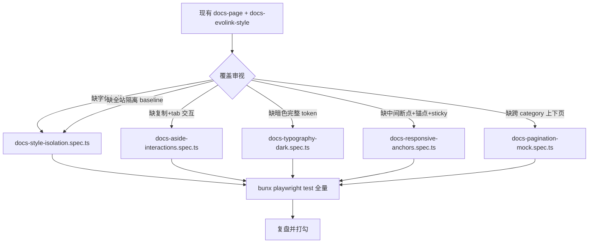

# 将 /docs 全部页面改造为 evolink Mintlify 风格 — 集成测试增补计划

> 本计划用于评审并补齐 `scripts/e2e/docs/docs-page.spec.ts` 与 `scripts/e2e/docs-evolink-style/docs-evolink-style.spec.ts` 的覆盖空白，确保 evolink Mintlify 风格改造在浏览器层面被彻底回归。
> 严格遵循 `.claude/rules/使用playwright mcp进行集成测试.md`、`CLAUDE.md`、`AGENTS.md`，复用既有 `scripts/e2e/docs/fixtures.ts`，零新增后端改动。

---

## 一、审视结论（必读）

现有用例已覆盖：

- 三栏 grid 与 sidebar 288 / aside 400~448 宽度
- `--docs-primary === #1e90ff`、`:root` token 未污染
- 字号 h1 30 / h2 24 / p 16 / 行内 code 12、th/td padding `8px 16px`、`docs-code-card` `border-radius 16px`
- 单 H1 策略（`article h1` count = 1）
- operation 页 `request` / `response` meta 选中右栏；`example` meta 不进入；概览页无右栏卡
- pagination `data-slug` 与 `/api/docs/list` 顺序一致
- 移动端（375）隐藏 sidebar + aside、显示 `docs-mobile-topbar`、SideSheet 切换
- 英文 i18n 不出现原始中文 key
- 未知 slug 文档不存在态、skeleton 加载态、文档切换重新加载内容

明显空白（按风险从高到低排序）：

| 缺口 | 风险等级 | 必补理由 |
|---|---|---|
| 6 个自托管 woff2 实际加载（HTTP 200 + content-type） | 高 | 文件名错、缓存出错、Vite 静态前缀漂移会让线上字体直接 fallback，肉眼难发现 |
| 全站样式污染：进 `/docs` 后跳 `/console/token` 的 body/root + Semi 主按钮 computed style baseline 比对 | 高 | 计划风险 #5 明确要求；`:root` token 不变只是必要条件，不充分 |
| 右栏代码卡复制 + 多 tab 切换 | 高 | 这是右栏对用户唯一的"操作能力"，零交互测试就等于没测 |
| 暗色 token 只测 1 处 | 中 | `--docs-text-1/2`、hljs 暗色 token、暗色 `docs-code-bg` 全没断言 |
| 响应式中间断点 1024–1280 | 中 | 这是真实存在的断点（sidebar 显示、aside 隐藏），漏测就是真漏 |
| heading 锚点跳转 + sidebar 4px indicator + sticky 行为 | 中 | `headingIdPrefix` / `:is-active::before` / `position:sticky` 都是 evolink 标志特征 |
| 跨 category 上下页 | 中 | 当前公共文档只有 1 个 category，必须 `page.route` mock 才能验 |
| 暗色 hljs 稳定 token（`#a5d6ff` / `#79c0ff` 等）落地 | 低 | 视觉对照里被发现的概率高；当前真实 docs 不稳定产生 keyword token，因此用 string/number token 验证 |

**不重复造测试**：补充用例统一落到 `scripts/e2e/docs-evolink-style/` 目录下，按维度拆成多个 spec，复用 `scripts/e2e/docs/fixtures.ts`。既有 `docs-evolink-style.spec.ts` 不动，避免合并冲突。

**覆盖边界修正**：`MarkdownRenderer` 默认 variant 的 chat 回归已经由单元测试覆盖，本计划不再新增只检查 `:root` 字体的 console markdown 伪 E2E。除非后续能在浏览器中稳定触发真实非 docs markdown 输出，并断言旧 inline style 仍存在，否则不要为这一点新增集成测试。

---

## 二、整体测试拓扑

```
scripts/e2e/
├── docs/                                     既有
│   ├── fixtures.ts                          (复用)
│   ├── docs-api.spec.ts                     (回归)
│   ├── docs-link-routing.spec.ts            (回归)
│   ├── docs-page.spec.ts                    (回归)
│   ├── docs-settings.spec.ts                (回归)
│   └── docs-toggle.spec.ts                  (回归)
└── docs-evolink-style/                       本次重点
    ├── docs-evolink-style.spec.ts           (既有，不动)
    ├── docs-style-isolation.spec.ts         (新增 §四.1)
    ├── docs-aside-interactions.spec.ts      (新增 §四.2)
    ├── docs-typography-dark.spec.ts         (新增 §四.3)
    ├── docs-responsive-anchors.spec.ts      (新增 §四.4)
    └── docs-pagination-mock.spec.ts         (新增 §四.5)
```



---

## 三、环境与执行约束

依据 `docker-compose.yml`：宿主端口 `127.0.0.1:9991:3000`，容器内 `3000`。
依据 `common/init.go`：默认 `GLOBAL_WEB_RATE_LIMIT_ENABLE=true`、`GLOBAL_WEB_RATE_LIMIT=60/180s`、`GLOBAL_API_RATE_LIMIT=180/180s`、`CRITICAL_RATE_LIMIT=20/1200s`。

E2E 必须用 compose override 或专用 `new-api-e2e` 容器，把以下变量真正注入容器（不能只 prefix 在 `docker compose up` 前）：

```yaml
environment:
  - GLOBAL_WEB_RATE_LIMIT_ENABLE=false
  - GLOBAL_API_RATE_LIMIT=2000
  - GLOBAL_API_RATE_LIMIT_DURATION=60
  - CRITICAL_RATE_LIMIT=400
  - CRITICAL_RATE_LIMIT_DURATION=60
```

启动后必须先确认：
- `curl -fsS http://127.0.0.1:9991/api/status` 200
- `curl -fsS http://127.0.0.1:9991/api/setup` 取 `data.status`，必要时由 fixtures 走初始化
- 已设置 `E2E_ROOT_USER` / `E2E_ROOT_PASS`（`fixtures.ts` 默认 `e2eroot / E2E_root_123456` 仅适用于全新数据库）

执行命令（`workers: 1`、串行）：

```bash
cd web
NEW_API_BASE_URL=http://127.0.0.1:9991 \
E2E_ROOT_USER=e2eroot \
E2E_ROOT_PASS=E2E_root_123456 \
bunx playwright test \
  ../scripts/e2e/docs \
  ../scripts/e2e/docs-evolink-style \
  --reporter=list
```

---

## 四、具体新增 spec 与断言

### 4.1 `docs-style-isolation.spec.ts` — 字体加载 + 全站样式隔离

> 目标：抓住"docs-theme.css 是否会污染全站"和"6 个 woff2 是否真的成功加载并被采纳"。

**前置**：复用 `loginRoot / backupDocsState / prepareDefaultDocsState / restoreDocsState`，不需要业务夹具。

**用例 A：六个 woff2 全部 200**

```ts
test('six self-hosted woff2 fonts load with HTTP 200 and font/woff2', async ({ page }) => {
  const fontUrls = [
    '/fonts/Inter-Regular.woff2',
    '/fonts/Inter-Medium.woff2',
    '/fonts/Inter-SemiBold.woff2',
    '/fonts/Inter-Bold.woff2',
    '/fonts/JetBrainsMono-Regular.woff2',
    '/fonts/JetBrainsMono-Medium.woff2',
  ];
  const seen = new Map<string, { status: number; type: string }>();
  page.on('response', (resp) => {
    const url = resp.url();
    const match = fontUrls.find((u) => url.endsWith(u));
    if (match) {
      seen.set(match, {
        status: resp.status(),
        type: resp.headers()['content-type'] || '',
      });
    }
  });

  await page.goto('/docs/gpt-image-2-generations');
  await expect(page.locator('.docs-shell')).toBeVisible();

  // 用 document.fonts.check 触发加载所有字重，直接命中 unicode-range
  await page.evaluate(async () => {
    const families = ['Inter', 'JetBrains Mono'];
    const weights = ['400', '500', '600', '700'];
    for (const family of families) {
      for (const weight of weights) {
        try { await document.fonts.load(`${weight} 16px '${family}'`); } catch {}
      }
    }
    await document.fonts.ready;
  });

  for (const url of fontUrls) {
    const hit = seen.get(url);
    expect(hit, `${url} 必须被请求`).toBeTruthy();
    expect(hit!.status, `${url} 必须 200`).toBe(200);
    expect(hit!.type.toLowerCase()).toContain('woff2');
  }

  // unicode-range 限制下，CJK 字符 fallback 到系统字体
  const cjkFamily = await page.locator('.docs-shell .docs-markdown h1').first()
    .evaluate((el) => {
      // 实际 used family 取决于浏览器；只验证 stack 含 fallback
      return getComputedStyle(el).fontFamily;
    });
  expect(cjkFamily).toContain('Inter');
  expect(cjkFamily).toMatch(/system-ui|sans-serif|-apple-system/);
});
```

**用例 B：跳出 `/docs` 后 console 视觉零回退**

```ts
test('navigating from /docs to /console does not contaminate global font/colors', async ({
  page,
}) => {
  await loginInBrowser(page); // 已在 fixtures.ts

  // 1. 先采 baseline：直接打开 console，记录 body/root font + Semi 主按钮实际样式
  await page.goto('/console/token');
  await expect(page.locator('header')).toBeVisible();
  const primaryButton = page.getByRole('button', { name: '添加令牌' }).first();
  await expect(primaryButton).toBeVisible();
  const baseline = await page.evaluate(() => ({
    bodyFont: getComputedStyle(document.body).fontFamily,
    rootFont: getComputedStyle(document.documentElement).fontFamily,
    semiPrimary: getComputedStyle(document.documentElement)
      .getPropertyValue('--semi-color-primary')
      .trim(),
  }));
  const baselinePrimaryButton = {
    backgroundColor: await computed(primaryButton, 'background-color'),
    color: await computed(primaryButton, 'color'),
    fontFamily: await computed(primaryButton, 'font-family'),
  };

  // 2. 走 /docs 触发 docs-theme.css 与 @font-face 注入
  await page.goto('/docs/gpt-image-2-generations');
  await expect(page.locator('.docs-shell .docs-markdown')).toBeVisible();
  expect(
    await computed(page.locator('.docs-shell .docs-markdown p').first(), 'font-family'),
  ).toContain('Inter');

  // 3. 跳回 console，比对采样
  await page.goto('/console/token');
  await expect(page.locator('header')).toBeVisible();
  const primaryButtonAfter = page.getByRole('button', { name: '添加令牌' }).first();
  await expect(primaryButtonAfter).toBeVisible();
  const after = await page.evaluate(() => ({
    bodyFont: getComputedStyle(document.body).fontFamily,
    rootFont: getComputedStyle(document.documentElement).fontFamily,
    semiPrimary: getComputedStyle(document.documentElement)
      .getPropertyValue('--semi-color-primary')
      .trim(),
    docsPrimaryOnRoot: getComputedStyle(document.documentElement)
      .getPropertyValue('--docs-primary')
      .trim(),
  }));
  const afterPrimaryButton = {
    backgroundColor: await computed(primaryButtonAfter, 'background-color'),
    color: await computed(primaryButtonAfter, 'color'),
    fontFamily: await computed(primaryButtonAfter, 'font-family'),
  };

  expect(after.bodyFont).toBe(baseline.bodyFont);
  expect(after.rootFont).toBe(baseline.rootFont);
  expect(after.semiPrimary).toBe(baseline.semiPrimary);
  expect(after.docsPrimaryOnRoot).toBe('');
  expect(afterPrimaryButton).toEqual(baselinePrimaryButton);
  // body 字体不允许出现 Inter（docs 字体不能污染全站正文）
  expect(after.bodyFont.toLowerCase()).not.toContain('inter');
});
```

**不新增用例 C：console markdown 默认 variant**

这里不要新增只检查 `documentElement.fontFamily` 的“兜底”用例。它不会真正触发 `MarkdownRenderer` 默认分支，和用例 B 的全站字体隔离重复，容易给出错误覆盖信号。默认 variant 回归继续由单元测试负责；E2E 只保留真实可观察的全站隔离断言。

---

### 4.2 `docs-aside-interactions.spec.ts` — 右栏复制 + 多 tab 切换

> 目标：右栏代码卡是 evolink 风格的核心承载；现在的测试只验证"看得到内容"，必须补"用得了"。

**前置**：浏览器上下文需要授权剪贴板。

```ts
test.use({
  permissions: ['clipboard-read', 'clipboard-write'],
});
```

**用例 A：generations 页右栏请求卡有两个 tab，可切换**

`docs/guides/gpt-image-2-generations.md` 中存在两个 `request` meta：`http request` 与 `json request`，按 `selectDocsCodeExamples` 顺序进入 tabs。

```ts
test('generations request card has two tabs and switches active state', async ({ page }) => {
  await page.goto('/docs/gpt-image-2-generations');
  const card = page.locator('.docs-aside .docs-code-card').filter({ hasText: '请求示例' });
  await expect(card).toBeVisible();

  const tabs = card.locator('.docs-code-card-tab');
  await expect(tabs).toHaveCount(2);

  // 默认第一个 tab active
  await expect(tabs.nth(0)).toHaveAttribute('aria-selected', 'true');
  await expect(tabs.nth(1)).toHaveAttribute('aria-selected', 'false');
  await expect(card.locator('pre code')).toContainText('POST /v1/images/generations');

  // 点第二个 tab 切换为 JSON 请求体
  await tabs.nth(1).click();
  await expect(tabs.nth(0)).toHaveAttribute('aria-selected', 'false');
  await expect(tabs.nth(1)).toHaveAttribute('aria-selected', 'true');
  await expect(card.locator('pre code')).toContainText('"prompt":');
});
```

**用例 B：复制按钮把当前 tab 内容写入剪贴板，并出 Toast**

```ts
test('copy button writes the active example to clipboard', async ({ page, context }) => {
  await context.grantPermissions(['clipboard-read', 'clipboard-write']);
  await page.goto('/docs/gpt-image-2-generations');

  const card = page.locator('.docs-aside .docs-code-card').filter({ hasText: '请求示例' });
  await card.getByRole('button', { name: '复制代码' }).click();

  await expect(page.locator('.semi-toast').filter({ hasText: '代码已复制到剪贴板' })).toBeVisible();
  const clipboard = await page.evaluate(() => navigator.clipboard.readText());
  expect(clipboard).toContain('POST /v1/images/generations');

  // 切到第二个 tab 再复制，应得 JSON
  await card.locator('.docs-code-card-tab').nth(1).click();
  await card.getByRole('button', { name: '复制代码' }).click();
  const clipboard2 = await page.evaluate(() => navigator.clipboard.readText());
  expect(clipboard2).toContain('"prompt":');
});
```

**用例 C：响应卡只有一个 example 时不渲染 tab 行**

```ts
test('response card without multiple tabs hides the tablist', async ({ page }) => {
  await page.goto('/docs/gpt-image-2-generations');
  const card = page.locator('.docs-aside .docs-code-card').filter({ hasText: '响应示例' });
  await expect(card).toBeVisible();
  await expect(card.locator('.docs-code-card-tabs')).toHaveCount(0);
});
```

**用例 D：概览页错误响应 JSON 不渲染右栏（边界）**

```ts
test('overview page error responses must not trigger the operation aside', async ({
  page,
}) => {
  await page.goto('/docs/gpt-image-2');
  await expect(
    page.getByRole('heading', { name: 'gpt-image-2 概览' }).first(),
  ).toBeVisible();
  await expect(page.locator('.docs-aside .docs-code-card')).toHaveCount(0);
});
```

---

### 4.3 `docs-typography-dark.spec.ts` — 完整暗色 token 与 hljs 主题

> 目标：补现在只测了 letter-spacing/background 单点的暗色覆盖，把 `--docs-text-1/2`、暗色 `docs-code-bg`、暗色 hljs 关键 token 全部钉死。
> 注意：当前内置 docs 的 `http/json/text` 代码块不稳定产生 `.hljs-keyword`。本用例必须使用真实文档稳定存在的 `.hljs-string` / `.hljs-number`，不要用 `.hljs-keyword` 做主断言。

```ts
test('dark mode applies the full --docs-text-* palette and hljs token swap', async ({
  page,
}) => {
  await page.goto('/docs/gpt-image-2-generations');
  await expect(page.locator('.docs-shell')).toBeVisible();

  const stringToken = page.locator('.docs-markdown .hljs-string').first();
  const numberToken = page.locator('.docs-markdown .hljs-number').first();
  await expect(stringToken).toBeVisible();
  await expect(numberToken).toBeVisible();

  // 先记录浅色 hljs string/number 颜色
  const lightString = await computed(stringToken, 'color');
  const lightNumber = await computed(numberToken, 'color');

  await page.evaluate(() => document.documentElement.classList.add('dark'));

  // dark text-1 / text-2 在 .docs-shell 内重写
  const tokens = await page.locator('.docs-shell').evaluate((el) => {
    const style = getComputedStyle(el);
    return {
      text0: style.getPropertyValue('--docs-text-0').trim().toLowerCase(),
      text1: style.getPropertyValue('--docs-text-1').trim().toLowerCase(),
      text2: style.getPropertyValue('--docs-text-2').trim().toLowerCase(),
    };
  });
  expect(tokens.text0).toBe('#e6edf3');
  expect(tokens.text1).toBe('#b1bac4');
  expect(tokens.text2).toBe('#8b949e');

  // 段落实际 color 必须采用 --docs-text-1
  const pColor = await computed(
    page.locator('.docs-markdown p').first(),
    'color',
  );
  // 浏览器把 #B1BAC4 计算为 rgb(177, 186, 196)
  expect(pColor.replace(/\s+/g, '')).toBe('rgb(177,186,196)');

  // 暗色 hljs-string / hljs-number 必须切到 GitHub Dark 风格色号，与浅色不同
  const darkString = await computed(stringToken, 'color');
  const darkNumber = await computed(numberToken, 'color');
  expect(darkString.replace(/\s+/g, '')).toBe('rgb(165,214,255)');
  expect(darkNumber.replace(/\s+/g, '')).toBe('rgb(121,192,255)');
  expect(darkString).not.toBe(lightString);
  expect(darkNumber).not.toBe(lightNumber);

  // 暗色 docs-code-card 内 pre 背景沿用 --docs-code-bg
  const cardBg = await computed(
    page.locator('.docs-aside .docs-code-card-pre').first(),
    'background-color',
  );
  expect(cardBg).not.toBe('rgba(0, 0, 0, 0)');
});
```

```ts
test('typography rhythm: h2 has top-margin 48 and h3 has top-margin 32', async ({
  page,
}) => {
  await page.goto('/docs/gpt-image-2-generations');
  const h2 = page.locator('.docs-markdown h2').first();
  const h3 = page.locator('.docs-markdown h3').first();
  expect(await computed(h2, 'margin-top')).toBe('48px');
  expect(await computed(h2, 'margin-bottom')).toBe('16px');
  expect(await computed(h3, 'margin-top')).toBe('32px');
  expect(await computed(h3, 'margin-bottom')).toBe('12px');
});
```

```ts
test('inline code uses Mintlify radius/padding and JetBrains Mono', async ({
  page,
}) => {
  await page.goto('/docs/gpt-image-2-generations');
  const code = page.locator('.docs-markdown :not(pre) > code').first();
  expect(await computed(code, 'border-radius')).toBe('6px');
  expect(await computed(code, 'padding')).toBe('2px 8px');
  expect(await computed(code, 'font-family')).toContain('JetBrains Mono');
});
```

---

### 4.4 `docs-responsive-anchors.spec.ts` — 中间断点 + 锚点 + sticky + sidebar indicator

```ts
test('1024-1280 viewport hides aside but keeps sidebar', async ({ page }) => {
  await page.setViewportSize({ width: 1100, height: 900 });
  await page.goto('/docs/gpt-image-2-generations');
  await expect(page.getByRole('heading', { name: '文本生成图像' }).first()).toBeVisible();

  await expect(page.locator('.docs-sidebar').first()).toBeVisible();
  await expect(page.locator('.docs-aside')).toBeHidden();
  await expect(page.locator('.docs-mobile-topbar')).toBeHidden();
});
```

```ts
test('headings get docs-<slug>-<id> ids and anchor navigation works', async ({ page }) => {
  await page.goto('/docs/gpt-image-2-generations');
  const headingName = /POST\s+\/v1\/images\/generations/;
  const h2 = page.locator('.docs-markdown h2').filter({ hasText: headingName });
  const id = await h2.first().getAttribute('id');
  expect(id).toBeTruthy();
  expect(id!).toMatch(/^docs-gpt-image-2-generations-/);

  // 在页面已加载后设置 hash，验证浏览器锚点滚动和 scroll-margin-top
  await page.evaluate((headingId) => {
    window.location.hash = headingId;
  }, id);
  await page.waitForFunction((headingId) => window.location.hash === `#${headingId}`, id);
  await expect(page.getByRole('heading', { name: headingName }).first()).toBeVisible();

  // 滚动后 heading 距视口顶部 ~96px（scroll-margin-top）
  const top = await page.locator(`#${id}`).first().evaluate(
    (el) => Math.round(el.getBoundingClientRect().top),
  );
  expect(top).toBeGreaterThan(0);
  expect(top).toBeLessThan(140);
});
```

```ts
test('active sidebar link renders the 4px primary indicator', async ({ page }) => {
  await page.goto('/docs/gpt-image-2-generations');
  const link = page.locator('.docs-sidebar-link.is-active').first();
  await expect(link).toBeVisible();

  const before = await link.evaluate((el) => {
    const style = getComputedStyle(el, '::before');
    return {
      width: style.width,
      background: style.backgroundColor,
    };
  });
  expect(before.width).toBe('4px');
  // #1E90FF -> rgb(30, 144, 255)
  expect(before.background.replace(/\s+/g, '')).toBe('rgb(30,144,255)');
});
```

```ts
test('sidebar and aside stay sticky at header offset when main scrolls', async ({ page }) => {
  await page.goto('/docs/gpt-image-2-generations');
  await expect(page.locator('.docs-shell')).toBeVisible();

  await page.locator('.docs-main-scroll').evaluate((el) => {
    el.scrollTo(0, 800);
  });

  const sidebarTop = await page.locator('.docs-sidebar').first()
    .evaluate((el) => Math.round(el.getBoundingClientRect().top));
  const asideTop = await page.locator('.docs-aside').first()
    .evaluate((el) => Math.round(el.getBoundingClientRect().top));
  // 顶部应等于 var(--docs-header-offset) = 64
  expect(Math.abs(sidebarTop - 64)).toBeLessThanOrEqual(2);
  expect(Math.abs(asideTop - 64)).toBeLessThanOrEqual(2);
});
```

```ts
test('pagination card hovers in docs primary color', async ({ page }) => {
  await page.goto('/docs/gpt-image-2-generations');
  const card = page.locator('.docs-pagination-card').first();
  await card.hover();
  expect(await computed(card, 'border-color')).toBe('rgb(30, 144, 255)');
});
```

---

### 4.5 `docs-pagination-mock.spec.ts` — 跨 category 上下页

> 当前公开文档全部都在「模型指南」一个 category，无法实测"跨 category 翻页"。用 `page.route` mock `/api/docs/list`，注入两个 category 的临时数据，验证 `useDocsNeighbors` 严格按 list 顺序取（哪怕 category 变化）。

```ts
test('pagination crosses categories using /api/docs/list order', async ({ page }) => {
  await page.route(/\/api\/docs\/list(?:\?.*)?$/, async (route) => {
    await route.fulfill({
      status: 200,
      contentType: 'application/json',
      body: JSON.stringify({
        success: true,
        message: '',
        data: [
          { slug: 'alpha-1', title: 'Alpha 1', order: 10, category: 'Alpha' },
          { slug: 'alpha-2', title: 'Alpha 2', order: 20, category: 'Alpha' },
          { slug: 'gpt-image-2', title: 'gpt-image-2 概览', order: 10, category: '模型指南' },
          { slug: 'gpt-image-2-generations', title: '文本生成图像', order: 20, category: '模型指南' },
        ],
      }),
    });
  });

  await page.goto('/docs/gpt-image-2');
  await expect(page.getByRole('heading', { name: 'gpt-image-2 概览' }).first()).toBeVisible();

  const cards = page.locator('.docs-pagination-card');
  // 上一页应是 Alpha 2（跨 category）
  await expect(cards.nth(0)).toHaveAttribute('data-slug', 'alpha-2');
  await expect(cards.nth(0)).toContainText('Alpha');
  // 下一页是 generations
  await expect(cards.nth(1)).toHaveAttribute('data-slug', 'gpt-image-2-generations');

  await cards.nth(0).click();
  // 注意：alpha-2 的 /api/docs/content 实际不存在，但路由会跳，跳完页面是 404 卡，断言 URL 即可
  await page.waitForURL('**/docs/alpha-2');
});
```

---

## 五、风险、边界与已知陷阱

1. **clipboard 权限**：`docs-aside-interactions.spec.ts` 必须显式 `permissions: ['clipboard-read', 'clipboard-write']`，否则 `navigator.clipboard.readText()` 在 headless Chromium 下被拒绝。
2. **`document.fonts.load`** 在 unicode-range 限定下只对 latin/latin-ext 触发实际下载；测试中故意用拉丁字符 `16px '${family}'` 触发，CJK 不会触发字体下载，因此用 `headings.length` 间接判断"CJK 字符走 fallback"已足够，不要再期望 woff2 在中文标题下被下载。
3. **`page.evaluate(scrollTo)` sticky 测试**：必须在 `.docs-main-scroll` 上滚动，而不是 `window`，因为 grid 三栏内主区是独立的 overflow-y 容器。
4. **`page.route` mock list 时**，记得不 mock `/api/docs/content`；翻到不存在 slug 时业务返回 `success:false`，页面进入空状态，这是预期，仅断言 URL，不断言文章内容。
5. **跨 spec 串行**：`docs-pagination-mock.spec.ts` 不能与 `docs-toggle.spec.ts` / `docs-link-routing.spec.ts` 共享 `setOption` 副作用，所有新 spec 一律用 `loginRoot + backupDocsState + restoreDocsState` 包住，避免污染下一组。
6. **暗色 hljs 颜色断言**：当前真实 docs 稳定存在 `.hljs-string` 与 `.hljs-number`，分别对应 `#a5d6ff` / `#79c0ff`；浏览器会计算成 `rgb(...)`，写比对前先用 `String.replace(/\s+/g, '')` 规范，否则空格差异会让 expect 间歇失败。
7. **header offset = 64**：`--docs-header-offset` 写死 64，与 `web/src/components/layout/Header.jsx` 实际高度一致；如果 Header 改高，本测试要随改，不要写更宽容的 ±10 容差。
8. **不调用真实付费上游**：所有新 spec 只读 `/api/docs/list` 与 `/api/docs/content`，不会触发 relay，符合 `.claude/rules/使用playwright mcp进行集成测试.md` 第十二节。
9. **AGENTS.md 受保护信息**：禁止断言 Header/Footer 文案"复刻自 evolink"或修改 new-api / QuantumNous 标识；本计划所有断言都限定在 `.docs-shell` 内或全站隔离 baseline 比对，不动品牌。

---

## 六、执行顺序（最佳路径）

按"先成本最低 + 价值最高、再依赖外部 mock"的顺序逐步推进：

1. **Step 1 — 字体 + 全站隔离 Done**：写 `docs-style-isolation.spec.ts`，无外部依赖，能立刻发现 woff2 路径或 CSS 全局污染问题，价值密度最高。
   已新增 6 个自托管 woff2 的浏览器响应与 content-type 断言，覆盖 Inter / JetBrains Mono 实际加载。
   已新增 `/docs` 到 `/console/token` 的 body/root/Semi 主按钮 computed style baseline 比对，验证 docs 样式不污染全站。
2. **Step 2 — 暗色与字号节奏 Done**：写 `docs-typography-dark.spec.ts`，纯 CSS 断言，无交互、无 mock。
   已新增暗色 `--docs-text-0/1/2`、段落实际颜色、`.hljs-string` 与 `.hljs-number` 暗色 token 断言。
   已新增 h2/h3 margin rhythm 与行内 code radius/padding/JetBrains Mono 断言，覆盖 Mintlify 风格排版细节。
3. **Step 3 — 响应式 + 锚点 + sticky + sidebar indicator Done**：写 `docs-responsive-anchors.spec.ts`，需要 viewport 切换和滚动，但仍然只读后端。
   已新增 1100px 中间断点断言，验证 sidebar 保留、aside 隐藏、mobile topbar 不显示。
   已新增 heading id/hash 锚点、sidebar 4px primary indicator、三栏 sticky offset 与 pagination hover 主色断言。
4. **Step 4 — 右栏交互 Done**：写 `docs-aside-interactions.spec.ts`，多 tab 切换、剪贴板，依赖 `permissions`。
   已新增 request 卡双 tab 默认状态与切换后代码内容断言，覆盖右栏操作示例的核心交互。
   已新增复制按钮剪贴板与 Toast 断言，并验证单响应卡不渲染 tab、概览页不误生成右栏卡。
5. **Step 5 — 跨 category 上下页 Done**：写 `docs-pagination-mock.spec.ts`，依赖 `page.route` mock；放最后是因为它不基于真实数据，调试成本相对最高。
   已通过 mock `/api/docs/list` 注入 Alpha 与模型指南两个 category，验证 previous/next 严格按列表顺序跨 category 取值。
   已保持 `/api/docs/content` 真实返回，点击不存在的 alpha slug 后只断言 URL，避免把 mock 内容误当业务能力。
6. **Step 6 — 全量回归 Done**：合并执行 `bunx playwright test ../scripts/e2e/docs ../scripts/e2e/docs-evolink-style`，按 list reporter 输出确认全部通过；失败用 `--headed --reporter=list` 调试，trace/截图保留在 `test-results/playwright/`。
   已先确认容器注入 `GLOBAL_WEB_RATE_LIMIT_ENABLE=false` 与提高 API/critical 限流，再执行 docs + docs-evolink-style 全量回归。
   已修正新增隔离测试中过宽的 `header` 定位器；格式化新增 spec 后最终 `48 passed (40.7s)`，`bun run i18n:lint` 通过。
7. **Step 7 — 收尾 Done**：在原计划 `20260430_将doc全部页面改造为 evolink Mintlify 风格_plan.md` 末尾追加一行"E2E 增补完成"指针，无视觉差距/已知限制不变。
   已检查 Playwright 结果目录无失败截图/trace，并清理 `.last-run.json` 测试产物，没有触发真实上游 relay 请求。
   已完成执行前/后 checklist 复核，并在原 docs 风格改造计划末尾追加本次 E2E 增补完成指针。

每个 step 都遵守 CLAUDE.md：
- `workers: 1`、`locale: zh-CN`、`timezoneId: Asia/Shanghai`（已在 `web/playwright.config.ts` 固定）
- 所有受保护接口均通过 `loginInBrowser` / fixtures 自动携带 `New-API-User` header
- 所有视觉断言走 `getComputedStyle`，不依赖 class 出现
- Semi portal（Toast / SideSheet）用 `.semi-toast` / `.semi-sidesheet` filter by text 定位，不用层级 CSS

---

## 七、Checklist（执行前/后双向核对）

执行前：

- [x] `docker compose` 已应用关闭 `GLOBAL_WEB_RATE_LIMIT_ENABLE` 的 override，`curl http://127.0.0.1:9991/api/status` 200
- [x] `E2E_ROOT_USER` / `E2E_ROOT_PASS` 已显式设置，或确认是全新独占数据库
- [x] `cd web && bunx playwright install chromium`
- [x] 已知 `web/public/fonts/` 下 6 个 woff2 物理存在
- [x] 已读 `selectDocsCodeExamples.js`、`docsMeta.js`、`docs-theme.css`，不靠"印象"写选择器

执行后：

- [x] 5 个新 spec 全部 pass，`workers: 1` 串行 200 秒内完成
- [x] 既有 `docs-page.spec.ts` / `docs-evolink-style.spec.ts` 0 回退
- [x] 失败截图与 trace 检查无新增告警
- [x] `bun run i18n:lint` 不报新增中文硬编码（如有新 t() key 同步 6 个 locale）
- [x] 未触发任何真实上游 relay 请求
- [x] `:root` `--docs-primary` 仍为空、console 主按钮 `getComputedStyle` 与 baseline 完全一致
- [x] AGENTS.md 受保护标识未被改动

---

## 八、不做（明确边界）

- 不做 pixel diff 全页截图比对（calc 可能漂移，肉眼复盘已在原计划"视觉对比"完成，本计划不再重复）
- 不做 Twoslash 类型悬浮（hljs 不支持，原计划已知差距 #1）
- 不再覆盖 `docs/openapi/` 等仓库内非内置路由文档（计划 Context 已明确不在范围）
- 不动 `web/tailwind.config.js` / `web/src/index.css` 任何样式（验证只读）
- 不做 fr/ru/ja/vi 全语言 E2E（i18n locale 同步交给 `bun run i18n:lint`，多语言渲染由单测 + 英文 E2E 兜底）
