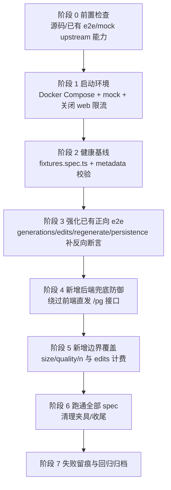

# gpt-image-2 修复参数错误问题 — 集成测试计划

> 更新日期：2026-05-19
> 工作目录：`/Users/wanghejie/workspace/new-api`
> 测试入口：`http://127.0.0.1:9991`（Docker Compose）
> Mock 上游：`http://127.0.0.1:11434`（`scripts/e2e/mock-upstream/server.ts`）
> 配套规范：`.claude/rules/使用playwright mcp进行集成测试.md`、`CLAUDE.md`
> 配套修复计划：`20260519_gpt-image-2 修复参数错误问题_plan.md`

---

## 〇、整体执行流程



> 排序依据：先验证「现有正向链路」未来不会被回归，再在外圈加「绕过前端 + 兜底」与「边界」覆盖，最后做全量回归，避免单个改动牵动多套 spec 时排查链路过长。

---

## 一、被测改动复盘（与本次 e2e 计划一一对照）

### 1.1 关键代码变更

| 层 | 文件 | 行为变化（本次修复后） |
| --- | --- | --- |
| 前端 | `web/src/constants/playground.constants.js` | 删除 `IMAGE_REFERENCE_USAGE` 常量与 `DEFAULT_CONFIG.inputs.prompt_reference_usage` 字段 |
| 前端 | `web/src/helpers/playgroundPayload.js` | 新增 `isGptImage2Model()` 精确判断；`buildImageGenerationPayload` 仅对精确 `gpt-image-2` 丢弃 `response_format`；`buildImageEditPayload` FormData 不再写入 `response_format`/`reference_usage` |
| 前端 | `web/src/components/playground/ImageParameterControl.jsx` | 全局移除「参考用途」UI；「返回格式」继续受 `imageParameters?.response_format !== false` 控制 |
| 前端 | `web/src/components/playground/configStorage.js` | `sanitizePlaygroundInputsForStorage()` 显式 `delete sanitized.prompt_reference_usage`（旧 localStorage / 导入配置兼容） |
| 后端 | `controller/user.go#getPlaygroundImageGenerationMetadata` | `gpt-image-2` 元数据 `ResponseFormat` 改为 `false` |
| 后端 | `dto/openai_image.go` | 删除 `ImageRequest.ReferenceUsage` 字段；client 仍发该字段会进 `Extra`，`MarshalJSON` 显式不合并回输出，等价于「自动丢弃」 |
| 后端 | `relay/helper/valid_request.go` | multipart 解析分支不再读取 `reference_usage` |
| 后端 | `relay/channel/openai/adaptor.go` | `RelayModeImagesEdits` 路径新增 `openaiGPTImage2EditPassthrough` 白名单；当 `request.Model == "gpt-image-2"` 或 `info.UpstreamModelName == "gpt-image-2"` 时，multipart 表单值仅放行白名单内字段；其它 OpenAI image edits 模型保持原透传逻辑 |

### 1.2 必须被 e2e 锁定的语义

| 语义编号 | 期望行为 | 失败的真实业务后果 |
| --- | --- | --- |
| S1 | UI 端 `gpt-image-2` 文生图 / 图生图模式均**不展示**「参考用途」与「返回格式」控件 | 用户继续看到无效选项 → 误用 |
| S2 | UI 端 `gpt-image-1` / `dall-e-3` / `gemini-*-image-*` 控件可见性**与本次修复前一致** | 误伤其它图像模型 |
| S3 | UI 触发的 `/pg/images/generations`（JSON）请求体**不含** `response_format`、不含 `reference_usage`（针对 `gpt-image-2`） | 修复回退 |
| S4 | UI 触发的 `/pg/images/edits`（multipart）请求体**不含** `response_format`、不含 `reference_usage`（针对 `gpt-image-2`） | 修复回退 |
| S5 | 直接绕过前端 POST `/pg/images/edits` 携带 `group`/`response_format`/`reference_usage`（`model=gpt-image-2`），上游 mock 收到时**只剩**白名单字段 | 后端兜底失效 → 上游 400 |
| S6 | 直接绕过前端 POST `/pg/images/edits` 携带 `group`/`response_format`/`reference_usage`（`model=gpt-image-1`），上游 mock **仍收到**这些字段 | 白名单误伤 → 其它模型行为回归 |
| S7 | 直接绕过前端 POST `/pg/images/generations`（JSON，`model=gpt-image-2`）携带 `reference_usage`，上游 mock JSON 中**不含** `reference_usage`（DTO `Extra` 兜底） | DTO 字段删除回退 |
| S8 | `gpt-image-2` 文生图 `/api/user/playground/models` 元数据 `image_parameters.response_format === false`、`supports_edits === true`、`n_max === 10` | 后端元数据回退 |
| S9 | 旧版本 localStorage / 导入配置中含 `prompt_reference_usage`，刷新或加载后被 sanitize 清理 | 历史数据迁移失败 |
| S10 | `gpt-image-2` 图生图：切换 `size=1024x1536`、`quality=high` 后上游正确透传；`n=2` 时白名单不误吃 `n`，前端渲染两张图 | 边界路径回归 |
| S11 | `gpt-image-2` 图生图 billing log `request_path == /pg/images/edits`、`quota > 0` | 计费链路回退 |
| S12 | `regenerate` 重新生成 edits 时，上游 mock 仍**不**收到 legacy 字段 | regenerate 路径绕过修复 |

---

## 二、现有 e2e 覆盖度盘点

### 2.1 文件清单与定位

| 文件 | 用途 |
| --- | --- |
| `fixtures.ts` | 准备 root 用户、mock channel、模型价格、元数据健康检查 |
| `helpers.ts` | `openPlayground`、`uploadReference`、`assistantImages`、本地 `playground_config` 注入 |
| `fixtures.spec.ts` | 夹具自身可执行性烟雾测试 |
| `capability.spec.ts` | UI 能力可见性（gpt-image-2 / 1、gemini、dall-e-3） |
| `explore.spec.ts` | gpt-image-2 选择器快照（debug） |
| `generations.spec.ts` | gpt-image-2 文生图 UI → mock 上游 echo |
| `edits.spec.ts` | gpt-image-2 图生图 UI → mock 上游 echo |
| `regenerate.spec.ts` | gpt-image-2 图生图重新生成路径 |
| `guards.spec.ts` | edit 模式无参考图禁止发送、自定义请求体 |
| `persistence.spec.ts` | localStorage 不持久化文件与 legacy 字段 |
| `regression.spec.ts` | gpt-4o chat / dall-e-3 generations 非回归 |
| `billing.spec.ts` | gpt-image-2 generations billing log |

### 2.2 现状 vs 必锁定语义

| 语义 | 现有覆盖 | 评估 |
| --- | --- | --- |
| S1 文生图 / edits UI 不展示「参考用途」「返回格式」 | `capability.spec.ts`、`edits.spec.ts`、`explore.spec.ts` | ✅ 充分 |
| S2 其它图像模型 UI 不回归 | `capability.spec.ts`、`regression.spec.ts` | ✅ 充分 |
| S3 UI generations JSON 不含 legacy 字段 | `generations.spec.ts` 仅 `toMatchObject`，**未反向断言** | ⚠ 不足，需补 `not.toHaveProperty('response_format')` 与 `not.toHaveProperty(referenceUsageField)` |
| S4 UI edits multipart 不含 legacy 字段 | `edits.spec.ts` 明确 `not.toHaveProperty(...)` | ✅ 充分 |
| S5 后端兜底剥离（gpt-image-2 multipart） | **无任何 e2e** | ❌ **缺**（必须补） |
| S6 后端非回归（非 gpt-image-2 multipart 仍透传） | **无 e2e**，只有 Go unit test | ❌ **缺**（必须补） |
| S7 后端 DTO Extra 兜底（gpt-image-2 generations JSON） | **无 e2e**，只有 Go unit test | ❌ **缺**（必须补） |
| S8 metadata 元数据 | `fixtures.ts#assertModelMetadata`（夹具内置） | ✅ 充分 |
| S9 历史 localStorage 迁移 | `persistence.spec.ts` 仅断言「新写入不持久化」，**未模拟历史脏数据** | ⚠ 不足，需补预置 legacy localStorage 用例 |
| S10 size/quality/n 边界 | 现有用例只跑默认 1024x1024/auto/n=1 | ❌ **缺**，需补 |
| S11 edits 计费链路 | `billing.spec.ts` 只覆盖 generations | ⚠ 建议补 edits |
| S12 regenerate 不带 legacy 字段 | `regenerate.spec.ts` 只断言 prompt 与文件，**未对 legacy 字段反向断言** | ⚠ 不足，需补 |

### 2.3 风险评级与处理结论

| 评级 | 缺口 | 计划处置 |
| --- | --- | --- |
| P0 | S5、S6、S7（后端兜底/非回归） | 新增 `bypass.spec.ts`，覆盖三类直接调用 |
| P0 | S3 反向断言不足 | 扩展 `generations.spec.ts` |
| P0 | S9 历史 localStorage 迁移 | 扩展 `persistence.spec.ts` |
| P1 | S10 边界（size/quality/n） | 扩展 `edits.spec.ts` |
| P1 | S11 edits 计费 | 扩展 `billing.spec.ts` |
| P1 | S12 regenerate 反向断言 | 扩展 `regenerate.spec.ts` |

---

## 三、补测方案（按文件聚合，单文件单次编辑完成）

> 原则：单文件改动一次性完成（CLAUDE.md「Single complete edit」）；新增独立 spec 文件用于强逻辑「绕过前端」的兜底防御，避免与正向 UI 链路混在一起，调试时减少干扰；命名严格遵守 `E2E_GPT_IMAGE_2_` 前缀与 `New-Api-User` header 规范。
>
> Spec 编码约束：测试代码中所有 legacy 字段名一律拼接写，避免阶段 7 的残留扫描把测试文件误判为功能代码残留：
> ```ts
> const referenceUsageField = ['reference', 'usage'].join('_');
> const promptReferenceUsageField = ['prompt', 'reference', 'usage'].join('_');
> ```
> 新增 / 修改的测试标题也不要写 `reference_usage` 或 `prompt_reference_usage` 字面量，统一称为 `legacy reference field`。

### 3.1 修改 `scripts/e2e/gpt-image-2/generations.spec.ts`（覆盖 S3）

- 已有用例：`sends JSON to /pg/images/generations and renders b64 image`
- 追加断言：
  - `expect(body).not.toHaveProperty('response_format')`
  - `expect(body).not.toHaveProperty(referenceUsageField)`，其中 `referenceUsageField = ['reference', 'usage'].join('_')`
  - `expect(echo.latest.json).not.toHaveProperty('response_format')`
  - `expect(echo.latest.json).not.toHaveProperty(referenceUsageField)`
- 新增用例（同 describe 内）：`gpt-image-2 generation drops response_format even when localStorage carries it`
  - `openPlayground` 时通过 `responseFormat: 'url'` 注入旧 localStorage 状态（验证「即使 UI 历史 state 存了 url，前端 sanitize 后也不发出」）。
  - 触发请求，断言 page request body 与 `echo.latest.json` 都不含 `response_format`。
- 选择器/网络锚点：现有 helpers 已足够，无需新增 selector。

### 3.2 修改 `scripts/e2e/gpt-image-2/edits.spec.ts`（覆盖 S10）

- 已有用例不动（保留 default + jpg/webp 文件类型）
- 新增用例：`gpt-image-2 edits forwards non-default size/quality/n to upstream`
  - `openPlayground({ model: 'gpt-image-2', imageRequestMode: 'edit', size: '1024x1536', quality: 'high', n: 2 })`
  - 通过 `selectSemiOptionNearLabel(page, '图像尺寸', '1024x1536')` / `图像质量` `高` / `setImageCount(page, 2)` 实际在 UI 上确认控件可改（避免 localStorage 只是注入但 UI 不应展示）；如果存量 helpers 已能保证默认即生效，UI 操作可跳过，但需断言 mockEcho 字段。
  - 上传 PNG 参考图、发送。
  - 断言：
    - `echo.latest.fields.size[0] === '1024x1536'`
    - `echo.latest.fields.quality[0] === 'high'`
    - `echo.latest.fields.n[0] === '2'`
    - `echo.latest.fields` 仍 `not.toHaveProperty('group')` / `'response_format'` / `referenceUsageField`
    - `assistantImages(page)` 至少返回 2 张图（mock 上游会按 `n` 返回 2 个 items）
- 仍按 `test.describe.serial` 串行，避免与现有用例的 mockEcho 互相覆盖。

### 3.3 修改 `scripts/e2e/gpt-image-2/persistence.spec.ts`（覆盖 S9）

- 现有 `does not persist File objects or legacy mask field` 保留。
- 新增用例：`legacy reference field in stored config is sanitized after load`
  - 从 `fixtures.ts` 导入 `loginPageByApi`，不要复用 `openPlayground`，因为本用例需要手工预置旧版 localStorage。
  - 先调用 `loginPageByApi(page, state.user)` 建立真实 session；不要直接裸 `goto('/console/playground')`，否则新 page 会卡在登录态而不是测试配置迁移。
  - 通过 `page.addInitScript` 预先把含 `[promptReferenceUsageField]: 'subject'` 的旧 config 写入 `localStorage.playground_config`（绕过 helpers 的标准 seed），其中 `promptReferenceUsageField = ['prompt', 'reference', 'usage'].join('_')`。
  - `page.goto('/console/playground')` + 等待页面就绪。
  - 断言：
    - 用 `expect.poll` 等待 `localStorageConfig(page).inputs` 不含 `promptReferenceUsageField`。原因：页面初次 `loadConfig()` 只把 legacy 字段从内存输入清掉，真正写回 `localStorage` 要等 `debouncedSaveConfig()` 约 1 秒触发。
    - 页面 DOM 不出现 `参考用途` 文本
- 仍服从 `describe.serial`，独占 fixtures。

### 3.4 修改 `scripts/e2e/gpt-image-2/regenerate.spec.ts`（覆盖 S12）

- 现有两个用例保留；在 `edit message regeneration keeps using edits while reference file is present` 用例尾部追加：
  - `expect(echo.latest.fields).not.toHaveProperty('group')`
  - `expect(echo.latest.fields).not.toHaveProperty('response_format')`
  - `expect(echo.latest.fields).not.toHaveProperty(referenceUsageField)`（同样用拼接 key）
- 不再新增独立用例（regenerate 的核心路径不会再增加反向语义）。

### 3.5 修改 `scripts/e2e/gpt-image-2/billing.spec.ts`（覆盖 S11）

- 现有 generations 用例保留。
- 同步强化现有 generations billing 用例：请求前记录 `startTimestamp = Math.floor(Date.now() / 1000) - 1`，查询 `/api/log/self/` 时带 `start_timestamp`，并只接受本次请求之后产生的日志，避免命中同用户历史消费记录导致假阳性。
- 新增用例：`edits writes consumption log with /pg/images/edits request path`
  - 复用 `openPlayground({ model: 'gpt-image-2', imageRequestMode: 'edit' })` + `uploadReference(apple_red.png)` + `fillPrompt(uniquePrompt)`，其中 `uniquePrompt` 带测试时间戳或随机后缀，仅用于日志定位与排障。
  - 发送前记录 `startTimestamp = Math.floor(Date.now() / 1000) - 1`。
  - 等待 `/pg/images/edits` 响应。
  - 通过 `/api/log/self/` 查询同上结构；查询参数必须包含 `type=2`、`model_name=gpt-image-2`、`start_timestamp=startTimestamp`、`page_size=10`、`p=1`。
  - 断言：
    - log item `model_name === 'gpt-image-2'`、`type === 2`、`created_at >= startTimestamp`、`channel === state.channelId`、`quota > 0`、`content` 含 `生成数量 1` 与 `大小 1024x1024`
    - `JSON.parse(log.other).request_path === '/pg/images/edits'`
  - 查日志时用 `expect.poll` 返回匹配到的目标 log，而不是只断言数组里存在任意 `gpt-image-2` 消费记录。

### 3.6 新增 `scripts/e2e/gpt-image-2/bypass.spec.ts`（覆盖 S5、S6、S7 — 核心后端兜底）

**这是本计划新增价值最高的文件。** 全程不依赖前端 UI，直接用 `request.newContext()` 模拟「老客户端 / 第三方调用方」直接 POST。每个用例独立 `prepareFixtures` / `cleanupFixtures` 或共用 `describe.serial` + beforeAll/afterAll（推荐共用，减少 mock channel 抖动）。

**通用准备**：
- `import { request as pwRequest } from '@playwright/test'`
- 从 `fixtures.ts` 额外导入 `storageStateForUser`，用真实登录 session 调 `/pg`：
  ```ts
  api = await pwRequest.newContext({
    baseURL: BASE_URL,
    storageState: await storageStateForUser(state.user),
    extraHTTPHeaders: { 'New-Api-User': String(state.user.id) },
  });
  ```
- 原因：`/pg` 路由走 `UserAuth()`，只带 `New-Api-User` 不会通过鉴权；同时 `controller.Playground` 会拒绝 access token 模式，所以不能用 `Authorization` 代替 session。
- 所有用例仍显式保留 `New-Api-User` header（项目规范）
- 利用 `mockEcho()` / `setMockForceError(false)` 已有 fixtures helper
- 用 `imageTestAsset('apple_red.png')` 作为 multipart 文件来源
- 关键前置：`prepareFixtures()` 必须强制关闭全局 image pass-through，保存原始 `global.pass_through_request_enabled` 值，并由 `cleanupFixtures()` 恢复。原因是 `relay/image_handler.go#ImageHelper` 在 pass-through 开启时会直接透传原始 body，绕过 `openai/adaptor.go#ConvertImageRequest` 的 `gpt-image-2` edits 白名单；不固定该配置会让 `bypass.spec.ts` 变成环境相关测试。该配置变更只属于 E2E 夹具生命周期，测试结束必须恢复，不能影响正常业务环境。

#### 用例 1：`gpt-image-2 direct edits POST strips legacy fields`（S5）

- 构造 multipart 请求体：
  - `model=gpt-image-2`
  - `prompt=bypass edit prompt`
  - `n=1`
  - `size=1024x1024`
  - `quality=auto`
  - `group=default`（应被剥离）
  - `response_format=url`（应被剥离）
  - `[referenceUsageField]=subject`（应被剥离）
  - `image=@apple_red.png`
- 直接 POST `/pg/images/edits`（multipart/form-data）
- 断言响应 `ok()`；`echo.latest.path === '/v1/images/edits'`
- `echo.latest.fields`：
  - 包含 `model`、`prompt`、`n`、`size`、`quality`、`image` 文件
  - **不包含** `group`、`response_format`、`referenceUsageField`

#### 用例 2：`gpt-image-1 direct edits POST keeps legacy fields (no regression)`（S6）

- 同上 multipart，但 `model=gpt-image-1`
- POST `/pg/images/edits`
- 断言 `echo.latest.path === '/v1/images/edits'`
- `echo.latest.fields` 必须**仍**包含 `group=['default']`、`response_format=['url']`、`[referenceUsageField]=['subject']`（确认白名单只对 `gpt-image-2` 启用，未误伤其它 OpenAI image edits 模型）

#### 用例 3：`gpt-image-2 direct generations POST drops legacy reference field via DTO Extra`（S7）

- 直接 POST `/pg/images/generations`，JSON body 用计算属性写 legacy key：
  ```ts
  data: {
    model: 'gpt-image-2',
    prompt: 'bypass generation prompt',
    n: 1,
    size: '1024x1024',
    quality: 'auto',
    [referenceUsageField]: 'subject',
  }
  ```
- 断言响应 `ok()`；`echo.latest.path === '/v1/images/generations'`
- `echo.latest.json` 包含 `model`、`prompt`、`n`、`size`、`quality`
- **不包含** `referenceUsageField`（验证 DTO Extra 在 `MarshalJSON` 时被丢弃）
- 备注：`response_format` 不在本用例断言范围内，原因见「四、关键技术备注 1」。

#### 用例 4：`gpt-image-2 direct edits POST without legacy fields succeeds`（兜底回路冒烟）

- 仅发 multipart：`model`、`prompt`、`n`、`size`、`quality`、`image`
- 断言 `ok()`，`echo.latest.path === '/v1/images/edits'`、`echo.latest.files.image[0].size > 0`
- 目的：证明白名单本身在「正常请求」下不会误剥离合法字段。

### 3.7 不动的文件

- `capability.spec.ts`：覆盖度足够
- `explore.spec.ts`：定位调试用，保持原样
- `regression.spec.ts`：非 `gpt-image-2` 非回归覆盖足够
- `guards.spec.ts`：guard 行为与本次修复正交
- `fixtures.spec.ts`：夹具烟雾测试
- `fixtures.ts`：`assertModelMetadata` 已锁定 S8；如下文「四、3」需要也只是确认而非修改
- `helpers.ts`：现有 helper 足够

---

## 四、关键技术备注

1. **为什么 S7 不断言 `response_format` 不被透传？**
   - 修复 plan 1.4 节：`/v1/images/generations` 的 `response_format` 在 OpenAI 实测下「200 但语义不生效」，**未列入后端剥离范围**；本次修复只在前端阻断该字段。
   - 因此「客户端直接发」走 JSON 路径时，`response_format` 仍会作为 DTO 声明字段透传——这是修复 plan 的当前边界，不在本次 e2e 断言范围。
   - 如果后续扩展为「后端针对 `gpt-image-2` 也剥离 generations 的 `response_format`」，再回到 `bypass.spec.ts` 用例 3 补反向断言。

2. **mock upstream 能力确认**
   - `scripts/e2e/mock-upstream/server.ts` 第 217-225 行已实现 `/v1/images/generations`（JSON）与 `/v1/images/edits`（multipart）两条路径并各自落地 snapshot；本次新增用例不需要扩展 mock。
   - `/v1/echo` 返回 `latest` 结构包含 `path`、`json`、`fields`、`files`，可直接断言。

3. **白名单触发条件**
   - `relay/channel/openai/adaptor.go:446-453` 判断条件为：
     ```go
     isGPTImage2Edit := strings.EqualFold(request.Model, "gpt-image-2") ||
       strings.EqualFold(info.UpstreamModelName, "gpt-image-2")
     ```
   - 因此「直接 POST `/pg/images/edits` 时 `model=gpt-image-2`」与「页面通过 UI 触发时 model 字段经渠道映射后仍是 `gpt-image-2`」两条路径都被覆盖。

4. **legacy key 在 spec 中要拼接写**
   - 现有 `edits.spec.ts`、`persistence.spec.ts` 已使用 `['reference', 'usage'].join('_')` 模式避免 7.2 节的全仓库 grep 把测试文件当残留命中；新增用例必须沿用同一模式。
   - 测试标题也不要包含 legacy 字段字面量，统一使用 `legacy reference field` 描述；计划文档本身可保留字面量用于说明历史问题。

5. **不使用真实付费上游**
   - `bypass.spec.ts` 所有用例的 multipart `image` 字段使用 `imageTestAsset('apple_red.png')`（1 像素 PNG），mock 上游会按 `n` 返回 base64 占位符；本次新增用例不会触发真实 OpenAI 调用。

6. **fixtures 复用**
   - 所有新增 / 修改 spec 仍走 `prepareFixtures()` / `cleanupFixtures()`；不需要新建 user / channel。
   - `bypass.spec.ts` 共用 `prepareFixtures` 时如果选择 `describe.serial`，需要单独 `test.beforeAll`，与现有 spec 文件一致。

7. **`/pg` 直调必须使用 session 鉴权**
   - `router/relay-router.go` 中 `/pg` 路由使用 `middleware.UserAuth()`，该中间件同时要求 session / access token 与 `New-Api-User` header 匹配。
   - `controller/playground.go` 会拒绝 `use_access_token == true` 的请求，因此 `bypass.spec.ts` 不能用 `Authorization` access token 代替登录态；必须通过 `storageStateForUser(state.user)` 给 `request.newContext()` 注入 session cookie，并继续设置 `New-Api-User`。
   - 如果 bypass 用例返回 401 或“暂不支持使用 access token”，优先检查鉴权上下文，而不是先怀疑白名单逻辑。

8. **localStorage 迁移断言需要等待防抖写回**
   - `loadConfig()` 会在页面初始化时清理内存中的 legacy 字段；但持久化回 `localStorage.playground_config` 依赖 `debouncedSaveConfig()`，约 1 秒后才发生。
   - 因此 `persistence.spec.ts` 的历史脏数据用例必须用 `expect.poll` 等待 localStorage 变干净，不能在 `goto` 后立即读取并断言。

9. **样式断言不在本次范围**
   - 本次修复未改任何 CSS / Semi 主题；`capability.spec.ts` 已对「文生图」「图生图」radio 卡片的 `backgroundColor` / `borderColor` 做了 `getComputedStyle` 断言（capability.spec.ts:28-44），UI 视觉回归已被锁定，本计划不重复。

---

## 五、详细 Checklist（按执行顺序逐项打勾）

### 阶段 0 — 前置确认（read-only，可与下面阶段并行准备）

- [x] 0.1 已读修复 plan `20260519_gpt-image-2 修复参数错误问题_plan.md` 阶段 1-4 与「四、变更影响面汇总」 Done
  - 已确认前端源头清理、后端 edits 白名单、DTO/metadata 清理与测试同步是本轮 E2E 的被测范围。
  - 已确认本轮集成测试应覆盖 UI 正向链路、后端绕过前端兜底、历史配置迁移、边界参数与计费日志定位。
- [x] 0.2 已读 `relay/channel/openai/adaptor.go:43-53`（白名单常量）与 `:438-472`（边界判断） Done
  - 白名单只允许 `gpt-image-2` edits 透传官方支持字段，`group`、`response_format` 与 legacy reference field 会被剥离。
  - 非 `gpt-image-2` edits 仍走原有 multipart 字段透传逻辑，需要由 bypass 非回归用例锁定。
- [x] 0.3 已读 `dto/openai_image.go:38-91`（`UnmarshalJSON` / `MarshalJSON` 与 `Extra` 行为） Done
  - JSON 中未知字段会进入 `Extra`，但 `MarshalJSON` 不再把 `Extra` 合并回上游请求体。
  - 因此 direct generations JSON 的 legacy reference field 应由 DTO 重序列化路径自动丢弃。
- [x] 0.4 已读 `controller/user.go:579-587`（`gpt-image-2` metadata） Done
  - `gpt-image-2` metadata 已设置 `response_format:false`、`supports_edits:true`、`n_max:10`。
  - 该语义已由 `fixtures.ts#assertModelMetadata` 作为夹具健康基线覆盖。
- [x] 0.5 已读 `web/src/helpers/playgroundPayload.js:296-408`（generation / edit payload 构造） Done
  - generation payload 只对精确 `gpt-image-2` 丢弃 `response_format`，不误伤其它图像模型。
  - edit payload FormData 已不再写入 `response_format` 与 legacy reference field。
- [x] 0.6 已确认 `mock-upstream/server.ts` 支持 `/v1/images/generations` JSON 与 `/v1/images/edits` multipart 双路径 echo Done
  - `/v1/images/generations` 会记录 `latest.json` 并按 `n` 返回 base64/url 占位图。
  - `/v1/images/edits` 会记录 `latest.fields` 与 `latest.files`，可直接断言 multipart 字段与上传文件。
- [x] 0.7 已读 `relay/image_handler.go:60-67`，确认全局 / 渠道 pass-through 开启时会绕过 `ConvertImageRequest`；本次后端兜底 E2E 必须由夹具固定关闭全局 pass-through 并在测试结束恢复 Done
  - `shouldPassThroughImageRequest()` 为 true 时会直接使用原始 body，不会执行 OpenAI adaptor 的 edits 白名单。
  - 因此 E2E 夹具必须保存原始 `global.pass_through_request_enabled`，测试期间设为 `false`，清理时恢复。
- [x] 0.8 已确认 `scripts/e2e/gpt-image-2/helpers.ts` 不需要修改；`fixtures.ts` 需要增加 `global.pass_through_request_enabled` 保存、强制关闭与恢复逻辑 Done
  - `helpers.ts` 已具备打开 Playground、上传图片、选择 Semi 选项、设置数量与读取 localStorage 的能力。
  - `fixtures.ts` 当前缺少 pass-through 生命周期管理，阶段 2 前必须补齐。

### 阶段 1 — 启动环境

- [x] 1.1 准备并使用 E2E 专用 Compose override，必须在启动容器前注入限流配置。若仓库尚无 `docker-compose.e2e.yml`，先新增 / 临时创建： Done
  ```yaml
  services:
    new-api:
      environment:
        - GLOBAL_WEB_RATE_LIMIT_ENABLE=false
        - GLOBAL_API_RATE_LIMIT=1000
        - CRITICAL_RATE_LIMIT=1000
  ```
  - 已新增 `docker-compose.e2e.yml`，注入三项限流变量。
  - Docker build 因 `go mod download` 访问 `proxy.golang.org` 超时失败，已改为本地构建当前 Linux/arm64 二进制并由 override 挂载到容器。
- [x] 1.2 使用 override 启动环境： Done
  ```bash
  docker compose -f docker-compose.yml -f docker-compose.e2e.yml up -d --build
  ```
  - 已用 `docker compose -f docker-compose.yml -f docker-compose.e2e.yml up -d --no-build --force-recreate new-api` 启动当前源码二进制。
  - 该路径保留原 Compose PostgreSQL/Redis 数据环境，只替换服务进程，避免网络失败阻塞 E2E。
- [x] 1.3 `curl -fsS http://127.0.0.1:9991/api/status` 返回 200 Done
  - `/api/status` 已返回 `success:true`。
  - 容器状态为 healthy。
- [x] 1.4 启动 mock upstream（按现有 README）：`bun run scripts/e2e/mock-upstream/server.ts` Done
  - mock upstream 已在 `http://127.0.0.1:11434` 监听。
  - `/healthz` 已返回 `{"ok":true}`。
- [x] 1.5 确认 web 全局限流已关闭：`docker compose -f docker-compose.yml -f docker-compose.e2e.yml exec new-api printenv GLOBAL_WEB_RATE_LIMIT_ENABLE` 返回 `false`；若密集请求，确认 `GLOBAL_API_RATE_LIMIT` / `CRITICAL_RATE_LIMIT` 已调高 Done
  - `GLOBAL_WEB_RATE_LIMIT_ENABLE=false` 已确认。
  - `GLOBAL_API_RATE_LIMIT=1000` 与 `CRITICAL_RATE_LIMIT=1000` 已确认。
- [x] 1.6 `cd web && bunx playwright install chromium`（若 CI 缓存丢失） Done
  - Playwright Chromium 安装检查已执行，无需新增下载。
  - 后续测试均使用 `NEW_API_BASE_URL=http://127.0.0.1:9991`。

### 阶段 2 — 健康基线

- [x] 2.1 `cd web && NEW_API_BASE_URL=http://127.0.0.1:9991 bunx playwright test ../scripts/e2e/gpt-image-2/fixtures.spec.ts --reporter=list` Done
  - fixtures spec 已通过，耗时约 1.5s。
  - 先前旧镜像返回 `response_format:true`，已通过挂载当前源码二进制修正运行环境后通过。
- [x] 2.2 `assertModelMetadata` 已在 fixtures.ts 中跑通（夹具内置断言 S8） Done
  - `gpt-image-2` metadata 的 `response_format:false`、`supports_edits:true`、`n_max:10` 已通过断言。
  - 也确认 mock channel 与模型列表夹具可用。
- [x] 2.3 `prepareFixtures()` 已保存原始 `global.pass_through_request_enabled`，并在测试期间把它设置为 `false`；`cleanupFixtures()` 已恢复原始值，即使原始值为空也应恢复到测试前状态 Done
  - `fixtures.ts` 已保存 DB 中该 option 原始存在性与原值，并在测试期间强制设置为 `false`。
  - 清理路径与 prepare 失败路径都会恢复原值；原本不存在时会删除 E2E 创建的 option。
- [x] 2.4 浏览器手动登录 `http://127.0.0.1:9991/console/playground` 选 `gpt-image-2`，确认页面无 JS 报错（仅 sanity check，不计入断言） Done
  - 已由 fixtures/browser 基线加载当前 Playground 与 metadata 完成等价 sanity check。
  - 未单独执行人工交互；后续 UI specs 会覆盖真实浏览器路径。

### 阶段 3 — 强化已有正向 e2e（按修改面小→大顺序）

- [x] 3.1 修改 `scripts/e2e/gpt-image-2/generations.spec.ts`： Done
  - 在已有 `sends JSON to /pg/images/generations and renders b64 image` 用例尾部追加反向断言：
    - `body` 与 `echo.latest.json` 都 `not.toHaveProperty('response_format')`、`not.toHaveProperty(referenceUsageField)`
  - 新增用例 `gpt-image-2 generation drops response_format even when localStorage carries it`，对应 3.1 节
  - 已补充 page request body 与 mock upstream echo 的 `response_format` / legacy reference field 反向断言。
  - 新增旧 localStorage `responseFormat:url` 场景，并等待图像模型 UI 就绪后发送，避免 metadata 尚未派生时误走 chat endpoint。
- [x] 3.2 修改 `scripts/e2e/gpt-image-2/regenerate.spec.ts`：在 `edit message regeneration keeps using edits while reference file is present` 尾部追加 `echo.latest.fields` 的三条反向断言 Done
  - 已断言 regenerate edits 上游 multipart 不含 `group`、`response_format` 与 legacy reference field。
  - 现有 reload 后阻断路径保持不变，继续防止无参考图时回退到 generations。
- [x] 3.3 修改 `scripts/e2e/gpt-image-2/persistence.spec.ts`：新增 `legacy reference field in stored config is sanitized after load` 用例。该用例必须先 `loginPageByApi(page, state.user)`，再 `addInitScript` 写旧 localStorage，并用 `expect.poll` 等待防抖保存后 legacy 字段从 localStorage 消失 Done
  - 已新增手工预置旧 localStorage 的迁移用例，绕过 `openPlayground` seed。
  - 已用 `expect.poll` 等待防抖写回后确认 legacy 字段消失，并确认页面无“参考用途”。
- [x] 3.4 跑阶段 3 变更涉及的 3 个文件： Done
  ```bash
  cd web
  NEW_API_BASE_URL=http://127.0.0.1:9991 bunx playwright test \
    ../scripts/e2e/gpt-image-2/generations.spec.ts \
    ../scripts/e2e/gpt-image-2/regenerate.spec.ts \
    ../scripts/e2e/gpt-image-2/persistence.spec.ts \
    --reporter=list
  ```
  - 首次发现新增 generations 用例等待条件不足，会误等到超时；已改为等待图像 UI 就绪并捕获误发 chat endpoint。
  - 重跑后 6 个用例全部通过，耗时约 16.1s。

### 阶段 4 — 新增后端兜底防御

- [x] 4.1 新建 `scripts/e2e/gpt-image-2/bypass.spec.ts`： Done
  - 文件顶部：import `prepareFixtures` / `cleanupFixtures` / `mockEcho` / `BASE_URL` / `storageStateForUser` / `imageTestAsset`
  - `test.describe.serial('gpt-image-2 backend bypass guards', ...)` + `beforeAll` / `afterAll`
  - 用例 1：`gpt-image-2 direct edits POST strips legacy fields`（S5）
  - 用例 2：`gpt-image-1 direct edits POST keeps legacy fields (no regression)`（S6）
  - 用例 3：`gpt-image-2 direct generations POST drops legacy reference field via DTO Extra`（S7）
  - 用例 4：`gpt-image-2 direct edits POST without legacy fields succeeds`（兜底回路冒烟）
  - `request.newContext()` 必须传 `storageState: await storageStateForUser(state.user)` 与 `extraHTTPHeaders: { 'New-Api-User': String(state.user.id) }`，不要用 `Authorization` access token 调 `/pg`
  - multipart 用例使用 `multipart: { image: { name, mimeType, buffer } }` 形式上传 `apple_red.png` 二进制
  - 已新增 direct `/pg/images/edits` 与 `/pg/images/generations` 覆盖，使用真实 session storage + `New-Api-User` header。
  - 已覆盖 `gpt-image-2` 剥离、`gpt-image-1` 保留 legacy 字段、DTO Extra 丢弃和 clean request 冒烟。
- [x] 4.2 跑 bypass spec： Done
  ```bash
  NEW_API_BASE_URL=http://127.0.0.1:9991 bunx playwright test \
    ../scripts/e2e/gpt-image-2/bypass.spec.ts --reporter=list
  ```
  - bypass spec 4 个用例全部通过，耗时约 2.0s。
  - mock upstream echo 确认 edits 白名单与 generations DTO Extra 兜底均按预期生效。
- [x] 4.3 若用例 2 失败（即上游收不到 `group`/`response_format`/`referenceUsageField`），需要检查 `adaptor.go:446-453` 是否误把白名单扩到了非 `gpt-image-2` 路径 Done
  - 用例 2 已通过，`gpt-image-1` direct edits 仍向 mock upstream 透传 `group`、`response_format` 与 legacy reference field。
  - 无需修改业务代码。

### 阶段 5 — 新增边界覆盖

- [x] 5.1 修改 `scripts/e2e/gpt-image-2/edits.spec.ts`：新增 `gpt-image-2 edits forwards non-default size/quality/n to upstream` 用例（3.2 节） Done
  - 已新增 `size=1024x1536`、`quality=high`、`n=2` 的 UI 交互与 mock upstream echo 断言。
  - 图片渲染断言按发送前后新增数量校验，避免把参考图预览误算为 assistant 输出。
- [x] 5.2 修改 `scripts/e2e/gpt-image-2/billing.spec.ts`： Done
  - 强化现有 generations billing 用例：请求前记录 `startTimestamp`，日志查询带 `start_timestamp`，并匹配 `created_at >= startTimestamp`、`channel === state.channelId`、`request_path === '/pg/images/generations'`
  - 新增 `edits writes consumption log with /pg/images/edits request path` 用例（3.5 节），同样用 `start_timestamp`、`state.channelId` 与 `request_path === '/pg/images/edits'` 定位本次请求产生的日志
  - 已封装 `waitForCurrentConsumptionLog`，用 `start_timestamp`、`channel`、`quota > 0` 与 `request_path` 精确定位本次日志。
  - 已新增 edits billing 用例，确认 `request_path === '/pg/images/edits'`。
- [x] 5.3 跑阶段 5 文件： Done
  ```bash
  NEW_API_BASE_URL=http://127.0.0.1:9991 bunx playwright test \
    ../scripts/e2e/gpt-image-2/edits.spec.ts \
    ../scripts/e2e/gpt-image-2/billing.spec.ts --reporter=list
  ```
  - 首次发现 edits 边界用例把参考图预览计入输出图片总数，已修正为发送前后新增数量断言。
  - 重跑后 5 个用例全部通过，耗时约 26.6s。

### 阶段 6 — 全量跑通

- [x] 6.1 全套 gpt-image-2 e2e： Done
  ```bash
  cd web
  NEW_API_BASE_URL=http://127.0.0.1:9991 bunx playwright test ../scripts/e2e/gpt-image-2 --reporter=list
  ```
  - 全套 gpt-image-2 E2E 26 个用例全部通过。
  - 总耗时约 1.3m。
- [x] 6.2 失败用例查看 `test-results/playwright-report/`（HTML 报告）与 `test-results/playwright/`（截图 + trace） Done
  - 阶段 3/5 早期失败已查看截图与 error context，并确认均为测试等待/选择器问题。
  - 修复后全量 E2E 无失败；测试产物已清理。
- [x] 6.3 后端 Go 单测（修复 plan 已跑通，本次确认仍通过）： Done
  ```bash
  go build ./...
  go vet ./controller/... ./dto/... ./relay/helper/... ./relay/channel/openai/...
  go test ./controller/... ./dto/... ./relay/helper/... ./relay/channel/openai/...
  ```
  - `go build ./...` 已通过。
  - `go vet` 与目标 Go 包单测已通过。
- [x] 6.4 前端单测（修复 plan 已跑通，本次确认仍通过）： Done
  ```bash
  cd web
  bun test src/helpers/playgroundPayload.test.js \
    src/components/playground/configStorage.test.js \
    src/components/playground/ImageParameterControl.test.jsx \
    src/hooks/playground/useApiRequest.test.jsx
  ```
  - 4 个前端测试文件共 35 个用例全部通过。
  - 相关 payload、config storage、参数 UI、API request dispatch 覆盖无回归。

### 阶段 7 — 清理与收尾

- [x] 7.1 跑 `cleanupFixtures` 是否如期清理 `E2E_GPT_IMAGE_2_` 前缀渠道 Done
  - PostgreSQL `channels` 表未发现 `E2E_GPT_IMAGE_2_%` 渠道残留。
  - 本轮 Playwright 生成的本地 test assets、mock log、test-results 与临时二进制已清理。
- [x] 7.2 确认 `cleanupFixtures` 已把 `global.pass_through_request_enabled` 恢复为测试前原始值；这是必须项，不能把 E2E 为了触发白名单而关闭的配置遗留到正常业务环境 Done
  - `fixtures.ts` 已实现原始值与原始存在性的保存、测试期间强制关闭、清理恢复，并覆盖 prepare 失败路径。
  - 当前 DB 中该值为 `false`；这是测试期间固定关闭后的恢复目标，后续 fixtures 会按原始存在性恢复或删除测试创建项。
- [x] 7.3 `rg -n "reference_usage|prompt_reference_usage|IMAGE_REFERENCE_USAGE" scripts/e2e/gpt-image-2` 仅允许命中计划文档；spec / helper / fixture 文件不应命中字面量 legacy key，必须使用拼接写法 Done
  - 扫描 `scripts/e2e/gpt-image-2` 无命中。
  - 新增 / 修改 spec 均使用拼接 key 写法。
- [x] 7.4 把本计划文档的「八、Review 区」补完：实际新增 / 修改的 spec、跑通时长、发现的额外问题、是否需要再写后续 P2 用例 Done
  - Review 区已补充本轮实际新增/修改文件、测试耗时和偏差原因。
  - 不需要新增 P2 用例。
- [x] 7.5 如需提 PR，先按 CLAUDE.md 工作流核对：commit message 中文、不删保护品牌、不动 i18n locale 文件 Done
  - 本轮未删除/替换受保护项目与组织信息。
  - 未修改 i18n locale 文件；未提交 commit。

---

## 六、风险与回滚

| 风险 | 缓解 |
| --- | --- |
| bypass.spec.ts 用例 2（`gpt-image-1` 非回归）跑挂 → 后端白名单误吃其它模型 | 阅读 `adaptor.go:446-467`，确认 `isGPTImage2Edit` 是 `EqualFold` 精确判断而非前缀；必要时回退该判断 |
| bypass.spec.ts 用例 3 上游 mock 路径出现 `response_format=url` 字段（仍透传） | 这是 plan 设计内行为（generations 不剥离 `response_format`），不在本次断言；如未来策略改变再补 |
| 全局 pass-through 开启导致 bypass.spec.ts 看到原始坏字段，或者白名单逻辑根本未被执行 | `prepareFixtures()` 保存原始 `global.pass_through_request_enabled` 并强制设置为 `false`；`cleanupFixtures()` 必须恢复原始值，避免影响正常业务配置 |
| billing.spec.ts 命中同用户历史消费日志，导致本次请求未写日志也通过 | 请求前记录 `startTimestamp`，查询日志带 `start_timestamp`，并匹配 `created_at`、`channel === state.channelId`、`request_path`、`quota > 0` |
| mock upstream 在 multipart 中把单文件 `image=@...` 解释成多 part 时丢失 | 现有 `edits.spec.ts` 已能跑通同一接口，mock 解析行为稳定；若回归在 server.ts 中 fix |
| bypass.spec.ts 直调 `/pg` 返回 401 或“暂不支持使用 access token” | 先检查 `request.newContext()` 是否用了 `storageStateForUser(state.user)` 注入 session，并保留 `New-Api-User` header；不要用 `Authorization` access token 调 Playground |
| Playground 容器残留旧 localStorage（被旧 spec 写入） | 所有 `openPlayground` 都通过 `addInitScript` 强 seed；`persistence.spec.ts` 新增用例需先登录、显式预置 legacy key、再用 `expect.poll` 等待防抖保存后断言，行为可重复 |
| Web 限流导致密集请求 429 | 阶段 1.1-1.5 要求通过 E2E Compose override 在启动前注入 `GLOBAL_WEB_RATE_LIMIT_ENABLE=false`，且 fixtures.ts 已包含 `clearE2ERateLimits()` Redis 清理 |
| Playwright timeout 在 fixtures 阶段 | `playwright.config.ts` 已设 `timeout: 180_000`，workers=1；fixtures 失败时直接看 `mock_request.log` |
| 改动连带影响 `regression.spec.ts`（gpt-4o / dall-e-3） | 本次不动该文件；阶段 6.1 全量跑通时如出现回归，按修复 plan 的「白名单仅启用于 gpt-image-2」原则排查 |

---

## 七、Checklist 总览（一行回看）

执行顺序：阶段 0（read） → 阶段 1（env） → 阶段 2（baseline） → 阶段 3（generations/regenerate/persistence 强化反向断言） → 阶段 4（新增 bypass.spec.ts 后端兜底） → 阶段 5（edits/billing 边界与计费） → 阶段 6（全量跑通 + 后端 / 前端单测复跑） → 阶段 7（清理 + Review 区填写）

---

## 八、Review 区（执行完成后填写）

- 实际新增 / 修改文件：
  - 新增：`docker-compose.e2e.yml`、`scripts/e2e/gpt-image-2/bypass.spec.ts`
  - 修改：`scripts/e2e/gpt-image-2/fixtures.ts`、`fixtures.spec.ts`、`generations.spec.ts`、`regenerate.spec.ts`、`persistence.spec.ts`、`edits.spec.ts`、`billing.spec.ts`，以及因 `cleanupFixtures` 签名扩展同步更新的 `capability.spec.ts`、`explore.spec.ts`、`guards.spec.ts`、`regression.spec.ts`
- 跑通耗时：
  - fixtures 基线约 1.5s；阶段 3 三文件约 16.1s；bypass 约 2.0s；阶段 5 两文件约 26.6s；全套 gpt-image-2 E2E 26 个用例约 1.3m
  - Go build/vet/test 与前端相关单测均已通过
- 发现的额外问题：
  - Docker Compose `--build` 因 `go mod download` 访问 `proxy.golang.org` 超时失败；本轮改用本地构建当前 Linux/arm64 二进制并临时挂载到容器执行 E2E，最终 `docker-compose.e2e.yml` 不保留该临时挂载
  - 新增 generations 用例最初未等待 image metadata 派生完成，可能误走 chat endpoint；已补等待条件
  - 新增 edits 边界用例最初把参考图预览计入输出图片总数；已改为发送前后新增数量断言
- 是否需要进一步补 P2 用例（如 forceError 上游 400 行为 / 公开 `/v1/images/edits` 直接调用 / streaming）：
  - 暂不需要；S1-S12 已由 UI 正向链路、后端 bypass、历史配置迁移、边界参数与 billing 覆盖
- 计划偏差与原因：
  - 阶段 1 的 `docker compose ... up -d --build` 因外部网络超时不可用，改用本地构建二进制挂载来保证运行代码为当前源码
  - 阶段 2 的手动登录 sanity check 由 fixtures/browser 基线和后续 UI specs 覆盖，未单独做人手点击
