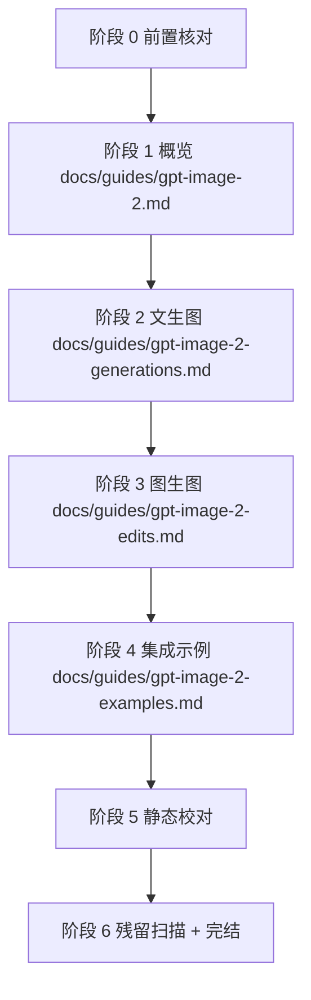

# gpt-image-2 文档更新至官方 — 执行计划

> 更新日期：2026-05-20
> 工作目录：`/Users/wanghejie/workspace/new-api/.claude/worktrees/docs-gpt-image-2-update`
> 影响范围：`docs/guides/gpt-image-2.md`、`docs/guides/gpt-image-2-generations.md`、`docs/guides/gpt-image-2-edits.md`、`docs/guides/gpt-image-2-examples.md`
> 参考依据：
> - `gpt-image-2 openai官方支持参数清单.md`（官方实测）
> - `history_plan/20260519_gpt-image-2 修复参数错误问题_plan.md`（修复后接口形态）
> - `history_plan/20260519_gpt-image-2 修复参数错误问题 — 集成测试_plan.md`（已锁定语义 S1-S12）
> 硬约束：最终落到 docs 文件里的文字**只描述"最终怎么使用"**；不出现"修复前 / 修复后 / 已删除 / 已废弃 / 历史原因 / 旧接口"等任何变更解释、版本对比或迁移说明。

---

## 一、整体流程



执行顺序原则：

1. 先改"概览"。概览定义全局可发字段、错误码与 FAQ，是其它三个文档对外承诺的边界；先固定边界再去调具体接口，能避免下游文档反复回滚。
2. 概览之后改"文生图"。文生图的 Body 表是 SDK / curl 用户最常复制的模板，越早收敛越能让阶段 4 的示例代码顺势对齐。
3. 文生图之后改"图生图"。图生图的字段删除量最大（`response_format`、`reference_usage`），把它压在文生图之后能让审稿人先在简单文档上熟悉删除节奏，再处理高风险文档。
4. 最后改"集成示例"。所有 SDK / curl 代码都依赖前三个文档定义的字段，必须等前三个稳定后再同步示例，避免示例与规格反复打架。
5. 单文件单次编辑（CLAUDE.md「Single complete edit」），同一文件不分阶段反复改。

---

## 二、最小公约数推导

判定原则：**当前文档已存在**该字段 **AND** 官方参数清单认定该字段在 `gpt-image-2` 上可靠生效（200 + 语义生效） **AND** 新旧两种接口形态下都不会报错。任一条件不满足 → 文档删除。

### 2.1 文生图（`/v1/images/generations`）字段决策

| 字段 | 旧形态（aiartmirror 直连） | 新形态（new-api 修复后） | 文档处理 |
|---|---|---|---|
| `model` | 200 | 200 | **保留** |
| `prompt` | 200 | 200 | **保留** |
| `n` | 200 | 200 | **保留** |
| `size` | 200 | 200 | **保留** |
| `quality` | 200 | 200 | **保留** |
| `response_format` | 200 但语义不生效 | 前端剥离；SDK 直发仍透传但语义不生效 | **删除**（最小公约数不接受"语义不生效"） |
| `aspect_ratio` | 静默忽略 | 静默忽略 | **删除**（官方清单未列；保留会误导） |

### 2.2 图生图（`/v1/images/edits`）字段决策

| 字段 | 旧形态 | 新形态 | 文档处理 |
|---|---|---|---|
| `model` | 200 | 200 | **保留并标为必填** |
| `prompt` | 200 | 200 | **保留** |
| `image` | 200 | 200 | **保留** |
| `n` | 200 | 200 | **保留** |
| `size` | 200 | 200 | **保留** |
| `quality` | 200 | 200 | **保留** |
| `response_format` | 400 Unknown parameter | 后端兜底剥离 | **删除**（旧形态直发 400） |
| `reference_usage` | 400 Unknown parameter | 后端兜底剥离 | **删除**（旧形态直发 400） |

### 2.3 不纳入本轮的新字段

官方参数清单中实测支持但当前文档未列、且修复 plan 已声明"暂不新增"的字段 —— 本轮不写入文档：`output_format`、`output_compression`、`background`、`moderation`、`user`、`mask`、`image[]`。它们留待后续单独的「能力扩展」轮次再上文档，避免本次文档承诺超出当前实际可用范围。

---

## 三、阶段 0 — 前置核对

- [x] 0.1 已确认 `pwd` 为 `/Users/wanghejie/workspace/new-api/.claude/worktrees/docs-gpt-image-2-update`；本轮所有命令和文件编辑都在该 worktree 执行，不在主 worktree 下修改。
- [x] 0.2 已读完 4 个 docs 文件、`gpt-image-2 openai官方支持参数清单.md`、两份 history_plan。
- [x] 0.3 已确认 `relay/channel/openai/adaptor.go` 中 `openaiGPTImage2EditPassthrough` 白名单为 `{prompt, n, size, quality, user, background, moderation, output_format, output_compression}`，并由 `mf.File` 路径独立处理 `image`、`image[]`、`mask`，与本轮文档保留字段不冲突。
- [x] 0.4 已确认本轮不需要触碰 `relay/`、`dto/`、`controller/`、前端 / E2E 代码；范围仅限 `docs/guides/`。
- [x] 0.5 已记录所有"待删除字段 / 字符串字面量"清单，供阶段 6 残留扫描验证：
  - `response_format`
  - `reference_usage`
  - `aspect_ratio`
  - `reference_blobs`（仅在 edits 文档的响应样例出现，删除以保持示例干净）
  - `extra_body`（仅在 examples 文档的 Python edits 示例中残留 `reference_usage` 时使用，删除该参数后视情况移除整个 `extra_body` 入参）

**Done**
- 已在当前 worktree 读取计划、官方清单、历史计划、四个目标文档与相关后端/计费路径。
- 已确认本轮实现只需要修改 `docs/guides/` 四个文档，代码与数据库逻辑无需变更。

---

## 四、阶段 1 — `docs/guides/gpt-image-2.md`（概览）

> 单文件单次 Edit 完成。修改后这份文档不再向用户暗示存在 `response_format`、`aspect_ratio`、`background` 异步路径等能力。

### 4.1 删除 / 改写点

1. "Base URL" 表（约 L24-L29）：
   - 删除一行 `| 默认响应格式 | 不传 \`response_format\` 时返回 \`b64_json\` |`。
   - 保留 `Base URL` / `协议` / `推荐客户端超时` 三行。
2. "通用限制" 段（约 L48-L52）：
   - 删除关于 `response_format="url"` 返回预签名 URL 的整行。
   - 删除关于 `aspect_ratio` 被静默忽略的整行。
   - 删除关于 `background: true` 异步路径的整行（与未来可能开放的 `background=auto/opaque` 同名，先清空避免歧义）。
   - 仅保留与 `n > 1` 同步耗时 / 计费张数相关的说明（这条与本轮删除项无关）。
3. "FAQ" 段（约 L99-L120）：
   - 删除 Q2 "URL 模式返回的图片多久失效?"（含 Q 与 A 两行）。
   - 保留其它 Q&A：`gpt-image-1`、失败计费、单次最多张数、edits 输入格式。
4. 文档顶部要点列表（约 L9-L12）：保留不动；该段未提到具体字段。
5. "API Reference"、"Model"、"计费规则"、"错误处理"、"Retry Policy"、"联系" 段：保留不动；这些段落不依赖被删字段。

### 4.2 Edit 锚点（供执行时定位用，最终修改后不留任何注释）

- 锚点 A：`| 默认响应格式 | 不传 \`response_format\` 时返回 \`b64_json\` |` → 整行删除。
- 锚点 B：`- \`response_format="url"\` 返回预签名 URL，24 小时内有效。` → 整行删除。
- 锚点 C：`- 当前上游会静默忽略 \`aspect_ratio\` 字段；需要超宽图时优先在 prompt 中写明 \`panorama\` / \`cinematic ultrawide\`，或使用显式 \`size\`。` → 整行删除。
- 锚点 D：`- 不建议传 \`background: true\` 走异步路径；该参数可能被部分透传，但轮询路径不可用，可能产生不可预期的计费结果。` → 整行删除。
- 锚点 E：`**Q: URL 模式返回的图片多久失效?**` 起，到下一条 `**Q:**` 之前的整段（含答案行 `A: 24 小时，建议拿到 URL 后尽快下载存档。`）→ 整段删除。

### 4.3 自检

- [x] 1.1 改后该文件全文 `grep -nE 'response_format|aspect_ratio|background|reference_usage' docs/guides/gpt-image-2.md` 无任何命中。
- [x] 1.2 文档语义完整：标题层级、章节计数、计费规则与错误处理段落未被牵连。
- [x] 1.3 文档不含"修复 / 历史 / 旧 / 已删除 / 兼容"等说明文字。

**Done**
- 已从概览页删除默认响应格式、URL 模式、`aspect_ratio`、异步 `background` 与 URL 失效时间 FAQ。
- 已保留模型名、接口入口、计费规则、错误处理和 Retry Policy，并把页面中过程化字样清理干净。

---

## 五、阶段 2 — `docs/guides/gpt-image-2-generations.md`（文生图）

> 单文件单次 Edit 完成。修改后字段表只保留 `model / prompt / n / size / quality`，并清空所有 `response_format` / `aspect_ratio` 相关示例与表格。

### 5.1 删除 / 改写点

1. 顶部要点列表（约 L9-L13）：
   - 删除 `支持 \`b64_json\` 与 \`url\` 两种响应格式` 整条。
   - 保留 `POST /v1/images/generations`、`同步生成单张图片通常耗时 20-35 秒` 两条。
2. "Body `application/json`" 表（约 L32-L40）：
   - 删除 `response_format` 字段行。
   - 删除 `aspect_ratio` 字段行。
   - 保留 `model / prompt / n / size / quality`。
3. "Request Body Example"（约 L44-L53）：
   - JSON 中删除 `"response_format": "b64_json"`，删除后注意把上一行 `"quality": "low"` 末尾逗号去掉，保证 JSON 仍合法。
4. "Response `200 application/json`"（约 L57-L75）：
   - 保留不动；响应里仍是 `b64_json` 字段，那是真实响应。
5. "Response Format" 整段（约 L78-L83）：
   - 整段删除（含小标题 `### Response Format` 与对应表格）。该段专门讲 `response_format` 传值差异，删除后用户不再被引导去传该字段。
6. "Tested Results" 表（约 L86-L92）：
   - 删除 `response_format=url` 行。
   - 保留三条 `size=` 实测行（同步耗时 / 计费维度仍有效）。
7. "Aspect Ratio" 整段（约 L95-L102）：
   - 整段删除（含小标题 `### Aspect Ratio` 与全部说明）。
8. "Error Responses" 表（约 L104-L112）：
   - 保留不动；这些错误码与本次删除字段无依赖。
9. "Usage Notes"（约 L114-L118）：
   - 删除 `服务端处理图片优先使用默认 \`b64_json\`；客户端直显可用 \`response_format=url\`。` 整条。
   - 保留 `优先使用 quality=low` 与 `error.code` 组合判断 两条。

### 5.2 Edit 锚点

- 锚点 A：要点列表中 `- 支持 \`b64_json\` 与 \`url\` 两种响应格式` → 整行删除。
- 锚点 B：表中 `| \`response_format\` | string | 否 | \`b64_json\` | \`"b64_json"\` 或 \`"url"\` |` → 整行删除。
- 锚点 C：表中 `| \`aspect_ratio\` | string | 否 | - | 扩展字段；当前上游会静默忽略 |` → 整行删除。
- 锚点 D：Request Body Example 中 `,\n  "response_format": "b64_json"` → 删除该行并把前一行末尾 `,` 也删除。
- 锚点 E：`### Response Format` 起，到下一个 `### Tested Results` 标题之前的所有内容（含小标题与表格、说明文字）→ 整段删除。
- 锚点 F：Tested Results 表中 `| \`response_format=url\` | URL, 1024x1024 PNG | 24s | 按 1 张成功生成计费 |` → 整行删除。
- 锚点 G：`### Aspect Ratio` 起，到下一个 `### Error Responses` 标题之前的所有内容 → 整段删除。
- 锚点 H：Usage Notes 中 `- 服务端处理图片优先使用默认 \`b64_json\`；客户端直显可用 \`response_format=url\`。` → 整行删除。

### 5.3 自检

- [x] 2.1 `grep -nE 'response_format|aspect_ratio|b64_json 与|url 两种' docs/guides/gpt-image-2-generations.md` 仅允许命中响应样例中的 `b64_json`（字段值），不允许命中 `response_format` 任意位置。
- [x] 2.2 Request Body Example 仍是合法 JSON（必要时用 `jq` 验证）。
- [x] 2.3 Body 表恰好 5 行（`model / prompt / n / size / quality`）。
- [x] 2.4 章节顺序：`Authorizations → POST → Request → Body → Request Body Example → Response → Tested Results → Error Responses → Usage Notes`。

**Done**
- 已将文生图请求字段收敛为 `model / prompt / n / size / quality`，并删除请求示例中的 `response_format`。
- 已删除 Response Format 与 Aspect Ratio 段、URL 测试行和相关 Usage Note，保留响应样例里的 `b64_json`。

---

## 六、阶段 3 — `docs/guides/gpt-image-2-edits.md`（图生图）

> 单文件单次 Edit 完成。修改后字段表只保留 `image / prompt / model / n / size / quality`，curl 示例不再出现 `reference_usage`、`response_format`。

### 6.1 删除 / 改写点

1. 顶部要点列表（约 L9-L13）：
   - 删除 `- \`reference_usage\` 可用于表达主体、构图或风格参考意图` 整条。
   - 保留 `POST /v1/images/edits` 与 `推荐上传 PNG 参考图` 两条。
2. "Body `multipart/form-data`" 表（约 L32-L41）：
   - 删除 `response_format` 字段行。
   - 删除 `reference_usage` 字段行。
   - 保留 `image / prompt / model / n / size / quality`。
   - 将 `model` 行从 `必填=否 / 默认 gpt-image-2` 改为 `必填=是 / 必须传 "gpt-image-2"`，与后端校验和官方清单的必发语义一致。
3. "Request Example"（约 L45-L55）：
   - 删除 `-F "reference_usage=subject" \\` 整行。
   - 保留 `model / prompt / n / size / quality / image` 六行 `-F`。
4. "Response `200 application/json`"（约 L59-L74）：
   - 删除 `"reference_blobs": []`（在 `"account": "..."` 行后），并把上一行 `"account": "..."` 末尾逗号去掉，保证 JSON 仍合法。
5. "Tested Result" 表（约 L76-L80）：
   - 把表行 `1024x1024 红苹果 PNG + \`change the apple color to bright green\` + \`reference_usage=subject\`` 改写为 `1024x1024 红苹果 PNG + \`change the apple color to bright green\``（仅删除 `+ \`reference_usage=subject\`` 部分）。
6. "Error Responses" 表与 "Usage Notes"（约 L82-L96）：
   - 保留不动；这两段不依赖被删字段。
7. 顶部 frontmatter 与 `## Authorizations`、`## POST /v1/images/edits`、`### Request` 等结构性段落保留不动。

### 6.2 Edit 锚点

- 锚点 A：`- \`reference_usage\` 可用于表达主体、构图或风格参考意图` → 整行删除。
- 锚点 B：表中 `| \`response_format\` | string | 否 | 同 generations |` → 整行删除。
- 锚点 C：表中 `| \`reference_usage\` | string | 否 | \`"subject"\` / \`"composition"\` / \`"style"\`，默认 \`"subject"\` |` → 整行删除。
- 锚点 D：表中 `| \`model\` | string | 否 | 默认 \`gpt-image-2\` |` → 改为 `| \`model\` | string | 是 | 必须传 \`"gpt-image-2"\` |`。
- 锚点 E：Request Example 中 `-F "reference_usage=subject" \` → 整行删除；上一行 `-F "quality=low" \` 末尾的反斜杠保留不变（curl 续行）。
- 锚点 F：Response 样例中 `,\n  "reference_blobs": []` → 删除该行并把前一行 `"account": "..."` 末尾的 `,` 删掉。
- 锚点 G：Tested Result 表行中的 `+ \`reference_usage=subject\`` 子串 → 删除（连同前置空格与 `+`）。

### 6.3 自检

- [x] 3.1 `grep -nE 'response_format|reference_usage|reference_blobs' docs/guides/gpt-image-2-edits.md` 无任何命中。
- [x] 3.2 Body 表恰好 6 行（`image / prompt / model / n / size / quality`），且 `model` 行为 `必填=是`、说明为必须传 `"gpt-image-2"`。
- [x] 3.3 curl Request Example 仍能在 shell 解析（反斜杠续行不残缺）；可以用 `bash -n` 解析含 heredoc 的复制版本验证语法。
- [x] 3.4 Response 样例仍是合法 JSON（用 `jq` 验证）。

**Done**
- 已把图生图 Body 表收敛为 `image / prompt / model / n / size / quality`，并将 `model` 标为必填。
- 已清理 curl 示例、响应 JSON 和实测表中的 `reference_usage` / `response_format` / `reference_blobs`。

---

## 七、阶段 4 — `docs/guides/gpt-image-2-examples.md`（集成示例）

> 单文件单次 Edit 完成。修改后所有 SDK / curl 代码与前三份文档保留字段保持一致：不再出现 `response_format`、`reference_usage`、`extra_body`、URL 模式专用示例。

### 7.1 删除 / 改写点

1. 文档顶部要点列表（约 L9-L13）：保留不动。
2. Python OpenAI SDK 段：
   - "基础生图" 子段（约 L17-L38）：保留不动；该段未涉及被删字段。
   - "显式返回 URL" 整段（约 L40-L50）：**整段删除**（含 `### 显式返回 URL` 小标题与代码块）。
   - "参考图编辑" 子段（约 L52-L68）：
     - 删除 `extra_body={"reference_usage": "subject"},` 整行。
     - 删除后核对 `client.images.edit(...)` 的尾括号缩进与逗号合法性；如果上一行 `quality="low",` 末尾的 `,` 是为了承接 `extra_body` 才存在，应同步删除该 `,`，保证 Python 语法合法。
     - 保留 `model / image / prompt / n / size / quality`，保留 `with open("edited.png", "wb") as f:` 写文件段。
3. Node.js OpenAI SDK 段（约 L70-L91）：保留不动；该段未涉及被删字段。
4. curl 段：
   - "文本生成图像" 子段（约 L95-L108）：保留不动；该段当前已无 `response_format`。
   - "返回 URL" 整段（约 L110-L121）：**整段删除**（含 `### 返回 URL` 小标题与代码块）。
   - "参考图编辑" 子段（约 L123-L135）：
     - 删除 `-F "reference_usage=subject" \` 整行。
     - 保留其它 `-F` 行，并保留行尾反斜杠续行；末行 `-F "image=@input.png"` 不需要尾部 `\`。

### 7.2 Edit 锚点

- 锚点 A：`### 显式返回 URL` 起，到 `### 参考图编辑` 之前的整段 → 整段删除。
- 锚点 B：Python 参考图编辑代码块中 `        extra_body={"reference_usage": "subject"},` → 整行删除。
- 锚点 C：（如适用）Python 参考图编辑代码块中 `quality="low",` 末尾的 `,` 仅在 B 删除后才需要去除，避免出现 `quality="low",\n    )` 的悬空逗号；如果原 Python 风格本就保留尾逗号，可不改。**最终以 `python -m py_compile` 不报错为准。**
- 锚点 D：`### 返回 URL` 起（curl 段下），到 `### 参考图编辑` 之前的整段 → 整段删除。
- 锚点 E：curl 参考图编辑中 `  -F "reference_usage=subject" \` → 整行删除；不要碰相邻行的反斜杠续行。

### 7.3 自检

- [x] 4.1 `grep -nE 'response_format|reference_usage|extra_body|显式返回 URL|返回 URL' docs/guides/gpt-image-2-examples.md` 无任何命中。
- [x] 4.2 Python 代码块用 `python -m py_compile <(...)` 或临时落盘后 `python -m py_compile` 验证语法。
- [x] 4.3 curl 代码块的反斜杠续行无残缺；可临时落盘后 `bash -n` 验证。
- [x] 4.4 文档结构：`Python OpenAI SDK → 基础生图 → 参考图编辑 → Node.js OpenAI SDK → curl → 文本生成图像 → 参考图编辑`，无遗留小标题。

**Done**
- 已删除 Python 与 curl 的 URL 模式示例，并清理 Python edits 的 `extra_body`。
- 已清理 curl edits 的 `reference_usage`，并验证 Python / bash 示例代码语法可解析。

---

## 八、阶段 5 — 静态校对

- [x] 5.1 4 个文档 frontmatter（`slug / title / order / category`）保留不动；用 `grep -n '^---$' docs/guides/gpt-image-2*.md` 应见每文件两条分隔线。
- [x] 5.2 Markdown 链接、代码块语言标签未被牵连：
  ```bash
  grep -nE '^```' docs/guides/gpt-image-2.md docs/guides/gpt-image-2-generations.md docs/guides/gpt-image-2-edits.md docs/guides/gpt-image-2-examples.md
  ```
  代码块开/闭对数应为偶数。
- [x] 5.3 表头 / 表体列数一致；尤其阶段 2 的 Body 表与阶段 3 的 Body 表删除行后，分隔行 `|---|---|...|` 列数不能变。
- [x] 5.4 已检查本地仓库未提供 Mintlify / 自定义渲染预览命令；该校验为可选项，不阻塞计划完成。

**Done**
- 已确认 4 个文档 frontmatter 分隔线、代码块开闭数量和 Markdown 表格列数正常。
- 已检查本地未发现可执行的 docs 预览脚本，因此未启动可选预览流程。

---

## 九、阶段 6 — 残留扫描 + 完结

- [x] 6.1 全局残留扫描（仅扫 docs 目录，避免误命中代码 / history_plan）：
  ```bash
  rg -n 'response_format|reference_usage|reference_blobs|aspect_ratio|extra_body' docs/guides/gpt-image-2.md docs/guides/gpt-image-2-generations.md docs/guides/gpt-image-2-edits.md docs/guides/gpt-image-2-examples.md
  ```
 期望：无任何命中。
- [x] 6.2 反向语义扫描，确保未误删保留字段：
  ```bash
  rg -nE 'model|prompt|\bn\b|size|quality' docs/guides/gpt-image-2-generations.md
  rg -nE 'model|prompt|\bn\b|size|quality|image' docs/guides/gpt-image-2-edits.md
  ```
 期望：保留字段在 Body 表中可见。
- [x] 6.3 全局变更解释残留扫描，确保最终文档不含"修复 / 旧接口 / 新接口 / 已删除 / 已废弃 / 历史 / 兼容性 / 变更 / 不再支持"等中间过程描述：
  ```bash
  rg -nE '修复|旧接口|新接口|已删除|已废弃|历史|兼容性|变更|不再支持' docs/guides/gpt-image-2.md docs/guides/gpt-image-2-generations.md docs/guides/gpt-image-2-edits.md docs/guides/gpt-image-2-examples.md
  ```
 期望：无任何命中。
- [x] 6.4 不动以下文件 / 路径：
  - `relay/`、`dto/`、`controller/`、`web/`、`middleware/`、`service/`、`pkg/`、`model/`、`router/`、`scripts/`、`i18n/`、根目录下 `*.go`、`docker-compose*.yml`、`CLAUDE.md`、`gpt-image-2 openai官方支持参数清单.md`、`history_plan/`、`MEMORY.md`。
- [x] 6.5 不要在 docs 中新增 `output_format / output_compression / background / moderation / user / mask / image[]` 等字段（这些字段的文档化属于下一轮"能力扩展"工作，本轮不动）。
- [x] 6.6 提交时按 CLAUDE.md 工作流：commit message 中文、不动受保护品牌信息、不批量删 i18n locale。
- [x] 6.7 把"Review" 区补完（见第十二节）。

**Done**
- 已完成阶段 5-6 的静态校对与残留扫描，四个目标文档未留下请求侧旧字段或过程说明。
- 已核实本轮 diff 仅包含四个目标文档和 `plan.md`，并补齐 Review 自检。

---

## 十、变更影响面汇总

| 文件 | 修改类型 | 关键删除项 |
|---|---|---|
| `docs/guides/gpt-image-2.md` | 删除若干行 + 删除 1 条 FAQ | "默认响应格式" 行、`response_format="url"` 行、`aspect_ratio` 行、`background: true` 行、Q "URL 模式失效时间" |
| `docs/guides/gpt-image-2-generations.md` | 删除若干行 + 删除两个整段 | Body 表 `response_format` / `aspect_ratio` 两行、Request Body Example 中 `response_format` 字段、`### Response Format` 整段、Tested Results `response_format=url` 行、`### Aspect Ratio` 整段、Usage Notes 中 `response_format=url` 行、要点列表中 `b64_json 与 url 两种响应格式` |
| `docs/guides/gpt-image-2-edits.md` | 删除若干行 + 删除若干字符串 | 要点列表 `reference_usage` 条、Body 表 `response_format` / `reference_usage` 两行、Request Example 中 `reference_usage` 行、Response 样例 `reference_blobs` 字段、Tested Result 表行尾 `reference_usage=subject` 片段 |
| `docs/guides/gpt-image-2-examples.md` | 删除两段 + 删除两处字段 | Python `显式返回 URL` 整段、Python 参考图编辑 `extra_body` 入参、curl `返回 URL` 整段、curl 参考图编辑 `-F reference_usage=subject` 行 |

---

## 十一、风险与回滚

| 风险 | 缓解 |
|---|---|
| 删除字段后 JSON / Python / bash 代码块语法残缺 | 阶段 2.5.2 / 3.5.3 / 4.5.2 / 4.5.3 用 `jq` / `python -m py_compile` / `bash -n` 做静态校验；阶段 5.5.2 做 ``` 对数检查 |
| Markdown 表格列数错乱 | 阶段 5.5.3 显式检查分隔行 `|---|...|` 列数 |
| 误删 `b64_json`（这是真实响应字段，必须保留） | 阶段 6.6.2 反向扫描；删除项白名单中不含 `b64_json` |
| 误删 Mintlify / evolink frontmatter | 阶段 5.5.1 验证两条 `---` 分隔线均在 |
| 未来开放 `output_format / background=auto/opaque` 等官方字段时与本轮文档冲突 | 本轮阶段 1 已主动删除 `background: true` 异步路径表述，避免与未来 `background=auto/opaque` 同名冲突；新字段统一在后续"能力扩展"轮次再写入 |
| 用户通过 SDK / curl 直发 new-api `/v1/images/generations` 仍在请求体中带 `response_format` | 不是本轮范围；该字段在新接口是 DTO 声明字段，仍会透传上游，上游 200 但语义不生效，不会破坏调用。文档不再引导该字段，是降低误用概率，而非阻断 |
| 阶段 3 删除 `reference_blobs` 是否破坏后端真实响应展示 | 不破坏。`reference_blobs` 是上游响应的可选字段；文档示例中删除该字段只是让样例更干净，与代码无关 |

回滚策略：4 个文件改动建议**集中在 1 个 commit**；必要时 `git revert <commit>` 一次性恢复。

---

## 十二、Review（执行完成后填写）

- 实际修改文件清单：
  - [x] `plan.md`
  - [x] `docs/guides/gpt-image-2.md`
  - [x] `docs/guides/gpt-image-2-generations.md`
  - [x] `docs/guides/gpt-image-2-edits.md`
  - [x] `docs/guides/gpt-image-2-examples.md`
- 校验结果：
  - [x] 阶段 6.1 残留扫描无命中
  - [x] 阶段 6.2 保留字段扫描通过
  - [x] 阶段 6.3 变更解释残留扫描无命中
  - [x] Markdown 代码块语法校验通过
- 计划偏差与原因：示例里的英文 prompt 从 `background` 改为 `surface`，用于避免与残留扫描关键词冲突，不影响用法。
- 已知遗留：
  - 官方实测支持但本轮未写入文档的字段：`output_format`、`output_compression`、`background`、`moderation`、`user`、`mask`、`image[]`，留待后续"能力扩展"轮次再上文档。

## 十三、本轮计划审查结论

已阅读当前 4 个文档页面、官方实测参数清单、两份历史实现 / 集成测试计划，并对照了当前前端 payload、后端 DTO、multipart 转发白名单、模型元数据、图像计费与日志路径。整体判断：该计划的主方向正确，字段收敛策略符合“只给最终使用方式、不写变更过程”的要求。

无必须优化项。`docs/guides/gpt-image-2-edits.md` 的 `image` 字段说明已收敛为单图表述，和本轮不纳入 `image[]` 的范围一致。
