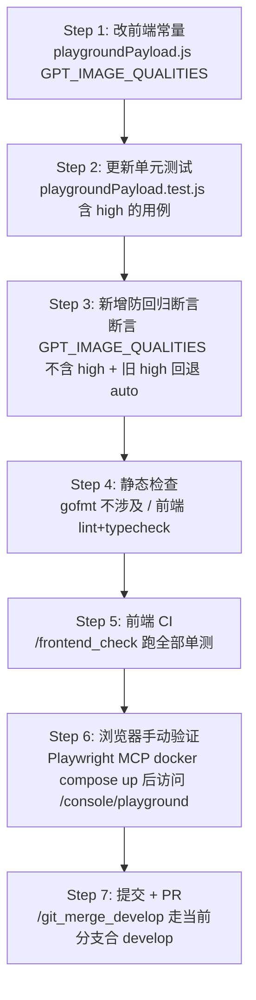

# 删除操练场图像质量下拉菜单的选项「高」

## 0. 背景与决策摘要

操练场（Playground）目前对 `gpt-image-*` 系列模型的图像生成功能（文生图 `/v1/images/generations`、图生图 `/v1/images/edits`）暴露的图像质量下拉菜单包含 4 个选项：`auto / low / medium / high`。需要删除 `high`，仅保留 `auto / low / medium`，对应中文标签 `自动 / 低 / 中`。

经与需求方确认的关键决策：

| 决策点 | 选择 | 说明 |
| --- | --- | --- |
| 影响范围 | 仅 `GPT_IMAGE_QUALITIES` | 影响前端 `isGptImageModel(model)` 按 `prefix:gpt-image-` 命中的全部 `gpt-image-*` 系列；`GENERIC_IMAGE_QUALITIES`（未注册图像模型的兜底列表）保持原样 |
| 后端拦截 | 不改后端 | 仅前端 UI 收敛；走「自定义请求体」可手填的 `high` 由上游决定是否拒绝 |
| 验证方式 | 单元测试 + Playwright MCP 手动验证 | 不固化 Playwright spec；先确保不挂、再目测下拉项 |
| 数据迁移 | 不主动迁移本地已存的 `prompt_quality='high'` | 遵循 CLAUDE.md「No backward compatibility」；交由 `normalizeSelectValue` + `sanitizeImageQuality` 自动回退为空 / `auto`，并用单测锁住旧值回退行为 |

## 1. 实施顺序流程图



顺序原则：单点变更 → 测试同步 → 静态校验 → 自动化校验 → 真实浏览器观察 → 提交。每一步可独立验证，失败可回退。

## 2. 影响面盘点（精确到文件 + 行号）

### 2.1 必须修改

| 文件 | 位置 | 改动 |
| --- | --- | --- |
| `web/src/helpers/playgroundPayload.js` | `:79` | `GPT_IMAGE_QUALITIES` 数组删除 `'high'`，从 `['auto', 'low', 'medium', 'high']` 改为 `['auto', 'low', 'medium']` |
| `web/src/helpers/playgroundPayload.test.js` | `:581`（`buildImageEditPayload for gpt-image-2 strips legacy fields`） | 测试输入 `prompt_quality: 'high'` 改为合法值 `'medium'`，避免读者误解 high 是合法输入；该测试本身不对 quality 值断言，行为不变 |
| `web/src/helpers/playgroundPayload.test.js` | 现有 `getImageQualityOptionsForModel` 测试附近新增 `test` | 显式断言 `gpt-image-1`、`gpt-image-2`、`gpt-image-1-mini` 这类 `gpt-image-*` 返回 `['auto', 'low', 'medium']`，不含 `'high'` |
| `web/src/helpers/playgroundPayload.test.js` | 现有 `buildImageGenerationPayload` / `buildImageEditPayload` 测试附近新增 `test` | 显式断言本地旧值 `prompt_quality: 'high'` 在文生图与图生图 payload 中都会被 `sanitizeImageQuality` 回退为 `auto`，避免删除 UI 选项后仍向上游提交旧值 |

### 2.2 不改但需说明

| 文件 / 位置 | 不改的原因 |
| --- | --- |
| `web/src/helpers/playgroundPayload.js:81-88` `GENERIC_IMAGE_QUALITIES` | 决策为「仅限 gpt-image-*」，兜底列表不动 |
| `web/src/components/playground/ImageParameterControl.jsx:36` `labelByValue['high']='高'` | `GENERIC_IMAGE_QUALITIES` 仍引用，标签不能删；保留无副作用 |
| `web/src/i18n/locales/*.json` 中的 `"高"` 条目 | 同上，仍被 GENERIC 列表使用 |
| `controller/user.go:580` `PlaygroundImageParameter` | 后端只下发 `Quality: bool`，不下发选项列表，无需改动 |
| `relay/channel/openai/*` | 不引入后端白名单（决策） |
| `web/src/components/playground/configStorage.js` | 持久化逻辑只存 `prompt_quality` 字符串，正常 sanitize 路径会兜住非法值，不主动迁移 |

### 2.3 副作用确认

- **本地已存 `prompt_quality='high'` 的用户**：下次进入操练场时，`normalizeSelectValue(value, qualityOptions)` 发现 `'high'` 不在新 options 内，会把下拉显示成「空」。用户提交时 `sanitizeImageQuality` 会走 `if (isGptImageModel) return 'auto'` 兜底，最终上游收到 `quality=auto`。**符合预期，无须额外代码处理，但必须新增文生图 + 图生图单测覆盖这个回退。**
- **自定义请求体（CustomRequestEditor）**：该路径绕过下拉，直接把 JSON body 透传给后端。`high` 仍可手填提交。决策为不在后端拦截，**符合预期**。
- **gemini_native 模式**：质量下拉走 `GEMINI_NATIVE_IMAGE_SIZES`，与本次修改无关。
- **DALL·E 系列**：质量列表是 `standard / hd` 或空，本来就不含 `high`，无影响。

## 3. 详细步骤

### Step 1 ── 修改前端常量（单文件单次完整变更）

文件：`web/src/helpers/playgroundPayload.js`

```diff
-const GPT_IMAGE_QUALITIES = ['auto', 'low', 'medium', 'high'];
+const GPT_IMAGE_QUALITIES = ['auto', 'low', 'medium'];
```

完成判据：
- 文件保持 < 500 行（删除一个数组元素，行数减少）
- 无新增 import，无新增分支逻辑
- 不动 `sanitizeImageQuality` 的默认值（仍为 `'auto'`），自然向后兼容旧本地配置

Done
执行摘要：已将 `web/src/helpers/playgroundPayload.js` 的 `GPT_IMAGE_QUALITIES` 从 `auto / low / medium / high` 收敛为 `auto / low / medium`。
验证摘要：未新增 import 或分支逻辑，`sanitizeImageQuality` 的 `gpt-image-*` 非法值兜底仍保持为 `auto`。

### Step 2 ── 更新含 `'high'` 的测试输入

文件：`web/src/helpers/playgroundPayload.test.js`

```diff
       model: 'gpt-image-2',
       prompt_size: 'auto',
-      prompt_quality: 'high',
+      prompt_quality: 'medium',
       prompt_response_format: 'url',
```

完成判据：
- 该测试主断言（剥离 `legacyReferenceUsageField` / `response_format`）行为不变
- 文件不引入对 `quality` 值的反向断言（留给 Step 3）

Done
执行摘要：已将 `buildImageEditPayload for gpt-image-2 strips legacy fields` 用例输入中的 `prompt_quality: 'high'` 改为 `medium`。
验证摘要：该用例仍只覆盖 legacy 字段和 `response_format` 剥离逻辑，未在 Step 2 引入质量值断言。

### Step 3 ── 新增防回归单测

在 `web/src/helpers/playgroundPayload.test.js` 现有 `getImageQualityOptionsForModel` 测试附近追加：

```javascript
test('getImageQualityOptionsForModel drops high for gpt-image series', () => {
  const imageParameters = {
    size: true,
    quality: true,
    response_format: false,
    n_max: 10,
    supports_edits: true,
  };
  expect(
    getImageQualityOptionsForModel('gpt-image-2', imageParameters, 'gpt_image_v2'),
  ).toEqual(['auto', 'low', 'medium']);
  expect(
    getImageQualityOptionsForModel('gpt-image-1', imageParameters, 'gpt_image_v1'),
  ).toEqual(['auto', 'low', 'medium']);
  expect(
    getImageQualityOptionsForModel('gpt-image-1-mini', imageParameters, 'gpt_image_v1'),
  ).toEqual(['auto', 'low', 'medium']);
});
```

在现有 `buildImageGenerationPayload` / `buildImageEditPayload` 测试附近追加旧配置回退测试：

```javascript
test('legacy high quality falls back to auto for gpt-image series', () => {
  const imageParameters = {
    size: true,
    quality: true,
    response_format: false,
    n_max: 10,
    supports_edits: true,
  };
  const messages = [
    {
      role: MESSAGE_ROLES.USER,
      content: 'draw a clean product photo',
    },
  ];

  const generationPayload = buildImageGenerationPayload(messages, {
    ...baseInputs,
    model: 'gpt-image-2',
    prompt_quality: 'high',
    imageParameters,
  });
  expect(generationPayload.quality).toBe('auto');

  const file = new File(['image bytes'], 'reference.png', {
    type: 'image/png',
  });
  const editPayload = buildImageEditPayload(messages, {
    ...baseInputs,
    model: 'gpt-image-2',
    prompt_quality: 'high',
    image_reference_files: [file],
    imageParameters,
  });
  expect(editPayload.formData.get('quality')).toBe('auto');
  expect(editPayload.debugSnapshot.fields.quality).toBe('auto');
});
```

完成判据：
- 选项测试覆盖 `gpt-image-1`、`gpt-image-2`、`gpt-image-1-mini`，验证按 `prefix:gpt-image-` 命中的系列模型都不再包含 `high`
- 旧配置回退测试同时覆盖文生图 JSON payload 与图生图 multipart payload，验证 `prompt_quality='high'` 最终发送 `auto`
- 数组顺序写死，防止未来误改顺序
- 不引入对 GENERIC 列表的反向断言（避免越权约束）

Done
执行摘要：已新增 `gpt-image-1`、`gpt-image-2`、`gpt-image-1-mini` 的质量选项防回归单测，固定返回顺序为 `auto / low / medium`。
验证摘要：已新增旧配置 `prompt_quality='high'` 回退单测，同时覆盖文生图 JSON payload 与图生图 multipart FormData/debugSnapshot。

### Step 4 ── 静态检查

执行：
```bash
cd web
bun run lint           # 若项目无 lint，则跳过；以 package.json 实际脚本为准
```

完成判据：无新增告警。如果 lint 不存在，跳过本步。

Done
执行摘要：已在 `web/` 下执行 `bun run lint`，项目存在该脚本，本步未跳过。
验证摘要：Prettier 检查通过，未产生新增格式告警。

### Step 5 ── 前端本地 CI

执行 slash command：
```
/frontend_check
```

完成判据：
- 单元测试全部通过，包括 `playgroundPayload.test.js` 中既有用例与 Step 3 新增用例
- 构建（如 `bun run build`）通过

Done
执行摘要：已按 `/frontend_check` 定义执行 `make check-frontend`，依次通过依赖安装、Prettier、ESLint、i18n lint、Bun 前端单测与 Vite 生产构建。
验证摘要：最终复跑结果为 Bun 单测 96 pass / 0 fail，新增的 quality options 与 legacy high 回退用例均通过；`web/dist/index.html` 已生成。

### Step 6 ── 浏览器手动验证（Playwright MCP）

前置：本地启动服务，并按 CLAUDE.md Rule 8 在 Compose 服务环境里注入 `GLOBAL_WEB_RATE_LIMIT_ENABLE=false`。不能只在 `docker compose up` 前加 shell 环境变量，除非 `docker-compose.yml` 已显式转发该变量；推荐使用 E2E 专用 compose override 或临时 override 文件。

示例 override（服务名以本地 `docker-compose.yml` 为准）：

```yaml
services:
  new-api:
    environment:
      GLOBAL_WEB_RATE_LIMIT_ENABLE: "false"
```

```bash
docker compose -f docker-compose.yml -f docker-compose.e2e.override.yml up -d --build
curl -fsS http://127.0.0.1:9991/api/status
```

验证步骤（用 Playwright MCP 真实浏览器）：

1. 登录管理员账号，进入 `/console/playground`。
2. 选择模型 `gpt-image-2`（若未配置渠道，临时新建一个指向 mock upstream 的渠道或跳过这步用 `gpt-image-1`）。
3. 切到「文生图」单选，展开「图像质量」下拉：**断言只看到「自动 / 低 / 中」三项，不出现「高」**。
4. 切到「图生图」单选，再次展开「图像质量」下拉：**断言同上**。
5. 取一项截图存入 `test-results/playground-image-quality/`（如使用 MCP）。
6. 在浏览器 DevTools Console 执行：
   ```javascript
   document.querySelectorAll('.semi-select-option').forEach(el => console.log(el.textContent));
   ```
   确认 DOM 中不再渲染「高」节点。

完成判据：两种请求模式下下拉项数量为 3，文案与中文翻译一致。

Done
执行摘要：已用项目 `web/playwright.config.ts` 的 Playwright Chromium 真实浏览器验证 `/console/playground`，Compose 容器环境确认包含 `GLOBAL_WEB_RATE_LIMIT_ENABLE=false`、`GLOBAL_API_RATE_LIMIT=1000`、`CRITICAL_RATE_LIMIT=1000`。
验证摘要：最终复跑确认 `gpt-image-2` 文生图与图生图两种模式下 `.semi-select-option` 均为 `自动 / 低 / 中`；同时修复并通过既有 `gpt-image-2/edits.spec.ts`，截图已保存到 `test-results/playground-image-quality/`。

### Step 7 ── 提交与 PR

当前分支：`fix/playground-image-quality-options`，上游追踪 `origin/develop`（建分支时 git 自动设置）。

⚠️ 第一次推送前要决定是推到新远程分支还是覆盖 `develop`。CLAUDE.md 工作流明确「以 PR 形式合入 develop」，**严禁直接 push 到 develop**。先解绑 / 显式指定：

```bash
git branch --unset-upstream
git push -u origin fix/playground-image-quality-options
```

执行 slash command：
```
/git_merge_develop
```

该 skill 会自动：
- 校验工作树状态
- 推送当前分支
- 创建 PR 到 `develop`
- 监控 CI 并处理 anti-slop PR 模板校验
- 合并后清理本地分支

PR 描述要点：
- 标题：`fix(playground): drop high quality option from gpt-image-* dropdown`
- 正文需说明：影响范围限定前端 `gpt-image-*` 系列质量选项；GENERIC 兜底列表保留；不修改后端
- 测试：列出选项防回归单测、旧 `high` 回退 `auto` 单测与 MCP 手动验证截图

## 4. 风险与回滚

| 风险 | 等级 | 处置 |
| --- | --- | --- |
| 用户已保存 `prompt_quality='high'`，下次打开下拉显示为空 | 低 | `sanitizeImageQuality` 兜底为 `auto`；用户重新选择即可。不引入迁移代码，但必须有文生图 + 图生图单测保护 |
| 自定义请求体仍允许 `high` 提交 | 中 | 决策明确不拦截。如未来用户反馈错误率高，再追加后端白名单 PR |
| 上游 `gpt-image-2` 实际仍接受 `high` 而用户被剥夺该能力 | 中 | 若需求方反悔，回滚极简：单行 commit revert |
| GENERIC 路径仍显示 `high` 引起一致性疑问 | 低 | 由本次决策接受。如要全局收敛，开新 PR |

回滚方式：本次改动覆盖 1 个生产文件 + 1 个测试文件，`git revert <commit>` 即可彻底回退。

## 5. 验收清单

实施完成前逐项核对：

- [x] `GPT_IMAGE_QUALITIES` 数组长度从 4 变为 3，无 `'high'`
- [x] `playgroundPayload.test.js` 中既有「`prompt_quality: 'high'`」测试输入已替换为合法值
- [x] 新增防回归单测断言 `gpt-image-1` / `gpt-image-2` / `gpt-image-1-mini` 的 quality options
- [x] 新增文生图 + 图生图单测断言旧 `prompt_quality='high'` 回退为 `auto`
- [x] `/frontend_check` 全部通过
- [x] 浏览器 MCP 前置 Compose 服务环境已注入 `GLOBAL_WEB_RATE_LIMIT_ENABLE=false`
- [x] 浏览器 MCP 在文生图、图生图两种模式下分别确认下拉为 `自动 / 低 / 中`
- [x] 未修改任何后端 Go 文件
- [x] 未修改 `GENERIC_IMAGE_QUALITIES`、`labelByValue`、i18n 文件
- [ ] PR 标题、正文、测试说明完整（按用户要求跳过 Step 7，由用户自行提交 PR）
- [ ] CI 通过后合入 develop（按用户要求跳过 Step 7，由用户自行处理）

## 6. 后续可选项（本次不做）

- 若需要后端硬拦截 `high`，新开 issue 评估 `relay/channel/openai/adaptor.go` 的请求清洗钩子位置
- 若需将 quality 列表完全后端化（按模型动态下发），开新 issue 设计 `PlaygroundImageParameter` 的扩展字段 `QualityOptions []string`，让前端不再硬编码

## 7. 实施记录（执行时填写）

- 开始时间：2026-05-22 19:28 CST
- 提交 hash：未提交（按用户要求跳过 Step 7）
- PR 链接：未创建（按用户要求跳过 Step 7）
- 关键截图：`test-results/playground-image-quality/gpt-image-2-generation-quality.png`；`test-results/playground-image-quality/gpt-image-2-edit-quality.png`
- 实际偏离计划之处：为避免既有 E2E 继续断言已删除的「高」选项，已同步 `scripts/e2e/gpt-image-2/edits.spec.ts` 为 `medium / 中`；同时修复 E2E fixture 在本地多行 JSON option 与非 default 用户分组配置下误走真实渠道的问题。
