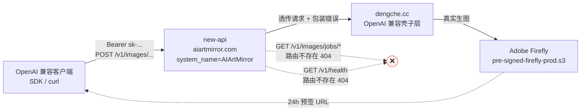

# AIArtMirror 接口回归测试结论

**测试时间**：2026-04-29
**被测站点**：`https://www.aiartmirror.com/`（new-api，system_name = AIArtMirror）
**测试 Token**：`sk-fgeb...SIph`（仅用于本次测试）
**对照文档**：`https://img.dengche.cc/api.md`（dengche.cc · GPT Image 2 API 文档 v2026-04-24）
**测试目标**：验证 dengche 文档里"全部接口与字段"在你的 new-api 站上是否仍然适用

---

## 1. 一句话结论

**dengche 文档只有 OpenAI 标准协议子集（§3 / §4）能在你这站上原样跑通**。私有扩展中 `aspect_ratio` 与 multipart `reference_usage` 透传成功，**但异步模式（§5）整条链路断裂且会扣钱**，健康检查（§6）与模型别名（§2）全部失效，错误响应字段（§3）语义不一致。客户端不能照搬 dengche 文档对接。

---

## 2. 实测拓扑



**链路真身**：客户端 → new-api → dengche → Adobe Firefly。返回的预签 URL 直指 `pre-signed-firefly-prod.s3-accelerate.amazonaws.com`，证明真实生图模型是 Adobe Firefly，不是 OpenAI 的 gpt-image。

---

## 3. 文档逐条对照表

| 文档章节 | 文档承诺 | 你这站实际 | 兼容? |
|---|---|---|:---:|
| §1 Base URL | `https://api.img.dengche.cc/v1` | `https://www.aiartmirror.com/v1` | ✅ 改 host |
| §1 鉴权 | `Authorization: Bearer <TOKEN>` | 一致 | ✅ |
| §2 模型别名 `gpt-image-1` / `dall-e-3` / `dall-e-2` | 全部映射到 `gpt-image-2` | **全部 503 model_not_found**，`/v1/models` 只暴露 `gpt-image-2` | ❌ |
| §3 generations 主流程 | POST + 标准字段返 200 | HTTP 200，1024×1024 PNG，21s，顶层多 `account` 字段 | ✅ |
| §3 size: `1024x1536` / `1536x1024` | 支持 | 实测像素一致 | ✅ |
| §3 quality | `low/medium/high/auto` | 仅测 `low` 通过 | ✅（部分） |
| §3 `response_format=url` | 预签 URL，1h 有效 | 返 Firefly S3 URL，**有效期 24h** | ✅（更长） |
| §3 默认返 `b64_json` | OpenAI SDK 默认路径 | 一致 | ✅ |
| §3 接受但忽略字段 | `output_format` / `output_compression` / `moderation` / `user` | 未单独验，dengche 透传不报错 | ⚠️ 推断 |
| §3 扩展 `aspect_ratio` | 优先级高于 size | `wide` 透传成功，实测返 1839×855 | ✅ |
| §3 扩展 `style` | 风格预设 | 未实测 | ⚠️ 未验 |
| §3 错误 `code` 字段 | `invalid_key` / `missing_prompt` / `unknown_model` / `bad_size` 等 | 顶层 `code` 是 new-api 自己的（`""` / `bad_response_status_code` / `model_not_found`），dengche 错误码字符串只**嵌在 `error.message`** 里 | ❌ |
| §3 unknown_model 状态码 | HTTP 400 | 实际 **HTTP 503**（无可用 channel） | ❌ |
| §4 edits 参考图编辑 | multipart + image | HTTP 200，32s，1024×1024，顶层多 `reference_blobs` 字段 | ✅ |
| §4 `reference_usage` | `subject` / `composition` / `style` | 接受不报错 | ✅ 推断 |
| §4 `mask` 字段 | 接受但忽略 | 未实测 | ⚠️ 推断 |
| §5 异步 `background:true` 提交 | 立即返 `image.job` 对象 | HTTP 200，0.8s，job 对象字段完整 | ✅ |
| §5 `GET /v1/images/jobs/{id}` 轮询 | 返 status / result | **HTTP 404 Invalid URL** | ❌❌❌ |
| §5 异步扣费 | 文档承诺"失败不扣" | **提交即扣 1 积分，永远拿不到结果** | ❌ 损失 |
| §6 `GET /v1/health` | 返 `{status, accounts_active, total_credits}` | **HTTP 404 Invalid URL** | ❌ |
| §7 LiteLLM / new-api / one-api 配置 | 配置示例 | 你站本身就是 new-api，无需配置 | n/a |
| §9 失败不扣积分 | 全局承诺 | generations / edits 失败不扣 ✅，**`background:true` 是反例** | ⚠️ |

---

## 4. 错误响应实测对比（重要）

dengche 文档承诺的错误格式：
```json
{ "detail": "[<status> <code>] <message>" }
```

new-api 实际返回：
```json
{ "error": { "message": "...", "type": "...", "param": "", "code": "..." } }
```

| 错误场景 | 文档 HTTP / code | 实际 HTTP | 实际 `error.code` | `error.message` 关键文本 |
|---|---|---|---|---|
| 401 错 token | 401 / `invalid_key` | 401 | `""` | `Invalid token (request id: ...)` |
| 缺 prompt | 400 / `missing_prompt` | 400 | `bad_response_status_code` | `[400 poll_failed] ... Invalid 'prompt': empty string` |
| 模型不存在 | 400 / `unknown_model` | **503** | `model_not_found` | `No available channel for model ...` |
| size 不合规 | 422 / `bad_size` | 422 | `bad_response_status_code` | `[422 bad_size] dimensions must be multiples of 16 ...` |
| JSON 不合法 | 400 / `bad_body` | 400 | `""` | `Invalid request: invalid character 'n' ...` |

**结论**：
- HTTP 状态码大部分对得上（除了 unknown_model：400 → 503）
- 顶层 `code` 字段**完全不能用做错误判断**，dengche 的 code 只剩字符串嵌在 message 里
- 客户端要做错误处理，请用 `(HTTP 状态码 + error.message 关键词)` 双维度匹配

---

## 5. 关键风险（按优先级）

### 🚨 P0：`background:true` 是金钱黑洞
- 提交端 200 OK，但 `GET /v1/images/jobs/{id}` 在 new-api 路由表里不存在，永远返 404
- 提交瞬间扣 1 积分（实测余额 2361 → 2360），结果永远拉不回来
- **生产必须做的事**：客户端 SDK 层硬禁掉 `background` 参数，或在 new-api 后台 channel 级别配请求字段过滤

### 🚨 P0：错误码语义不兼容
- dengche 文档的 `error.code == "invalid_key"` / `"unknown_model"` 等判断在 new-api 上**全部失效**
- 已有客户端如果按文档写了类似断言，要么完全收不到对应错误码，要么状态码也不一样
- **必须改造**：所有客户端的错误分支处理要重写

### ⚠️ P1：unknown model 返 503 而非 400
- 客户端如果有"5xx 自动重试"策略，撞上模型名错误会无限重试
- **建议**：明确把 503 + `code == "model_not_found"` 放进不可重试白名单

### ⚠️ P1：模型别名全失效
- `gpt-image-1`（OpenAI SDK 文档里的官方推荐名）、`dall-e-3`、`dall-e-2` 全部 503
- 你的 channel 只暴露了原生名 `gpt-image-2`
- **建议**：到 new-api 后台 → 渠道 → 模型映射，加上 `gpt-image-1 → gpt-image-2` 等别名，让标准 OpenAI SDK 用户开箱即用

### ℹ️ P2：真身是 Adobe Firefly
- 影响 prompt 风格选择（Firefly 的审核/偏好与 OpenAI gpt-image 不一致）
- 影响合规与版权说明
- **建议**：对外 README / 服务说明里如实标注上游

---

## 6. 给下游用户的最小可用样板

```python
from openai import OpenAI
import base64

client = OpenAI(
    base_url="https://www.aiartmirror.com/v1",
    api_key="sk-...",
    timeout=120.0,
)

resp = client.images.generate(
    model="gpt-image-2",          # 必须用这个，别用 gpt-image-1
    prompt="a cat sitting on a windowsill at golden hour",
    n=1,
    size="1024x1024",             # 或 1024x1536 / 1536x1024
    quality="low",                # low/medium/high/auto，省积分用 low
    # 不要传 background=True / extra_body={"background": True}
    # 不要依赖 error.code 字段做错误判断
)

png = base64.b64decode(resp.data[0].b64_json)
open("out.png", "wb").write(png)
```

**扩展能力**（仅在客户端能容忍非标准字段时使用）：
```python
resp = client.images.generate(
    model="gpt-image-2",
    prompt="...",
    extra_body={"aspect_ratio": "wide"},   # 实测返 1839×855
)
```

---

## 7. 测试消耗

| 项 | 数 |
|---|---|
| 总扣积分 | **7** |
| 明细 | T-CORE 1 + response_format=url 1 + size 矩阵 2 + aspect_ratio 1 + background 1（损失，未拿到结果）+ edits 1 |
| 别名失败（未扣） | 3 |
| 错误路径探测（未扣） | 5 |
| 余额变化 | 2366 → **2359** |

---

## 8. 行动建议

| 优先级 | 行动 | 谁做 |
|:---:|---|---|
| P0 | 客户端 SDK / 文档明确禁用 `background` 字段 | 你 |
| P0 | 改写对外 API 文档，删除 §5、§6、§2 别名表，标注错误响应实际格式 | 你 |
| P1 | 在 new-api 后台 channel 上加模型别名映射 `gpt-image-1` → `gpt-image-2` | 你 |
| P1 | 客户端错误处理改为 `(http_status, error.message 关键词)` 双维度匹配 | 下游接入方 |
| P2 | README / 服务说明标注真实上游为 Adobe Firefly | 你 |
| P2 | 补测 `quality=high`、`style`、`mask`、被忽略字段透传 | 后续 |

---

## 9. 原始数据落盘清单

| 文件 | 内容 |
|---|---|
| `/tmp/dengche_api.md` | dengche 原始 API 文档（11.7 KB） |
| `/tmp/aam_root.html` | 你站首页快照 |
| `/tmp/aam_T_CORE.json` | 核心生图响应 |
| `/tmp/aam_core.png` | 核心生图 PNG（1024×1024，1.2 MB） |
| `/tmp/aam_alias_{gpt-image-1,dall-e-3,dall-e-2}.json` | 别名 503 响应 |
| `/tmp/aam_url.json` | response_format=url 响应 |
| `/tmp/aam_size_{1024x1536,1536x1024}.json` | size 矩阵响应 |
| `/tmp/aam_ar_wide.json` | aspect_ratio=wide 响应（1839×855） |
| `/tmp/aam_bg.json` | background=true 提交响应（job 对象） |
| `/tmp/aam_bg_job.json` | jobs 轮询的 404 响应 |
| `/tmp/aam_edit.json` | edits 响应 |
