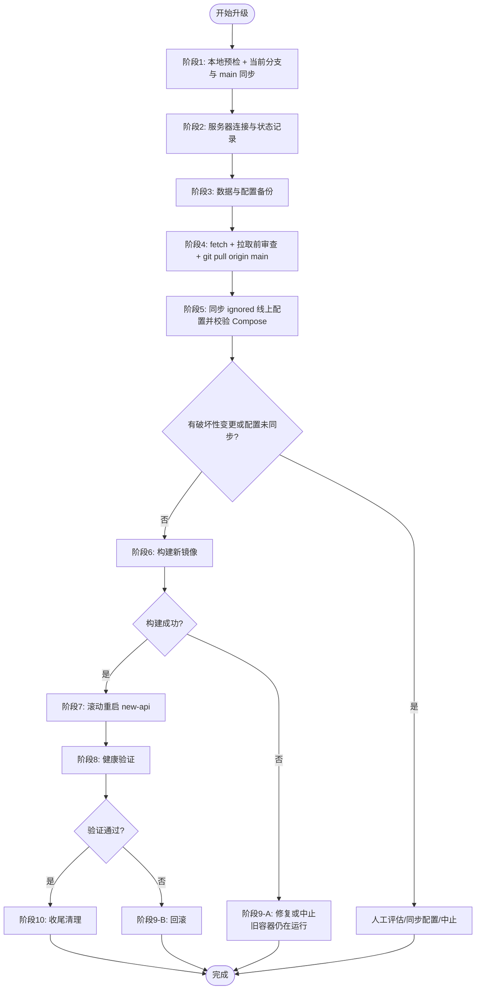

# 升级远程服务器上的项目版本

> 适用对象：通过 `docker compose` 在单台服务器上运行的 new-api 实例
> 目标服务器：`root@45.58.165.180`
> 项目路径（服务器上）：以下命令默认服务器上的仓库路径与本地相同结构，请按实际替换 `/path/to/new-api`
>
> **分支约定（重要）**：
> - **本地工作分支**：不固定，可能是 `feature/playground`、`develop`、某个 hotfix 分支，或直接就是 `main`
> - **服务器部署分支**：`main`（线上仓库 checkout 在这个分支，不变）
> - **核心流程**：每次升级前先检查本地"当前分支"与 `main` 的领先/落后关系，把领先的 commit 合并到 `main` 并推送到 origin，然后服务器再 `git pull origin main`
> - 这个文档不假设你在哪个分支，命令里用 `$CURRENT_BRANCH` 表示"你此刻 checkout 的那个分支"

---

## 一、设计原则

1. **数据先于代码**：PostgreSQL 是状态核心，任何代码切换前必须先做物理备份。GORM `AutoMigrate` 一旦把新 schema 写入数据库，旧版本代码可能读不了，**没有备份就没有真正的回滚**。
2. **零停机优先**：用 `build` + `up -d <service>` 两步替代 `up -d --build`。构建期间旧容器继续提供服务，构建失败时旧容器不受影响。
3. **不动 `down`**：滚动更新只重建 `new-api` 服务容器，`postgres` / `redis` 容器保持运行。坚决不用 `docker compose down`，更不用 `down -v`。
4. **变更可审查**：拉代码前先 `fetch + log + diff`，重点审查 `Dockerfile`、`docker-compose.example.yml`、`.env.example`、`go.mod`、`model/main.go`（迁移逻辑入口）、`web/package.json`、`VERSION`。
5. **可回滚**：升级前必须记录当前运行的 commit hash 和 docker-compose 文件副本，以便随时回到原状态。
6. **配置不入仓**：`docker-compose.yml` 被 `.gitignore` 忽略，是服务器本地真实配置文件，不会随 `git pull` 更新，也不应依赖 `git stash` 管理。模板 `docker-compose.example.yml` 如有必需配置变化，需要手动同步到服务器真实 `docker-compose.yml`。
7. **本地分支 ≠ 部署分支**：服务器只跟踪 `main`。无论你在哪个本地分支开发，"代码已推到 GitHub" ≠ "已经在 origin/main 上"。升级前必须先比对当前分支与 main 的领先关系，把超前 commit 合到 main 并推送，部署链路才打通。

---

## 二、流程总览



---

## 三、阶段一：本地预检与当前分支同步到 main（在本地仓库执行）

> **核心目标**：让 `origin/main` 包含本次想发布的所有变更。服务器只跟踪 main，所以"把当前分支领先 main 的 commit 合到 main 并推送"是部署链路的接通动作。
>
> 这一阶段不假设你在哪个分支 —— 流程会先检测当前分支与 main 的关系，再按情况分流。

### 1.1 识别当前分支与状态

```bash
cd /Users/wanghejie/workspace/new-api

# 1. 记录当前分支名（后续命令引用）
CURRENT_BRANCH=$(git branch --show-current)
echo "当前分支：$CURRENT_BRANCH"

# 2. 工作树必须干净
git status                     # 应显示 nothing to commit, working tree clean

# 3. 拉取远端引用
git fetch origin

# 4. 当前分支已推送到 origin（无输出代表已同步；origin 上没有同名分支也无输出）
git log origin/$CURRENT_BRANCH..$CURRENT_BRANCH --oneline 2>/dev/null
```

### 1.2 判断当前分支与 main 的领先/落后关系

```bash
# 当前分支领先 origin/main 的提交数（部署所需的代码差异）
AHEAD=$(git rev-list --count origin/main..$CURRENT_BRANCH)

# origin/main 领先当前分支的提交数（main 上有当前分支没拿到的提交）
BEHIND=$(git rev-list --count $CURRENT_BRANCH..origin/main)

echo "当前分支领先 main：$AHEAD 个 commit"
echo "main 领先当前分支：$BEHIND 个 commit"

# 直观查看领先 main 的提交内容
git log --oneline origin/main..$CURRENT_BRANCH
```

根据 `AHEAD` / `BEHIND` 的值进入对应分支：

| AHEAD | BEHIND | 含义 | 处理路径 |
|-------|--------|------|----------|
| `0` | `0` | 当前分支与 main 完全一致 | **跳过 1.3，直接进入阶段二**（无新代码可发，确认是否真的需要升级） |
| `>0` | `0` | 当前分支单纯领先 main，可 fast-forward 合并 | **走 1.3 路径 A 或 B** |
| `0` | `>0` | main 已被推进、当前分支没有新 commit | **不该升级**：先 `git pull --ff-only origin main` 同步本地，再确认是否真的有变更要发 |
| `>0` | `>0` | 双向分歧 | **先解决分歧**：在当前分支上 `git rebase origin/main`（或 `git merge origin/main`），处理冲突后回到 1.2 重测 |

> **特例**：如果 `CURRENT_BRANCH == main`，那么 `AHEAD` 表示本地 main 领先 origin/main 的提交数。此时只需要 `git push origin main`，跳过 1.3 的合并步骤。

### 1.3 把当前分支合并到 main 并推送（仅在 AHEAD>0 且 BEHIND=0 时执行）

提供两条路径，**任选其一**：

#### 路径 A：通过 GitHub PR 合并（推荐，留下审查记录）

1. 在 GitHub 上发起 PR：`$CURRENT_BRANCH` → `main`
2. 在网页上完成 merge（推荐 "Create a merge commit" 或 "Squash and merge"）
3. 本地同步 main：
   ```bash
   git checkout main
   git pull --ff-only origin main
   git rev-parse main           # 记录目标 commit hash
   git checkout $CURRENT_BRANCH # 切回工作分支
   ```

#### 路径 B：本地直接合并（最快，但跳过 review）

```bash
# 切到 main 并拉最新
git checkout main
git pull --ff-only origin main

# fast-forward 合并（前提：1.2 已确认 BEHIND=0）
git merge --ff-only $CURRENT_BRANCH

# 或：保留分支历史的 merge commit（可选）
# git merge --no-ff $CURRENT_BRANCH -m "merge $CURRENT_BRANCH for deploy"

# 推到远程
git push origin main

# 记录目标 commit hash
git rev-parse main

# 切回日常工作分支，避免误操作 main
git checkout $CURRENT_BRANCH
```

### 1.4 双向核对

```bash
# 重新拉取远端引用
git fetch origin

# origin/main 的 HEAD 应该是阶段 1.3 推送后的 commit
git log -1 origin/main --pretty=oneline

# 与本地 main 比对（应一致）
git log -1 main --pretty=oneline
```

**通过条件**：
- `git status` clean
- `origin/main` 的 HEAD = 本次升级的目标 commit
- 已记录目标 commit hash（用于阶段四核对服务器是否拉到同一个版本）

---

## 四、阶段二：服务器连接与状态记录

目标：登录服务器，确认当前运行版本，建立"原始状态快照"。

```bash
# 1. 登录
ssh root@45.58.165.180

# 2. 进入项目目录
cd /path/to/new-api

# 3. 确认当前在 main 分支（部署分支必须是 main）
git branch --show-current      # 必须输出 main，否则停止操作并排查

# 4. 记录当前部署的 commit（关键：这是回滚锚点）
git rev-parse HEAD | tee /tmp/new-api-rollback-commit.txt
git log -1 --pretty=fuller

# 5. 查看运行中的容器与镜像 ID
docker compose ps
docker images new-api:local
```

**记录到运维笔记的内容**：
- 当前 commit hash（回滚目标）
- 当前 image ID（用于必要时直接回滚到旧镜像）
- 确认分支为 main

---

## 五、阶段三：数据与配置备份（不可跳过）

目标：在任何变更前，做出可独立恢复的全量备份。

```bash
# 0. 创建备份目录（按时间戳）
BACKUP_DIR=/root/backups/new-api/$(date +%Y%m%d_%H%M%S)
mkdir -p "$BACKUP_DIR"
echo "备份目录：$BACKUP_DIR"

# 1. PostgreSQL 物理备份（最重要）
docker compose exec -T postgres pg_dump -U root -Fc new-api > "$BACKUP_DIR/new-api.dump"
ls -lh "$BACKUP_DIR/new-api.dump"   # 至少应该有数 MB
cat "$BACKUP_DIR/new-api.dump" | docker compose exec -T postgres pg_restore -l >/dev/null

# 2. 备份 docker-compose.yml（ignored 线上真实配置，不随 git pull 更新）
test -f docker-compose.yml
cp docker-compose.yml "$BACKUP_DIR/docker-compose.yml"

# 3. 备份 .env（如果存在）
[ -f .env ] && cp .env "$BACKUP_DIR/.env"

# 4. 备份 bind mount 数据（data/ 存放 SQLite 默认库、密钥等；logs/ 是日志）
tar --exclude='*.log' -czf "$BACKUP_DIR/data.tar.gz" data/
tar -czf "$BACKUP_DIR/logs.tar.gz" logs/  # 仅当需要保留旧日志

# 5. 记录当前镜像（保留一份旧镜像 tar，作为最快的回滚途径）
docker save new-api:local | gzip > "$BACKUP_DIR/new-api-image.tar.gz"

# 6. 校验备份
ls -lh "$BACKUP_DIR"
```

**通过条件**：
- `new-api.dump` 文件大小合理（不为 0），且 `pg_restore -l` 能正常读取 dump 目录
- `new-api-image.tar.gz` 存在（必要时可 `docker load < ...` 秒回滚）
- `docker-compose.yml` 已备份，它是服务器上的真实 ignored 配置
- 备份目录路径已记录

---

## 六、阶段四：拉取前审查并快进代码

目标：先审查即将部署的变更，确认无破坏性问题后，再让服务器仓库快进到最新 `main`。

```bash
# 1. 检查服务器上有无非 ignored 的本地修改
git status

# 2-A. 如果有非 ignored 改动 —— 不要直接 stash 后丢失，先备份再决定
git diff > "$BACKUP_DIR/server-local-changes.patch"
cat "$BACKUP_DIR/server-local-changes.patch"   # 人工确认是哪些改动

# 把非 ignored 改动暂存，pull 完再按需恢复
git stash push -u -m "pre-upgrade-$(date +%Y%m%d_%H%M%S)"

# 2-B. 如果无改动则跳过 stash

# 3. 抓取远程最新
git fetch origin

# 4. 预览将应用的提交（重点核对：origin/main 的 HEAD 与阶段 1.2 记录的目标 commit 一致）
git log origin/main -1 --pretty=oneline
git log HEAD..origin/main --oneline
git log HEAD..origin/main --stat | head -100

# 5. 拉取前审查关键文件变更
git diff --stat HEAD origin/main -- Dockerfile docker-compose.example.yml go.mod web/package.json VERSION model/ .env.example setting/ common/env.go
git diff HEAD origin/main -- .env.example docker-compose.example.yml

# 6. 快进合并 main（拒绝任何 merge commit；如果 fast-forward 失败说明服务器 main 上有"野生"提交，需人工介入）
git pull --ff-only origin main

# 7. 核对服务器 HEAD 与阶段 1.2 记录的目标 commit 一致
git rev-parse HEAD
```

**通过条件**：
- 当前分支是 `main`
- 已在 `git pull` 前审查 `HEAD..origin/main` 的关键变更
- `git pull --ff-only` 成功
- 服务器 HEAD hash 与本地推送 main 的目标 commit 完全一致

**fast-forward 失败的处理**：说明服务器 main 上有未推回 origin 的提交（极少见但可能，例如曾经在服务器上 hotfix）。
```bash
# 先看是哪些提交
git log origin/main..HEAD --oneline
# 如果是有价值的 hotfix，应先 push 回 origin、合并到本地再重新规划升级
# 如果是无关产物，确认后 git reset --hard origin/main（破坏性操作，慎用）
```

---

## 七、阶段五：同步 ignored 线上配置并决定是否继续

目标：确认新版本模板变化是否需要同步到服务器真实 `docker-compose.yml`，并在构建前再次识别破坏性变更。

> 注意：`docker-compose.yml` 被 `.gitignore` 忽略，是服务器本地真实配置文件，不会随 `git pull` 更新。这里审查的是入库模板 `docker-compose.example.yml` 的变化；如果模板新增了必需环境变量、服务、端口或卷，需要手动同步到服务器上的真实 `docker-compose.yml`。

```bash
# 旧 commit -> 新 commit 的关键文件变更
OLD=$(cat /tmp/new-api-rollback-commit.txt)
NEW=$(git rev-parse HEAD)

# 1. Docker / 部署模板相关
git diff --stat $OLD $NEW -- Dockerfile docker-compose.example.yml
git diff $OLD $NEW -- docker-compose.example.yml .env.example

# 2. 依赖与版本
git diff $OLD $NEW -- go.mod web/package.json VERSION

# 3. 数据库迁移入口与模型层（GORM AutoMigrate 涉及）
git diff --stat $OLD $NEW -- model/

# 4. 环境变量与配置
git diff $OLD $NEW -- .env.example
git diff --stat $OLD $NEW -- setting/ common/env.go

# 5. 确认真实线上配置存在，并校验当前 Compose 配置
test -f docker-compose.yml
docker compose config >/dev/null
```

**审查清单（任一命中需特别评估）**：
- [ ] `Dockerfile` 改了基础镜像或构建参数 → 构建时间会变长
- [ ] `docker-compose.example.yml` 新增必需环境变量、服务、端口、卷或健康检查 → 需手动同步到服务器真实 `docker-compose.yml`
- [ ] `.env.example` 新增**必填**变量 → 必须先在服务器 `.env` 里加上
- [ ] `model/` 大量改动或有新表/字段删除 → AutoMigrate 行为重点验证
- [ ] `go.mod` 升级了主版本依赖 → 关注启动日志
- [ ] `VERSION` 文件变化 → 这是会嵌入二进制的版本号

如果发现破坏性变更（例如删字段、改字段类型），**停止升级**，先在测试环境演练。如果 `docker-compose.example.yml` 或 `.env.example` 有必须同步的配置变化，先人工更新真实 `docker-compose.yml` / `.env`，并重新执行 `docker compose config >/dev/null`。

---

## 八、阶段六：构建新镜像（不停服）

目标：在旧容器持续服务的前提下产出新镜像。

```bash
# 1. 如果阶段四 stash 过非 ignored 的本地修改，现在按需恢复
git stash list
# git stash pop   # 谨慎：解决冲突；不要依赖 stash 恢复 docker-compose.yml，它是 ignored 线上配置文件

# 2. 构建前再次校验真实 Compose 配置
test -f docker-compose.yml
docker compose config >/dev/null

# 3. 仅构建 new-api 服务镜像（不会触碰运行中的容器）
docker compose build new-api

# 4. 确认新镜像已生成（CREATED 时间应该是刚刚）
docker images new-api:local
```

**通过条件**：
- `docker compose config >/dev/null` 成功
- 构建无 error 退出
- 新镜像的 CREATED 是刚刚

**构建失败的处理**：保留现状，旧容器仍在跑。修复构建问题或直接 `git reset --hard $OLD` 放弃本次升级，结束。

---

## 九、阶段七：滚动重启 new-api

目标：用最短停机时间替换为新镜像。

```bash
# 1. 仅重建 new-api 容器（postgres/redis 保持运行）
docker compose up -d new-api

# 2. 立即跟随启动日志，重点关注：
#    - GORM 迁移日志（"AutoMigrate", "ALTER TABLE" 等）
#    - 端口监听 :3000
#    - Redis / PostgreSQL 连接成功
docker compose logs -f --tail=200 new-api
# 看到 "server started" 类日志或健康检查通过后 Ctrl+C 退出 logs
```

**预期现象**：
- 旧容器在数秒内被替换
- 新容器进入 `healthy` 状态（`docker compose ps` 显示 healthy 大约 30~60 秒后出现）

---

## 十、阶段八：健康验证

目标：从多个层级验证升级成功。

```bash
# 1. 容器状态
docker compose ps
# 期待 new-api 状态为 "Up X seconds (healthy)"

# 2. 后端健康检查
curl -fsS http://127.0.0.1:9991/api/status | jq .
# 期待 success: true，version 字段是新版本

# 3. 错误日志扫描
docker compose logs --tail=500 new-api | grep -iE "error|panic|failed" | head -30

# 4. 数据库表完整性（可选，看 AutoMigrate 是否创建了预期的表）
docker compose exec -T postgres psql -U root -d new-api -c "\dt"

# 5. 浏览器人工验证（关键路径）
#    - 访问实际公网入口（例如反向代理域名 / HTTPS 域名 / 实际暴露端口）能正常打开
#    - 登录管理后台
#    - 进入：渠道列表、令牌列表、playground、内置文档
#    - 抽样发起一次 chat 请求确认 relay 正常
```

注意：如果 `docker-compose.yml` 使用 `127.0.0.1:9991:3000` 绑定，公网直接访问 `http://45.58.165.180:9991/` 理论上不会通。服务器本机验证用 `http://127.0.0.1:9991`，浏览器验证应使用真实公网入口。

**通过条件**（全部满足才算升级成功）：
- `/api/status` 返回 `success: true`，且 `version` 是新版本
- `docker compose ps` 显示 `healthy`
- 错误日志无新增 panic / fatal
- 关键页面浏览器自测通过

---

## 十一、阶段九：异常处理

### 9-A 构建失败（阶段六）

旧容器仍在跑，影响最小。

```bash
# 选项 1：修复后重试（推荐）
# 选项 2：放弃本次升级
git reset --hard $(cat /tmp/new-api-rollback-commit.txt)
# 不需要 rebuild，旧容器继续服务
```

### 9-B 启动失败或验证不通过（阶段七 / 八）

按"严重程度递增"采取措施：

```bash
# 步骤 1：先看是否只是首启慢，等 60 秒重试健康检查
sleep 60 && curl -fsS http://127.0.0.1:9991/api/status

# 步骤 2：优先加载升级前保存的旧镜像（最快、变量最少）
docker load < "$BACKUP_DIR/new-api-image.tar.gz"
docker compose up -d new-api
docker compose logs -f --tail=200 new-api

# 步骤 3：如果旧镜像也起不来（通常说明 schema 已被新版改过，旧代码不兼容）
#         必须用阶段三的备份恢复数据库
docker compose stop new-api
docker compose exec -T postgres psql -U root -d postgres -c "DROP DATABASE \"new-api\";"
docker compose exec -T postgres psql -U root -d postgres -c "CREATE DATABASE \"new-api\";"
cat "$BACKUP_DIR/new-api.dump" | docker compose exec -T postgres pg_restore -U root -d new-api
docker compose up -d new-api

# 步骤 4：后续整理仓库 HEAD（确认服务已恢复后再做）
OLD=$(cat /tmp/new-api-rollback-commit.txt)
git reset --hard $OLD
```

### 9-C 部分功能异常（验证发现 bug，但服务能跑）

视严重程度选择"立即回滚"或"挂着 + 排查 + 修复后再发版"。优先看 `docker compose logs new-api` 与浏览器 DevTools。

---

## 十二、阶段十：收尾清理

目标：释放磁盘、归档备份信息。

```bash
# 1. 清理悬挂镜像（被新镜像替换下来的旧 layer）
docker image prune -f

# 2. 检查磁盘
df -h /var/lib/docker

# 3. 归档备份（可选：把 $BACKUP_DIR 同步到对象存储或异地备份）
# 例如：aws s3 cp -r "$BACKUP_DIR" s3://your-bucket/new-api-backups/

# 4. 写部署记录
cat >> /root/new-api-deploy.log <<EOF
---
时间: $(date)
旧 commit: $(cat /tmp/new-api-rollback-commit.txt)
新 commit: $(git rev-parse HEAD)
分支: $(git branch --show-current)
备份位置: $BACKUP_DIR
执行人: <填入>
备注: <填入>
EOF
```

---

## 十三、检查清单（执行时逐项打勾）

**升级前**
- [ ] 已识别当前本地分支并记录（`git branch --show-current`）
- [ ] 已用 `AHEAD` / `BEHIND` 计数确认当前分支与 origin/main 的关系
- [ ] 若 `AHEAD>0` 且 `BEHIND=0`：已通过 PR 合并或本地 merge 把当前分支合到 main 并推送
- [ ] 若双向分歧：已先 rebase / merge 解决再合并
- [ ] `origin/main` 的 HEAD 是本次想发布的目标 commit
- [ ] 已记录当前线上 commit hash
- [ ] 已完成 PostgreSQL `pg_dump` 备份，并用 `pg_restore -l` 校验 dump 可读
- [ ] 已备份 `docker-compose.yml` / `.env` / `data/`
- [ ] 已 `docker save` 旧镜像
- [ ] 已在 `git pull` 前审查 Dockerfile / docker-compose.example.yml / model/ / .env.example 的 diff
- [ ] 已确认 `docker-compose.example.yml` / `.env.example` 的必需配置变化已同步到真实 `docker-compose.yml` / `.env`
- [ ] 服务器仓库当前分支是 `main`，无未处理的非 ignored 本地修改（或已 stash 并记录）

**升级中**
- [ ] `git pull --ff-only origin main` 成功且 HEAD 与本地一致
- [ ] `docker compose config >/dev/null` 成功
- [ ] `docker compose build new-api` 成功
- [ ] `docker compose up -d new-api` 后看到 healthy

**升级后**
- [ ] `/api/status` 返回 success: true
- [ ] 错误日志无新增 panic
- [ ] 浏览器关键路径抽测通过
- [ ] `docker image prune -f` 已清理
- [ ] 部署记录已写入

---

## 十四、关键风险提醒

1. **本地与服务器分支不一致**：服务器跟踪 `main`，本地工作可能在任何分支（feature 分支、develop、main 本身等）。"本地分支已推到 origin" **不代表** main 已更新。每次升级前都要用 `AHEAD/BEHIND` 计数确认关系，并显式合并并推送 main，部署链路才接通。
2. **PostgreSQL 数据存放在命名 volume `pg_data`**，重建 `new-api` 服务不会丢；但**永远不要** `docker compose down -v`。
3. **Redis 无持久化**，重启会清空所有缓存（包括 rate limit 计数、token 缓存）。这通常无影响，但首次请求短暂偏慢属正常。
4. **`./data` 与 `./logs` 是 bind mount**，跟随宿主机文件系统，不受容器重建影响。
5. **镜像 tag 固定为 `new-api:local`**，每次 build 会原地覆盖。这意味着**仅靠 docker 没有"上一版镜像"可回滚**，必须通过阶段三的 `docker save` 自己保留。
6. **GORM AutoMigrate 不可逆**：新版本启动会改 schema，旧版本代码可能用不了新 schema。**这就是为什么阶段三的 `pg_dump` 是非可选项**。
7. **服务器 `docker-compose.yml` 是 ignored 线上真实配置**，不会随 `git pull` 更新，也不会被普通 `git stash push -u` 暂存。新版本模板如有必需配置变化，必须手动同步到真实 `docker-compose.yml`，并执行 `docker compose config >/dev/null`。
8. **构建期间 CPU 占用高**：Bun + Go 双阶段构建对单台小机器有压力，前端响应可能短暂变慢。低峰期升级。

---

## 十五、可选改进（非本次必需，但建议后续落地）

1. **镜像打 commit tag**：把 `image: new-api:local` 改成 `image: new-api:${GIT_SHA}`，构建时 `GIT_SHA=$(git rev-parse --short HEAD) docker compose build` —— 这样自然保留历史镜像，回滚一行命令。
2. **抽取 `.env`**：把 `docker-compose.yml` 里硬编码的密码改成 `${POSTGRES_PASSWORD}` 等环境变量引用，减少真实 Compose 文件里的明文敏感配置和手动同步成本。
3. **加部署脚本**：把上面的命令固化成 `scripts/deploy.sh`，参数化备份目录。
4. **GitHub Actions 构建镜像 + 推 GHCR**：服务器只需 `docker compose pull && up -d`，零本地构建压力，秒级回滚。
5. **统一分支策略**：本流程要求"任何分支领先 main 时合并到 main 再发"，灵活但每次都要做合并动作。两种更激进的替代方案：(a) 服务器一次性切换到与本地一致的分支（例如 `git checkout feature/playground`），从此服务器跟踪那个分支；(b) 干脆放弃 feature 分支，所有提交都直接打到 main。当前方案的优势是"main 始终代表已部署的稳定版"，仅作权衡参考。
