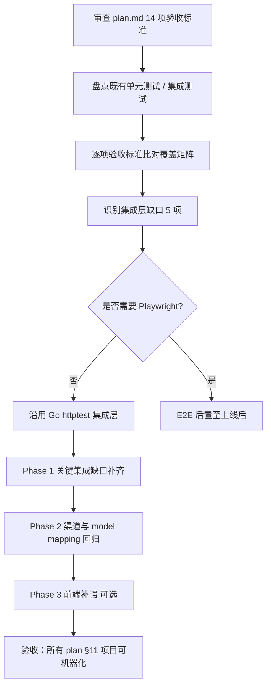
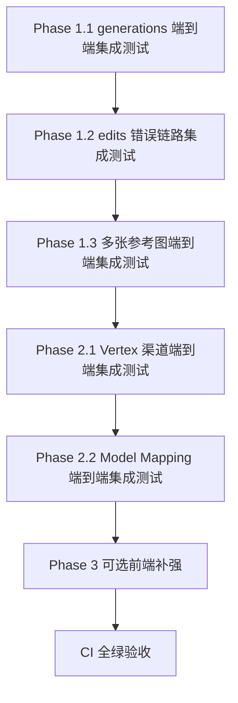
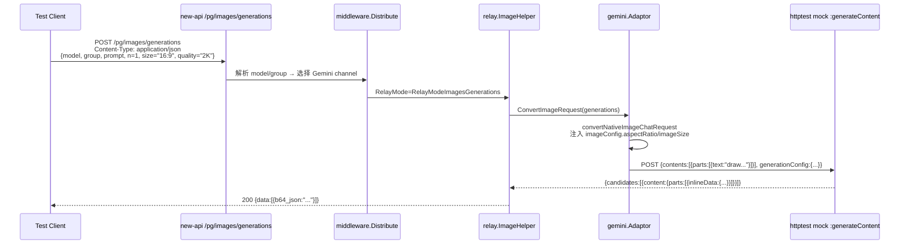
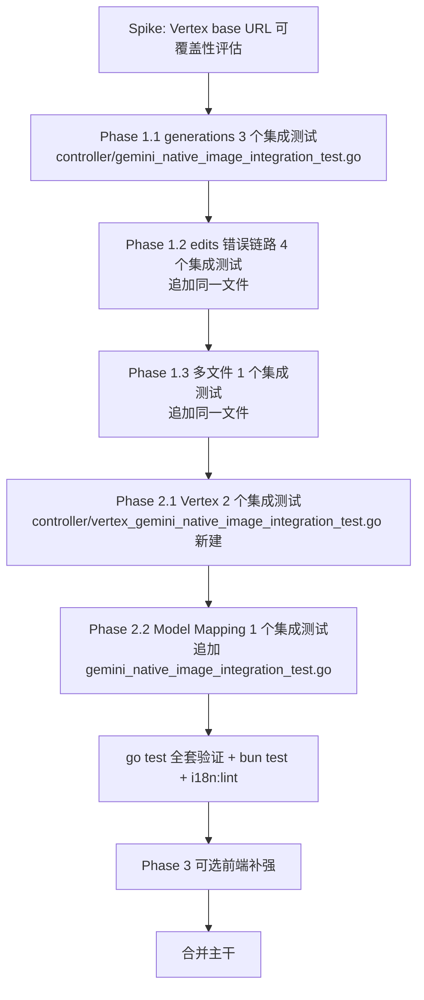

# 操练场 Gemini 原生生图模型改造（对齐 gpt-image-2 交互）— 集成测试补强计划

> 范围：审查 `20260520_操练场 Gemini 原生生图模型改造（对齐 gpt-image-2 交互）_plan.md` 落地后的全部既有自动化测试，识别端到端集成层面的覆盖缺口，按"价值优先 + 风险递减"的顺序补齐必要的集成测试，并明确不需要新增的部分及理由。
>
> 关键事实来源：
> - 后端实现：`controller/user.go`、`relay/image_handler.go`、`relay/channel/gemini/adaptor.go`、`relay/channel/vertex/adaptor.go`
> - 前端实现：`web/src/components/playground/ImageParameterControl.jsx`、`web/src/helpers/playgroundPayload.js`、`web/src/hooks/playground/usePlaygroundState.js`
> - 既有测试：
>   - `controller/gemini_native_image_integration_test.go`（multipart edits 全链路）
>   - `controller/playground_test.go`、`controller/playground_models_test.go`
>   - `relay/channel/gemini/adaptor_image_test.go`、`relay/channel/vertex/adaptor_gemini_image_test.go`
>   - `relay/image_handler_test.go`
>   - `web/src/helpers/playgroundPayload.test.js`、`web/src/components/playground/ImageParameterControl.test.jsx`
>
> 兼容前提：与已落地的 `gpt-image-2`、`gpt-image-1`、`dall-e-2/3`、`imagen-*`、`flux-*`、`/v1/chat/completions` multimodal 调 Gemini 生图等行为零回归。

---

## 一、审查总览



**核心结论**：

1. 单元层面覆盖**已充分**：adaptor 派发、imageConfig 白名单与映射、edits 多文件 + 4xx + SkipRetry、Vertex DoResponse、前端 sanitize、UI 标签条件化、option 列表、processModelsData 注入 metadata、自定义 body 派发——均已覆盖。
2. 端到端 HTTP 集成层**已有 1 条**（`controller/gemini_native_image_integration_test.go`）：覆盖 `/pg/images/edits` multipart → Distribute → Playground → ImageHelper → Gemini adaptor → mock `:generateContent` → `ImageResponse` 全链路，并断言上游 `inlineData / text / responseModalities / imageConfig.aspectRatio / imageSize`。
3. **关键缺口**：
   - `/pg/images/generations` **无端到端集成测试**（最严重）。
   - edits 错误链路（缺文件 / MIME / 超大）**只有 adaptor 单测，没有验证错误是否完整传递到 HTTP 响应**。
   - 多张参考图**只有 adaptor 单测，没有端到端**。
   - Vertex 渠道**只有 DoResponse 单测，没有真实 HTTP → 真实 Vertex adaptor → mock upstream 集成**。
   - **Model Mapping 场景未覆盖**：用户用别名 `gemini-native` 走 mapping 到 `gemini-3.1-flash-image-preview`，能否仍然命中 `isGeminiNativeImageGeneration` 分支。
4. **不需要 Playwright**：本计划补强目标聚焦在 Go HTTP 集成层；plan §11.4 已明确浏览器级 E2E 后置；现有 `controller/gemini_native_image_integration_test.go` 已经证明 Go httptest + mock upstream 能完整覆盖前后端契约的关键交点。

---

## 二、既有测试覆盖矩阵

> 列：plan.md §十四 验收标准；行：测试维度。✔=已覆盖，△=部分覆盖，✗=未覆盖。

### 2.1 后端覆盖矩阵

| 验收点（plan §十四） | 单元层 | 集成层 | 当前状态 | 缺口 |
|---|---|---|---|---|
| 1. `/api/user/playground/models` 返回 Gemini native metadata 形态 | `TestPlaygroundGeminiNativeImageMetadata` ✔ | `TestGetUserPlaygroundModelsIncludesGeminiNativeEditMetadata` ✔ | 完整 | 无 |
| 2. gpt-image / dall-e / flux / imagen / gpt-4o 元数据无回归 | `TestPlaygroundGPTImageMetadata` ✔ `TestPlaygroundModelInfoGPTImageJSONShape` ✔ | ✗ | 集成层未覆盖 | 低优先级 |
| 3. UI Radio / 参数面板 / 不显示返回格式与流式 | 前端单测 ✔ | ✗（属 UI 范畴） | 单测充分 | 无 |
| 4. 文生图 URL=`/pg/images/generations` + JSON + 可控字段集 + 旧值丢弃 | 前端 sanitize 单测 ✔ | ✗ | **缺端到端** | **Phase 1.1** |
| 5. 图生图 URL=`/pg/images/edits` + multipart + 字段集 | 前端单测 ✔ | `TestPlaygroundGeminiNativeImageEditMultipartIntegration` ✔ | 完整 | 无 |
| 6. 后端 edits 进入 adaptor → MultipartForm.File["image"] → inline_data → responseModalities → imageConfig → safetySettings | adaptor 单测 6 条 ✔ | edits 集成测试 ✔ | 完整 | 无 |
| 7. 本地校验错误：缺文件/空 prompt/MIME/超大 → 4xx + SkipRetry | adaptor 单测 4 条 ✔ | ✗ | **缺端到端** | **Phase 1.2** |
| 8. Gemini + Vertex 在 generations/edits 均走 `GeminiNativeImageChatHandler` | Gemini ✔ Vertex ✔（DoResponse 单测） | Gemini edits ✔；**Vertex generations/edits 集成 ✗** | 单测充分 | **Phase 2.1** |
| 9. dall-e / gpt-image / flux / imagen 零回归 | 前端 + adaptor 单测 ✔ | ✗ | 单测充分 | 无 |
| 10. `/v1/chat/completions` multimodal 调 Gemini 不回归 | `TestDoResponse_GeminiNativeImageRequiresImageRelayMode` ✔ | ✗ | 单测充分 | 无 |
| 11. 自定义请求体 + 图生图 UI 阻断 | 前端单测 ✔ | n/a | 前端职责 | 无 |
| 12. 三库兼容（schema 不改） | n/a（本计划不改 schema） | n/a | 无需新增 | 无 |
| 13. 最小 edits 集成测试 | n/a | ✔ | 完整 | 无 |
| 14. 所有 go test / bun test / i18n:lint 全绿 | ✔ | ✔ | 完整 | 无 |
| 隐藏需求：多张参考图 → 多个 inlineData | `TestConvertNativeImageEditRequest_MultipleImages` ✔ | ✗ | 单测覆盖 | **Phase 1.3** |
| 隐藏需求：Model Mapping 别名 → upstream Gemini 模型仍命中 native 分支 | ✗ | ✗ | **未覆盖** | **Phase 2.2** |

### 2.2 前端覆盖矩阵

| 维度 | 测试文件 | 覆盖 | 缺口 |
|---|---|---|---|
| option list 切换（gemini_native / gpt-image / dall-e / 通用） | `playgroundPayload.test.js` | ✔ | 无 |
| sanitize 旧值丢弃 / 默认空 | `playgroundPayload.test.js` | ✔ | 无 |
| `buildImageGenerationPayload` 含 size/quality（Gemini native） | `playgroundPayload.test.js` | ✔ | 无 |
| `buildImageEditPayload` multipart 字段（Gemini native） | `playgroundPayload.test.js` | ✔ | 无 |
| `processModelsData` 注入 `imageGenerationMode/imageParameters` | `playgroundPayload.test.js` | ✔ | 无 |
| UI 标签「宽高比」「图像分辨率」「默认（不发送）」 | `ImageParameterControl.test.jsx` | ✔ | 无 |
| `usePlaygroundState` 注入 `imageGenerationMode` 到 `inputsWithImageParameters` | ✗ | ✗ | Phase 3.1（可选） |
| SettingsPanel Radio + Uploader 联动 | ✗ | ✗ | Phase 3.2（可选） |
| i18n 7 语言 key 完整性 | 命令行：`bun run i18n:lint` | ✔ | 无 |

---

## 三、缺口识别（按 Severity 排序）

### 3.1 Sev-1 — 必须补齐（合并前门禁）

1. **缺口 G1**：`/pg/images/generations` 端到端集成测试缺失。当前只有 edits 集成测试。generations 是 Gemini native 改造的"主要使用入口"，缺少同形覆盖会让 JSON request 路径 + Distribute + Playground + ImageHelper + Gemini adaptor + mock `:generateContent` + 响应 → `ImageResponse` 全链路无任何端到端门禁。
2. **缺口 G2**：edits 错误链路（缺文件 / unsupported MIME / 超大文件 / 空 prompt）只在 adaptor 单测覆盖。问题在于 `ImageHelper` 会用 `types.NewError(err, ErrorCodeConvertRequestFailed)` 包装错误，4xx + SkipRetry 是否会被正确透传到 HTTP 响应、是否会被 retry middleware 误重试，**没有任何端到端门禁**。这恰恰是 plan §三.错误处理硬约束 强调的关键风险。

### 3.2 Sev-2 — 强烈建议补齐（覆盖关键回归路径）

3. **缺口 G3**：多张参考图（plan §3.1 `TestConvertNativeImageEditRequest_MultipleImages` 已存在）的 multipart → 上游 JSON parts 顺序在集成层未端到端验证。Gemini 上游对 parts 顺序敏感度较低但官方推荐 `[inlineData..., text]`；前端首版限制 limit=1，后端不限。未来如果前端解锁多文件，**没有集成层快照**。
4. **缺口 G4**：Vertex 渠道完整 HTTP 链路集成测试缺失。Vertex `ConvertImageRequest` / `DoResponse` / `SetupRequestHeader` 单测覆盖了"委托给 Gemini adaptor"的契约，但没有真实 `ChannelTypeVertexAi` + mock upstream 的 multipart → Distribute → ImageHelper 全链路验证。

### 3.3 Sev-3 — 可选补齐（防御未来变更）

5. **缺口 G5**：Model Mapping 场景。当渠道配置 `model_mapping = {"gemini-image":"gemini-3.1-flash-image-preview"}`，用户用别名发起请求，`ModelMappedHelper` 会改写 `UpstreamModelName`。`isGeminiNativeImageGeneration` 检查的是 `UpstreamModelName`，理论上应命中，但**无测试锁死**。未来如有重构动 `OriginModelName/UpstreamModelName` 切换顺序，会静默失效。
6. **缺口 G6**：`web/src/hooks/playground/usePlaygroundState.js` 与 `SettingsPanel.jsx` 的集成（Radio + Uploader 在 `supports_edits=true` 时显示）目前依赖既有 gpt-image-2 集成测试套路验证，Gemini 路径没有独立 hooks 测试。属于"防御未来变更"，价值低于 G1-G5。

---

## 四、Playwright 评估

按 `.claude/rules/使用playwright mcp进行集成测试.md` 检视：

| 维度 | Playwright 适合？ | 当前 Go httptest 是否能覆盖？ |
|---|---|---|
| `/pg/images/generations` JSON 路径 | 适合，但成本高（mock upstream + Docker Compose + Bun + Playwright） | **完全可以**（Phase 1.1） |
| `/pg/images/edits` multipart 路径 | 适合 | **已覆盖**（既有 edits 集成测试） |
| UI Radio / Uploader / 「请求方式」单选 | 适合 | 仅 DOM 渲染，单测已覆盖核心契约 |
| 跨浏览器渲染、计算样式 | 唯一选项 | Go 无法覆盖 |
| 用户视觉体验回归 | 适合 | Go 无法覆盖 |

**结论**：本次缺口聚焦在"HTTP 请求/响应的契约"层，Go httptest 已能完整覆盖，且与既有 `controller/gemini_native_image_integration_test.go` 完全同形，复用成本最低。Playwright 适合的是 UI 渲染层，但 plan §11.4 已明确"完整 E2E 可后置到本计划合并 + 上线后再做"，本次不引入。

**未来如新增 Playwright**：在 `scripts/e2e/gemini-native-image/` 下建立完整 spec 套件（generations.spec.ts / edits.spec.ts / capability.spec.ts / guards.spec.ts / regression.spec.ts），mock upstream 复用 gpt-image-2 的 server.ts 并扩展 `/v1beta/models/<model>:generateContent` 路径。本计划文档不预先创建，避免半成品 spec。

---

## 五、新增集成测试方案（按执行顺序）



> **顺序原则**：先补"主使用入口（generations）"，再补"错误鲁棒性（edits 错误链路）"，再补"已实现但未端到端验证的特性（多文件）"，最后是"渠道层 + 映射层回归"。Phase 3 视开发节奏可选。

### 5.1 Phase 1.1 — `/pg/images/generations` 端到端集成测试（Sev-1）

**目标**：与既有 `TestPlaygroundGeminiNativeImageEditMultipartIntegration` 同形对称，覆盖文生图主路径。

**文件**：`controller/gemini_native_image_integration_test.go`（在现有文件追加，复用 `setupGeminiNativeImageIntegrationDB` / `seedGeminiNativeImageIntegrationData` / `newGeminiNativeImagePlaygroundRouter` 辅助函数）

**改造点**：
- 在现有 router helper 上扩展支持 `/pg/images/generations` POST，逻辑与 `/pg/images/edits` 完全一致（同一 Playground handler）；建议把 router helper 升级为 `func newGeminiNativeImagePlaygroundRouter() *gin.Engine` 注册两条路径。

**新增测试函数**：`TestPlaygroundGeminiNativeImageGenerationsJSONIntegration`



**断言矩阵**：

| 断言对象 | 期望 |
|---|---|
| HTTP 响应状态码 | `200 OK` |
| 响应 body | `dto.ImageResponse{Data:[{B64Json}]}` 且 `b64_json` 非空 |
| 上游收到的 path | `/v1beta/models/gemini-3.1-flash-image-preview:generateContent` |
| 上游收到的 Content-Type | `application/json` |
| 上游收到的 `x-goog-api-key` | `test-key` |
| 上游 body `contents[0].parts` | 长度=1，且仅含 `text="draw a 16:9 hero banner"`、**不含 `inlineData`** |
| 上游 body `generationConfig.responseModalities` | `["TEXT","IMAGE"]`（顺序不限） |
| 上游 body `generationConfig.imageConfig.aspectRatio` | `"16:9"` |
| 上游 body `generationConfig.imageConfig.imageSize` | `"2K"` |
| 上游 body `safetySettings` | 非空 |
| `model.Log.Other.request_path` | `/pg/images/generations` |
| `model.Log.ModelName` | `gemini-3.1-flash-image-preview` |
| 全局 `PassThroughRequestEnabled=true` 时仍走 adaptor 转换（pass-through 守卫生效） | 验证守卫不被绕过 |

**新增测试函数**：`TestPlaygroundGeminiNativeImageGenerationsOmitsEmptyImageConfig`

| 输入 | 期望 |
|---|---|
| body 不带 `size` 与 `quality` | 上游 body 中 `generationConfig.imageConfig` 字段缺失或 null（不发送上游默认覆盖字段） |

**新增测试函数**：`TestPlaygroundGeminiNativeImageGenerationsDropsLegacyOpenAISize`

| 输入 | 期望 |
|---|---|
| body `size="1024x1024"`、`quality="auto"` | 上游 body **不含** `imageConfig.aspectRatio` 与 `imageConfig.imageSize`（被 whitelist 静默丢弃；保持 plan §2.2 关键决策） |

**判定通过**：`go test ./controller -run TestPlaygroundGeminiNativeImageGenerations -v` 全绿。

### 5.2 Phase 1.2 — edits 错误链路端到端集成测试（Sev-1）

**目标**：验证 plan §三 错误处理硬约束（4xx + SkipRetry 沿 `ImageHelper` 包装链完整传递）真的在 HTTP 层生效。

**文件**：`controller/gemini_native_image_integration_test.go`（追加 4 个测试函数）

**新增测试函数**：

| 测试函数 | 场景 | 期望 |
|---|---|---|
| `TestPlaygroundGeminiNativeImageEditsRejectsMissingImage` | multipart 不含 `image` 字段，仅有 prompt 与其他字段 | HTTP 400；响应 body `success=false`，`message` 包含 `image is required`；**mock upstream 未收到任何请求** |
| `TestPlaygroundGeminiNativeImageEditsRejectsUnsupportedMime` | multipart `image` 字段 Content-Type=`image/gif` | HTTP 400；mock 未收到请求；`message` 含 `unsupported image mime type` |
| `TestPlaygroundGeminiNativeImageEditsRejectsOversizedImage` | multipart `image` 字段长度 > 10MB | HTTP 413；mock 未收到请求；`message` 含 `exceeds` |
| `TestPlaygroundGeminiNativeImageEditsRejectsEmptyPrompt` | multipart `prompt=""`（或全空白）+ 正常 image 文件 | HTTP 400；mock 未收到请求；`message` 含 `prompt is required` |

**关键断言**：

- 每条用例必须断言 **mock upstream 收到的请求数 = 0**（`captured` channel 长度=0），证明本地校验在进入上游前阻断。
- 必须断言 HTTP 状态码（400 / 413），不能只断言 success=false——因为 `ImageHelper` 默认包装会丢弃状态码，这正是 plan §三的核心风险。
- 必须断言 `model.Log` 中**没有 consume 日志**（错误请求不应扣费）。

**辅助函数复用**：复用现有 `newGeminiNativeImagePlaygroundRouter` / `setupGeminiNativeImageIntegrationDB` / `seedGeminiNativeImageIntegrationData`；扩展 `newGeminiNativeImageEditMultipartRequest` 接受可配置 `prompt / mimeType / fileSize / omitFile bool` 参数。

**判定通过**：4 个测试函数全部通过；mock 在错误用例下永不被触发。

### 5.3 Phase 1.3 — 多张参考图端到端集成测试（Sev-2）

**目标**：锁死多文件 multipart 的 parts 顺序契约，未来前端解锁多文件 limit 时仍保持后端协议稳定。

**文件**：`controller/gemini_native_image_integration_test.go`（追加 1 个测试函数）

**新增测试函数**：`TestPlaygroundGeminiNativeImageEditsAcceptsMultipleReferences`

| 步骤 | 内容 |
|---|---|
| 请求 | multipart：`prompt="combine these references"`、`image=apple.png/png/<bytes1>`、`image=cup.jpg/jpeg/<bytes2>` |
| 上游断言 | `contents[0].parts` 长度=3：`parts[0].inlineData.mimeType=image/png` + base64=bytes1；`parts[1].inlineData.mimeType=image/jpeg` + base64=bytes2；`parts[2].text="combine these references"`（**顺序敏感**） |
| 响应断言 | 200 + `data[0].b64_json` 非空 |
| 日志断言 | `request_path=/pg/images/edits` |

**判定通过**：单测通过。注意 mock 必须保留 parts 数组顺序断言（用 `require.Equal` 对整个数组而不是 `ElementsMatch`）。

### 5.4 Phase 2.1 — Vertex 渠道端到端集成测试（Sev-2）

**目标**：Vertex 渠道（`ChannelTypeVertexAi` + `VertexKeyTypeAPIKey`）在 generations/edits 两种 relay mode 下完整链路与 Gemini 渠道等价。

**文件**：新建 `controller/vertex_gemini_native_image_integration_test.go`

**前置条件**：Vertex API Key 模式 URL 形如 `https://aiplatform.googleapis.com/v1/publishers/google/models/<model>:generateContent?key=<key>`；mock upstream 必须接受带 `?key=` 的查询参数路径，并断言。

**新增测试函数**：

| 函数 | 场景 | 关键断言 |
|---|---|---|
| `TestPlaygroundVertexGeminiNativeImageGenerationsIntegration` | `/pg/images/generations` + Vertex 渠道 | 上游 path 含 `publishers/google/models/<model>:generateContent`；query `key=test-key`；JSON body 与 Gemini 渠道形态一致（含 imageConfig）；响应 `ImageResponse{B64Json}` |
| `TestPlaygroundVertexGeminiNativeImageEditsIntegration` | `/pg/images/edits` + Vertex 渠道 + 单张图 | 上游 path 同上；`contents[0].parts=[inlineData, text]`；响应正常 |

**实现要点**：
- 复用 mock upstream 结构，但 URL pattern 需要兼容 Vertex `publishers/google/models/...:generateContent` 的查询参数模式（`r.URL.Path` 与 `r.URL.Query().Get("key")` 分别断言）。
- `seedVertexGeminiNativeImageIntegrationData` 区别于 Gemini：`channel.Type=ChannelTypeVertexAi`，并设置 `channel.OtherSettings` 让 `VertexKeyType=VertexKeyTypeAPIKey`（参见 `relay/channel/vertex/adaptor.go:179-204`）。
- 不需要测试 `VertexKeyTypeServiceAccount`（涉及 OAuth token 获取，单测层成本过高；保留为 Phase 3 可选）。

**判定通过**：`go test ./controller -run TestPlaygroundVertex -v` 全绿。

### 5.5 Phase 2.2 — Model Mapping 端到端集成测试（Sev-3）

**目标**：用户用别名 `gemini-image-alias` 发请求，渠道 `model_mapping={"gemini-image-alias":"gemini-3.1-flash-image-preview"}` 改写为真实模型名后，仍能命中 `isGeminiNativeImageGeneration` 分支。

**文件**：`controller/gemini_native_image_integration_test.go`（追加 1 个测试函数）

**新增测试函数**：`TestPlaygroundGeminiNativeImageMappedModelIntegration`

| 步骤 | 内容 |
|---|---|
| 渠道配置 | `channel.Models="gemini-image-alias"`；`channel.ModelMapping={"gemini-image-alias":"gemini-3.1-flash-image-preview"}` |
| Ability 配置 | `model="gemini-image-alias"` |
| 请求 | `/pg/images/generations` body `model="gemini-image-alias"` + prompt + size + quality |
| 上游断言 | path = `/v1beta/models/gemini-3.1-flash-image-preview:generateContent`（被 mapping 改写）；imageConfig 仍正确注入；不退化到普通 chat handler |
| 响应断言 | 200 + `data[0].b64_json` 非空 |

**关键风险锁定**：未来如有人重构 `ModelMappedHelper` 与 `isGeminiNativeImageGeneration` 的执行顺序，此测试会直接红灯。

**判定通过**：单测通过。

### 5.6 Phase 3 — 前端可选补强（Sev-3，可后置）

> 决策：本计划**不强制**做 Phase 3。如未来 `usePlaygroundState` 或 `SettingsPanel` 出现回归，再独立补 PR。

**候选测试**：

| 文件 | 测试内容 |
|---|---|
| `web/src/hooks/playground/usePlaygroundState.test.js`（新建） | 验证 `inputsWithImageParameters` 在 `selectedModelOption.imageGenerationMode='gemini_native'` 时正确注入 `imageGenerationMode` 字段 |
| `web/src/components/playground/SettingsPanel.test.jsx`（新建） | 验证 `supports_edits=true` 时显示 Radio + Uploader；模型切换为 `gemini_native` 后 ImageParameterControl props 正确联动 |

**判定通过**：`bun test src/hooks/playground/ src/components/playground/SettingsPanel.test.jsx` 全绿。

---

## 六、不需要新增的部分及理由

| 项 | 不增加理由 |
|---|---|
| **完整 Playwright E2E 套件**（`scripts/e2e/gemini-native-image/`） | plan §11.4 已明确"可后置到本计划合并 + 上线后再做"；Go httptest 已能覆盖 HTTP 契约层；浏览器级 UI 回归价值在上线后更高，本次资源应集中在 Sev-1 缺口 |
| **OpenAI / DALL-E / Flux / Imagen 回归集成测试** | adaptor 与前端单测已覆盖；本计划改动严格不动这些路径（`imagen` 走独立 `convertImagenRequest`，OpenAI 走 OpenAI adaptor，本计划不改 OpenAI adaptor）；新增集成测试价值低 |
| **`/v1/chat/completions` multimodal 调 Gemini 生图回归** | 走 `CovertOpenAI2Gemini` 独立路径，本计划完全不动；`TestDoResponse_GeminiNativeImageRequiresImageRelayMode` 子用例 "chat relay mode keeps chat handler" 已显式锁死 |
| **三库（SQLite / MySQL / PostgreSQL）冒烟集成测试** | 本计划完全不改 schema；所有改动通过 GORM 抽象；既有 `setupModelListControllerTestDB` 使用 SQLite，已能验证 ORM 层契约 |
| **Vertex `VertexKeyTypeServiceAccount`（OAuth）集成测试** | 涉及 Google OAuth Token 获取，需要 mock GCP token endpoint，单测成本远高于价值；API Key 模式覆盖了"Vertex 委托 Gemini adaptor"的关键契约 |
| **Frontend `ImageReferenceUploader` 单文件 limit / MIME 白名单** | 已有 `web/src/components/playground/` 既有测试覆盖；本计划未改动该组件 |
| **i18n 翻译质量回归** | `bun run i18n:lint` 已锁定 key 覆盖完整性；翻译质量属于人工 review 范畴 |
| **计费倍率 / quota 计算回归** | 本计划未改 `ImagePriceRatio`；既有 edits 集成测试 `consumeLog.Other.request_path` 断言已覆盖日志路径；quota 精确数值不在 plan §十四 验收范畴 |

---

## 七、执行清单与文件改动

### 7.1 新增/扩展测试文件清单

| 序号 | 文件 | 改动 | Phase |
|---|---|---|---|
| 1 | `controller/gemini_native_image_integration_test.go` | 扩展现有文件，追加 generations / errors / multi-file / mapping 共 7 个新测试函数；router helper 升级支持双路径 | 1.1 / 1.2 / 1.3 / 2.2 |
| 2 | `controller/vertex_gemini_native_image_integration_test.go` | 新建文件，2 个测试函数 + 独立 mock 与 seed helper | 2.1 |
| 3 | `web/src/hooks/playground/usePlaygroundState.test.js` | 新建（可选） | 3.1 |
| 4 | `web/src/components/playground/SettingsPanel.test.jsx` | 新建（可选） | 3.2 |

**总计**：必做 2 个文件改动（扩展 1 + 新建 1），共新增约 9 个测试函数；可选 2 个文件。

### 7.2 命令行验收

```bash
# Phase 1 + Phase 2 后端集成测试全跑
cd /Users/wanghejie/workspace/new-api
go test ./controller -run 'TestPlaygroundGeminiNativeImage|TestPlaygroundVertexGeminiNativeImage' -v

# 既有全套不回归
go test ./controller ./relay/channel/gemini ./relay/channel/vertex ./relay -v

# 前端不回归
cd web
bun test src/helpers/playgroundPayload.test.js src/components/playground/ImageParameterControl.test.jsx
bun run i18n:lint

# Phase 3（可选）
bun test src/hooks/playground/ src/components/playground/SettingsPanel.test.jsx
```

### 7.3 风险与对策

| 风险 | 应对 |
|---|---|
| mock upstream 在并发用例下出现状态污染 | 每个测试函数独占创建 `httptest.NewServer`；用 `t.Cleanup` 释放；`captured` channel 容量=1 防止串扰 |
| `setupModelListControllerTestDB` 全局状态泄漏（pricing cache / model cache） | 现有 helper 已有 `t.Cleanup` 恢复 `MemoryCacheEnabled` 等开关；新增测试遵循同样模式 |
| Vertex URL 在测试中无法直接指向 mock | mock URL 设置成 `channel.BaseURL`；Vertex API Key 模式不走 `aiplatform.googleapis.com` 硬编码，复用 `info.ChannelBaseUrl`——需验证 `relay/channel/vertex/adaptor.go:179-204` 路径（API Key 分支硬编码了 `https://aiplatform.googleapis.com`，**这是阻塞**）；若硬编码无法绕过，将 Phase 2.1 改为"通过 `setting/model_setting` 注入测试 base URL"或暂时降级为 ServiceAccount mock（评估后选择代价更低的方案，可能需要在 Vertex adaptor 增加"测试模式 base URL 覆盖"机制——但这会改动生产代码，**Phase 2.1 启动前需先 spike 评估**）|
| 错误用例下 `model.Log` 仍有写入 | 仔细审 `relay.ImageHelper`：当前 `service.PostTextConsumeQuota` 仅在成功路径调用；错误路径直接 return，不写 consume 日志。需要测试函数显式断言 `model.Log` 仅有 `LogTypeError` 或为空 |
| Model Mapping 与 channel cache 交互 | `model.InvalidatePricingCache` + 显式 `model.GetGroupEnabledModels` 预热；用 alias 触发模型选择前确保 ability 已 seed |

### 7.4 Spike 任务（执行前置）

> **必须在 Phase 2.1 启动前完成的探查**：

| Spike | 目标 | 产出 |
|---|---|---|
| Vertex API Key 模式 base URL 可否在测试中替换 | 阅读 `relay/channel/vertex/adaptor.go:179-204`，确认硬编码 `https://aiplatform.googleapis.com` 在 `VertexKeyTypeAPIKey` 模式下是否可通过 `channel.BaseURL` 或环境变量覆盖；若不能，则选择最小生产代码改动方案（推荐：将 base URL 提取为 `Vertex.defaultBaseURL` 包变量，测试可临时替换） | 决策：是否新增 1 行生产代码改动；或降级为 ServiceAccount mock |

---

## 八、验收标准

1. **Sev-1 缺口全部补齐**：
   - `TestPlaygroundGeminiNativeImageGenerationsJSONIntegration` 通过
   - `TestPlaygroundGeminiNativeImageGenerationsOmitsEmptyImageConfig` 通过
   - `TestPlaygroundGeminiNativeImageGenerationsDropsLegacyOpenAISize` 通过
   - `TestPlaygroundGeminiNativeImageEditsRejectsMissingImage` 通过
   - `TestPlaygroundGeminiNativeImageEditsRejectsUnsupportedMime` 通过
   - `TestPlaygroundGeminiNativeImageEditsRejectsOversizedImage` 通过
   - `TestPlaygroundGeminiNativeImageEditsRejectsEmptyPrompt` 通过
2. **Sev-2 缺口补齐**：
   - `TestPlaygroundGeminiNativeImageEditsAcceptsMultipleReferences` 通过
   - `TestPlaygroundVertexGeminiNativeImageGenerationsIntegration` 通过
   - `TestPlaygroundVertexGeminiNativeImageEditsIntegration` 通过
3. **Sev-3 缺口补齐**（推荐做完）：
   - `TestPlaygroundGeminiNativeImageMappedModelIntegration` 通过
4. **零回归**：
   - 既有 `controller/gemini_native_image_integration_test.go` 所有测试函数仍通过
   - `go test ./controller ./relay/channel/gemini ./relay/channel/vertex ./relay -v` 全绿
   - `bun test src/helpers/playgroundPayload.test.js src/components/playground/ImageParameterControl.test.jsx` 全绿
   - `bun run i18n:lint` 通过
5. **覆盖矩阵更新**：plan.md §十四 14 项验收标准的"集成层"列从 △/✗ 全部变为 ✔。
6. **Spike 决策**（Phase 2.1 前）：完成 Vertex base URL 覆盖机制评估并产出最小生产代码改动方案。

---

## 九、与既有 gpt-image-2 集成测试的关系

| 维度 | gpt-image-2 集成测试现状 | 本计划新增 Gemini 集成测试 |
|---|---|---|
| 后端 Go 集成测试 | 不详（搜索范围内未见同形 controller 集成测试） | **本计划是第一份后端集成测试套件** |
| Playwright E2E 套件 | `scripts/e2e/gpt-image-2/`（参考） | 暂不新建（后置） |
| mock upstream 复用 | `scripts/e2e/mock-upstream/server.ts` 仅 OpenAI 路径 | 本计划不依赖 |
| 复用策略 | n/a | 全部使用 Go httptest，与生产代码最近 |

> 本计划首次为 Gemini 原生生图建立 Go 层集成测试栈，gpt-image-2 后续如做同形集成测试，可参考本计划的 `controller/gemini_native_image_integration_test.go` 结构。

---

## 十、执行顺序总结



> **关键卡点**：Spike 必须在 Phase 2.1 之前完成，因为可能影响 Vertex base URL 替换方案；Phase 1 与 Phase 2 之间可并行（不同测试文件，无依赖）；Phase 3 完全可选，不阻塞合并。

> **建议合并策略**：
> - Phase 1 + Phase 2 作为一个原子 PR 合入（即"Gemini native image integration test coverage"），所有 Sev-1 + Sev-2 缺口同一 PR 关闭。
> - Phase 3 独立 PR（不强制）。

---

> 本计划为 `Gemini 原生生图模型在操练场对齐 gpt-image-2 交互` 改造的集成测试补强方案，按本文档顺序执行即可。落地后请在文档末尾补 Review 区，记录实际改动、Spike 结论与偏差。
