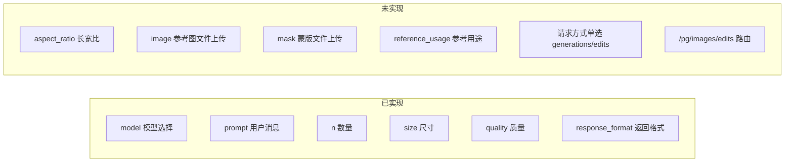
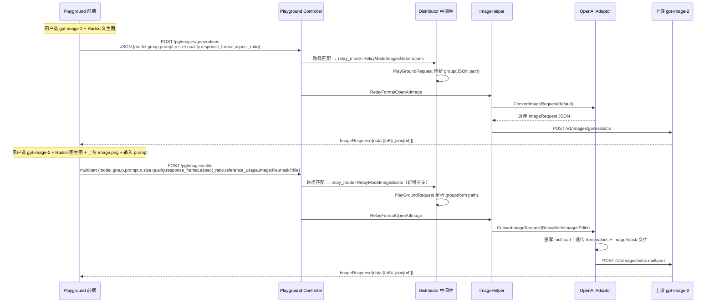
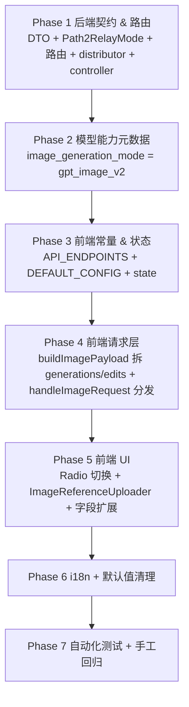
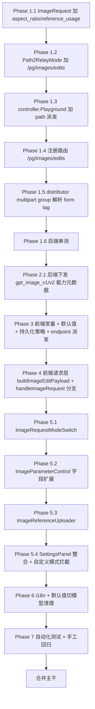

# 操练场新增 gpt-image-2 文生图与图生图页面功能 — 执行计划

> 范围：在 `/console/playground` 页面为 `gpt-image-2` 模型新增「文生图」与「图生图」两种使用方式，分别对应上游 `POST /v1/images/generations` 与 `POST /v1/images/edits` 接口。前端用单选切换（Radio），所有上游可调参数均在前端暴露并提供合理默认值。
>
> 接口规范来源：项目根目录 `gpt-image-2使用指南.md`（实测整理）。
>
> 兼容前提：与已落地的 `20260427_playground_images_plan.md`（playground 接入 images/generations）和 `20260428_操练场新增 Gemini 原生生图模型_plan.md`（Gemini 原生生图）现网行为完全兼容，对其他生图模型零回归。

---

## 一、目标

1. 在 playground 选中 `gpt-image-2`（含未来任意命中 `prefix:gpt-image-` 的模型）时，参数面板出现「请求方式」单选：`文生图(generations)` / `图生图(edits)`。
2. **文生图** 走 `POST /pg/images/generations`（JSON），暴露所有上游参数：`prompt`、`n`、`size`、`quality`、`response_format`、`aspect_ratio`，全部带默认值且可覆盖。
3. **图生图** 走 `POST /pg/images/edits`（multipart/form-data），在文生图参数基础上额外暴露：`image`（文件，必填）、`mask`（可选）、`reference_usage`（subject/composition/style）。
4. 两种模式共用同一个对话流：用户输入 prompt → 助手消息渲染图片（沿用已有 `image_url` content 协议，base64 → data URI、url 直接展示）。
5. **不破坏** 已有 `dall-e-2/3`、`gpt-image-1`、`flux-*`、`imagen-*`、`gemini-*-image-*` 的 playground 行为。
6. 三库（SQLite / MySQL / PostgreSQL）行为一致，本计划不改 schema。

---

## 二、参数差距分析（当前前端 vs gpt-image-2 接口指南）



### 详细对照表

| 字段 | 文生图(generations) | 图生图(edits) | 当前前端是否实现 | 当前后端是否实现 |
|---|:---:|:---:|---|---|
| `model` | ✅ | ✅ | 已（模型下拉） | 已 |
| `prompt` | ✅ | ✅ | 已（取最后一条 user 消息文本） | 已 |
| `n` | ✅ | ✅ | 已（`ImageParameterControl`） | 已（`ImageRequest.N`） |
| `size` | ✅ | ✅ | 已 | 已 |
| `quality` | ✅ | ✅ | 已 | 已 |
| `response_format` | ✅ | ✅ | 已（但当前对 GPT Image 系列默认隐藏） | 已 |
| `aspect_ratio` | ✅（gpt-image-2 扩展，**优先级高于 size**） | ✅ | **未** | **未**（需要新增 DTO 字段透传） |
| `image` 文件上传 | ❌ | ✅（必填，可重复传多张） | **未**（现有 `ImageUrlInput` 是 chat 多模态消息内 URL，不是 multipart 文件） | 已（`OpenAI adaptor.ConvertImageRequest` 在 `RelayModeImagesEdits` 已处理 `mf.File["image"]`） |
| `mask` 文件上传 | ❌ | ✅（可选） | **未** | 已（`OpenAI adaptor.ConvertImageRequest` 已处理 `mf.File["mask"]`） |
| `reference_usage` | ❌ | ✅（默认 `subject`） | **未** | **未**（DTO 未声明，但适配器透传 form 时可携带；为类型安全建议显式声明） |
| 上游路由 `/pg/images/edits` | — | — | **未** | **未**（仅 `/v1/images/edits` 已存在） |
| 请求方式单选 | — | — | **未** | — |

### 关键发现（已读代码确认）

1. **后端 `OpenAI adaptor.ConvertImageRequest`（[`relay/channel/openai/adaptor.go:426-552`](relay/channel/openai/adaptor.go)）已实现完整的 multipart 透传**：以 `mf.Value` 写入所有非 model/file 字段、把 `image` / `image[]` / `mask` 文件按 MIME 类型重写到上游。这意味着只要前端正确发出 multipart，新字段 `aspect_ratio` / `reference_usage` 会自动透传上游，**适配器无需改造**。
2. **`GetAndValidOpenAIImageRequest`（[`relay/helper/valid_request.go:142-228`](relay/helper/valid_request.go)）在 `RelayModeImagesEdits + multipart` 分支已正确解析 prompt/model/n/quality/size**。`aspect_ratio` / `reference_usage` 当前不在显式取字段范围（不影响 multipart 透传，但 `ImageRequest` 结构体内不会带这两个值，如需做计费/校验需要 DTO 显式声明）。
3. **`Path2RelayMode`（[`relay/constant/relay_mode.go:69-72`](relay/constant/relay_mode.go)）当前只识别 `/v1/images/edits`**，`/pg/images/edits` 不会落到 `RelayModeImagesEdits`。这是后端必须改造的点。
4. **`distributor.go` 的 `/pg/` 分支（[`middleware/distributor.go:84-99,325-333`](middleware/distributor.go)）依赖 `UnmarshalBodyReusable` 取 `model`/`group`**，而 `UnmarshalBodyReusable`（[`common/gin.go:108-134`](common/gin.go)）已经原生兼容 `application/json`、`form`、`multipart/form-data` 三种 Content-Type。`PlayGroundRequest`（[`dto/playground.go:3-6`](dto/playground.go)）和 `ModelRequest`（[`middleware/distributor.go:25-28`](middleware/distributor.go)）目前只有 `json` 标签 — **需要补 `form` 标签**，否则 multipart 路径取不到 `group`。
5. **playground 模型元数据接口（[`controller/user.go:545-611`](controller/user.go)）已有 `image_generation_mode` + `image_parameters` 的下发机制**，前端 `processModelsData`（[`web/src/helpers/playgroundPayload.js:360-400`](web/src/helpers/playgroundPayload.js)）已消费这两个字段。新增 `gpt-image-2` 的能力元数据应走这条单一来源。
6. **`response_format` 当前在前端对 `gpt-image-*` 系列默认隐藏**（[`ImageParameterControl.jsx:136`](web/src/components/playground/ImageParameterControl.jsx) 与 [`playgroundPayload.js:172`](web/src/helpers/playgroundPayload.js)）。`gpt-image-2` 文档明确支持 `response_format=url`（实测通过），需要让 `gpt-image-2` 解锁该控件。

---

## 三、目标架构



---

## 四、改造原则（不可违反）

1. **单一来源**：模型能力（哪些参数可用、上限）由后端 `/api/user/playground/models` 的 `image_generation_mode` + `image_parameters` 下发，前端不复制 `gpt-image-2` 白名单（与历史 Gemini 计划保持一致原则）。
2. **路径即语义**：playground 与 `/v1/...` 镜像 — `/pg/images/generations` 与 `/pg/images/edits` 一一对应，不在请求体里塞 mode 字段。
3. **前后端契约最小化**：`gpt-image-2` 在 OpenAI 协议族下是标准 OpenAI 兼容图像模型，复用 `OpenAI adaptor` 已有 multipart 重写逻辑，**不新增渠道适配器代码**。
4. **DTO 白名单原则**：`aspect_ratio`、`reference_usage` 在 `ImageRequest` 显式声明字段（`omitempty`），保证 JSON & multipart 解析、param-override、计费 meta 一致；不依赖 `Extra` map 透传以避免计费/统计漏字段。
5. **强制非流式**：图像请求 `IsStream` 永远 false（[`dto/openai_image.go:162`](dto/openai_image.go) 已固化），UI 隐藏流式开关。
6. **零回归**：`dall-e-*`、`gpt-image-1`、`flux-*`、`imagen-*`、`gemini-*-image-*` 在 playground 中的现有行为（含已落地的 Gemini native image generation 强制转换、image_parameters 能力下发）完全不变。
7. **跨库兼容**：本次不改 schema，三库行为一致。
8. **可测试**：每个改造点配套单测，至少覆盖路径派发、relay mode 映射、multipart 透传、`aspect_ratio`/`reference_usage` 字段透传、前端 Radio 切换 endpoint 与 payload 形态。
9. **错误清晰**：edit 模式下 `image` 文件未上传时前端阻止发送并提示；后端 `image is required` 错误（[`openai/adaptor.go:475`](relay/channel/openai/adaptor.go)）原样回显。
10. **i18n 完整**：所有新文案 7 语言（zh-CN / zh-TW / en / fr / ru / ja / vi）补齐，沿用项目既有 `useTranslation` 模式。

---

## 五、阶段总览



> 顺序原则：**后端先行 → 数据层 → 请求层 → 视图层 → 文案 → 测试**。每阶段独立可验证。

---

## 六、Phase 1 — 后端契约与路由（5 步）

### Step 1.1 — 扩展 `dto.ImageRequest` 增加 `aspect_ratio` / `reference_usage`

**文件**：[`dto/openai_image.go:14-37`](dto/openai_image.go)

新增两个字段（保持 `omitempty` 与项目命名风格）：

```go
type ImageRequest struct {
    // ...既有字段...
    AspectRatio    string `json:"aspect_ratio,omitempty" form:"aspect_ratio"`
    ReferenceUsage string `json:"reference_usage,omitempty" form:"reference_usage"`
}
```

- 必须同时打 `json` 与 `form` 双标签：generations 走 JSON 解码，edits 走 multipart 解码（[`common/gin.go:108-134`](common/gin.go) 的 `UnmarshalBodyReusable` 按 Content-Type 分发，multipart 经由 `processFormMap` 反射绑定）。
- 不要使用 `*string` 或 `json.RawMessage`：`aspect_ratio` 与 `reference_usage` 都是简单字符串枚举，零值即空字符串语义无歧义；与项目其他类似字段（如 `Quality`、`Size`）保持一致。
- 不要破坏 `UnmarshalJSON`/`MarshalJSON`：因为这两个新字段会被 `GetJSONFieldNames`（反射）自动识别为已知字段，不会误入 `Extra`，无需特别改造。

**判定通过**：`go vet ./...` + `go build ./...` 通过；新加字段在 generations(JSON) 与 edits(multipart) 两条解析路径都能被填充（写一条最小 round-trip 单测）。

### Step 1.2 — `Path2RelayMode` 新增 `/pg/images/edits` 分支

**文件**：[`relay/constant/relay_mode.go:71-72`](relay/constant/relay_mode.go)

把：
```go
} else if strings.HasPrefix(path, "/v1/images/edits") {
    relayMode = RelayModeImagesEdits
```
改为：
```go
} else if strings.HasPrefix(path, "/v1/images/edits") || strings.HasPrefix(path, "/pg/images/edits") {
    relayMode = RelayModeImagesEdits
```

- 与已落地的 `/pg/images/generations`（[`relay_mode.go:69`](relay/constant/relay_mode.go)）保持完全对称写法。
- 这是关键开关：`relay_mode` 一旦正确为 `RelayModeImagesEdits`，下游 `relayHandler`（[`controller/relay.go:37`](controller/relay.go)）会进入 `ImageHelper`，`GetAndValidOpenAIImageRequest`（[`relay/helper/valid_request.go:146`](relay/helper/valid_request.go)）会进入 multipart 解析，`OpenAI adaptor.ConvertImageRequest`（[`relay/channel/openai/adaptor.go:428`](relay/channel/openai/adaptor.go)）会进入 multipart 重写。

**判定通过**：单测构造 `path=/pg/images/edits`，`Path2RelayMode` 返回 `RelayModeImagesEdits`；同时验证 `/pg/images/generations` 仍返回 `RelayModeImagesGenerations`、`/v1/images/edits` 不回归。

### Step 1.3 — `controller.Playground` 增加 `/pg/images/edits` 派发

**文件**：[`controller/playground.go:16-25`](controller/playground.go)

`playgroundRelayFormatByPath` 增加分支：
```go
case "/pg/images/edits":
    return types.RelayFormatOpenAIImage, nil
```

- `images/generations` 与 `images/edits` 共用同一个 `RelayFormatOpenAIImage`，差异由 `relay_mode` 区分（generations vs edits），与 `/v1` 真实路径完全镜像。

**判定通过**：扩展 `controller/playground_test.go` 的 `TestPlaygroundRelayFormatByPath`，补 `/pg/images/edits` 用例与无效 path 用例；`go test ./controller -run TestPlaygroundRelayFormatByPath`。

### Step 1.4 — 路由注册 `POST /pg/images/edits`

**文件**：[`router/relay-router.go:62-69`](router/relay-router.go)

在 playground 路由组内新增一行：
```go
playgroundRouter.POST("/chat/completions", controller.Playground)
playgroundRouter.POST("/images/generations", controller.Playground)
playgroundRouter.POST("/images/edits", controller.Playground) // 新增
```

- 中间件链 `UserAuth + SystemPerformanceCheck + Distribute` 沿用，无需另设。

**判定通过**：起服务后 `curl -F` 一个最小 multipart 到 `/pg/images/edits` 能进入到 distributor 阶段（即使因渠道未配通会失败，路由层 200/4xx 即 OK，不应是 404）。

### Step 1.5 — `distributor.go` /pg/ 分支兼容 multipart 解析 group

**文件**：[`middleware/distributor.go:25-28,84-99,325-333`](middleware/distributor.go)、[`dto/playground.go`](dto/playground.go)

#### 1.5.1 给 `ModelRequest` 与 `PlayGroundRequest` 补 `form` 标签

`UnmarshalBodyReusable` 多路解析时，`processFormMap` 通过反射读取 struct tag 把 form values 绑定到字段。当前两个结构体只有 `json` 标签，**multipart 路径下 group 字段会绑定失败导致权限校验落到默认 group**。

```go
// middleware/distributor.go:25
type ModelRequest struct {
    Model string `json:"model" form:"model"`
    Group string `json:"group,omitempty" form:"group"`
}

// dto/playground.go
type PlayGroundRequest struct {
    Model string `json:"model,omitempty" form:"model"`
    Group string `json:"group,omitempty" form:"group"`
}
```

> 必须验证：`processFormMap` 是按 `form` tag 绑定还是按 json/字段名绑定。先读 `common/gin.go` 内 `processFormMap` 实现，按需选择 tag 名。**这是 1.5 的前置阅读项**。如果该函数已经原生识别 json tag 兜底，仍建议显式补 form tag 让契约清晰。

#### 1.5.2 distributor `/pg/` JSON 解析与 multipart 解析的统一

[`middleware/distributor.go:84-99`](middleware/distributor.go) 当前直接 `UnmarshalBodyReusable` 解 `PlayGroundRequest`：JSON 路径正常，multipart 路径已天然兼容（前提是 1.5.1 已加 form tag）。**不需要再分支**。

[`middleware/distributor.go:325-333`](middleware/distributor.go) 同理 — `getModelFromRequest` 内部也走 `UnmarshalBodyReusable`，加 form tag 后无须再写 `c.PostForm` 兜底。

**判定通过**：单测 `TestDistributorPlaygroundEditsMultipart` —— 模拟 `/pg/images/edits` multipart body 含 `model=gpt-image-2&group=demo`，`getModelRequest` 返回的 `ModelRequest.Model == "gpt-image-2"` 且 `Group == "demo"`；权限分支正常。

### Step 1.6 — 单元测试

**新增/扩展文件**：
- `controller/playground_test.go` — 扩 `playgroundRelayFormatByPath` 与 `Path2RelayMode` 用例。
- `relay/constant/relay_mode_test.go`（如不存在则新建）— 验证 `/pg/images/edits` → `RelayModeImagesEdits`，及现有 `/v1/images/edits`、`/pg/images/generations` 不回归。
- `dto/openai_image_test.go`（如不存在则新建）— 验证 `aspect_ratio`、`reference_usage` 在 JSON 与 multipart 两条路径都可被解码并参与 `MarshalJSON` 后再次反序列化（round-trip）。
- `middleware/distributor_test.go`（如不存在则新建）— 验证 multipart `/pg/images/edits` 模型/分组正确解析。

**判定通过**：`go test ./controller ./relay/constant ./dto ./middleware -v` 全绿。

---

## 七、Phase 2 — 模型能力元数据（gpt-image-2 解锁 response_format & aspect_ratio）

### Step 2.1 — 后端下发 gpt-image-2 能力元数据

**文件**：[`controller/user.go:545-611`](controller/user.go)

#### 2.1.1 扩展 `PlaygroundImageParameter`

```go
type PlaygroundImageParameter struct {
    Size           bool `json:"size"`
    Quality        bool `json:"quality"`
    ResponseFormat bool `json:"response_format"`
    NMax           int  `json:"n_max,omitempty"`
    AspectRatio    bool `json:"aspect_ratio,omitempty"` // 新增
    SupportsEdits  bool `json:"supports_edits,omitempty"` // 新增：是否支持 /v1/images/edits
}
```

- `aspect_ratio` 与 `supports_edits` 都用 `omitempty`，不影响其他模型 JSON 形态。

#### 2.1.2 扩展 `getPlaygroundImageGenerationMetadata` 增加 gpt-image 分支

```go
func getPlaygroundImageGenerationMetadata(modelName string) (string, *PlaygroundImageParameter) {
    if common.IsGeminiNativeImageModel(modelName) {
        // 既有逻辑不变
    }
    if strings.HasPrefix(strings.ToLower(modelName), "gpt-image-") {
        return "gpt_image", &PlaygroundImageParameter{
            Size:           true,
            Quality:        true,
            ResponseFormat: true,  // gpt-image-2 实测支持 response_format=url
            NMax:           10,    // 文档允许 1-10
            AspectRatio:    true,  // gpt-image-2 扩展字段
            SupportsEdits:  true,  // gpt-image 系列均支持 /v1/images/edits
        }
    }
    return "", nil
}
```

> **关键考量**：`gpt-image-1` 与 `gpt-image-2` 都用 `prefix:gpt-image-` 命中，但 OpenAI 官方 `gpt-image-1` 不支持 `response_format=url`、不支持 `aspect_ratio`，把这两个能力一起下发会让 `gpt-image-1` UI 出现无效控件。两种处理方式：
> - **方案 A（保守，推荐）**：在 `image_generation_mode` 上区分 — `gpt-image-1` 返 `image_generation_mode = "gpt_image_v1"` + `ResponseFormat: false, AspectRatio: false`；`gpt-image-2` 返 `image_generation_mode = "gpt_image_v2"` + 全开。
> - **方案 B（激进）**：统一 `gpt_image` 模式，把不兼容字段交给上游报错处理。
>
> 选 **方案 A**：避免上游 4xx 噪音，前端 UI 干净。本计划按方案 A 落地。

```go
func getPlaygroundImageGenerationMetadata(modelName string) (string, *PlaygroundImageParameter) {
    name := strings.ToLower(modelName)
    if common.IsGeminiNativeImageModel(modelName) {
        return "gemini_native", &PlaygroundImageParameter{ /* 既有 */ }
    }
    if name == "gpt-image-1" {
        return "gpt_image_v1", &PlaygroundImageParameter{
            Size: true, Quality: true,
            ResponseFormat: false, // gpt-image-1 不支持
            NMax: 10,
            AspectRatio: false,
            SupportsEdits: true,
        }
    }
    if strings.HasPrefix(name, "gpt-image-") {
        // gpt-image-2 及未来同系列
        return "gpt_image_v2", &PlaygroundImageParameter{
            Size: true, Quality: true,
            ResponseFormat: true,
            NMax: 10,
            AspectRatio: true,
            SupportsEdits: true,
        }
    }
    return "", nil
}
```

#### 2.1.3 单测

新增 / 扩展 `controller/user_test.go` 或 `controller/playground_test.go`：
- `gpt-image-1` 模型返回 `image_generation_mode = "gpt_image_v1"`、`AspectRatio=false`、`ResponseFormat=false`、`SupportsEdits=true`。
- `gpt-image-2` 模型返回 `image_generation_mode = "gpt_image_v2"`、`AspectRatio=true`、`ResponseFormat=true`、`SupportsEdits=true`。
- `dall-e-3` / `gemini-3.1-flash-image-preview` 不回归（gemini 仍返 `gemini_native`，dall-e 仍无元数据）。

**判定通过**：`go test ./controller -v` 通过；`curl /api/user/playground/models | jq '.data[]|select(.name=="gpt-image-2")'` 返回新增字段。

---

## 八、Phase 3 — 前端常量与状态（4 步）

### Step 3.1 — 常量扩展

**文件**：[`web/src/constants/playground.constants.js`](web/src/constants/playground.constants.js)

```js
export const API_ENDPOINTS = {
  CHAT_COMPLETIONS: '/pg/chat/completions',
  IMAGES_GENERATIONS: '/pg/images/generations',
  IMAGES_EDITS: '/pg/images/edits',                     // 新增
  USER_MODELS: '/api/user/playground/models',
  USER_GROUPS: '/api/user/self/groups',
};

export const IMAGE_REQUEST_MODES = {
  GENERATION: 'generation',
  EDIT: 'edit',
};

export const IMAGE_REFERENCE_USAGE = {
  SUBJECT: 'subject',
  COMPOSITION: 'composition',
  STYLE: 'style',
};

export const DEFAULT_CONFIG = {
  inputs: {
    // ...既有...
    prompt_size: '1024x1024',
    prompt_quality: 'auto',
    prompt_n: 1,
    prompt_response_format: '',          // 不传时上游默认 b64_json
    prompt_aspect_ratio: '',             // 新增：默认空，不发送（避免覆盖 size）
    prompt_reference_usage: 'subject',   // 新增：edits 默认 subject
    image_request_mode: 'generation',    // 新增：Radio 默认值
    image_reference_files: [],           // 新增：edit 模式上传的 File[]（不持久化到 localStorage）
    image_mask_file: null,               // 新增：edit 模式 mask 文件（不持久化）
  },
  // ...
};
```

> **持久化策略**：`image_request_mode`、`prompt_aspect_ratio`、`prompt_reference_usage` 持久化到 localStorage（与 `prompt_size` 等一致）；`image_reference_files`、`image_mask_file` 是 `File` 对象，**不可序列化**，必须从持久化路径剔除（参考 `usePlaygroundState` 的现有 `JSON.stringify` 逻辑，新增字段 blacklist）。

### Step 3.2 — `processModelsData` 携带新能力字段

**文件**：[`web/src/helpers/playgroundPayload.js:360-400`](web/src/helpers/playgroundPayload.js)

`imageParameters` 字段已在通用对象中保留，新增字段（`aspect_ratio` / `supports_edits`）会自动随 spread 传到前端。**核心改动只是 `getImageSizeOptionsForModel` 等纯函数读取 `imageParameters?.aspect_ratio` / `imageParameters?.supports_edits` 控制 UI 展示**（详见 Phase 5）。

### Step 3.3 — `usePlaygroundState` 暴露 image_request_mode

**文件**：[`web/src/hooks/playground/usePlaygroundState.js`](web/src/hooks/playground/usePlaygroundState.js)

- 把 `image_request_mode` 加入 inputs 持久化字段，把 `image_reference_files` / `image_mask_file` 排除。
- 暴露 `selectedImageRequestMode` derived 值（如果当前模型 `imageParameters.supports_edits === false`，强制 fallback 到 `'generation'`，避免脏状态污染）：

```js
const selectedImageRequestMode = useMemo(() => {
  const supportsEdits = currentModelOption?.imageParameters?.supports_edits;
  const persisted = inputs.image_request_mode || 'generation';
  if (!supportsEdits && persisted === 'edit') {
    return 'generation';
  }
  return persisted;
}, [currentModelOption, inputs.image_request_mode]);
```

### Step 3.4 — endpoint 派发增加 edits 分支

**文件**：[`web/src/helpers/playgroundPayload.js:26-32`](web/src/helpers/playgroundPayload.js)

`getApiEndpointByEndpointType` 当前只有 chat / generations 两个返回。新增按 `image_request_mode` 二次派发：

```js
export const getApiEndpointForRequest = ({ endpointType, imageRequestMode }) => {
  if (!isImageGenerationEndpoint(endpointType)) {
    return API_ENDPOINTS.CHAT_COMPLETIONS;
  }
  if (imageRequestMode === IMAGE_REQUEST_MODES.EDIT) {
    return API_ENDPOINTS.IMAGES_EDITS;
  }
  return API_ENDPOINTS.IMAGES_GENERATIONS;
};
```

保留旧 `getApiEndpointByEndpointType` 作为兼容层，内部委托新函数（避免引发的 import 风暴）。

---

## 九、Phase 4 — 前端请求层（3 步）

### Step 4.1 — `buildImagePayload` 拆 generations / edits

**文件**：[`web/src/helpers/playgroundPayload.js:277-316`](web/src/helpers/playgroundPayload.js)

把当前 `buildImagePayload` 拆为：
- `buildImageGenerationPayload(messages, inputs)` — 返回 plain object（沿用现有 sanitize 逻辑），新增 `aspect_ratio`：仅当 `imageParameters?.aspect_ratio === true` 且 `inputs.prompt_aspect_ratio` 非空时写入。
- `buildImageEditPayload(messages, inputs)` — **返回 `{ formData: FormData, debugSnapshot: object }`**：
  - `formData` 用于 `fetch` 提交；
  - `debugSnapshot` 用于 DebugPanel 显示（File 对象不能 `JSON.stringify`，把文件名/大小/类型抽出）。
  - FormData 字段顺序：`model`、`group`、`prompt`、`n`、`size`（如有）、`quality`（如有）、`response_format`（如有）、`aspect_ratio`（如有）、`reference_usage`（如有）、`image`（每个文件 append 一次，多张时 OpenAI 适配器已自动转 `image[]`）、`mask`（如有）。
  - 必须做前端校验：`prompt` 不能为空、`image_reference_files` 至少 1 个文件、`mask`（如上传）必须是 PNG 且与 `image` 同尺寸（尺寸校验留警告级别，不阻断发送 — 后端会返 422）。

```js
export const buildImageEditPayload = (messages, inputs) => {
  const lastUserMessage = getLastUserMessage(messages);
  const prompt = getTextContent(lastUserMessage).trim();
  const imageParameters = inputs.imageParameters;
  const formData = new FormData();
  formData.append('model', inputs.model);
  formData.append('group', inputs.group || '');
  formData.append('prompt', prompt);
  formData.append('n', String(sanitizeImageCount(inputs.prompt_n, imageParameters?.n_max)));
  const size = sanitizeImageSize(inputs.model, inputs.prompt_size, imageParameters);
  if (size) formData.append('size', size);
  const quality = sanitizeImageQuality(inputs.model, inputs.prompt_quality, imageParameters);
  if (quality) formData.append('quality', quality);
  const responseFormat = sanitizeImageResponseFormat(inputs.model, inputs.prompt_response_format, imageParameters);
  if (responseFormat) formData.append('response_format', responseFormat);
  if (imageParameters?.aspect_ratio && inputs.prompt_aspect_ratio) {
    formData.append('aspect_ratio', inputs.prompt_aspect_ratio);
  }
  if (inputs.prompt_reference_usage) {
    formData.append('reference_usage', inputs.prompt_reference_usage);
  }
  (inputs.image_reference_files || []).forEach((file) => {
    formData.append('image', file, file.name);
  });
  if (inputs.image_mask_file) {
    formData.append('mask', inputs.image_mask_file, inputs.image_mask_file.name);
  }
  return {
    formData,
    debugSnapshot: {
      url: API_ENDPOINTS.IMAGES_EDITS,
      fields: {
        model: inputs.model, group: inputs.group, prompt,
        n: inputs.prompt_n, size, quality,
        response_format: responseFormat || undefined,
        aspect_ratio: imageParameters?.aspect_ratio ? inputs.prompt_aspect_ratio || undefined : undefined,
        reference_usage: inputs.prompt_reference_usage || undefined,
      },
      files: {
        image: (inputs.image_reference_files || []).map(f => ({ name: f.name, size: f.size, type: f.type })),
        mask: inputs.image_mask_file ? { name: inputs.image_mask_file.name, size: inputs.image_mask_file.size } : null,
      },
    },
  };
};
```

`buildPayloadByEndpoint` 同步加分支：
```js
if (isImageGenerationEndpoint(endpointType)) {
  if (inputs.image_request_mode === IMAGE_REQUEST_MODES.EDIT) {
    return buildImageEditPayload(messages, inputs);
  }
  return buildImageGenerationPayload(messages, inputs);
}
```

### Step 4.2 — `useApiRequest.handleImageRequest` 区分 multipart / json

**文件**：[`web/src/hooks/playground/useApiRequest.jsx:305-431`](web/src/hooks/playground/useApiRequest.jsx)

修改 `handleImageRequest`：
- 接收 payload 现在可能是 plain object（generations）或 `{ formData, debugSnapshot }`（edits）。
- 用第二参数显式传入目标 endpoint（避免函数内再判断模式，由调用方决定）：

```js
const handleImageRequest = useCallback(async (payload, endpoint = API_ENDPOINTS.IMAGES_GENERATIONS) => {
  const isMultipart = payload && payload.formData instanceof FormData;
  const debugView = isMultipart ? payload.debugSnapshot : payload;
  setDebugData((prev) => ({
    ...prev, request: debugView, timestamp: new Date().toISOString(),
    response: null, sseMessages: null, isStreaming: false,
  }));
  setActiveDebugTab(DEBUG_TABS.REQUEST);
  const fetchInit = isMultipart
    ? { method: 'POST', headers: { 'New-Api-User': getUserIdFromLocalStorage() }, body: payload.formData }
    : { method: 'POST', headers: { 'Content-Type': 'application/json', 'New-Api-User': getUserIdFromLocalStorage() }, body: JSON.stringify(payload) };
  const response = await fetch(endpoint, fetchInit);
  // ...其余错误处理 / 响应处理与现状完全一致
}, [...]);
```

> **注意**：multipart 请求**不要手动设置 `Content-Type`**，由浏览器自动加上 boundary。手动设置会让上游解析失败。

`sendRequest` 同步增加 `endpoint` 参数：
```js
const sendRequest = useCallback((payload, isStream, endpointType = ENDPOINT_TYPES.OPENAI, endpoint) => {
  if (endpointType === ENDPOINT_TYPES.IMAGE_GENERATION) {
    handleImageRequest(payload, endpoint || API_ENDPOINTS.IMAGES_GENERATIONS);
    return;
  }
  // ...其余不变
}, [...]);
```

### Step 4.3 — `Playground/index.jsx` 与 `useMessageEdit` 适配

**文件**：[`web/src/pages/Playground/index.jsx`](web/src/pages/Playground/index.jsx)、[`web/src/hooks/playground/useMessageEdit.jsx`](web/src/hooks/playground/useMessageEdit.jsx)

- `onMessageSend`：
  ```js
  const payload = buildPayloadByEndpoint(endpointType, messages, systemPrompt, inputs, parameterEnabled);
  const endpoint = getApiEndpointForRequest({ endpointType, imageRequestMode: inputs.image_request_mode });
  sendRequest(payload, inputs.stream, endpointType, endpoint);
  ```
- `useMessageEdit` 的「重新生成」分支同步使用 `buildPayloadByEndpoint` + `getApiEndpointForRequest`，避免编辑 prompt 后再生成时退回 generations（即使当前 mode 是 edit）。
  - **edit 重新生成的特殊点**：`File` 对象在编辑用户消息后可能已经被 GC（用户没有重新选择文件）。处理策略：
    - 若 `inputs.image_reference_files` 仍有有效 `File`（用户没刷新页面），照常发送；
    - 若已为空，提示「图生图重新生成需要重新上传参考图」，阻止发送，保持 user message 不变。
  - 这是必须的：否则会无声地把 edit 退化成 generations，行为不一致。
- `constructPreviewPayload`（DebugPanel 预览）按 `image_request_mode` 调用对应 builder；edit 模式下显示 `debugSnapshot` 而非 FormData 实例。

---

## 十、Phase 5 — 前端 UI（4 步）

### Step 5.1 — 新增 `ImageRequestModeSwitch` 单选组件

**新增文件**：`web/src/components/playground/ImageRequestModeSwitch.jsx`

- 仅在 `endpointType === image-generation` 且当前模型 `imageParameters?.supports_edits === true` 时渲染。
- 使用 Semi UI `RadioGroup`，options：
  - `generation` → 文案 `t('文生图')`，副标题 `POST /v1/images/generations`
  - `edit` → 文案 `t('图生图')`，副标题 `POST /v1/images/edits`
- 受控：`value={inputs.image_request_mode}`、`onChange => onInputChange('image_request_mode', value)`。
- `disabled={customRequestMode}` — 自定义请求体模式下由 JSON 决定，不让 Radio 干扰。

### Step 5.2 — `ImageParameterControl` 扩展

**文件**：[`web/src/components/playground/ImageParameterControl.jsx`](web/src/components/playground/ImageParameterControl.jsx)

新增字段渲染（与既有 size/quality/n/response_format 同样按 `imageParameters?.<key>` 控制可见性）：

1. **aspect_ratio**（仅 `imageParameters?.aspect_ratio === true` 时显示）：
   - `Select`，optionList：`[ {value:'', label:t('不发送')}, {value:'square', label:t('方形')}, {value:'portrait', label:t('竖屏')}, {value:'landscape', label:t('横屏')}, {value:'wide', label:t('超宽')} ]`
   - 默认 `''`（不发送）。
   - tooltip：`t('优先级高于尺寸；设置后将覆盖 size 字段')`。
2. **reference_usage**（仅 `image_request_mode === 'edit'` 时显示）：
   - `Select`，optionList：`[ {value:'subject', label:t('主体(subject)')}, {value:'composition', label:t('构图(composition)')}, {value:'style', label:t('风格(style)')} ]`
   - 默认 `'subject'`。
3. **response_format** 解锁 `gpt-image-2`：
   - 当前判定 `!isGptImage && imageParameters?.response_format !== false` 隐藏。
   - 改为 `imageParameters?.response_format !== false`（让能力元数据成为唯一来源；`gpt-image-1` 由后端能力元数据 `response_format=false` 控制隐藏，`gpt-image-2` 由 `response_format=true` 显示）。
   - 同步更新 `playgroundPayload.js` 内 `sanitizeImageResponseFormat` — 删掉对 `isGptImageModel(model)` 的硬编码隐藏（已被能力元数据替代）。

### Step 5.3 — 新增 `ImageReferenceUploader` 文件上传组件

**新增文件**：`web/src/components/playground/ImageReferenceUploader.jsx`

- 仅在 `image_request_mode === 'edit'` 时渲染。
- 使用 Semi UI `Upload`：
  - `multiple`：先期固定为单文件（`limit={1}`），保留 `multiple` 接口；后续若上游验证多张支持稳定再放开。
  - `accept="image/png,image/jpeg,image/webp"`：与 OpenAI adaptor `detectImageMimeType`（[`relay/channel/openai/adaptor.go:557-565`](relay/channel/openai/adaptor.go)）支持的 MIME 一致。
  - `beforeUpload` 拦截：阻断默认 HTTP 上传，仅本地保留 `File`，写入 `inputs.image_reference_files`。
  - 大小限制：`maxSize` 设为 10 MB（与项目 `multipartMemoryLimit` 默认 32 MB 留缓冲；超大文件给出软警告，不强制阻断）。
- 第二个 `Upload` 区块（折叠展开 — "高级"）：mask 文件，单文件可选。
- 文件预览：显示缩略图 + 文件名 + 删除按钮。
- 校验：`prompt` 与文件至少一项缺失时，禁用「发送」按钮（在 `Playground/index.jsx` 的 `onMessageSend` 入口处再次校验，防止 keyboard shortcut 绕过）。

### Step 5.4 — `SettingsPanel` 整合

**文件**：[`web/src/components/playground/SettingsPanel.jsx`](web/src/components/playground/SettingsPanel.jsx)

- `isImageGeneration` 分支内增加：
  ```jsx
  {isImageGeneration && (
    <>
      {currentModelOption?.imageParameters?.supports_edits && (
        <ImageRequestModeSwitch
          inputs={inputs}
          onInputChange={onInputChange}
          disabled={customRequestMode}
        />
      )}
      {inputs.image_request_mode === IMAGE_REQUEST_MODES.EDIT && (
        <ImageReferenceUploader
          referenceFiles={inputs.image_reference_files}
          maskFile={inputs.image_mask_file}
          onReferenceFilesChange={(files) => onInputChange('image_reference_files', files)}
          onMaskFileChange={(file) => onInputChange('image_mask_file', file)}
          disabled={customRequestMode}
        />
      )}
      <ImageParameterControl
        inputs={inputs}
        onInputChange={onInputChange}
        disabled={customRequestMode}
      />
    </>
  )}
  ```
- `customRequestMode` 与 image-generation 的兼容：当用户在自定义请求体模式 + edit 模式下，请求 URL 由 `image_request_mode` 决定，body 仍以用户 JSON 为准；**不允许**在自定义请求体模式下提交 multipart（自定义模式天然只能写 JSON），UI 应在自定义模式 + edit 模式同时启用时给出提示「自定义请求体模式不支持图生图，请关闭自定义请求体或切换到文生图」并阻止发送。
- `endpointType` 与 `image_request_mode` 都纳入 `React.memo` 比较 props 的依赖列表。

---

## 十一、Phase 6 — i18n 与默认值清理

### Step 6.1 — i18n 文案

**文件**：`web/src/i18n/locales/{zh-CN,zh-TW,en,fr,ru,ja,vi}.json`

新增 keys（按现有 flat JSON 风格，key 为中文源串）：
- `请求方式`、`文生图`、`图生图`
- `参考图`、`蒙版`、`参考用途`、`长宽比`
- `主体(subject)`、`构图(composition)`、`风格(style)`
- `方形`、`竖屏`、`横屏`、`超宽`
- `不发送`
- `优先级高于尺寸；设置后将覆盖 size 字段`
- `图生图模式需要先上传参考图`
- `自定义请求体模式不支持图生图，请关闭自定义请求体或切换到文生图`
- `图生图重新生成需要重新上传参考图`
- `仅支持 PNG / JPEG / WebP，单文件不超过 10 MB`

执行 `bun run i18n:lint` 确保 7 语言全部补齐。

### Step 6.2 — 默认值兜底

- `usePlaygroundState` 持久化时把 `image_reference_files`、`image_mask_file` 从 stringify 路径排除。
- `DEFAULT_CONFIG.inputs.image_request_mode` 新装机用户默认 `'generation'`。
- 当用户切换模型导致 `supports_edits` 变 false 时，`useEffect` 监听并把 `image_request_mode` 强制回退到 `'generation'`、清空 `image_reference_files` / `image_mask_file`，避免脏状态污染下次发送。

---

## 十二、Phase 7 — 测试与验收

### 7.1 自动化

| 类型 | 文件 | 覆盖 |
|---|---|---|
| 后端 | `dto/openai_image_test.go` | `aspect_ratio` / `reference_usage` JSON & multipart round-trip |
| 后端 | `relay/constant/relay_mode_test.go` | `/pg/images/edits` → `RelayModeImagesEdits`；`/pg/images/generations` 不回归 |
| 后端 | `controller/playground_test.go` | `/pg/images/edits` → `RelayFormatOpenAIImage`；其他 path 不回归 |
| 后端 | `controller/user_test.go` | `gpt-image-1`/`gpt-image-2`/`gemini-3.1-flash-image-preview`/`dall-e-3` 的 `image_generation_mode` 与 `image_parameters` 形态 |
| 后端 | `middleware/distributor_test.go` | multipart `/pg/images/edits` 的 `model`/`group` 解析 |
| 前端 | `web/src/helpers/playgroundPayload.test.js` | `buildImageGenerationPayload`：`gpt-image-2` 启用 `aspect_ratio` 且非空时写入；`buildImageEditPayload`：FormData 字段集、文件 append、`debugSnapshot` 形态 |
| 前端 | `web/src/components/playground/ImageReferenceUploader.test.jsx` | 单文件上传/删除/MIME 拒绝/大小阻断 |
| 前端 | `web/src/components/playground/ImageRequestModeSwitch.test.jsx` | 单选切换；`supports_edits=false` 时不渲染 |
| 前端 | `web/src/hooks/playground/useMessageEdit.test.jsx` | edit 模式重新生成时无文件 → 阻断；有文件 → 走 `/pg/images/edits` |

### 7.2 手工回归清单

- [ ] 选 `gpt-image-2`，Radio 默认「文生图」，UI 显示 size / quality / n / response_format / aspect_ratio。
- [ ] 文生图发送：DevTools 网络面板 URL = `/pg/images/generations`，`Content-Type: application/json`，请求体含 `{model, group, prompt, n, size, quality, response_format?, aspect_ratio?}`。
- [ ] 文生图 `aspect_ratio=wide` + 不传 size：返回图片接近 1839×855（与文档一致）。
- [ ] 文生图 `response_format=url`：返回 `data[0].url`，前端聊天流渲染外链图片。
- [ ] 切换 Radio 到「图生图」：UI 出现参考图上传 + reference_usage 单选；上传一张红苹果 PNG + prompt `change the apple color to bright green`。
- [ ] 图生图发送：URL = `/pg/images/edits`，`Content-Type: multipart/form-data; boundary=...`，请求体含 model/group/prompt/n/size/quality/response_format?/aspect_ratio?/reference_usage/image，response 为 ImageResponse，前端正常渲染。
- [ ] 图生图未上传文件 → 发送按钮禁用 + 提示。
- [ ] 图生图上传后编辑用户消息「重新生成」 → 仍走 `/pg/images/edits`，文件仍在；若刷新过页面 → 提示需要重新上传。
- [ ] 切换到 `gpt-image-1`：Radio 仍出现（`supports_edits=true`），但 `aspect_ratio` 与 `response_format` UI **不显示**（能力元数据控制）。
- [ ] 切换到 `dall-e-3`：Radio **不出现**（`supports_edits` 缺失），UI 与改造前一致。
- [ ] 切换到 `gemini-3.1-flash-image-preview`：Radio **不出现**，行为完全保持已落地的 Gemini native image 流程。
- [ ] 切换到 `gpt-4o`：endpointType=openai，参数面板显示 chat 参数，行为不变。
- [ ] 自定义请求体模式 + 选 `gpt-image-2` + 模式 = 图生图：UI 提示禁用，发送按钮 disable。
- [ ] 自定义请求体模式 + 选 `gpt-image-2` + 模式 = 文生图：可正常发送 JSON。
- [ ] 三库（SQLite / MySQL / PostgreSQL）冒烟：每库各跑一次「文生图」+「图生图」。
- [ ] 计费日志：generations 单张 / edits 单张正确扣费，`size`、`quality`、`n` 写入 logContent。

---

## 十三、风险与应对

| 风险 | 触发条件 | 应对 |
|---|---|---|
| `PlayGroundRequest`/`ModelRequest` multipart 解析失败导致 group 失效 | 仅有 `json` 标签 | Step 1.5 显式补 `form` 标签；单测覆盖 multipart 路径下 group 校验 |
| `Path2RelayMode` 漏配致 edits 落到 `RelayModeChatCompletions` | 只复制 generations 不加 edits 分支 | Step 1.2 双 path 同时覆盖；单测 negative case |
| OpenAI 适配器把 `aspect_ratio` 当未知字段抛弃 | 未在 DTO 显式声明 | Step 1.1 显式声明字段，多 multipart `mf.Value` 透传，generations 走 JSON marshal 透传 |
| 上传文件残留在 localStorage 触发存储错误 | 把 File 对象 `JSON.stringify` | Step 6.2 持久化时 blacklist 这两个字段 |
| 自定义请求体模式下尝试发 multipart | UI 没有阻断 | Step 5.4 显式提示并 disable 发送 |
| 编辑 prompt 重新生成时丢失 File 静默退化 | useMessageEdit 没校验 | Step 4.3 显式校验，缺文件时阻断 |
| `gpt-image-1` UI 出现无效 aspect_ratio | 能力元数据没区分 v1/v2 | Step 2.1 按模型名细分 `gpt_image_v1` / `gpt_image_v2` |
| 多文件上传时上游 only 接首张 | `image[]` 命名机制 | OpenAI adaptor 已自动转 `image[]`（[`adaptor.go:489`](relay/channel/openai/adaptor.go)）；首版 UI 限制单文件，规避兼容问题 |
| 大文件触发 `multipartMemoryLimit` | 默认 32 MB | UI 限制 10 MB；超出走软警告；后端默认值不动 |
| customRequest body model 与左侧模型不一致 | 自定义 JSON 写 `gpt-image-2` 但左侧选 `gpt-4o` | endpoint 派生已在 `getEndpointTypeFromCustomBody`（[`playgroundPayload.js:416`](web/src/helpers/playgroundPayload.js)）按 body model 优先；本次保持该行为，edit 模式因为不支持自定义已被 5.4 拦截 |
| Radio 切换后 UI 抖动 | mode 切换时 `useEffect` 强制 reset 文件 | Step 6.2 切到 generation 时清空 image/mask；切到 edit 时不动（保留用户已上传） |
| 后端 `image is required` 在 edits 路径 prompt 为空时被 generations 校验吞 | `GetAndValidOpenAIImageRequest` 在 edits 分支不校验 prompt 为空 | UI 层强校验阻断；上游 4xx 也会回显，验收清单已覆盖 |
| GPT Image 系列计费 ratio 因 aspect_ratio/扩展字段错算 | `GetTokenCountMeta` 仅按 `dall-e` 系列处理 size 倍率 | `gpt-image-*` 系列的 ImagePriceRatio 默认走 1.0；本次不引入新计费规则；如未来需要按 size 倍率细化，单独提案 |
| 旧 client 通过 `/v1/images/edits` 调用受影响 | 后端 `/v1/images/edits` 行为完全不变 | 本次只新增 `/pg/...` 镜像分支，对 v1 路径零影响 |

---

## 十四、改动文件清单

### 后端（5 修改 + ≥1 新建）
1. [`dto/openai_image.go`](dto/openai_image.go) — 增加 `AspectRatio` / `ReferenceUsage` 字段（双 tag）。
2. [`dto/playground.go`](dto/playground.go) — 加 `form` tag。
3. [`middleware/distributor.go`](middleware/distributor.go) — `ModelRequest` 加 `form` tag。
4. [`relay/constant/relay_mode.go`](relay/constant/relay_mode.go) — `Path2RelayMode` 增加 `/pg/images/edits` 分支。
5. [`controller/playground.go`](controller/playground.go) — `playgroundRelayFormatByPath` 增加 `/pg/images/edits` 分支。
6. [`router/relay-router.go`](router/relay-router.go) — 注册 `POST /pg/images/edits`。
7. [`controller/user.go`](controller/user.go) — `PlaygroundImageParameter` 加 `AspectRatio` / `SupportsEdits`，`getPlaygroundImageGenerationMetadata` 加 `gpt-image-*` 分支。
8. **新建/扩展** `dto/openai_image_test.go`、`relay/constant/relay_mode_test.go`、`middleware/distributor_test.go`、`controller/playground_test.go`、`controller/user_test.go`。

### 前端（5 修改 + 2 新建）
9. [`web/src/constants/playground.constants.js`](web/src/constants/playground.constants.js) — 常量 / 默认值。
10. [`web/src/helpers/playgroundPayload.js`](web/src/helpers/playgroundPayload.js) — `processModelsData` 字段、`buildImageGenerationPayload` / `buildImageEditPayload`、`getApiEndpointForRequest`、`sanitizeImageResponseFormat` 解锁条件。
11. [`web/src/hooks/playground/usePlaygroundState.js`](web/src/hooks/playground/usePlaygroundState.js) — 持久化 blacklist 与 derived `selectedImageRequestMode`。
12. [`web/src/hooks/playground/useApiRequest.jsx`](web/src/hooks/playground/useApiRequest.jsx) — `handleImageRequest` multipart 分支、`sendRequest` 接 `endpoint`。
13. [`web/src/hooks/playground/useMessageEdit.jsx`](web/src/hooks/playground/useMessageEdit.jsx) — edit 重生成的文件存在性校验。
14. [`web/src/pages/Playground/index.jsx`](web/src/pages/Playground/index.jsx) — `onMessageSend` / `constructPreviewPayload` 按模式切 builder/endpoint，自定义+edit 模式拦截。
15. [`web/src/components/playground/SettingsPanel.jsx`](web/src/components/playground/SettingsPanel.jsx) — 装入新组件、纳入 memo deps。
16. [`web/src/components/playground/ImageParameterControl.jsx`](web/src/components/playground/ImageParameterControl.jsx) — 增加 aspect_ratio / reference_usage / response_format 解锁。
17. **新建** `web/src/components/playground/ImageRequestModeSwitch.jsx`。
18. **新建** `web/src/components/playground/ImageReferenceUploader.jsx`。
19. [`web/src/i18n/locales/{zh-CN,zh-TW,en,fr,ru,ja,vi}.json`](web/src/i18n/locales/) — 文案。
20. **新建/扩展** `web/src/helpers/playgroundPayload.test.js`、`web/src/components/playground/ImageRequestModeSwitch.test.jsx`、`web/src/components/playground/ImageReferenceUploader.test.jsx`。

### 总计：约 12 修改 + ≥4 新建

---

## 十五、验收标准

1. `gpt-image-2` 在 `/api/user/playground/models` 返回 `endpoint_types` 含 `image-generation`、`image_generation_mode = "gpt_image_v2"`、`image_parameters.size/quality/response_format/aspect_ratio = true`、`supports_edits = true`、`n_max = 10`。
2. `gpt-image-1` 同接口返回 `image_generation_mode = "gpt_image_v1"`、`response_format = false`、`aspect_ratio = false`、`supports_edits = true`。
3. `dall-e-*`、`gemini-*-image-*`、`flux-*`、`imagen-*`、`gpt-4o` 的元数据形态与改造前一致（回归保护）。
4. playground 选 `gpt-image-2` 时显示「请求方式」单选，默认「文生图」。
5. 文生图模式：请求 URL = `/pg/images/generations`、Content-Type = `application/json`；请求体可控字段为 `{model, group, prompt, n, size, quality, response_format?, aspect_ratio?}`。
6. 图生图模式：请求 URL = `/pg/images/edits`、Content-Type 由浏览器自动生成的 `multipart/form-data; boundary=...`；FormData 字段集为 `{model, group, prompt, n, size, quality, response_format?, aspect_ratio?, reference_usage, image, mask?}`。
7. 两种模式响应均能在聊天流中正确渲染（base64 → data URI / url 直接展示）。
8. 编辑用户消息后「重新生成」与原模式一致；edit 模式无文件时阻断并提示。
9. 自定义请求体模式 + 文生图：可正常 JSON 发送；自定义请求体模式 + 图生图：UI 阻断并提示。
10. 三库（SQLite/MySQL/PostgreSQL）冒烟通过。
11. 后端 `go test ./controller ./relay/constant ./dto ./middleware -v` 全绿；前端 `bun test src` 全绿；`bun run i18n:lint` 无缺失。
12. 计费链路：generations 与 edits 都按现有 `ImageHelper` + `ImagePriceRatio` 正确扣费，日志含 size/quality/n。

---

## 十六、执行顺序总结



> 关键卡点：**Phase 1（后端）必须整体合入**，否则前端任何调用 `/pg/images/edits` 都会 404。Phase 2 元数据也要一起上线，否则前端无法识别 `gpt-image-2` 的能力。前端 Phase 3-6 必须按顺序串行（数据 → 请求 → 视图 → 文案）。
